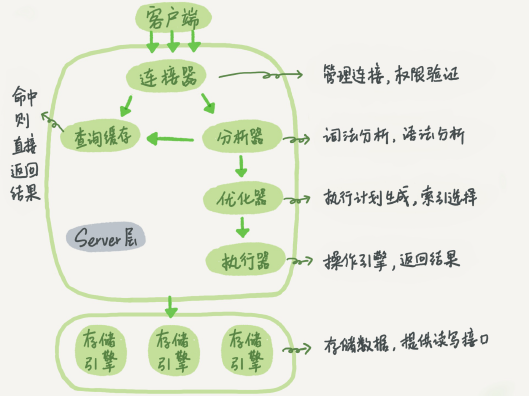
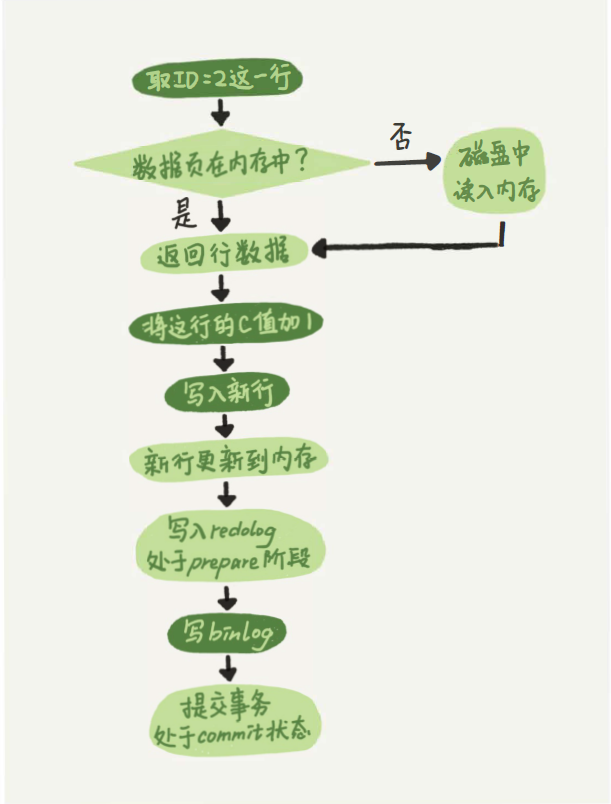
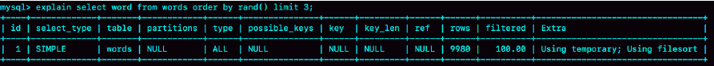
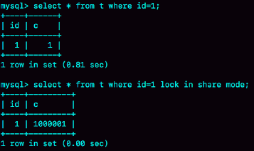
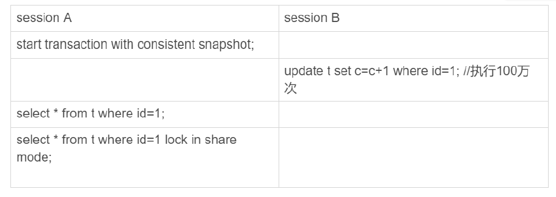

# 基础

// todo 基础架构图


服务层：

存储引擎层：

**查询语句的执行流程**



- 连接器

- 查询缓存

MySQL8 移除

- 分析器

-  优化器 


优化器的作用：

选择索引是优化器的⼯作。⽽优化器选择索引的⽬的，是找到⼀个最优的执⾏⽅案，并⽤最⼩的代价去执⾏语句。在数据库⾥⾯，扫描⾏数是影响执⾏代价的因素之⼀。<u>扫描的⾏数</u> 越少，意味着 <u>访问磁盘数据的次数</u> 越少，消耗的CPU资源越少。
当然，扫描⾏数并不是唯⼀的判断标准，优化器还会结合 <u>是否使⽤临时表、是否排序</u> 等因素进⾏综合判断。

```
权限校验--->查询缓存--->分析器--->优化器--->权限校验--->执行器--->引擎
```

<u>Q: MySQL是怎样得到索引的基数的呢？</u>

MySQL采样统计的⽅法，采样统计的时候，InnoDB默认会选择N个数据⻚，统计这些⻚⾯上的不同值，得到⼀个平均值，然后乘以这个索引的⻚⾯数，就得到了这个索引的基数。
⽽数据表是会持续更新的，索引统计信息也不会固定不变。所以，当变更的数据⾏数超过1/M的时候，会⾃动触发重新做⼀次索引统计。


(5) 执行器

**执行更新语句的流程**



<u>MySQL可以恢复到半个⽉内任意⼀秒的状态</u>；

涉及到两个日志文件 redo log 和 binlog；

两阶段提交，以及 Insert Buffer 插入缓冲

```sql
UPDATE T SET c=c+1 WHERE ID=2;
```

```
分析器---->权限校验---->执行器--->引擎---redo log prepare--->binlog--->redo log commit
```


# 日志

## 慢查询 日志

> MySQL 的动态参数，可以随关随停

开启慢查询；

设置慢查询的时间阈值；

设置慢查询日志文件目录；

```sql
SHOW VARIABLES LIKE '%quer%';       --慢查询日志开启、位置、时长，查询缓冲、
SHOW STATUS LIKE '%slow_queries%';    -- 当前慢查询数
-- Set slow query
SET GLOBAL slow_query_log=on;
SET GLOBAL long_query_time=1;     -- 当前会话有效, 修改 my.ini 永久
```


慢查询日志的性能剖析工具：

汇总一些信息，自动排序


查看慢日志：

正常的格式


explain

EXPLAIN 关键字模拟优化器执行 SQL 查询语句


```sql
explain select star, evaluator_no from indicator_evaluate order by evaluator_no desc;
```


id: 代表执行的顺序

**(1)  *type:** 

找到数据行的方式

数据的访问类型 取值为如下

1)all :全表扫描

2)index: ALL 和 INDEX 都读全表，INDEX 从索引读的， ALL 从硬盘读的

3):range：   between, in, >, < 等的查询，无需扫全表

4)ref：非唯一性索引扫描，返回匹配.. 
5)eq_ref:唯一性索引扫描，对于每一个索引键，表中只有一条记录与之匹配。常见于主键 或者唯一索引扫
描。
6)const:表示通过索引一次就找到了，const用于比较为primary key(主键索引)或者是unique索引，因为
只匹配一行，所以很快，若将主键作为where条件，MySQL就会把该查询作为一个常量
7)system ：表中只有一条记录(等同于系统表) 这是const特例，平时不会出现。

```shell
# 最好达到 ref OR range 级别
system>const>eq_ref>
ref>range>
index>all
```


***(2) extra**

> Using where, Using index， Using filesort

最重要的extra的取值是前三个 filesort、 using temporary(性能差的sql语句) 、use index(性能好的
sql语句)；

是查询优化器进行选择索引的一个参数，及排序的规则；


参数情况

- filesort: 外部索引排序
- temporary: 使用临时表，在 order by 和 group by 中常见


**3) select_type** 

查询的类型 有以下六种取值
1)：simplye:表示简单查询 ，不包含子查询以及union
2)：primary 若查询中包含了任何的子查询，最外层的主查询标识为primary
3):subquery 标识为子查询
4):derived :在from子查询的结果会被放入为衍生虚表(临时表)
5)union:若第二个select 出现在union之后，则会标记为union(若union包含在from子句的子查询中，外
层的的select标识为derived)
6)union result：从union表中获取数据的select 标识


(4) KEY

【possiable_keys】:理论上可能使用到的索引
`key`:实际上使用的索引,为null表示为索引失效

若在查询的时候使用了覆盖索引，那么该索引就不会出现在possible_keys中，而只会出现在key列中
什么是**覆盖索引**：建立复合索引的时候的列和顺序匹配查询语句的字段个数和顺序

【key_len】：表示索引在使用的字节数，可以通过该列计算查询中使用的索引的长度，长度越小越好
key_len显示的值为索引字段的最大可能长度，而非使用长度，及key_len是根据表定义计算而得，
不是通过表内检索出来的。

【ref】:表示索引的哪一列被使用，如果可能的话是一个常数，哪些列或者常量被用于索引列上的查找。
【rows】:根据表信息统计，估算出大约要扫描的行数。


**优化：**

**&手动优化**

**① 修改SQL:** 在业务允许的情况下使得语句走对应的索引；


```
EXPLAIN SELECT evaluator_no, course_id from evaluator;
```


**② 添加索引：**对于无法通过修改 SQL 满足业务的情况下，而此 SQL 又进行多次的查询，对其进行添加索引处理

```
alter table <table> add index idx_name(<col>);
```


**&查询优化器优化**

不使用密集索引，稀疏索引为二级索引不存放对应的全行信息；

查询的不需要整体信息；

记住抽样统计，同时查询是否排序、是否使用临时表进行索引的选择；


```sql
EXPLAIN SELECT COUNT( id ) FROM person_info_large;     
			-- 测试使用什么所以更好
<sql> FORCE INDEX(<index>);
```


## *binlog 日志(逻辑)

> 为归档日志；
>
> 记录了完整的逻辑记录；
>
> 属于 Server 层的日志，可作用于任何存储引擎；
>

**WAL(Write-Ahead Logging)**： 先写⽇志，再写磁盘，也就是先写粉板，等不忙的时候再写账本。


两者日志的区别：

1. redo log是InnoDB引擎特有的；binlog是MySQL的Server层实现的，所有引擎都可以使⽤。
2. redo log是物理⽇志，记录的是“在某个数据⻚上做了什么修改”；binlog是逻辑⽇志，记录的是这个语句的原始逻辑，⽐如“给ID=2这⼀⾏的c字段加1 ”。
3. redo log是 <u>循环写</u> 的，空间固定会⽤完；binlog是可以 <u>追加写⼊</u> 的。“追加写”是指binlog⽂件写到⼀定⼤⼩后会切换到下⼀个，并不会覆盖以前的⽇志。


(3) 两阶段提交

用于保证一致性使用的，如果不使⽤“两阶段提交”，那么数据库的状态就有可能和⽤它的⽇志恢复出来的库的状态不⼀致；

如果没有两阶段提交，会导致MySQL出现主备数据不⼀致等问题；

分为 prepare 和 commit 两个阶段；

其实不是的，不只是误操作后需要⽤这个过程来恢复数据。当你需要扩容的时候，也就是需要再多搭建⼀些备库来增加系统的读能⼒的时候，现在常⻅的做法也是⽤全量备份加上应⽤ binlog 来实现的，这个“不⼀致”就会导致你的线上出现主从数据库不⼀致的情况。
简单说，redo log和binlog都可以⽤于表示事务的提交状态，⽽两阶段提交就是让这两个状态保持逻辑上的⼀致。


## redolog (物理)

> InnoDB在处理更新语句的时候，只做了写⽇志这⼀个磁盘操作。这个⽇志叫作redo log(重做⽇志)，在更新内存写完redo log后，就返回给客户端，本次更新成功。
>

只有 InnoDB 有，其他引擎没有；

redolog 循环写，不持久保存，有大小限制，一般为 4 * 1GB；


由来： 如果每⼀次的更新操作都需要写进磁盘，然后磁盘也要找到对应的那条记录，然后再更新，整个过程 IO 成本、查找成本都很⾼。为了解决这个问题，MySQL的设计者就⽤了类似酒店掌柜粉板的思路来提升更新效率。


## undo 日志

>  属于 InnoDB 存储引擎特有的日志，做事务的处理。


相关的一些问题

(1) MySQL  "抖" 了一下的原因

**当内存数据⻚跟磁盘数据⻚内容不⼀致的时候，我们称这个内存⻚为“脏⻚”。内存数据写⼊到磁盘后，内存和磁盘上的数据⻚的内容就⼀致了，称为“⼲净⻚”。**


平时执⾏很快的更新操作，其实就是在写内存和⽇志，⽽MySQL偶尔“抖”⼀下的那个瞬间，可能就是在刷脏⻚(flush)


几种可能的原因：

一： InnoDB的redo log写满了。这时候系统会停⽌所有更新操作，把 checkpoint 往前推进，redo log留出
空间可以继续写。

二： 系统内存不⾜。当需要新的内存⻚，⽽内存不够⽤的时候，就要淘汰⼀些数据⻚，空出内存给别的
数据⻚使⽤。如果淘汰的是“脏⻚”，就要先将脏⻚写到磁盘。

三： MySQL认为系统“空闲”的时候，即使是“⽣意好”的时候，也要⻅缝插针地找时间，只要有机会就刷⼀点“脏⻚”

四： MySQL正常关闭的情况，这时候，MySQL会把内存的脏⻚都flush到磁盘上，这样下次MySQL启动
的时候，就可以直接从磁盘上读数据，启动速度会很快。


对性能的影响：

对于 ① 出现这种情况的时候，整个系统就不能再接受更新了，所有的更新都必须堵住。

对于 ② 这种情况其实是常态。**InnoDB⽤缓冲池(buffer pool)管理内存，缓冲池中的内存⻚有三种状态**：

第⼀种是，还没有使⽤的；
第⼆种是，使⽤了并且是⼲净⻚；
第三种是，使⽤了并且是脏⻚。


() InnoDB 刷脏页的控制策略

要正确地告诉InnoDB所在主机的IO能⼒，这样InnoDB才能知道需要全⼒刷脏⻚的时候，可以刷多快。


可能的问题： MySQL的写⼊速度很慢，TPS很低，但是数据库主机的IO压⼒并不⼤

```shell
innodb_io_capacity           # 会告诉InnoDB你的磁盘能⼒,建议你设置成磁盘的IOPS
```


如果你来设计策略控制刷脏⻚的速度，会参考哪些因素呢？

InnoDB的刷盘速度就是要参考这两个因素：⼀个是脏⻚⽐例，⼀个是redo log写盘速度。

参数 innodb_max_dirty_pages_pct 是脏⻚⽐例上限，默认值是75%。InnoDB会根据当前的脏⻚⽐例(假设为M)，算出⼀个范围在0到100之间的数字，计算这个数字的伪代码类似这样：

**根据上述算得的F1(M)和F2(N)两个值，取其中较⼤的值记为R，之后引擎就可以按照innodb_io_capacity定义的能⼒乘以R%来控制刷脏⻚的速度。**


() 总结

利⽤WAL技术，数据库将随机写转换成了顺序写，⼤⼤提升了数据库的性能。
但是，由此也带来了内存脏⻚的问题。脏⻚会被后台线程⾃动flush，也会由于数据⻚淘汰⽽触发flush，⽽刷脏⻚的过程由于会占⽤资源，可能会让你的更新和查询语句的响应时间⻓⼀些。在⽂章⾥，我也给你介绍了控制刷脏⻚的⽅法和对应的监控⽅式。


# *索引

索引相关的 SQL

```SQL
SHOW INDEX FROM <myTab>;
```


## 索引基础

**索引的优缺点**

好处：

提高访问速度；

优化查询；


缺点：

占用空间，索引建立的越多越占用空间；

更改频繁时，每次修改都需要重建索引；


**索引的适用场景**

选择性较高的场景；


不适合索引的场景：

数据规模小的情况；

选择性较低的键；


B+ 树为什么适合用于作为索引

磁盘 IO 读写次数少


B 树与 B+ 树的区别？

关键字与孩子节点的个数；

B+ 树无论如何都要扫表到叶子节点才能返回数据， B 树可以中途跳出；

B+ 树适合用于遍历和范围的选择，底层叶子节点是双向链表；


**索引的底层实现**

(1) Hash 索引

<u>适⽤于只有等值查询的场景</u>，⽐如Memcached及其他⼀些NoSQL引擎。

(2)) 有序数组

<u>有序数组在等值查询和范围查询场景中的性能就都⾮常优秀</u>,  有序数组索引只适⽤于静态存储引擎。

(3)  二叉树

(4) B+ 树


## 索引类型

**联合索引**

创建的注意事项： 

选取字符串的前多少位作为索引项；

注意 <u>最左前缀</u> 的使用，以及基于此衍生出来的联合索引组合；

能够形成覆盖索引，从而避免二次扫表问题。


**覆盖索引**

>  指的是查询的字段在索引上都存在，包含只查一个字段、查询几个特定的组合索引字段；

无需二次扫表，直接扫描索引中的 B+ 树即可获取全部数据；

```sql
show index from <table>;
```


**主键索引**

> 作为表的主键，可以有包含多个列，该索引是唯一索引，在 InnoDB 存储引擎中为聚集索引

显然，<u>主键⻓度越⼩，普通索引的叶⼦节点就越⼩，普通索引占⽤的空间也就越⼩</u>。
所以，从性能和存储空间⽅⾯考量，⾃增主键往往是更合理的选择。


基于主键索引和普通索引的查询有什么区别？
如果语句是select * from T where ID=500，即主键查询⽅式，则只需要搜索ID这棵B+树；
如果语句是select * from T where k=5，即普通索引查询⽅式，则需要先搜索k索引树，得到ID的值为500，再到ID索引树搜索⼀次。这个过程称为 <u>回表</u>。
也就是说，基于⾮主键索引的查询需要多扫描⼀棵索引树。


**唯一索引**

唯⼀索引⽤不上 <u>change buffer</u> 的优化机制，因此如果业务可以接受，从性能⻆度出发我建议你优先考虑⾮唯⼀索引。

对于唯⼀索引来说，由于索引定义了唯⼀性，查找到第⼀个满⾜条件的记录后，就会停⽌继续检索。


**普通索引**
相较于唯一索引，使用了 change buffer 


与唯一索引的比较

这两类索引在查询能⼒上是没差别的，主要考虑的是对更新性能的影响。


Change buffer 使用场景：

如果所有的更新后⾯，都⻢上伴随着对这个记录的查询，那么你应该关闭 change buffer。⽽在其他情况下，change buffer都能提升更新性能。


### **字符串加索引**

1. 直接创建完整索引，这样可能⽐较占⽤空间；
2. 创建前缀索引，节省空间，但会增加查询扫描次数，并且 <u>不能使⽤覆盖索引</u>；
3. <u>倒序存储</u>，再创建前缀索引，⽤于绕过字符串本身前缀的 <u>区分度</u>不够的问题；
4. 创建 <u>hash字段索</u>引，查询性能稳定，有额外的存储和计算消耗，跟第三种⽅式⼀样，都不⽀持 <u>范围扫描</u>。


**前缀索引限定索引的长度**

不指定前缀长度，默认包含整个字符串；

```sql
ALTER TABLE SUser ADD INDEX idx1(email);   
-- only prefix
ALTER TABLE SUser ADD INDEX idx2(email(6));    
```

由于email(6)这个索引结构中每个邮箱字段都只取前6个字节，所以占⽤的空间会更⼩，这就是使⽤前缀索引的优势。
但，这同时带来的损失是，可能会增加额外的记录扫描次数。


如果使⽤的是index1(即email整个字符串的索引结构)，执⾏顺序是这样的：
1. 从index1索引树找到满⾜索引值是 zhangssxyz@xxx.com ’的这条记录，取得ID2的值；

2. 到主键上查到主键值是ID2的⾏，判断email的值是正确的，将这⾏记录加⼊结果集；

3. 取index1索引树上刚刚查到的位置的下⼀条记录，发现已经不满⾜email='zhangssxyz@xxx.com’的条件了，循环结束。
    这个过程中，只需要回主键索引取⼀次数据，所以系统认为只扫描了⼀⾏。
    
    
    
    如果使⽤的是index2(即email(6)索引结构)，执⾏顺序是这样的：
    

1 . 从index2索引树找到满⾜索引值是’zhangs’的记录，找到的第⼀个是ID1；

2 . 到主键上查到主键值是ID1的⾏，判断出email的值不是’zhangssxyz@xxx.com’，这⾏记录丢弃；

3 . 取index2上刚刚查到的位置的下⼀条记录，发现仍然是’zhangs’，取出ID2，再到ID索引上取整⾏然后判断，这次值对了，将这⾏记录加⼊结果集；

4 . 重复上⼀步，直到在idxe2上取到的值不是’zhangs’时，循环结束。
    在这个过程中，要回主键索引取4次数据，也就是扫描了4⾏。
    通过这个对⽐，你很容易就可以发现，使⽤前缀索引后，可能会导致查询语句读数据的次数变多。


**使⽤前缀索引，定义好⻓度，就可以做到既节省空间，⼜不⽤额外增加太多的查询成本。**

根据区分度来选择前缀的长度

我们在建⽴索引时关注的是区分度，区分度越⾼越好。因为区分度越⾼，意味着重复的键值越少。因此，我们可以通过统计索引上有多少个不同的值来判断要使⽤多⻓的前缀。
可以使⽤下⾯这个语句，算出这个列上有多少个不同的值，95% 作为参考

```sql
SELECT COUNT(DISTINCT LEFT(email, 4)) AS L4,
COUNT(DISTINCT LEFT(email, 5)) AS L5,
COUNT(DISTINCT LEFT(email, 6)) AS L6,
COUNT(DISTINCT LEFT(email, 7)) AS L7, 
FROM SUser;
```


**对覆盖索引的影响**

如果使⽤index1(即email整个字符串的索引结构)的话，可以利⽤覆盖索引，从index1查到结果后直接就返回了，不需要回到ID索引再去查⼀次。⽽如果使⽤index2(即email(6)索引结构)的话，就不得不回到ID索引再去判断email字段的值。
即使你将index2的定义修改为email(18)的前缀索引，这时候虽然index2已经包含了所有的信息，但InnoDB还是要回到id索引再查⼀下，因为系统并不确定前缀索引的定义是否截断了完整信息。
也就是说，使⽤前缀索引就⽤不上覆盖索引对查询性能的优化了，这也是你在选择是否使⽤前缀索引时需要考虑的⼀个因素。

```sql
ALTER TABLE SUser ADD INDEX idx_email(eamil(20));
-- 
SELECT id, name, email
FROM SUser 
WHERE email='zhangssxyz@xxx.com';
```


 **前缀的区分度不够时如何处理**

如国家的身份证号、电话号码

方式一：  倒序存储

由于身份证号的最后6位没有地址码这样的重复逻辑，所以最后这6位很可能就提供了⾜够的区分度，先使⽤count(distinct)⽅法做验证

```sql
-- MySQL 函数 revere 操作，插入处理
INSERT INTO T(col.., id_card) VALUES (xxx, revere('input_id_card_string'));
-- 查询的处理
SELECT <field_list> 
FROM t
WHERE id_card=reverse('input_id_card_string');
```


方式二： 使用 Hash 字段

 可以在表上再创建⼀个整数字段，来保存身份证的校验码，同时在这个字段上创建索引。

然后每次插⼊新记录的时候，都同时⽤crc32()这个函数得到校验码填到这个新字段。由于校验码可能存在冲突，也就是说两个不同的身份证号通过crc32()函数得到的结果可能是相同的，所以你的查询语句where部分要判断id_card的值是否精确相同。

这样，索引的⻓度变成了4个字节，⽐原来⼩了很多。

```sql
-- 新增加一列，4byte 存放索引 hash 后的值
ALTER TABLE t ADD id_card_crc INT UNSIGNED, ADD index(id_card_crc);
```

```sql
-- 插入逻辑， crc32 hash 值以及原始的值
INSERT INTO T(co1..., id_card_crc, id_card) VALUES (xxx, crc32('input_card_string'), 'input_id_card_string');                        -- INDEX can duplication

-- 对应的查询语句，先对 hash 进行查询后对原始字符串查询
SELECT * 
  FROM t
  WHERE id_card_crc=crc32('input_id_card_string') 
    AND id_card='input_id_card_string');                   
```


两种方式的比较：

⾸先，它们的相同点是，都不⽀持范围查询。倒序存储的字段上创建的索引是按照倒序字符串的⽅式排序的，已经没有办法利⽤索引⽅式查出身份证号码在[ID_X, ID_Y]的所有市⺠了。同样地，hash字段的⽅式也只能⽀持等值查询。

它们的区别，主要体现在以下三个⽅⾯：

1. 从占⽤的额外空间来看，倒序存储⽅式在主键索引上，不会消耗额外的存储空间，⽽hash字段⽅法需要增加⼀个字段。当然，倒序存储⽅式使⽤4个字节的前缀⻓度应该是不够的，如果再⻓⼀点，这个消耗跟额外这个hash字段也差不多抵消了。
2. 在CPU消耗⽅⾯，倒序⽅式每次写和读的时候，都需要额外调⽤⼀次reverse函数，⽽hash字段的⽅式需要额外调⽤⼀次crc32()函数。如果只从这两个函数的计算复杂度来看的话，reverse函数额外消耗的CPU资源会更⼩些。
3. 从查询效率上看，使⽤hash字段⽅式的查询性能相对更稳定⼀些。因为crc32算出来的值虽然有冲突的概率，但是概率⾮常⼩，可以认为每次查询的平均扫描⾏数接近1。⽽倒序存储⽅式毕竟还是⽤的前缀索引的⽅式，也就是说还是会增加扫描⾏数。


## 最左匹配原则

> 全值匹配我最爱，最左前缀要遵守；
>
> 带头大哥不能死，中间兄弟不能断；
>
> 原因： B+ 树的索引结构导致

原因： 复合索引，先对最左边的字段进行排序，在第一个字段排序的基础上再对后面的字段排序。

类似 orderby ，只保证第一个字段有序，通常对于第二个字段用不到索引；


<u>B+树这种索引结构，可以利⽤索引的“最左前缀”，来定位记录</u>


只要满⾜最左前缀，就可以利⽤索引来加速检索。这个最左前缀可以是联合索引的最左N
个字段，也可以是字符串索引的最左M个字符。


如何控制索引的顺序：

如果通过调整顺序，可以少维护⼀个索引，那么这个顺序往往就是需要优先考虑采⽤的。
考虑的原则就是空间了。⽐如上⾯这个市⺠表的情况，name字段是⽐age字段⼤的 ，那我就建议你创建⼀个(name,age)的联合索引和⼀个(age)的单字段索引


## 索引的使用

修改 SQL 语句尽量使其走索引；

对于查询优化器选择索引错误，通过修改 SQL 引导其进行选择正确的索引，如通过 FORCE INDEX() 来进行查询；

为查询较多的字段添加索引，可考虑使用覆盖索引；

要避免编写使索引失效的 SQL 语句；


## 何时失效

> 索引列上少计算，范围之后全失效；
>
> LIKE 百分写最右，覆盖索引不写星；
>
> 不等空值还有 OR, 索引失效要少用；
>
> VAR 引号不可丢，SQL 高级也不难！

**条件字段函数及计算操作**

如果对字段做了函数计算，就⽤不上索引了。

SQL语句条件⽤的是 where t_modified='2018-7-1’ 的话，B+树提供的这个快速定位能⼒，来源于 <u>同⼀层兄弟节点的有序性</u>。

(1) 显示调用函数
在t_modified字段加了month()函数操作，导致了全索引扫描

```sql
CREATE TABLE `tradelog` (
`id` int(11) NOT NULL,
`tradeid` varchar(32) DEFAULT NULL,
`operator` int(11) DEFAULT NULL,
`t_modified` datetime DEFAULT NULL,
PRIMARY KEY (`id`),
KEY `tradeid` (`tradeid`),
KEY `t_modified` (`t_modified`)
) ENGINE=InnoDB DEFAULT CHARSET=utf8mb4;
-- Query，对索引列使用了函数
SELECT COUNT(*) 
FROM tradelog
WHERE month(t_modified)=7;
```

按照业务进行修改，使其走索引：

```SQL
-- 更改索引列中使用的函数成为索引列的范围比较查询
SELECT COUNT(*) 
FROM tragelog 
WHERE (t_modified >= '2016-7-1' AND t_modified<'2016-8-1') OR
 (t_modified >= '2017-7-1' AND t_modified<'2017-8-1') OR
  (t_modified >= '2018-7-1' AND t_modified<'2018-8-1');
```

**(2) 隐式类型转换**

字符串隐式得转换成数字进行操作；

```sql
select * 
from tradelog 
where tradeid=110717;

select “10” > 9;     -- 1, String ⇒ number

SELECT * FROM tradelog 
WHERE CAST(tradid AS signed int)=110717;

-- 修改
SELECT * 
FROM tradelog
WHERE tradeid='110717'
```

**(3)隐式字符编码转换**

```SQL
CREATE TABLE `trade_detail` (
`id` int(11) NOT NULL,
`tradeid` varchar(32) DEFAULT NULL,
`trade_step` int(11) DEFAULT NULL COMMENT "操作步骤",
`step_info` varchar(32) DEFAULT NULL COMMENT "步骤信息", 
PRIMARY KEY (`id`),
KEY `tradeid` (`tradeid`)
) ENGINE=InnoDB DEFAULT CHARSET=utf8;
-- log 和 业务的详情表字符集不同
select d.* from tradelog l, trade_detail d where d.tradeid=l.tradeid and l.id=2; /*语句Q1*/
```

两个字符集不同：

```sql
select * from trade_detail where tradeid=$L2.tradeid.value;
-- 等同于，对列粒度的字符进行编码转换比较
select * from trade_detail where CONVERT(traideid USING utf8mb4)=$L2.tradeid.value;
```

字符集utf8mb4是utf8的超集，所以当这两个类型的字符串在做⽐较的时候，MySQL
内部的操作是，先把utf8字符串转成utf8mb4字符集，再做⽐较。


方案一： 把trade_detail表上的tradeid字段的字符集也改成utf8mb4，这样就没有字符集转换的问题了。

````sql
ALTER TABLE trade_detail MODIFY tradeid varchar(32) character SET utf8mb4 DEFAULT NULL;
````

方案二： 在无法修改字符集的情况下，或者表中的数据很多的情况下

```sql
select d.* from tradelog l , trade_detail d where d.tradeid=CONVERT(l.tradeid USING utf8) and l.id=2;
```


(4) 简单的计算

```sql
SELECT * 
FROM trade_detail 
WHERE trade_step=trade_step + 1;
```


## 索引下堆(5.6)

// TODO


## 索引问题

@Q: 为什么要重建索引?
索引可能因为删除，或者⻚分裂等原因，导致数据⻚有空洞，重建索引的过程会创建⼀个新的索引，把数据按顺序插⼊，这样 <u>⻚⾯的利⽤率</u> 最⾼，也就是索引更紧凑、更省空间。


通过两个alter 语句重建索引k，以及通过两个alter语句重建主键索引是否合理。

重建索引k的做法是合理的，可以达到省空间的⽬的。但是，重建主键的过程不合理。不论是删除主键还是创建主键，都会将整个表重建。所以连着执⾏这两个语句的话，第⼀个语句就⽩做了。这两个语句，你可以⽤这个语句代替 ： alter table Tengine=InnoDB。


记录⽇志⽤的, 会 <u>定期删除过早之前的数据</u> . 最后这个表实际内容的⼤⼩才10G, ⽽他的索引却有30G. 在阿⾥云控制⾯板上看,就是占了40G空间. 这可花的是真⾦⽩银啊.
后来了解到是 InnoDB 这种引擎导致的,虽然删除了表的部分记录,但是它的索引还在, 并未释放.
只能是重新建表才能重建索引.
如果当时看到了这个专栏,把这个语句拿来⽤,就可以省下不少钱了.

TH:  搜索日志表在程序中的使用，若都是单表的查询，没有修改操作，只有 delete 操作，可以考虑使用 Archive 存储引擎


@Q: 索引选择异常和处理？ 处理查询优化器选择错误索引？

查询优化器选择的不是最优的索引情况的处理。

其实⼤多数时候优化器都能找到正确的索引，但偶尔你还是会碰到我们上⾯举例的这两种情况：原本可以执⾏得很快的SQL语句，执⾏速度却⽐你预期的慢很多

**第⼀种⽅法是，采⽤force index强⾏选择⼀个索引**。MySQL会根据词法解析的结果分析出可能可以使⽤的索引作为候选项，然后在候选列表中依次判断每个索引需要扫描多少⾏。如果force index指定的索引在候选索引列表中，就直接选择这个索引，不再评估其他索引的执⾏代价。

```sql
-- FORCE INDEX 的使用
SELECT * 
FROM t FORCE INDEX(a) 
WHERE a BETWEEN 1 AND 1000 
AND b BETWEEN 50000 AND 100000
ORDER BY b
LIMIT 1;
```


但其实使⽤force index最主要的问题还是变更的及时性。因为选错索引的情况还是⽐较少出现的，所以开发的时候通常不会先写上force index。⽽是等到线上出现问题的时候，你才会再去修改SQL语句、加上force index。但是修改之后还要测试和发布，对于⽣产系统来说，这个过程不够敏捷。


第⼆种⽅法就是，**可以考虑修改语句，引导MySQL使⽤我们期望**的索引。

⽐如，在这个例⼦⾥，显然把“order by b limit 1” 改成 “order by b,a limit 1” ，语义的逻辑是相同的。

现在order by b,a 这种写法，要求按照b,a排序，就意味着使⽤这两个索引都需要排序。因此，扫描⾏数成了影响决策的主要条件，于是此时优化器选了只需要扫描1000⾏的索引a。
当然，这种修改并不是通⽤的优化⼿段，只是刚好在这个语句⾥⾯有limit 1，因此如果有满⾜条件的记录， order by b limit 1和order by b,a limit 1 都会返回b是最⼩的那⼀⾏，逻辑上⼀致，才可以这么做。

```sql
SELECT * 
FROM t FORCE INDEX(a) 
WHERE a BETWEEN 1 AND 1000 
AND b BETWEEN 50000 AND 100000
ORDER BY b,a     -- modify
LIMIT 1;

-- 另一种引导我们⽤limit 100让优化器意识到，使⽤b索引代价是很⾼的。其实是我们根据数据特征诱导了⼀下优化器，也不具备通⽤性。
SELECT *
FROM (SELECT * FROM t WHERE (a BETWEEN 1 AND 1000) AND (B BETWEEN 50000 AND 100000) ORDER BY b LIMIT 100)alias LIMIT 1;
```


第三种⽅法是，**在有些场景下，我们可以新建⼀个更合适的索引，来提供给优化器做选择，或删掉误⽤的索引**

这种情况其实⽐较少，尤其是经过DBA索引优化过的库，再碰到这个bug，找到⼀个更合适的索引⼀般⽐较难。
如果我说还有⼀个⽅法是删掉索引b，你可能会觉得好笑。但实际上我碰到过两次这样的例⼦，最终是DBA跟业务开发沟通后，发现这个优化器错误选择的索引其实根本没有必要存在，于是就删掉了这个索引，优化器也就重新选择到了正确的索引。


# *锁

## 锁的分类

锁的粒度：  表级锁、行级锁、页级锁、全局锁(逻辑备份)

锁级别：     共享锁、排它锁

加锁方式： 自动锁、显视锁

操作类型划分： DML 锁、DDL 锁

使用方式： 乐观锁、悲观锁

『分布式锁』：分布式锁实现有两种：基于Redis和基于Zookeeper，基于这两种 业界也有开源的解决方案。

```sql
... FOR UPDATE;				-- 悲观策略
... LOCK IN SHARE MODE;  
SHOW test_optimistic SET money=223, version=0+1 WHERE version=0 AND id=2;     -- version 中的 0 由调用者提供
```


**锁的粒度划分**

**全局锁**

>  锁住整个数据库，全局锁的典型使⽤场景是做全库逻辑备份

MySQL提供了⼀个加全局读锁的⽅法，命令是 `Flush tables with read lock`
(FTWRL)。当你需要让整个库处于只读状态的时候，可以使⽤这个命令，之后其他线程的以下语句会被阻塞：数据更新语句(数据的增删改)、数据定义语句(包括建表、修改表结构等)和更新类事务的提交语句。

在对 MySQL 进行数据备份的时候可开启，避免数据不一致。


**表级锁**

两种： ⼀种是表锁，⼀种是元数据锁(meta data lock，MDL)。

(1) 表锁

可以⽤unlock tables主动释放锁，也可以在客户端断开的时候⾃动释放。

```sql
lock tables … read/write
```

(2) MDL 锁

另⼀类表级的锁是MDL(metadata lock)。MDL不需要显式使⽤，在访问⼀个表的时候会被⾃动加上。MDL的作⽤是，保证读写的正确性。你可以想象⼀下，如果⼀个查询正在遍历⼀个表中的数据，⽽执⾏期间另⼀个线程对这个表结构做变更，删了⼀列，那么查询线程拿到的结果跟表结构对不上，肯定是不⾏的。

MDL会直到事务提交才释放，在做表结构变更的时候，你⼀定要⼩⼼不要导致锁住线上查询和更新。


**行锁**

也就是说，在InnoDB事务中，⾏锁是在需要的时候才加上的，但，**并不是不需要了就⽴刻释放，⽽是要等到事务结束时才释放**。这个就是两阶段锁协议。
知道了这个设定，对我们使⽤事务有什么帮助呢？那就是，**如果你的事务中需要锁多个⾏，要把最可能造成锁冲突、最可能影响并发度的锁尽量往后放**。我给你举个例⼦。


假设你负责实现⼀个电影票在线交易业务，顾客A要在影院B购买电影票。我们简化⼀点，这个业务需要涉及到以下操作：
1. 从顾客A账户余额中扣除电影票价；
2. 给影院B的账户余额增加这张电影票价；
3. 记录⼀条交易⽇志。

根据两阶段锁协议，不论你怎样安排语句顺序，<u>所有的操作需要的⾏锁都是在事务提交的时候才释放的</u>。所以，如果你把语句2安排在最后，⽐如按照3、1、2这样的顺序，那么影院账户余额这⼀⾏的锁时间就最少。这就最⼤程度地减少了事务之间的锁等待，提升了并发度。


## 锁的算法

(1) Record lock：

单个⾏记录上的锁


(2) Gap lock：

间隙锁，锁定⼀个范围，不包括记录本身


(3) Next-key lock：

record+gap 锁定⼀个范围，包含记录本身


1. innodb对于⾏的查询使⽤next-key lock

2. Next-locking keying为了解决Phantom Problem幻读问题

3. 当查询的索引含有唯⼀属性时，将next-key lock降级为record key

4. Gap锁设计的⽬的是为了阻⽌多个事务将记录插⼊到同⼀范围内，⽽这会导致幻读问题的产⽣

5. 有两种⽅式显式关闭gap锁：（除了外键约束和唯⼀性检查外，其余情况仅使⽤record lock）

   A. 将事务隔离级别设置为RC B. 将参数innodb_locks_unsafe_for_binlog设置为1


## **乐观锁**

适用于冲突机会少，读多写少的情景；

解决加锁的资源耗费、以及繁琐；


**两种实现方式：**

方式一： 版本保护

取出并赋值，比较初次获取时的值和将要更改时候的值

方式二： 时间戳

添加 timestamp 字段进行前后比较


『数据版本』：为数据增加的一个版本标识。当读取数据时，将版本标识的值一同读出，数据每更新一次，同时对版本标识进行更新。当我们提交更新的时候，判断数据库表对应记录的当前版本信息与第一次取出来的版本标识进行比对，如果数据库表当前版本号与第一次取出来的版本标识值相等，则予以更新，否则认为是过期数据。

 读取数据，记录Timestamp：通过在 db 中设置字段实现。


修改数据；

检查和提交放在同一行；

AND `count`=46

 

**版本保护**

**|-**保证同一个改变只写进去一次

**|-**写不进的返回0行，对应抛异常，经过事务重新做

更新的字段，在将要提交的时候进行判断，是否与原来未更新前一样。


**抢票解决：**  将count|Timestamp存放到NoSql中，或者存放于服务器的内存中


TH: 对于程序更新的语句，对数据的更新查看影响的行数，若行数不符合乐观锁的更改则抛出异常，之后通过框架的事务回滚。

 

##  悲观锁

显示加悲观锁

```sql
SELECT ... FROM ...  FOR UPDATE;    -- 显示加悲观锁
```


## 死锁

```SQL
-- TODO 查看数据库 INNODB 的状态，其中包含了死锁日志
SHOW INNODB STATUE;
```

死锁日志的格式：


# 事务

> 事务是数据库区别于文件系统的一个关键特性。

(1) 事务的分类

① 扁平事务，使用最频繁；

② 带有保存点的偏平事务；

③ 链事务，下一个事务将能够看到上一个事务的结果，只能恢复到最近一个的保存点；

④ 嵌套事务； 任何子事务都在顶层事务提交后才真正的提交；

是一棵树状的结构；

只有叶子节点的事务才能访问数据库、发送消息、获取其他类型的资源；

⑤ 分布式事务；

需要根据数据所在位置访问网络中的不同节点；


保存点在事务内部是递增的；


相关的 SQL

```SQL
SHOW VARIABLES LIKE 'ios%';
```


## 四大特性

原子性(Atomic)： 所有操作要么全部成功，要么全部失败

一致性(Consistency)： 数据从一个一致性状态转移到另一个一致性状态，一致指的是 <u>数据的完整性约束</u> 没有被破坏

**隔离性(Isolation)**： 并发执行事务时，一个事务应该不影响其他事务的执行

持久性(Duration)： 对 DB 的修改永久，恢复性能


实现的原理：

undo.log, redo.log 文件， InnoDB 


**事务的实现方式**

原子性、

隔离性： 通过上面的锁实现

原子性和持久性： 通过  redo 物理日志实现；

事务的一致性： 通过 undo log 实现；


() redo log

blog 

可通过参数调节控制 redo log 刷新到磁盘的策略；

log blcok： redo log 的块大小与磁盘扇区大小一样都是 512 字节，保证了原子性，不需要 doublewrite 技术；

为物理日志，恢复速度比逻辑日志快，是幂等的。

重做日志记录了事务的行为，可以很好地通过其对也进行 "重做" 操作


() undo log 

帮助事务回滚；

帮助实现 MVCC；

是实现快照读的一种必要机制；

存放在数据库内部的一个特殊字段上；

功能一： 是逻辑日志，将数据库逻辑地恢复到原来的样子；

功能二： 当用户读取一行记录时，若该记录已经被其他事务占用，当前事务可以通过 undo 读取之前的行版本信息，以此实现<u>非锁定读取</u>。


分类： 

insert undo log

update undo log

delete 操作不直接删除记录，而只是将记录标记为已删除。

undo 信息的数据字典： 

真正删除这行记录的操作其实被 "延时" 了，最终在 purage 操作中完成。


()两阶段提交

1 . 膝盖内存中事务对应的信息，并将日志放写入 redolog 缓冲；

2 . 调用 fsync 将确保日志都从重做日志缓冲写入磁盘；


() 事务相关的 SQL 语句

一条语句失败并抛出异常，不会导致先前已经执行的语句自动会馆，

```sql

-- salfpoint
ROLLBACK 

-- 删除一个保存点
RELEASE SAVEPOINT t1;
-- 定义一个保存点
SAVEPOINT t2;
-- 回滚到某个保存点, 此时事务没有结束
ROLLBACK TO SAVEPOINT t2;

-- 设置级别
SET [GLOBAL | SESSION] TRANSACTION ISOLATION LEVEL {...}
```


事务的统计：

QPS： 每秒请求数；

TPS： 每秒事务处理的能力；


**事务的隔离级别**

InnoDB 在 REPEATABLE READ 级别下，使用 Next-Key Lock 锁算法，避免幻读的产生；


Serializable：

为每一个读取操作加一个共享锁；

主要用于实现 InnoDB 的分布式事务


**分布式事务**

() XA

XA 事务由一个或多个资源管理器、一个事务管理器以及一个应用程序组成。


() Serializable 级别


() 两阶段提交

第一阶段： 所有参与全局事务的节点都开始准备(PREPARE) ，告诉事务管理器准备好了；

第二阶段： 事务管理器告诉资源管理器质性 ROLLBACK 还是 COMMIT，分布式事务需要多一次的 PREPARE 操作，待收到所有节点的统一信息后，再进行 COMMIT 或是 ROLLBACK 操作。


()内部 XA 事务

在存储引擎与插件之间


**长事务**

执行时间较长的事务；

进行的优化： 

在1亿用户表中，这个操作被封装在一个事务中完成，通过为其转化成小批量的事务进行处理；


好处一： 便于回滚每完成一个小事务，将完成的结果存放在 batchcontext 表中，表示已完成批量事务的最大账号 ID。 在发生错误时，可以从这个已完成的最大事务 ID 继续进行批量的小事务，重新开启事务的代价就显得比较低。

好处二： 用户可以知道现在大概已经执行到了哪个阶段

```sql
UPDATE account 
SET account_total=account_total+1 + (1+interest_rate);
```


## 并发问题

**更新丢失：** 


**Dirty Read**

读取到未提交的数据，之后回滚 ，修改成 `READ UNCOMMITTED` 隔离级别可以处理

```SQL
SELECT @@tx_isolation;
```


**二级封锁协议**

在一级的基础上，要求读取数据 A 时必须加 S 锁，读取完马上释放 S 锁。

可以解决读脏数据问题，因为如果一个事务在对数据 A 进行修改，根据 1 级封锁协议，会加 X 锁，那么就不能再加 S 锁了，也就是不会读入数据。

| T1          | T2          |
| ----------- | ----------- |
| lock-x(A)   |             |
| read A=20   |             |
| write A=19  |             |
|             | lock-s(A)   |
|             | wait        |
| rollback    | .           |
| A=20        | .           |
| unlock-x(A) | .           |
|             | obtain      |
|             | read A=20   |
|             | unlock-s(A) |
|             | commit      |


**不可重复读**

session1 执行事务期间，另一个 session2 事务对session1 读取的数据修改并提交

将事务隔离级别升级为 REPEATABLE READ


**幻读**

侧重于删除和增加Transaction A 读取与搜索条件相匹配的若干行， Transaction B 插入或删除行修改 Transaction A 的结果集。

1. 在可重复读隔离级别下，普通的查询是快照读，是不会看到别的事务插⼊的数据的。因此，幻读在“当前读”下才会出现。

2. 上⾯session B的修改结果，被session A之后的select语句⽤“当前读”看到，不能称为幻读。幻读仅专指“新插⼊的⾏”。
   
   
   

幻读有什么问题？
⾸先是语义上的。session A在T1时刻就声明了，“我要把所有d=5的⾏锁住，不准别的事务进⾏读写操作”。⽽实际上，这个语义被破坏了。
其次，是数据⼀致性的问题。
我们知道，锁的设计是为了保证数据的⼀致性。⽽这个⼀致性，不⽌是数据库内部数据状态在此刻的⼀致性，还包含了数据和⽇志在逻辑上的⼀致性。
原因很简单。在T3时刻，我们给所有⾏加锁的时候，id=1这⼀⾏还不存在，不存在也就加不上锁。
也就是说，<u>即使把所有的记录都加上锁，还是阻⽌不了新插⼊的记录</u>，这也是为什么“幻读”会被单独拿出来解决的原因。
到这⾥，其实我们刚说明完⽂章的标题 ：幻读的定义和幻读有什么问题。
接下来，InnoDB怎么解决幻读的问题。


## 隔离级别

隔离得越严实，效率就会越低。

(1) READ UNCOMMITTED:  ⼀个事务还没提交时，它做的变更就能被别的事务看到。

(2) READ COMMIT: ⼀个事务提交之后，它做的变更才会被其他事务看到。

(3) REPEATABLE READ: <font color="green">⼀个事务执⾏过程中看到的数据，总是跟这个事务在启动时看到的数据是⼀致的</font>。当然在可重复读隔离级
别下，未提交变更对其他事务也是不可⻅的。

(4) SERIALIZABLE:  顾名思义是对于同⼀⾏记录，“写”会加“写锁”，“读”会加“读锁”。当出现读写锁冲突的时候，后访问的事务必须等前⼀个事务执⾏完成，才能继续执⾏。

| 隔离级别         | 脏读 | 不可重复读 | 幻影读 |
| ---------------- | ---- | ---------- | ------ |
| READ-UNCOMMITTED | √    | √          | √      |
| READ-COMMITTED   | ×    | √          | √      |
| REPEATABLE-READ  | ×    | ×          | √      |
| SERIALIZABLE     | ×    | ×          | ×      |


**事务隔离的实现**

read view 算法

在MySQL中，实际上每条记录在更新的时候都会同时记录⼀条回滚操作。记录上的最新值，通过回滚操作，都可以得到前⼀
个状态的值。
回滚⽇志什么时候删除呢？

在不需要的时候才删除。也就是说，系统会判断，当没有事务再需要⽤到这些回滚⽇志时，回滚⽇志会被删除。

什么时候才不需要了呢？

当系统⾥没有⽐这个回滚⽇志更早的read-view的时候。


为何尽量不使用长事务？

⻓事务意味着系统⾥⾯会存在很⽼的事务视图。由于这些事务随时可能访问数据库⾥⾯的任何数据，所以这个事务提交之前，数据库⾥⾯它可能⽤到的回滚记录都必须保留，这就会导致⼤量占⽤存储空间。

除此之外，⻓事务还占⽤锁资源，可能会拖垮库。


**开启事务的方式**

⼀、显式启动事务语句，begin或者start transaction,提交commit，回滚rollback；⼆、set
autocommit=0，该命令会把这个线程的⾃动提交关掉。这样只要执⾏⼀个select语句，事务就启动，并不会⾃动提交，直到主
动执⾏commit或rollback或断开连接。
11、建议使⽤⽅法⼀，如果考虑多⼀次交互问题，可以使⽤commit work and chain语法。在autocommit=1的情况下⽤begin显
式启动事务，如果执⾏commit则提交事务。如果执⾏commit work and chain则提交事务并⾃动启动下⼀个事务。


# **Innodb 存储引擎**

相关 SQL:

```SQL
-- 与索引相关?
SHOW VARIABLES LIKE 'innodb_file_per_table';
-- 日志缓冲区
SHOW VARIABLES LIKE 'innodb_log_buffer_size';
```


MySQL InnoDB默认行级锁。行级锁都是基于索引的，如果一条SQL语句用不到索引是不会使用行级锁的，会使用表级锁把整张表锁住，这点需要注意。

**InnoDB也支持通过特定的语句进行显示锁定，这些语句不属于SQL规范：**

```sql
-- InnoDB 显示加表锁
SELECT ... LOCK IN SHARE MODE
SELECT ... FOR UPDATE
```


**InnoDB 中的锁**

性质： 

InnoDB 支持行级锁；

锁与索引相关，不走索引时，整张表都被锁住；


在InnoDB事务中，⾏锁<u>是在需要的时候才加上的</u>，但并不是不需要了就⽴刻释放，⽽是要等到<u>事务结束时才释放</u>。这个就是两阶段锁协议。

**如果你的事务中需要锁多个⾏，要把最可能造成锁冲突、最可能影响并发度的锁尽量往后放。**

(1) 行级锁

InnoDB 对行级上锁时，会上表级别的易向锁；

二段锁： 加锁和解锁

```sql
UPDATE person_info_large SET title="Test" WHERE id = 1;
SHOW VARIABLES LIKE 'autocommit';
SET autocommit=0;      -- 当前 Session, 关闭
```

```sql
# 行级锁，阻塞住
SELECT * FROM person_info_large WHERE id=3 LOCK IN SHARE MODE;
					-- Add Read Lock, 其他 session 无法加 Write 锁
UPDATE person_info_large SET title="test" WHERE id=3;
# 行级锁，不同的行，不阻塞
SELECT * FROM person_info_large WHERE id=3 LOCK IN SHARE MODE;
UPDATE person_info_large SET title="test" WHERE id=4;
# 共享锁，读读不冲突
```

(2)当不走索引时，整张表都被锁住

```sql
SELECT * FROM person_info_large WHERE mottto="xxx" LOCK IN SHARE MODE;
				-- motto 无索引
UPDATE person_info_large SET title="zzz" WHERE motto="yyy";
			-- 在之前未提交前，阻塞住
```

(3)易向锁： 不需要轮询看是否加了锁

在不走 Index 时用表锁，不走 index 时用行级锁以及间隙锁

支持表级的易向锁， `IS`, `IX`

锁的细度越细，开销就大

辅助索引需要回表操作， MyISAM 在增删改时叫 InnoDB 

(4) next-key 锁


**两者的比较与选取**

SELECT MyISAM: 

- 频繁权标 count(维护变量)

- 对数据进行增删改频率不高，查询频繁

- No Transaction


SELECT InnoDB:

- Data 增删改多
- 可靠性高，要求支持事务


## 快照

InnoDB⾥⾯每个事务有⼀个 <u>唯⼀的事务ID</u>，叫作transaction id。它是在事务开始的时候向InnoDB的事务系统申请的，是按申请顺序严格递增的。
⽽每⾏数据也都是有多个版本的。每次事务更新数据的时候，都会⽣成⼀个新的数据版本，并且把transaction id赋值给这个数据版本的事务ID，记为row trx_id。同时，旧的数据版本要保留，并且在新的数据版本中，能够有信息可以直接拿到它。
也就是说，数据表中的⼀⾏记录，其实可能有多个版本(row)，每个版本有⾃⼰的row trx_id。


**InnoDB利⽤了“所有数据都有多个版本”的这个特性，实现了“秒级创建快照”的能⼒。**


**更新数据都是先读后写的，⽽这个读，只能读当前的值，称为“当前读”(currentread)。**


InnoDB的⾏数据有多个版本，每个数据版本有⾃⼰的row trx_id，每个事务或者语句有⾃⼰的⼀致性视图。普通查询语句是⼀致性读，⼀致性读会根据row trx_id和⼀致性视图确定数据版本的可⻅性。

- 对于可重复读，查询只承认在事务启动前就已经提交完成的数据；

- 对于读提交，查询只承认在语句启动前就已经提交完成的数据；

  ⽽当前读，总是读取已经提交完成的最新版本。你也可以想⼀下，为什么表结构不⽀持“可重复读”？这是因为表结构没有对应的⾏数据，也没有row trx_id，因此只能遵循当前读的逻辑。


## RR 下解决幻读

表象：快照读(非阻塞读)--伪MVCC
内在：是因为事务对数据加了next-key锁(行锁+gap锁)
   -gap锁会用在非唯一索引或者不走索引的当前读中


**RC、RR 下的 InnoDB 的非阻塞读实现**

RR 下可能读取到老的版本

RR 创建快照的时机决定了事务的版本

```
session1:
UPDATE ...     -- 1

session2:
SELECT          --  3
SELECT ... LOCK IN SHARE MODE;    -- 2
```

(1) 数据行中三个行隐藏参数：

DB_TRX_ID:      最近一次对本行数据进行修改的数据 ID

DB_ROW_PTR:   回滚指针， 指向 undo 日志

DB_ROW_ID: 无主件时隐式的 ID


**(2) undo 日志**： 老版本

针对 Insert undo log,  

针对 update undo log


**(3) read view**: 可见性算法


MVCC: 读不加锁，读写不冲突，读多写少

伪 MVCC： 无法多版本共存


**RR 避免 幻读**

产⽣幻读的原因是，⾏锁只能锁住⾏，但是新插⼊记录这个动作，要更新的是记录之间的“间隙”。因此，为了解决幻读问题，InnoDB只好引⼊新的锁，也就是间隙锁(Gap Lock)。


但是间隙锁不⼀样，**跟间隙锁存在冲突关系的，是“往这个间隙中插⼊⼀个记录”这个操作**。间隙锁之间都不存在冲突关系。

**间隙锁和next-key lock的引⼊，帮我们解决了幻读的问题，但同时也带来了⼀些“困扰”。**

**间隙锁的引⼊，可能会导致同样的语句锁住更⼤的范围，这其实是影响了并发度的。**


⾏锁确实⽐较直观，判断规则也相对简单，间隙锁的引⼊会影响系统的并发度，也增加了锁分析的复杂度，但也有章可循


next-key 锁

行锁：

**Gap 锁**： 锁定一个范围，不包含当前


() GAP  锁出现的时机

出现的场景：  WHERE + INDEX

where 条件全部命中，不会加 Gap Lock, 只会加 Record  Lock

where 条件部分命中，或全部不命中，加 Gap Lock;


Gap 锁会用在非唯一索引或者不走 index 的当前读中：

- 非唯一索引
- 不走索引的当前读，尽量避免

```
-- ------------------ALL not exist -----------------
# session1
BEGIN；
DELETE FROM tb WHERE id=7;   // id=7 not exist
# session2
BEGIN;
INSERT INTO tb VALUES('i', 8);    // 阻塞
-- ---------------------- SOME 
# session1
BEGIN;
SELECT * FROM tb WHERE id in(5,7,9);    // id=7 not exist, lock 5 ~ 9

# session2
BEGIN;
INSERT INTO tb VALUES('iii', 9)    // block
INSERT INTO tb VALUES('ii', 10);   // not block


-- -------------------- ALL EXIST ---------------
# session1
BEGIN;
# session2
```

redo.log, undo.log, bin.log??   


### *比较

MyISAM 和 InnoDB 的区别(#)？
① 锁粒度： MyISAM 支持表级锁，不支持行锁。

② 事务的支持： InnoDB 支持事务。

③ 奔溃恢复： 

④ 外键： InnoDB 支持外键。

⑤ MVCC：仅 InnoDB ⽀持。应对⾼并发事务, MVCC⽐单纯的加锁更⾼效；MVCC只在 READ COMMITTED 和 REPEATABLE READ 两个隔离级别下⼯作;MVCC可以使⽤ 乐观 (optimistic)锁 和 悲观(pessimistic)锁来实现;各数据库中MVCC实现并不统⼀。

⑥ 聚集索引： InnoDB 主键采用聚集索引，MyISAM 采用非聚集索引。

⑥ 其他： MyISAM 存储表的总行数，表有三个文件，索引文件、表结构文件、数据文件。


# **MyISAM 存储引擎**

**存储为三个文件**

**数据的定义文件，以及存放数据的文件**


**MyISAM 中的锁**

MyISAM 只能为表加上锁


() 运行时的情况

在一个 session1 进行查询时

session2 进行更新操作时，被阻塞


session1 进行查询

session2 进行查询，不会阻塞，共享式


session1 进行写

session2 进行读，阻塞注


session1 进行写

session2 进行写，阻塞，排它锁

```sql
LOCK TABLES person_info_myisam READ | WRITE;       -- 显示锁 READ, WRITE
```


为 `SELECT` 添加排它锁

```sql
SELECT <> FOR UPDATE;
```


**Memory**

**存放在内存中，不需要修改，只保存表的结构，在重启之后数据全部消失。**


题目：

**使用多线程方式不可提高I/O****密集型操作的效率**

​       |-IO系统级别， 该阻塞还是阻塞，多线程的效果不大

 

常用的程序调优方式：

​       **合并多个远程调用批量发送**

​       共享冗余数据提高访问效率

​              |-**不可变对象缓存来提高**


# 优化

### 配置与管理

乱码问题处理

root进入

```SQL
-- 
show variables like 'character%';
-- 全局设置指定字符集, 临时处理字符编码问题
set global character_set_database=utf8mb4; 
set global character_set_server=utf8mb4; 
set global character_set_client=utf8mb4;
set global character_set_connection=utf8mb4;
set global character_set_results=utf8mb4;
```


全局配置

修改mysql配置文件/etc/my.cnf

```
[mysqld] 
character-set-server=utf8 

[client] 
default-character-set=utf8 

[mysql] 
default-character-set=utf8
```


**用户管理**

```SQL
use mysql;
select user,host,password from user where user='root';
update user set host='localhost' where user='root' and host='%';
flush privileges;
```


存储引擎：

```SQL
show engines;
show table status from bbs where name='orders';
alter table orders engine=myisam;
show variables like '%storage_engine';
show create table orders;
```


### MySQL 配置

<p align="center">my.cnf 主要配置</p>

| 配置                            | 可在线更改 | 类型    | 说明                             |
| ------------------------------- | ---------- | ------- | -------------------------------- |
| log-error                       |            | Base    |                                  |
| datadir                         |            | Base    |                                  |
| transaction-isolation           |            | Base    | 事务隔离级别，REPEATABLE-READ    |
| character-set-server            |            | Base    | 字符集，一般为 utf8 / utf8mb4    |
| tmp_table_size                  |            | Base    |                                  |
| group_concat_max_len            |            | Base    | concat 最长长度                  |
| log_bin_trust_function_creators |            | Base    |                                  |
| max_allowed_packet              |            | Base    | 最大运行传输的包                 |
| max_connections                 |            | Base    | 最大连接数                       |
|                                 |            |         |                                  |
| innodb_buffer_pool_size         |            | InnoDB  | InnoDB 缓冲区大小                |
| innodb_log_file_size            |            | InnoDB  |                                  |
| innodb_flush_log_at_trx_commit  |            | InnoDB  | 默认为1，                        |
| innodb_file_per_table           |            | InnoDB  | 每张表独立一个文件存储           |
| innodb_lock_wait_timeout        |            | InnoDB  |                                  |
|                                 |            |         |                                  |
| server_id                       |            | binlog  | 配置主从时候要求全局唯一         |
| log-bin                         |            | binlog  |                                  |
| binlog_format                   |            | binlog  | ROW                              |
| binlog_row_image                |            | binlog  | minimal                          |
| expire_logs_days                |            | binlog  |                                  |
| relay_log                       |            | binlog  | 从服务器配置 relay log           |
|                                 |            |         |                                  |
| slow_query_log                  |            | slowlog |                                  |
| slow_query_log_file             |            | slowlog |                                  |
| long_query_time                 |            | slowlog |                                  |
| log_queries_not_using_indexes   |            | slowlog | 未使用索引的查询记录到慢查询日志 |


# 其他

## MySQL 性能优化

(1)尽量使用索引，避免使用索引失效的运算符

​    如：`in` ，`not in` ， `is nul`， i`s not null`，`<>`等

(2)根据业务需要选择正确的存储引擎     

在 MySQL 中有两个存储引擎 MyISAM 和 InnoDB，每个引擎都有利有弊。

MyISAM 适合于一些需要大量查询的应用，但其对于有大量写操作并不是很好。甚至你只是需要update一个字段，整个表都会被锁起来，而别的进程，就算是读进程都无法操作直到读操作完成。另外，MyISAM 对于 SELECT COUNT(*) 这类的计算是超快无比的。 
      InnoDB 的趋势会是一个非常复杂的存储引擎，对于一些小的应用，它会比 MyISAM 还慢。他是它支持“行锁”，于是在写操作比较多的时候，会更优秀。并且，他还支持更多的高级应用，比如：事务。 


(3)mysql分库分表：

分库分表有垂直切分和水平切分两种。 

① 垂直切分：即将表按照 <u>功能模块、关系密切程度</u> 划分出来，部署到不同的库上。例如，我们会建立定义数据库workDB、商品数据库payDB、用户数据库userDB、日志数据库logDB等，分别用于存储项目数据定义表、商品定义表、用户数据表、日志数据表等。
 ② 水平切分：当一个表中的数据量过大时，我们可以把该表的数据按照某种规则，例如 userID 散列，进行划分，然后存储到多个结构相同的表，和不同的库上。例如，我们的 userDB 中的用户数据表中，每一个表的数据量都很大，就可以把 userDB 切分为结构相同的多个 userDB：part0DB、part1DB等，再将 userDB 上的用户数据表 userTable，切分为很多 userTable：userTable0、userTable1 等，然后将这些表按照一定的规则存储到多个userDB 上。


(4) 只要一行数据时使用 LIMIT 1 

已经知道结果只会有一条结果，加上 LIMIT    1 可以增加性能。MySQL数据库引擎会在找到一条数据后停止搜索，而不是继续往后查少下一条符合记录的数据。 

 

(5) 用Not Exists 代替Not In

​      Not Exists允许用户使用相关子查询已排除一个表中能够与另一个表成功连接的所有记录。Not Exists用到了连接，能够发挥已经建好的索引的作用，而Not In不能使用索引。Not In是最慢的方式，要同每条记录比较，在数据量比较大的查询中不建议使用这种方式。

```SQL
Select a.mobileid 
from Log_user a 
where not exists (select b.mobileid 
                  from magazineitem b 
                  where b.mobileid=a.mobileid);
```


## 备份恢复

⼀天⼀备跟⼀周⼀备的对⽐
好处是“最⻓恢复时间”更短
在⼀天⼀备的模式⾥，最坏情况下需要应⽤⼀天的binlog。⽐如，你每天0点做⼀次全量备份，⽽要恢复出⼀个到昨天晚上23点的备份。
⼀周⼀备最坏情况就要应⽤⼀周的binlog了。
系统的对应指标就是(恢复⽬标时间)。
当然这个是有成本的，因为更频繁全量备份需要消耗更多存储空间，所以这个RTO是成本换来的，就需要你根据业务重要性来评估了。


## 索引与删除

@Q: 怎么删除表的前10000⾏。

⽐较多的留⾔都选择了第⼆种⽅式，即：在⼀个连接中循环执⾏20次 delete from T limit 500。
确实是这样的，第⼆种⽅式是相对较好的。
第⼀种⽅式(即：直接执⾏delete from T limit 10000)⾥⾯，单个语句占⽤时间⻓，锁的时间也⽐较⻓；⽽且 <u>⼤事务还会导致主从延迟</u>。
第三种⽅式(即：在20个连接中同时执⾏delete from T limit 500)，会⼈为造成锁冲突。


Q: 为什么表数据删掉⼀半，表⽂件⼤⼩不变？

参数 **innodb_file_per_table**， **将innodb_file_per_table设置为ON，是推荐做法**

(1) 数据删除流程

由于page A满了，再插⼊⼀个ID是550的数据时，就不得不再申请⼀个新的⻚⾯page B来保存数据了。⻚分裂完成后，page A的末尾就留下了空洞(注意：实际上，可能不⽌1个记录的位置是空洞)。
另外，更新索引上的值，可以理解为删除⼀个旧的值，再插⼊⼀个新值。不难理解，这也是会造成空洞的。
也就是说，经过⼤量增删改的表，都是可能是存在空洞的。所以，如果能够把这些空洞去掉，就能达到收缩表空间的⽬的。
⽽重建表，就可以达到这样的⽬的。


**重建表**

需要做空间收缩，为了把表中存在的空洞去掉。

只是这个临时表B不需要你⾃⼰创建，MySQL会⾃动完成转存数据、交换表名、删除旧表的操作。

```sql
ALTER TABLE A engin=InnoDB;
-- 隐含等价于
alter table t engine=innodb,ALGORITHM=inplace;
```


MySQL 5.6版本开始引⼊的Online DDL，对这个操作流程做了优化：

重建表的流程：
1. 建⽴⼀个临时⽂件，扫描表A主键的所有数据⻚；
2. ⽤数据⻚中表A的记录⽣成B+树，存储到临时⽂件中；
3. ⽣成临时⽂件的过程中，将所有对A的操作记录在⼀个⽇志⽂件(row log)中，对应的是图中state2的状态；
4. 临时⽂件⽣成后，将⽇志⽂件中的操作应⽤到临时⽂件，得到⼀个逻辑数据上与表A相同的数据⽂件，对应的就是图中
    state3的状态；
5. ⽤临时⽂件替换表A的数据⽂件。


() inplace

如果说这两个逻辑之间的关系是什么的话，可以概括为：
1. DDL过程如果是Online的，就⼀定是inplace的；
2. 反过来未必，也就是说inplace的DDL，有可能不是Online的。截⽌到MySQL 8.0，添加全⽂索引(FULLTEXT index)和空间索引(SPATIAL index)就属于这种情况。


() 总结

如果要收缩⼀个表，只是delete掉表⾥⾯不⽤的数据的话，表⽂件的⼤⼩是不会变的，你还要通过alter table命令重建表，才能达到表⽂件变⼩的⽬的。我跟你介绍了重建表的两种实现⽅式，Online DDL的⽅式是可以考虑在业务低峰期使⽤的，⽽MySQL 5.5及之前的版本，这个命令是会阻塞DML的，这个你需要特别⼩⼼。


## 计数的实现和比较

**COUNT(*)**

即使是在同⼀个时刻的多个查询，由于多版本并发控制(MVCC)的原因，InnoDB表“应该返回多少⾏”也是不确定的。


这和InnoDB的事务设计有关系，可重复读是它默认的隔离级别，在代码上就是通过多版本并发控制，也就是MVCC来实现的。每⼀⾏记录都要判断⾃⼰是否对这个会话可⻅，因此对于count(*)请求来说，InnoDB只好把数据⼀⾏⼀⾏地读出依次判断，可⻅的⾏才能够⽤于计算“基于这个查询”的表的总⾏数。


(1) 对于 COUNT(*) 的优化

你知道的，InnoDB是 <u>索引组织表</u>，主键索引树的叶⼦节点是数据，⽽普通索引树的叶⼦节点是主键值。所以，普通索引树⽐主键索引树⼩很多。对于count(*)这样的操作，遍历哪个索引树得到的结果逻辑上都是⼀样的。因此，MySQL优化器会找到最⼩的那棵树来遍历。在保证逻辑正确的前提下，尽量减少扫描的数据量，是数据库系统设计的通⽤法则之⼀。


(2) 获取计数的一些比较

MyISAM表虽然 `count(*)` 很快，但是不⽀持事务；
show table status命令虽然返回很快，但是不准确；
InnoDB表直接 `count(*)`  会遍历全表，虽然结果准确，但会导致性能问题。


**计数有哪些⽅法，以及每种⽅法的优缺点有哪些**

(1)⽤缓存系统保存计数

将计数保存在缓存系统中的⽅式，还不只是丢失更新的问题。即使Redis正常⼯作，这个值还是逻辑上不精确的

你可以设想⼀下有这么⼀个⻚⾯，要显示操作记录的总数，同时还要显示最近操作的100条记录。那么，这个⻚⾯的逻辑就需要先到Redis⾥⾯取出计数，再到数据表⾥⾯取数据记录。
我们是这么定义不精确的：

1. ⼀种是，查到的100⾏结果⾥⾯有最新插⼊记录，⽽Redis的计数⾥还没加1；
2. 另⼀种是，查到的100⾏结果⾥没有最新插⼊的记录，⽽Redis的计数⾥已经加了1。
    这两种情况，都是逻辑不⼀致的。

在并发系统⾥⾯，我们是⽆法精确控制不同线程的执⾏时刻的，因为存在图中的这种操作序列，所以，我们说即使Redis正常⼯作，这个计数值还是逻辑上不精确的。

⽤缓存系统保存计数有丢失数据和计数不精确的问题

(2) 在数据库保存计数
如果我们把这个计数直接放到数据库⾥单独的⼀张计数表C中，⼜会怎么样呢？

这解决了崩溃丢失的问题，InnoDB是⽀持崩溃恢复不丢数据的。
都是由于InnoDB要⽀持事务，从⽽导致InnoDB表不能把count(*)直接存起来，然后查询的时候直接返回形成的。
所谓以⼦之⽭攻⼦之盾，现在我们就利⽤“事务”这个特性，把问题解决掉。


计数放在Redis⾥⾯，不能够保证计数和MySQL表⾥的数据精确⼀致的原因，是 **这两个不同的存储构成的系统，不⽀持分布式事务，⽆法拿到精确⼀致的视图**。⽽把计数值也放在MySQL中，就解决了⼀致性视图的问题。


**各种 COUNT 比较**

count(*)、count(主键id)、count(字段)和count(1)等不同⽤法的性能

语义： count()是⼀个聚合函数，对于返回的结果集，⼀⾏⾏地判断，如果count函数的参数不是NULL，累计值就加1，否则不加。最后返回累计值。


⾄于分析性能差别的时候，你可以记住这么⼏个原则：
1. server层要什么就给什么；
2. InnoDB只给必要的值；
3. 现在的优化器只优化了count(*)的语义为“取⾏数”，其他“显⽽易⻅”的优化并没有做。

对于count(主键id)来说，InnoDB引擎会遍历整张表，把每⼀⾏的id值都取出来，返回给server层。server层拿到id后，判断是不可能为空的，就按⾏累加。
对于count(1)来说，InnoDB引擎遍历整张表，但不取值。server层对于返回的每⼀⾏，放⼀个数字“1”进去，判断是不可能为空的，按⾏累加。
单看这两个⽤法的差别的话，你能对⽐出来，count(1)执⾏得要⽐count(主键id)快。因为从引擎返回id会涉及到解析数据⾏，以及拷⻉字段值的操作。
对于count(字段)来说：

1. 如果这个“字段”是定义为not null的话，⼀⾏⾏地从记录⾥⾯读出这个字段，判断不能为null，按⾏累加；
2. 如果这个“字段”定义允许为null，那么执⾏的时候，判断到有可能是null，还要把值取出来再判断⼀下，不是null才累加。
    也就是前⾯的第⼀条原则，server层要什么字段，InnoDB就返回什么字段。
    但是count(*)是例外，并不会把全部字段取出来，⽽是专⻔做了优化，不取值。count(*)肯定不是null，按⾏累加。
    看到这⾥，你⼀定会说，优化器就不能⾃⼰判断⼀下吗，主键id肯定⾮空啊，为什么不能按照count(*)来处理，多么简单的优
    化啊。
    当然，MySQL专⻔针对这个语句进⾏优化，也不是不可以。但是这种需要专⻔优化的情况太多了，⽽且MySQL已经优化过
    count(*)了，你直接使⽤这种⽤法就可以了。
    所以结论是：按照效率排序的话，count(字段)<count(主键id)<count(1)≈count(*)，所以我建议你，尽量使⽤count(*)。


## 索引与排序

```sql
SELECT city, name, age 
FROM t 
WHERE city='杭州' 
ORDER BY name
LIMIT 1000;
```

全字段排序：

通常情况下，这个语句执⾏流程如下所示 ：
1. 初始化sort_buffer，确定放⼊name、city、age这三个字段；
2. 从索引city找到第⼀个满⾜city='杭州’条件的主键id，也就是图中的ID_X；
3. 到主键id索引取出整⾏，取name、city、age三个字段的值，存⼊sort_buffer中；
4. 从索引city取下⼀个记录的主键id；
5. 重复步骤3、4直到city的值不满⾜查询条件为⽌，对应的主键id也就是图中的ID_Y；
6. 对sort_buffer中的数据按照字段name做快速排序；
7. 按照排序结果取前1000⾏返回给客户端。
    我们暂且把这个排序过程，称为全字段排序，执⾏流程的示意图如下所示，下⼀篇⽂章中我们还会⽤到这个排序。


rowid 排序

使其采用另一种算法；

```
SET max_length_for_sort_data = 16;
```


如果MySQL实在是担⼼排序内存太⼩，会影响排序效率，才会采⽤rowid排序算法，这样排序过程中⼀次可以排序更多⾏，但是需要再回到原表去取数据。
如果MySQL认为内存⾜够⼤，会优先选择全字段排序，把需要的字段都放到sort_buffer中，这样排序后就会直接从内存⾥⾯返回查询结果了，不⽤再回到原表去取数据。
这也就体现了MySQL的⼀个设计思想：**如果内存够，就要多利⽤内存，尽量减少磁盘访问。**


其实，并不是所有的order by语句，都需要排序操作的。从上⾯分析的执⾏过程，我们可以看到，MySQL之所以需要⽣成临时表，并且在临时表上做排序操作，其原因是原来的数据都是⽆序的。

**于InnoDB表来说，执⾏全字段排序会减少磁盘访问，因此会被优先选择。**


Q: select * from t where city in (“杭州”," 苏州 ") order by name limit 100;这个SQL语句是
否需要排序？有什么⽅案可以避免排序？

虽然有(city,name)联合索引，对于单个city内部，name是递增的。但是由于这条SQL语句不是要单独地查⼀个city的值，⽽是同时查了"杭州"和" 苏州 "两个城市，因此所有满⾜条件的name就不是递增的了。也就是说，这条SQL语句需要排序。


那怎么避免排序呢？
这⾥，我们要⽤到(city,name)联合索引的特性，把这⼀条语句拆成两条语句，执⾏流程如下：
1. 执⾏select * from t where city=“杭州” order by name limit 100; 这个语句是不需要排序的，客户端⽤⼀个⻓度为100的内存数组A保存结果。
   
2. 执⾏select * from t where city=“苏州” order by name limit 100; ⽤相同的⽅法，假设结果被存进了内存数组B。

3. 现在A和B是两个有序数组，然后你可以⽤归并排序的思想，得到name最⼩的前100值，就是我们需要的结果了。


大数据量的处理：

方案一：

如果把这条SQL语句⾥“limit 100”改成“limit 10000,100”的话，处理⽅式其实也差不多，即：要把上⾯的两条语句改成写：

```sql
-- 拆分 in 成单独的 SQL
select * from t where city="杭州" order by name limit 10100;
select * from t where city="苏州" order by name limit 10100;
```

这时候数据量较⼤，可以同时起两个连接⼀⾏⾏读结果，⽤归并排序算法拿到这两个结果集⾥，按顺序取第10001~10100的 name值，就是需要的结果了。


方案二： 

从数据库返回给客户端的数据量变⼤了。
再⽤归并排序的⽅法取得按name顺序第10001~10100的name、id的值，然后拿着这100个id到数据库中去查出所有记录。
上⾯这些⽅法，需要你根据性能需求和开发的复杂度做出权衡。

```sql
select id,name from t where city="杭州" order by name limit 10100;
select id,name from t where city="苏州" order by name limit 10100;
```


## 随机消息

**(1) 简易实现**

Using temporary，Using filesort，使用临时表，需执行排序操作；

```sql
SELECT word
FROM words 
ORDER BY rand()             -- order
LIMIT 3;
```




语句执行流程： 

```sql
# Query_time: 0.900376 Lock_time: 0.000347 Rows_sent: 3 Rows_examined: 20003
SET timestamp=1541402277;
select word from words order by rand() limit 3;
```


**order by rand()使⽤了内存临时表，内存临时表排序的时候使⽤了rowid排序⽅法。**

查询的执⾏代价往往是⽐较⼤的。


(2) 磁盘临时表

tmp_table_size这个配置限制了内存临时表的⼤⼩，默认值是16M。如果临时表⼤⼩超过了tmp_table_size，那么内存临时表就会转成磁盘临时表。

这个SQL语句的排序确实没有⽤到临时⽂件，采⽤是MySQL 5.6版本引⼊的⼀个新的排序算法，即：优先队列排序算法。接下来，我们就看看为什么没有使⽤临时⽂件的算法，也就是归并排序算法，⽽是采⽤了优先队列排序算法。

```sql
select city,name,age from t where city='杭州' order by name limit 1000 ;
```

这⾥也⽤到了limit，为什么没⽤优先队列排序算法呢？原因是，这条SQL语句是limit 1000，如果使⽤优先队列算法的话，需要维护的堆的⼤⼩就是1000⾏的(name,rowid)，超过了我设置的sort_buffer_size⼤⼩，所以只能使⽤归并排序算法。


(3) 随机排序方法

我们先把问题简化⼀下，如果只随机选择1个word值，可以怎么做呢？

方式一： 

1. 取得这个表的主键id的最⼤值M和最⼩值N;
2. ⽤随机函数⽣成⼀个最⼤值到最⼩值之间的数 X = (M-N)*rand() + N;
3. 取不⼩于X的第⼀个ID的⾏。

```sql
SELECT MAX(id), MIN(id) INTO @M, @N 
FROM comment;
SET @X=floor((@M-@X+1)*rand() + @N);
SELECT * 
FROM comment
WHERE id>=@X
LIMIT 1;                   -- error??
```

因为ID中间可能有空洞，因此选择不同⾏的概率不⼀样，不是真正的随机。


方式二： 

1、取得整个表的⾏数，并记为C。

2、取得 Y = floor(C * rand())。 floor函数在这⾥的作⽤，就是取整数部分。

3、再⽤limit Y,1 取得⼀⾏。

```sql
select count(*) into @C from t;
set @Y = floor(@C * rand());
set @sql = concat("select * from t limit ", @Y, ",1");
prepare stmt from @sql;
execute stmt;
DEALLOCATE prepare stmt;
```

跟直接order by rand()⽐起来，执⾏代价还是⼩很多的。

解决了算法1⾥⾯明显的概率不均匀问题。

第⼀步扫描的C⾏，总共需要扫描C+Y+1⾏，执⾏代价⽐随机算法1的代价要⾼。


方式三： 要随机取3个word值呢？你可以这么做：
1. 取得整个表的⾏数，记为C；
2. 根据相同的随机⽅法得到Y1、Y2、Y3；
3. 再执⾏三个limit Y, 1语句得到三⾏数据。

```sql
select count(*) into @C from t;
set @Y1 = floor(@C * rand());
set @Y2 = floor(@C * rand());
set @Y3 = floor(@C * rand());
select * from t limit @Y1，1； -- 在应⽤代码⾥⾯取Y1、Y2、Y3值，拼出SQL后执⾏
select * from t limit @Y2，1；
select * from t limit @Y3，1；
```


我们不是仅仅在数据库内部解决问题，还会让应⽤代码配合拼接SQL语句。在实际应⽤的过程中，⽐较规范的⽤法就是：<u>尽量将业务逻辑写在业务代码中，让数据库只做“读写数据”的事情</u>。因此，这类⽅法的应⽤还是⽐较⼴泛的。


@Q: 上⾯的随机算法3的总扫描⾏数是 C+(Y1+1)+(Y2+1)+(Y3+1)，实际上它还是可以继续优化，来进⼀步减少扫描⾏数的。
我的问题是，如果你是这个需求的开发⼈员，你会怎么做，来减少扫描⾏数呢？说说你的⽅案，并说明你的⽅案需要的扫描⾏
数。


方案一： 

取Y1、Y2和Y3⾥⾯最⼤的⼀个数，记为M，最⼩的⼀个数记为N，然后执⾏下⾯这条SQL语句：

```sql
SELECT * 
FROM t
LIMIT N, M-N+1;
```

再加上取整个表总⾏数的C⾏，这个⽅案的扫描⾏数总共只需要C+M+1⾏。


方案二： 

当然也可以先取回id值，在应⽤中确定了三个id值以后，再执⾏三次where id=X的语句也是可以的。


在平时学习概念的过程中，你可以经常这样做，先通过原理分析算出扫描⾏数，然后再通过查看慢查询⽇
志，来验证⾃⼰的结论。


**查询长时间不返回**


(1) 等 MDL 锁

这个状态表示的是，现在有⼀个线程正在表t上请求或者持有MDL写锁，把select语句堵住了


(2) 等flush

```
select * from information_schema.processlist where id=1;
```

这个状态表示的是，现在有⼀个线程正要对表t做flush操作。MySQL⾥⾯对表做flush操作的⽤法，⼀般有以下两个：

```sql
flush tables t with read lock;
flush tables with read lock;
```


(3)  等行锁

```
select * from t where id=1 lock in share mode;
```


**查询慢**

```sql
select * from t where c=50000 limit 1;
SET long_query_time=0;    -- slow log 
```

```sql
select * from t where id=1；   -- 800ms
select * from t where id=1 lock in share mode     -- 0.2ms
```





session B更新完100万次，⽣成了100万个回滚⽇志(undo log)。
带lock in share mode的SQL语句，是当前读，因此会直接读到1000001这个结果，所以速度很快；⽽select * from t where
id=1这个语句，是⼀致性读，因此需要从1000001开始，依次执⾏undo log，执⾏了100万次以后，才将1这个结果返回。
注意，undo log⾥记录的其实是“把2改成1”，“把3改成2”这样的操作逻辑，画成减1的⽬的是⽅便你看图。


### 连接池

池化设计思想： 常⻅的如java线程池、jdbc连接池、redis连接池等就是这类设计的代表实现。这种设计会初始预设资源，解决的问题就是抵消每次获取资源的消耗，如创建线程的开销，获取远程连接的开销等。


数据库连接本质就是⼀个 socket 的连接。数据库服务端还要维护⼀些缓存和⽤户权限信息之类的 所 以占⽤了⼀些内存。我们可以把数据库连接池是看做是维护的数据库连接的缓存，以便将来需要对数据 库的请求时可以重⽤这些连接。为每个⽤户打开和维护数据库连接，尤其是对动态数据库驱动的⽹站应 ⽤程序的请求，既昂贵⼜浪费资源。<font color="green">在连接池中，创建连接后，将其放置在池中，并再次使⽤它，因此不必建⽴新的连接。</font>如果使⽤了所有连接，则会建⽴⼀个新连接并将其添加到池中。 连接池还减少了 ⽤户必须等待建⽴与数据库的连接的时间。