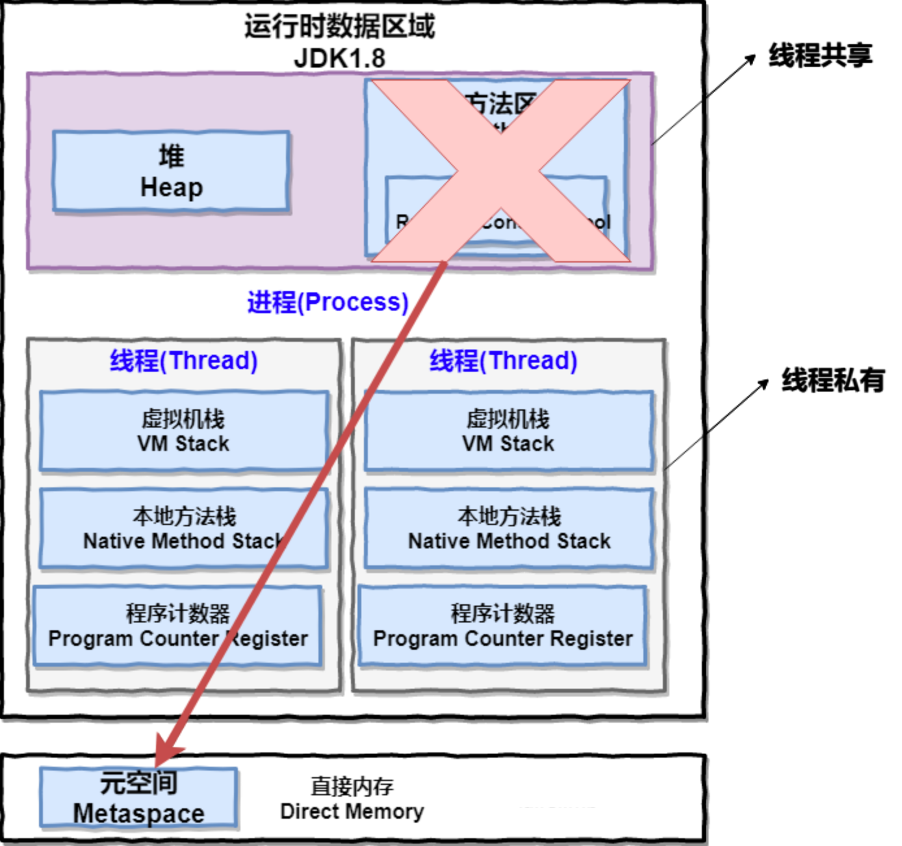
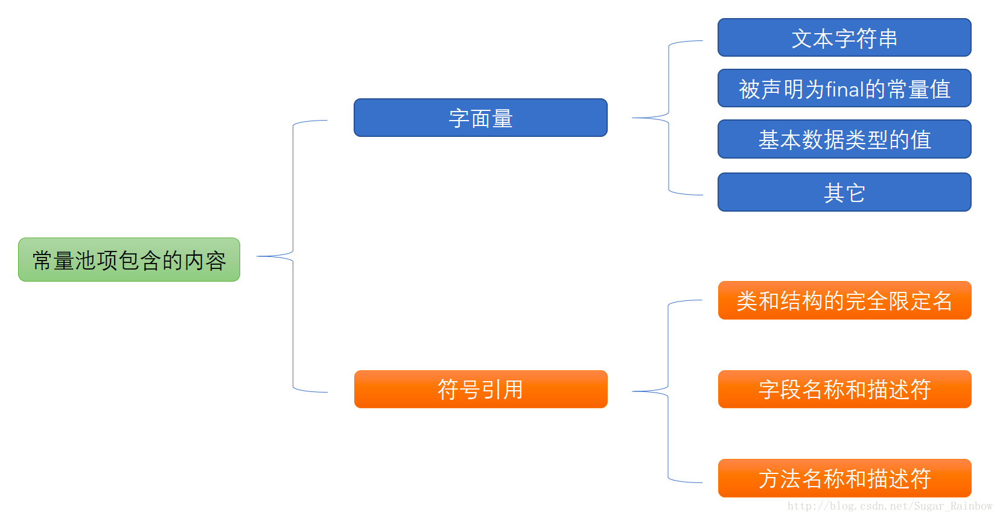
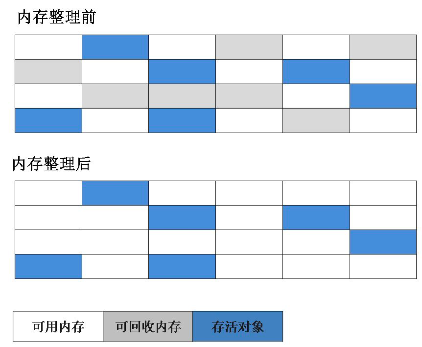
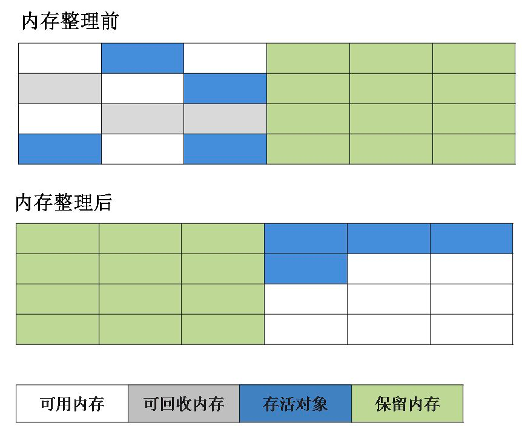
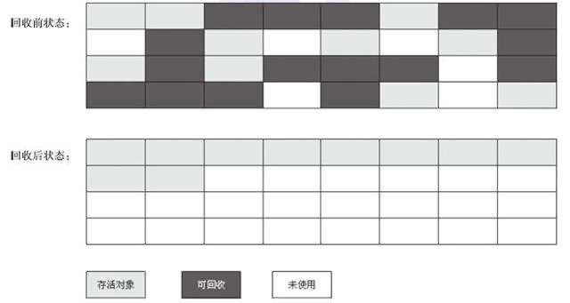
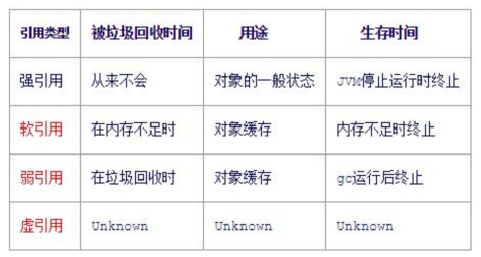

# 内存区域

## 内存划分



**内存结构**

**(1) 堆**

存放实例对象、数组的地方；
JVM所管理的内存中最大的一块；
采用分代收集算法；

分为新生代、老年代，新生代又分为 Eden、From Survivor、To Survivor 来实现10％ 空间浪费的复制算法。

```
-xms
-xmx
-xmn
-XX:SurvivorRatio               # 默认8
-XX:+HandlePromotionFailure     # 允许担保失败
```

年轻带：
① MinorGC 过程

老年代

是否开启允许担保失败

**(2) 方法区**

用于存储  **被 JVM 加载的类信息、常量、静态变量、即时编译器编译后的代码** 等数据.

**(3) 虚拟机栈**
线程私有；

与线程的生命周期相同；

一个线程中，每调用一个方法创建一个栈帧；

Stack Frame包含以下数据：

- 本地变量表；
- 操作数栈；
- 方法返回地址；
- 附加信息；


**(4) 本地方法栈**

为本地方法服务的栈

**(5) 程序计数器(PC)**

存放_<u>当前线程</u>_ 执行的字节码行号，获取下一条执行的字节码。

JVM的多线程是通过线程轮流切换并分配处理器执行时间的方式来实现的，为了线程切换后能恢复到正确位置而产生的。

唯一不会发生 OOM 的区域

Native 方法调用时，显示为为 null(undefined)

**(6) 运行时常量池：**
方法区中的一部分，存放编译期生成的字面量和符号引用；

JDK1.7及之后版本的 JVM 已经将运⾏时常量池从⽅法区中移了出来，<u>在 Java 堆（Heap）中开辟了⼀ 块区域存放运⾏时常量池。</u>



**(7) 直接内存**

默认情况下为最大堆的内存, NIO 中使用导致；

在5个区域中堆、方法区是线程共享的，需要对其进行垃圾回收；

JDK8 中元数据区存放在该处；


**其他**
(1) Metaspace
用于替换 Perm Gen；

元空间与永久代之间最大的区别在于：
①  <u>元空间并不在虚拟机中，而是使用本地内存</u> 。因此，默认情况下，元空间的大小仅受本地内存限制。
② <u>类的元数据放入 native memory, 字符串池和类的静态变量放入java堆中</u>，这样可以加载多少类的元数据就不再由MaxPermSize控制, 而由系统的实际可用空间来控制。

(2) 堆与栈的比较：
都是 Java 在 RAM 中存放数据的地方。

① 结构特性与存放内容：栈结构简单，只有有限的几种操作，因而栈的效率比堆高，通常存放对象的引用，而堆回收算法复杂，空间大，速度慢，通常用于存放所有创建的对象；

① 管理方式：栈自动释放，堆需要GC管理
② 空间大小：栈比堆小
③ 碎片相关：栈产生的碎片远小于堆
④ 分配方式与生命周期：栈支持静态和动态分配，而堆仅支持动态分配。栈中的数据大小与生命周期必须是确定的，缺乏灵活性，堆可以动态地分配内存大小，生命周期无需事先告诉编译器，运行时动态分配内存，存取速度慢。

⑤ 栈数据共享特性

(3) JDK 中 intern() 的区别


Q: 为什么要将永久代(PermGen)替换为元空间(MetaSpace)呢?

整个永久代有⼀个 JVM 本身设置固定⼤⼩上线，⽆法进⾏调整，⽽元空间使⽤的是直接内存，受本机可⽤内存的限制，并且永远不会得到 java.lang.OutOfMemoryError。可以使⽤ -XX:MaxMetaspaceSize 标志设置最⼤元空间⼤⼩，默认值为 unlimited，这意味着它只受系统内存的限 制。 -XX:MetaspaceSize 调整标志定义元空间的初始⼤⼩如果未指定此标志，则 Metaspace 将根 据运⾏时的应⽤程序需求动态地重新调整⼤⼩。


### **内存配置参数**

<p align="center"> 内存选项配置 </p>

| 选项                       | 描述                               | 备注                                                         |
| :------------------------- | :--------------------------------- | :----------------------------------------------------------- |
| -Xmn                       | 新生代大小                         |                                                              |
| -Xms                       | 最小堆容量                         |                                                              |
| -Xmx                       | 最大堆容量                         |                                                              |
| -Xss                       | 栈的大小                           |                                                              |
| -XX:NewSize=n              | 设置好后YoungGen的初始内存         | 与-Xmn等价,推荐-Xmn,<br>  相当于设定了NewSize/Max-NewSize的内存大小 |
| -XX:MaxNewSize=n           | 设置YoungGen的最大内存             |                                                              |
| -XX:SurvivorRatio=n        | eden:survivor                      | 默认为8                                                      |
| -XX:NewRatio=n             | 新生代:老年代                      | 默认为3,老年代为3,与-Xmn类似功能,相斥                        |
| -XX:PermSize               | 方法区(永久代)初始内存             |                                                              |
| -XX:MaxPermSize            | 方法区最大                         |                                                              |
| -XX:MetaspaceSize          | 元空间大小                         |                                                              |
| -XX:MaxMetaspaceSize       | 最大元空间大小                     |                                                              |
| -XX:MaxTenuringThreshold   | 对象熬过一定的年龄进入老年代的年龄 |                                                              |
| -XX:TLABWasteTargetPercent | TLAB空间所占用eden空间的百分比     |                                                              |

<p align="center">调试选项配置</p>

| 选项                                     | 描述                       | 备注                                                         |
| :--------------------------------------- | :------------------------- | :----------------------------------------------------------- |
| -XX:+PrintGC                             |                            |                                                              |
| +PrintGCDetails                          | 设置好后YoungGen的初始内存 | 与-Xmn等价,推荐-Xmn,<br>  相当于设定了NewSize/Max-NewSize的内存大小 |
| -XX:+HeapDumpOnOutOfMemoryError          | 出现 OOM 时 dump 堆文件    |                                                              |
| -XX:+PrintCommandLineFlags               | 打印命令行参数             |                                                              |
| -XX:ErrorFile=/XXX/logs/hs_err_pid%p.log | 指定错误文件路径           |                                                              |
| -XX:HeapDumpPath=/xx/logs                | 指定堆 dump 路径           |                                                              |
| -Xloggc:/XX/logs/gc.log                  | 指定 GC 日志存放位置       |                                                              |
| -XX:+PrintGCDateStamps                   | 打印 GC 时间               |                                                              |


### GC

**内存分配**
堆上分配
TLAB 分配
栈上分配


**Minor GC(Young GC)**

发生在新生代上的 GC, 当新生代的 Eden 区域满时触发。

(1) Minor GC 的过程(复制算法)
① ：eden、survivorFrom 复制到SurvivorTo，年龄+1
② ：清空eden、servicorFrom
③ ：ServicorTo和ServicorFrom互换


(2) 何时进行 Minor GC

当新生代的 Eden 区域满时触发


(3) 何时进入老年代

大对象直接进入老年代，防止读取文件太大只用一次；

对象熬过一定的年龄(-XX:MaxTenuringThreshold) 进入老年代；

to_survivor 区域内存满了进入老年代；


**Full GC**

Q: 何时进行 Full GC
① 老年代空间占满；
② 老年代的空间小于平均 Minor GC 上来的平均空间；


Q: Minor Gc和Full GC 有什么不同?

① 触发区域： MinorGC 发生在新生代， FullGC 发生在老年代。

② 触发频率： MinorGC 触发频率高，FullGC 触发频率低。

③ 速度： Full GC 一般比 MinorGc 慢10倍。


**相关的一些问题**

@Q: Java 堆如何实现的？

划分为 Young, Old, 在 Young 分为 Eden, from, to，

各个区域之间的比例， eden:survivor = 8, 


**@Q: 在方法中 Student s = new Student() 发生了什么？**

1、加载 Student.class 进入内存；

2、在栈中为 s 开辟空间；

3、在堆中为对象开辟空间；

4、为 s 对象的成员变量进行默认初始化；

5、对学生对象的成员变量进行显示初始化；

6、有构造代码块就执行构造代码块，无则省略;

7、通过构造函数对学生的成员变量赋值；

8、学生对象初始化完毕，把对象地址赋值给 s 变量；


**堆内存中对象的分配的基本策略**

对象优先在 Eden 区域分配

大对象直接进入老年代

长期存活的对象进入老年代


## 内存问题

### **OOM**

1.HeapOutOfMemory
可通过-XX:+HeapDumpOnOutOfMemoryError查看内存快照进行分析


2.MethodAreaOutOfMemory
存放类信息，常量，静态变量，及时编译后的代码，产生原因为动态产生过多的类。
如通过Cglib代理字节码增强，需要方法区来动态生成的class可以加载进内存。

3.ConstantPool OutOfMemory
如String.intern的使用不当

4.DirectMemoryOutOfMemory
可通过-XX:MaxDirectoryMemorySize指定，其默认与堆最大值相同。
发生在系统进行直接内存分配， 如unsafe.allocateMemeory()
特征: OOM后发现。。。，程序中直接或间接使用了NIO

5.StackOutOfMemeory
扩展栈时无法获取足够的内存空间，常发生在开发多线程应用中；
如果建立过多线程导致的内存溢出，在不减少线程数和更换64bit JVM的情况下,只能通过减少最大堆和减少栈容量来换取更多的线程。

6.Stack OverFlow
栈深度大于JVM锁允许的深度，常发生在死循环的递归调用.


### **内存泄漏**

指无用对象(不再使用的对象)持续占有内存或无用对象的内存得不到及时释放，从而造成的内存空间的浪费称为内存泄露。内存泄露有时不严重且不易察觉，这样开发者就不知道存在内存泄露，但有时也会很严重，会提示你Out of memory。


Java内存泄露根本原因是什么呢？
长生命周期的对象持有短生命周期对象的引用就很可能发生内存泄露，尽管短生命周期对象已经不再需要，但是因为长生命周期对象持有它的引用而导致不能被回收

1、常见引发原因
(1)  静态集合类引起的
静态变量的生命周期和应用程序一致，他们所引用的所有的对象Object也不能被释放，因为他们也将一直被Vector等引用着。 

在这个例子中，循环申请Object 对象，并将所申请的对象放入一个Vector 中，如果仅仅  释放引用本身  (o=null)，那么Vector 仍然引用该对象，所以这个对象对GC 来说是不可回收的。因此，如果对象加入到Vector 后，还必须从Vector 中删除，最简单的方法就是将Vector对象设置为null。

```java
static Vector v = new Vector(10);
for (int i = 0; i < 100; i ++) {
    Object o = new Object();
    v.add(o);
    o = null;
}
```


(2) 集合里面的对象属性被修改后，再调用remove() 方法时不起作用
Hash 表容器不可用户存放动态改变的数据类型，即改变对应对象的字段造成其 hashCode 不同。
```java
Set<Person> set = new HashSet<>();
Person p = new Person("A", "pwd1", 2);
Person p = new Person("B", "pwd2", 2);
Person p = new Person("C", "pwd3", 2);
set.add(p1);
set.add(p2);
set.add(p3);
log.info("Size: {}", set.size());    // 3

// modify
p3.setAge(3);
set.remove(p3);            // can not remove, memory leak
set.add(p3);       // add success
log.info("Size: {}", set.size());    // 4
```

(3) 各种连接未释放
数据库连接(dataSource.getConnection())
网络连接(socket)、IO 连接，未显视地调用 close() 方法将其关闭，不会自动 GC；

对于数据库连接：

对于Resultset 和Statement
对象可以不进行显式回收，但Connection 一定要显式回收，因为Connection 在任何时候都无法自动回收，而Connection一旦回收，Resultset 和Statement 对象就会立即为NULL。但是如果使用连接池，情况就不一样了，除了要显式地关闭连接，还必须显式地关闭Resultset
Statement 对象(关闭其中一个，另外一个也会关闭)，否则就会造成大量的Statement 对象无法释放，从而引起内存泄漏。这种情况下一般都会在try里面去的连接，在finally里面释放连接。

(4) 监听器
在java 编程中，我们都需要和监听器打交道，通常一个应用当中会用到很多监听器，我们会调用一个控件的诸如addXXXListener()等方法来增加监听器，但往往在释放对象的时候却没有记住去删除这些监听器，从而增加了内存泄漏的机会。

(5) 内部类和外部模块等的引用
内部类的引用是比较容易遗忘的一种，而且一旦没释放可能导致一系列的后继类对象没有释放。此外程序员还要小心外部模块不经意的引用，例如程序员A 负责A 模块，调用了B 模块的一个方法如： 

public void registerMsg(Object b); 

这种调用就要非常小心了，传入了一个对象，很可能模块B就保持了对该对象的引用，这时候就需要注意模块B 是否提供相应的操作去除引用。

(6) 不正确使用单例模式

不正确使用单例模式是引起内存泄露的一个常见问题，单例对象在被初始化后将在JVM的整个生命周期中存在(以静态变量的方式)，如果单例对象持有外部对象的引用，那么这个外部对象将不能被jvm正常回收，导致内存泄露，考虑下面的例子： 

```java
class A{ 
    public A(){ 
   	    B.getInstance().setA(this); 
    } 
    .... 
} 
```

显然B采用singleton模式，它持有一个A对象的引用，而这个A类的对象将不能被回收。想象下如果A是个比较复杂的对象或者集合类型会发生什么情况


**2、 内存溢出与内存泄漏的区别**

内存泄露是寻致内存溢出的原因之一；内存泄露积累起来将导致内存溢出。
内存泄露可以通过完善代码来避免：内存溢出可以通过调整配置来减少发生频率，但无法彻底避免。


### 内存状况分析

如何检测内存泄漏？

通过一些性能监测工具，如 JProfiler、Optimizeit Profiler

如何避免内存泄漏、溢出？

- 尽早释放放无用对象的引用。

- 使用临时变量的时候，让引用变量在退出活动域后自动设置为null，暗示垃圾收集器来收集该对象，防止发生内存泄露。

- 程序进行字符串处理时，尽量避免使用string，而0使用StringBuffer，因为每一个 String对象都会独立占用内存一块区域。


# GC和内存分配
**JVM垃圾回收区域：**
对于PC,虚拟机栈,本地方法栈与线程生命周期相同，分配具有确定性。
对于堆内存、方法区，一个接口中的多个实现类需要的内存可能不一样，一个方法中的多个分支需要的内存不一样，只有在运行时才能知道要创建多少obj，这部分内存的分配和回收是动态的。


## 对象存活判断
**1. 引用计数法**
对象添加一个引用计数器，有地方引用+1,失效-1.
不能够解决对象之间`循环引用、环形引用`问题

可以实现共享数据，redis 中共享1-9999 的数字。

**2. 根搜索算法**
GC Root Tracing: 通过名为 "GC Root" 的对象作为起始点，从这些节点开始向下搜索，搜索走过的路劲称为`引用链`。是一种**可达性分析算法**。
当一个对象到 GC Root 无任何引用链(图论中的不可达)时，证明此对象不可引用。

*可作为 GC Roots 的几种对象*

+ 虚拟机栈(栈帧中的本地变量表)中引用过的对象
+ 方法区中的类静态属性引用的对象
+ 方法区中的常量引用的对象
+ 本地方法栈中`JNI(native方法)`引用的对象

不可达对象不等价于可回收对象，<u>不可达对象变为可回收对象至少要经过两次标记过程</u>。两次标记后仍然是可回收对象，则将面临回收。

**3. 对象引用:**
用于判断对象存活都与`引用`相关
- 强引用: 
- 软引用: 内存足时,可经过多次GC, 类似缓存
- 弱引用: 下一次GC 时回收；
- 虚引用: 目的是能在这个obj被gc时收到一个系统通知

ThreadLocalMap.Entry：

WeakHashMap.Entry：需要引用队列持有

**4. 回收方法区**
永久带的gc主要回收：废弃常量和无用的类。
判断为`无用的类`需要三个条件:
+ 该类实例多被gc, heap中不存在类的任何instance
+ 加载该类的 ClassLoader 被回收
+ 该类的java.lang.Class obj 没有任何对象被引用, 无法在任何地方通过反射访问该类的方法

**5. Finalize()：**
可实现在其中拯救一次对象，是对象逃逸死亡的最后一次机会，具有只能被系统调用一次的特性，代价高昂不建议使用。


**相关问题**

(1) 两种判断内存空间是否符合 GC
① 给对象赋予了空值null，以下再没有调用过，
② 给对象赋予了新值，这样重新分配了内存空间。


## GC 内存回收

**内存回收算法**

**1、标记-清除算法**
两个阶段：标记和清除
先标记出所有需要回收的obj，在标记完成后统一回收所有被标记的obj.


两个缺点：
+ 效率低，标记和清除都不高;
+ 磁盘碎片多，空间问题，产生大量不连续的内存碎片。



**2、复制算法**
为了解决Mark-Sweep算法内存碎片化的缺陷而被提出的算法。按内存容量将内存划分为等大小的两块。
每次只使用其中一块，当这一块内存满后将尚存活的对象复制到另一块上去，把已使用的内存清掉。


特点： 
内存效率高，不易产生碎片，但是最大的问题是可用内存被压缩到了原本的一半。
且存活对象增多的话，Copying算法的效率会大大降低。

实现：
大多数对象存活时间短，不需要 1:1 划分两块区域；
survivor 区域不够需要老年代进行分配担保；
大对象直接进入老年代，避免不必要的复制开销。


**说明：**常用于回收新生代，基于`新生代中的对象98%是朝生夕死的`，将内存划分为较大的Eden和两块较小的Survivor，每次使用eden和其中的一块Survivor, 此方式需要老年代的分配担保策略，浪费 10% 的空间。

当回收的时候，将Eden和Survivor中还存活的 obj 一次性复制到另一块Survivor上，清理掉Eden和刚刚用过的Survivor的空间。

默认eden:survivor=8

特征：在对象存活率较高时需要执行较多的复制操作，效率将会变低，老年代不能使用这种算法。




**3、标记-整理算法**
其中标记过程和“标记-清除”算法一样，但是后续步骤不是直接对可回收的对象进行清理，而是  <u>让所有存活的对象都*向一端移动*，然后直接清理掉端边界以外的内存</u>  。




**4、分代收集算法**
根据对象的存活周期的不同将内存划分为几块。一般是把Java堆分为新生代和老年代，这样就可以根据各个年代的特点采用最适合的收集算法。
在新生代中，每次垃圾收集时都会发现有大量对象死去，只有少量对象存活，那就选择复制算法。

算法；
老年代中因为对象存活率较高，没有额外空间对它进行分配担保，就必须采用“标记-清除”或者“标记-整理”算法来进行回收。


## 收集器


**收集器的分类**

(1) 增量收集器
 增量收集器把堆栈分为多个域，每次仅从一个域收集垃圾。这会造成较小的应用程序中断。

(2) 分代收集器
 这种收集器把堆栈分为两个或多个域，用以存放不同寿命的对象。JVM生成的新对象一般放在其中的某个域中。过一段时间，继续存在的对象将获得使用期并转入更长寿命的域中。分代收集器对不同的域使用不同的算法以优化性能。 

(3) 并发收集器
并发收集器与应用程序同时运行。这些收集器在某点上(比如压缩时)一般都不得不停止其他操作以完成特定的任务，但是因为其他应用程序可进行其他的后台操作，所以中断其他处理的实际时间大大降低。

(4) 并行收集器
并行收集器使用某种传统的算法并使用多线程并行的执行它们的工作。在多CPU机器上使用多线程技术可以显著的提高java应用程序的可扩展性。


**新生代的收集器**

**1、Serial**
该收集器是一个单线程的收集器，即在进行垃圾收集时候，必须暂停其他所有的工作线程，直到它收集结束。到目前为止，它依然是虚拟机运行在`Client模式下的默认`新生代收集器。
优点是简单而高效。目前停顿时间可以控制在几十毫秒最多一百多毫秒以内。

**2、ParNew**
Serial 收集器的多线程版本，也使用复制算法，除了使用多线程进行垃圾收集之外，其余的行为和Serial收集器完全一样。

ParNew收集器默认开启和CPU数目相同的线程数，可以通过-XX:ParallelGCThreads参数来限制垃圾收集器的线程数。ParNew虽然是除了多线程外和Serial收集器几乎完全一样，但是ParNew垃圾收集器是很多java虚拟机运行在  <u>Server模式下新生代的默认垃圾收集器</u> 。

server 默认，可与 CMS 配合。

默认情况下开启 CMS，在新生代模式使用的便是 ParNew


**3、Paralel Scanvenge**(多线程复制算法、高效)
Parallel Scavenge收集器也是一个新生代垃圾收集器，同样使用复制算法，也是一个多线程的垃圾收集器，
**它重点关注的是程序达到一个可控制的吞吐量**(Thoughput，CPU用于运行用户代码的时间/CPU总消耗时间，即吞吐量=运行用户代码时间/(运行用户代码时间+垃圾收集时间))

(1) 特性及适用场景
高吞吐量可以最高效率地利用CPU时间，尽快地完成程序的运算任务，主要适用于在后台运算而不需要太多交互的任务。


( 2) 与 ParNew 的区别
**自适应调节策略也是ParallelScavenge收集器与ParNew收集器的一个重要区别**。


**老年代的收集器**

**1、Serial Old 收集器**

// TODO

**2、 Parallel Old 收集器**

要求吞吐量大的情况下使用

**3、CMS**

已淘汰

Concurrent mark sweep(CMS)：  并发标记清除

GC时，用户线程还可以同时工作(老年代)

(1) 特性和适用场景
其最主要目标是获取最短垃圾回收停顿时间，和其他年老代使用标记-整理算法不同，它
使用多线程的标记-清除算法。 
最短的垃圾收集停顿时间可以为交互比较高的程序提高用户体验。


(2) 算法的流程
 CMS工作机制相比其他的垃圾收集器来说更复杂，整个过程分为以下4个阶段：
① 初始标记(STW)
只是标记一下 GC Roots 能直接关联的对象，速度很快，仍然需要暂停所有的工作线程。
② 并发标记 (耗时)
进行 GC Roots 跟踪的过程，和用户线程一起工作，不需要暂停工作线程。
③ 重新标记(STW)
为了修正在并发标记期间，因用户程序继续运行而导致标记产生变动的那一部分对象的标记记录，仍然需要暂停所有的工作线程。
④ 并发清除 (耗时)
清除 GC Roots 不可达对象，和用户线程一起工作，不需要暂停工作线程。由于耗时最长的并发标记和并发清除过程中，垃圾收集线程可以和用户现在一起并发工作，所以总体上来看CMS收集器的内存回收和用户线程是一起并发地执行。


**4、G1收集器**
(1) 算法实现
G1收集器将整个Java堆(包括新生代、老年代)划分为多个大小固定的独立区域(Region)，并且跟踪这些区域里面的垃圾堆积程度，在后台维护`一个优先列表`，每次根据允许的收集时间，优先回收垃圾最多的区域(这就是G1名称的由来)。
进行回收时，是对整个堆，新生代和老年代都为逻辑划分，尽量减少了对整个堆的垃圾收集。

(2) 优点及特性
G1收集器可以实现在基本不牺牲吞吐量的前提下完成低停顿的内存回收，这是由于它能够极力的避免全区域的垃圾收集，

(3) 与 CMS 的对比
与CMS收集器相比有两个显著的改进：

+ 一是空间整合，G1收集器整体是基于 “标记-整理” 算法实现的收集器；
+ 二是可预测的停顿，它可以非常精准地控制停顿，既能让使用者明确指定在一个长度为M毫秒的时间片段内，消耗在垃圾收集上的时间不得超过N毫秒。


### 收集器比较与参数


<p align="center">垃圾收集器比较</p>
| 垃圾收集器       | 算法          | 方式 | 堆区域 | 机制                |
| :--------------- | :------------ | :--- | :----- | :------------------ |
| Serial收集器     | 复制算法      | 串行 | 新生代 | STW                 |
| Serial Old收集器 | 标记-压缩算法 | 串行 | 老年代 | STW                 |
| ParNew收集器     | 复制算法      | 并行 | 新生代 | Stop-the-World      |
| Parallel收集器   | 复制算法      | 并行 | 新生代 | Stop-the-World      |
| Parallel Old收集 | 标记-压缩算法 | 并行 | 老年代 | Stop-the-World      |
| CMS收集器        | 标记-清除算法 | 并行 | 老年代 | Stop-the-World/并发 |
| G1收集器         |               |      | 整个堆 |                     |


<p align="center">GC回收器组合配置</p>
| GC组合                                      | Minor GC              | Full GC                          | 描述                                                         |
| :------------------------------------------ | :-------------------- | :------------------------------- | :----------------------------------------------------------- |
| -XX:+UserSerialGC                           |                       |                                  | 可与Serial Old组合执行                                       |
| -XX:+UseParNewGC                            | ParNew                | Serial Old                       | ParNew 配合 Serial Old                                       |
| -XX:+UseParallelGC                          | Parallel并行          | Serial Old 串行                  | 与Serial Old配合                                             |
| ---                                         | ---                   | ---                              | ---                                                          |
| -XX:+UseParallelOldGC                       | Parallel并行          | Parallel Old并行                 | **Parallel+Parallel Old**,吞吐量优先                         |
| -XX:+UseConcMarkSweepGC                     | ParNew并行回收        | *缺省使用CMS并发,备用Serial Old* | ParNew+CMS默认回收，出现`ConcurrentNodeFailure`或者`PromotionFailed`时，采用ParNew+Serial Old |
| -XX:+UseConcMarkSweepGC<br>-XX:+UseParNewGC | Serial 串行           |                                  |                                                              |
| -XX:+UseG1GC                                | G1 并发、并行内存回收 |                                  |                                                              |
| -XX:MaxGCPauseMillis=100                    | G1 时，最大停止时间   |                                  |                                                              |
| -XX:+ParallelRefProcEnabled                 |                       |                                  |                                                              |


## 内存分配|回收

New出来的特别小，分配在栈上(开了栈上分配的优化)，默认server模式下开启。
TLAB：每个线程去eden申请内存，不用加锁，提高对象分配效率


**1. 分配内存**
一个对象new出来，首先放在栈上一一>栈上放不下了，放线程本地一一>线程本地放不下，放eden。
(如果特别大，直接扔透老年代)


**2. 新生代到老年代**

+ ① gc年龄活过设定值(默认15)；
+ ② 对象过大，直接进入老年代，防止年轻代复制的开销；
-  ③ Young Gen 存放不下时，进入老年代；

```
-XX:PretenureSizeThreshold
```

实现机制：
对象的动态年龄判断；

空间分配担保；


**四种引用**

**1、 强引用**
把一个对象赋给一个引用变量，这个引用变量就是一个强引用。当一个对象被强引用变量引用时。

它处于可达状态，它是**不可能被垃圾回收机制回收的**，即使该对象以后永远都不会被用到JVM也不会回收。因此 *强引用是造成 Java 内存泄漏的主要原因之一* 。

**2、 软引用**
软引用需要用SoftReference类来实现，对于只有软引用的对象来说，当系统内存足够时它不会被回收，当系统内存空间不足时它会被回收。软引用通常用在对内存敏感的程序中。

() 适用场景
软引用适合引用那些可以通过其他方式恢复的对象，例如：数据库缓存中的对象就可
以从数据库中恢复，所以软引用可以用来实现缓存。等会会介绍MyBatis中的使用软引
用实现缓存的案例。


**3、 弱引用**
弱引用需要用WeakReference类来实现，它比软引用的生存期更短，对于只有弱引用的对象来说，只要垃圾回收机制一运行，<u>不管JVM的内存空间是否足够，总会回收该对象占用的内存</u>。

(1) 特性

这里我们就需要重新认识一下，什么是：当垃圾收集器工作时，无论当前内存是否足够，都会回收掉只被弱引用关联的对象，这里的重点是：只被弱引用关联的对象

(2) 应用

ThreadLocalMap.Entry

WeakHashMap.Entry


**4、 虚引用(PhantomReference)** 
虚引用需要类来实现，它不能单独使用，**必须和引用队列联合使用**。虚引用的**主要作用是跟踪对象被垃圾回收的状态**。

一个对象是否有虚引用的存在，完全不会对其生存时间构成影响，也无法通过虚引用来取得一个对象实例。为一个对象设置虚引用关联的唯一目的就是希望能在这个对象被收集器回收时收到一个系统通知。

**5、 引用队列**

在很多场景中，我们的程序需要在一个对象的可达性(GC可达性，判断对象是否需要回收)发生变化的时候得到通知，引用队列就是用于收集这些信息的队列。


ReferenceQueue引用队列记录了GC收集器回收的引用，这样的话，我们就可以通过引用队列的数据来判断引用是否被回收，以及被回收之后做相应的处理，例如：如果使用弱引用做缓存则需要清除缓存，或者重新设置缓存等。


从MyBatis的源码中抽离出来的，MyBatis在缓存的时候也提供了对弱引用和软引用的支持，SoftCache、WeakCache。





## JVM 调优

jvm 调优目的
1.将转移到老年代的对象数量降低到最小；
2.减少fullGC 的执行时间

```
jstat -gcutil
jstat -gccapacity
```


Q: 如何减少 GC 的次数？
什么时候发生GC 根据对应情况做出对应的调整。
1.对象不用时最好显示置为NULL
一般而言，为NULL 的对象都会被作为垃圾处理，所以将不用的对象置为NULL，有利于GC 收集器判定垃圾，从而提高了GC 的效率。

2.System,gc()

尽量少使用System,gc()
此函数建议JVM 进行主GC，会增加主GC 的频率，增加了间接性停顿的次数。

3.静态变量

尽量少使用静态变量
静态变量属于全局变量，不会被GC 回收，他们会一直占用内存

4.String

尽量使用 StringBuffer, 而不使用String 来累加字符串

5.分散对象创建或删除的时间
集中在短时间内大量创建新对象，特别是大对象，会导致突然需要大量内存，
JVM 在这种情况下只能进行主GC 以回收存，从而增加主GC 的频率。

6.尽量少用finaliza 函数
它会加大GC 的工作量。

7.如果有需要使用经常用到的图片，可以使用软引用类型，将图片保存在内存中，而不引起outofmemory

8.能用基本类型入INT 就不用对象Integer

9.增大-Xmx 的值


# 类加载机制

(1) 概述
虚拟机把描述类的数据从Class文件加载到内存中，并对数据进行校验、转换解析和初始化，最终形成可以被虚拟机直接使用的Java类型，这就是虚拟机的类加载机制。

(2) 类加载到 JVM 的过程：
类从被加载到虚拟机内存中开始，到卸载出内存为止，它的整个生命周期包括了：
加载、校验、准备、解析、初始化、使用和卸载七个阶段。
其中解析可以在初始化之后, 此是Java动态的体现.


**(3) 何时进行类加载:**

① 遇到new、getstatic、putstatic、invokestatic 这4条字节码指令时, 对应 Java 中 new 实例化obj、读取或设置一个个类静态字段的时候、调用一个类的静态方法时；  

② 初始化一个子类,而其父类未初始化,先触发父类的初始化；

③ 要执行的主类(含main方法的)；

④ java.lang.reflet 包的方法对类进行反射调用时, 如 Class.forName()；；

⑤ 动态语言支持，java.lang.invoke.MethodHandler, 如 Groovy ?


## 类加载的过程


**(1) 加载**
 需要做的事情：

+ 通过类全限定名获取类的二进制字节流；
+ 将字节流的静态存储结构转换为 `方法区的运行时数据结构`；
+ 在堆中生成一个代表该类的Class对象，作为方法区这些数据的访问入口。

加载是类加载过程中的一个阶段，**这个阶段会在内存中生成一个代表这个类的 java.lang.Class 对象，作为方法区这个类的各种数据的入口**。注意这里不一定非得要从一个Class文件获取，这里既可以从ZIP包中读取(比如从jar包和war包中读取)，也可以在运行时计算生成(动态代理)，也可以由其它文件生成(比如将JSP文件转换成对应的Class类)。

**(2) 验证**
这一阶段的主要目的是为了**确保Class文件的字节流中包含的信息是否符合当前虚拟机的要求**，并且不会危害虚拟机自身的安全。

**(3) 准备**
准备阶段是正式为类变量分配内存并设置类变量的初始值阶段，即 **在方法区中分配这些变量所使用的内存空间**。注意这里所说的初始值概念，比如一个类变量定义为：

```java
public static int v = 8080; 
```

实际上变量v在准备阶段过后的初始值为0而不是8080，将v赋值为8080的put static指令是程序被编译后，**存放于类构造器<client>方法之中**。 

但是注意如果声明为：  final 的特殊性
```java
public static final int v = 8080; 
```
在编译阶段会为v生成ConstantValue属性，在**准备阶段虚拟机会根据ConstantValue属性将v赋值为8080。**

**(4) 解析**
解析阶段是指 **虚拟机将常量池中的符号引用替换为直接引用的过程**。

符号引用 
符号引用与虚拟机实现的布局无关，**引用的目标并不一定要已经加载到内存中。各种虚拟机实现的内存布局可以各不相同**，但是它们能接受的符号引用必须是一致的，因为符号引用的字面量形式明确定义在Java虚拟机规范的Class文件格式中。


直接引用 
直接引用可以**是指向目标的指针，相对偏移量或是一个能间接定位到目标的句柄**。如果有了直接引用，那***引用的目标必定已经在内存中存在***。


符号引用就是class文件中的：

1. CONSTANT_Class_info 
2. CONSTANT_Field_info 
3. CONSTANT_Method_info 等类型的常量


**(5) 初始化**
对于类变量中的常量进行指定(非默认)

初始化阶段是类加载最后一个阶段，前面的类加载阶段之后，除了在加载阶段可以自定义类加载器以外，其它操作都由JVM主导。到了初始阶段，<u>才开始真正执行类中定义的Java程序代码</u>。


**类加载相关问题**

(2) 父子类中的初始化顺序
父类的静态块 → 子类的静态块|域 → 父类的构造方法块 → 子类的构造方法块 → 父类的构造器 → 子类的构造器 → 


类构造器<client> 
初始化阶段是**执行类构造器<client>方法的过程**。<client>方法是由编译器自动收集类中的类变量的赋值操作和静态语句块中的语句合并而成的。虚拟机会保证子<client>方法执行之前，父类的<client>方法已经执行完毕，**如果一个类中没有对静态变量赋值也没有静态语句块，那么编译器可以不为这个类生成<client>()方法**。 


(3)以下几种情况不会执行类初始化： 
1. 通过子类引用父类的静态字段，只会触发父类的初始化，而不会触发子类的初始化。 
2. 定义对象数组，不会触发该类的初始化。 
3. 常量在编译期间会存入调用类的常量池中，本质上并没有直接引用定义常量的类，不会触发定义常量所在的类。 
4. 通过类名获取 Class 对象，不会触发类的初始化。 
5. 通过 Class.forName 加载指定类时，如果指定参数initialize为false时，也不会触发类初始化，其实这个参数是告诉虚拟机，是否要对类进行初始化。
6. 通过 ClassLoader 默认的 loadClass 方法，也不会触发初始化动作。


(4) 类加载方式
类初始化时会执行静态代码块
① 显式加载：new
② 隐式加载：loadClass 和 forName

两者区别：
loadClass 加载的类未进行链接和初始化，比如 Spring IOC的bean类加载，就用了loadClass，延时加载；
forName 加载的类已进行了初始化，比如 mysql的驱动包加载就用了forName；


(5) 类加载器中方法对应的阶段

Class.forName() ： 完成了初始化阶段；

loadClass()： 仅完成加载阶段，未进行到初始化阶段；


## 类加载器

通过不同类加载器加载的类不算相同的类？

使用不同的类加载器加载，进行类的动态调试，arthas ...

**(1) 类与类加载器**
虚拟机设计团队把类加载阶段中的 “通过一个类的全限定名来获取此类的二进制字节流” 这个动作放到Java虚拟机外部去实现，以便让应用程序自己决定如何去获取所修要的类。实现这个动作的代码模块被称为“类加载器”。


类加载器虽然只用于实现类的加载动作，但它在Java程序中起到的作用却远远不限于类加载阶段。对于任意一个类，都需要由加载它的类加载器和这个类本身一同确定其在Java虚拟机中的唯一性。


**(2) 类加载器的分类**

① 启动类加载器(Bootstrap ClassLoader) 
负责加载 `JAVA_HOME\lib` 目录中的，或通过 -Xbootclasspath 参数指定路径中的，且被虚拟机认可(按文件名识别，如rt.jar)的类。

② 扩展类加载器(Extension ClassLoader) 
负责加载  `JAVA_HOME\lib\ext` 目录中的，或通过 java.ext.dirs 系统变量指定路径中的类库。

③ 应用程序类加载器(Application ClassLoader)
负责加载 用户路径(`classpath`)上的类库。 JVM通过双亲委派模型进行类的加载，当然我们也可以通过继承java.lang.ClassLoader实现自定义的类加载器。
是java.lang.ClassLoader.getSystemClassLoader()的返回值，负责加载用户类路径(classPtth)下制定的类库。 若应用程序未指定自定义的CL, 默认为此CL.

④ 用户自定义类加载器
重写 findClass、defineClass


## 双亲委派模型

(1) 双亲委派模型概述

​	**当一个类收到了类加载请求，他首先不会尝试自己去加载这个类，而是把这个请求委派给父类去完成**，每一个层次类加载器都是如此，因此所有的加载请求都应该传送到启动类加载其中，**只有当父类加载器反馈自己无法完成这个请求的时候**(在它的加载路径下没有找到所需加载的Class)，**子类加载器才会尝试自己去加载**。

​	采用双亲委派的一个好处是比如加载位于rt.jar包中的类java.lang.Object，不管是哪个加载器加载这个类，最终都是委托给顶层的启动类加载器进行加载，这样就保**证了使用不同的类加载器最终得到的都是同样一个Object对象**。

总结：带有层级关系(优先级)


**(2) 好处**
① 保证 Java 程序的稳定运行，实现了基本类的加载一致，保证了使用不同的类加载器最终得到的都是同样一个Object对象， 节约内存；
② 使类通过类加载器而实现了带有优先层次的类结构关系；


**(3)  打破双亲委派模型的方式**
① 基础类需要调用回用户的代码，通过线程上下文加载器处理，如 JNDI、JDBC；

② 用户对程序动态性的追求， OSGi 热部署实现就是通过自定义类加载器实现；

③ JDK1.2 之前自定义的；


OSGI

Open Server Gateway Initiative，是面向Java的动态模型系统，是Java动态化模块化系统的一系列规范。

基于OSGi的程序很可能可以实现模块级的热插拔功能。

 


# 其他

### 对象的访问定位

⽬前主流的访问⽅式有

① 使⽤句柄

Java堆中将会划分出⼀块内存来作为句柄池，reference 中存 储的就是对象的句柄地址，⽽句柄中包含了对象实例数据与类型数据各⾃的具体地址信息；

② 直接指针

Java 堆对象的布局中就必须考虑如何放置访问类型 数据的相关信息，⽽reference 中存储的直接就是对象的地址。


## 监控与故障处理

开启 JMX ，使用 Prometheus 等监控组件。。。

使用 arthas 命令行查看运行时情况


### JDK 命令行

**jstat**

查看日志信息，查看各个区域的占用空间情况，YGC, FGC 的时间和回收状况，以及整体的 GC 时间。

```
jstat -gcutil [pid] [intervel] [count]
jmap -dump:format=b,file=[filename][pid]
```

一些参数：

记录堆的内存快照，之后利用第三方工具(如 MAT) 来分析整个 Heap 的对象关联情况。 在线网站分析。

**jmap**


## 性能调优

具体来讲：
Java整个堆大小设置，Xmx 和 Xms设置为老年代存活对象的3-4倍，即FullGC之后的老年代内存占用的3-4倍
永久代 PermSize和MaxPermSize设置为老年代存活对象的1.2-1.5倍。
年轻代Xmn的设置为老年代存活对象的1-1.5倍。
老年代的内存大小设置为老年代存活对象的2-3倍。

BTW：
1、Sun官方建议年轻代的大小为整个堆的3/8左右， 所以按照上述设置的方式，基本符合Sun的建议。
2、堆大小=年轻代大小+年老代大小， 即xmx=xmn+老年代大小 。 Permsize不影响堆大小。
3、为什么要按照上面的来进行设置呢？ 没有具体的说明，但应该是根据多种调优之后得出的一个结论。


@Q: System.gc() 和 Runtime.gc() 

用于 JVM 进行垃圾回收，立即开始还是延迟进行 GC 取决于 JVM 的实现


@Q: finalize() 什么时候被调用？

内存充足， GC 可能永远不会执行， finalize() 可能永远不被执行，无法作为收尾工作；

主要用于 JNI 调用 non-java 程序时回收这部分的内存；


@Q: 如何加快 GC 速度

快速判断对象生死


@Q: 线程 安全 Java 里面的实现方式？


@Q: 如果我们一个项目，理论上需要1.5G 的内存就足够，但是项目上线后发现隔了几个星期，
占用内存到了2.5G，这时候你会考虑是什么问题？怎么解决？


@Q: 可能造成内存泄漏的原因有哪些？检查内存泄漏的工具有哪些？你平时是怎么检查内存泄漏的？


@Q: jvm 多态原理。
invokestatic invokeinterface 等指令。常量池中的符号引用找到直接引用。在堆中找到实例对象，获取到偏移量，由偏移量在方法表中指出调用的具体方法。接口是在方法表中进行扫描)等等扯了半天


