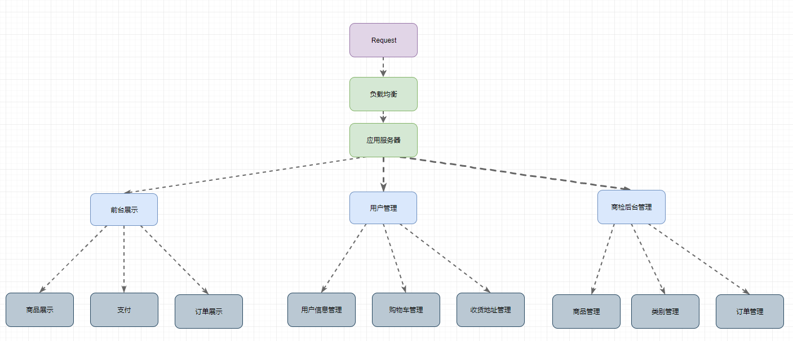
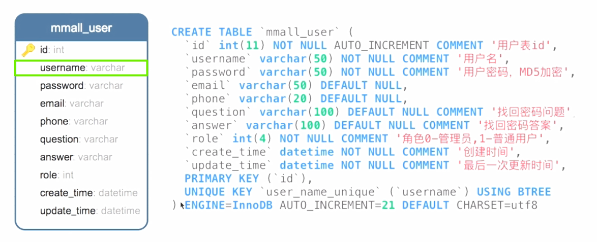
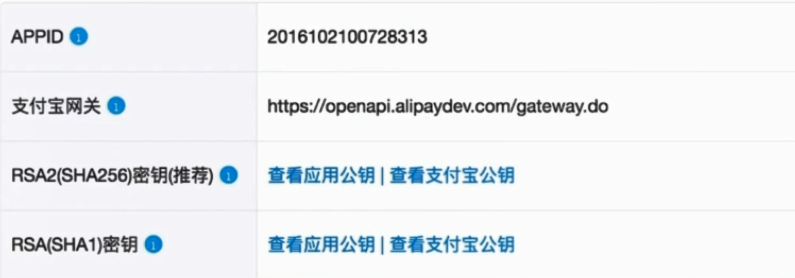
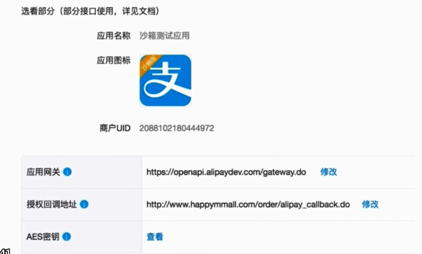
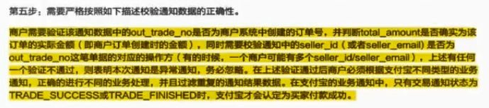
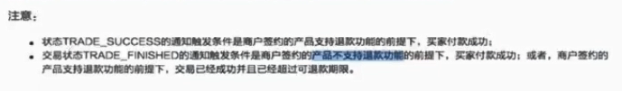

# 项目起步

## 环境搭建

**Web.xml初始化**
	RequestContextListener
	ContextLoaderListener
	DispatchServlet
	CharacterEncodingFilter


**Spring 中的初始化**

applicationContext.xml配置初始化
	扫描、注解开启
	Aop配置
	分离配置    == *.xml
applicationContext-datasource.xml
	扫描、注解开启
	PropertyPlaceholderConfigurer
	dataSource
	sqlSessionFactoryBean
		|-分页    -- 方言
	MapperScannerConfigurer
	DataSourceTransactionManager事务管理


SpringMvc初始化(dispatch-servlet.xml)

   扫描、注解开启

   转换器

​      |-StringHttpMessageConverter

​      |-MappingJackson….

   文件上传

​      |-内存最大

​      |-上传大小


**日志初始化**

|-打卡dao层日志  (dubugàinfo)

最大存储时间


**项目配置文件**

文件服务器的server

User、passwd、prefix


## 通用模块

1、提取出通用的工具

(1) 日期处理工具


(2) BigDecimal 处理商业运算精度工具

解决浮点型在商业应用中丢失精度的问题

​    |-*String ->BigDecimal*

​    |-除法的取余，精度


Q: 如何保证浮点数的精度？ double->BigDecimal为什么不可以？ 对于有特定精度要求时该如何处理？

A1: 使用**String -> BigDecimal****，**为方便开发封装成工具类。

​       |-BigDecimal(0.05).add()精度仍然存在问题

​       |-参考阅读源码中的文档

​       |-考虑除法中除不尽的情况

A3: 使用BigDecimal提供的常量进行限制

b1.divide(b2, 2, BigDecimal.ROUND_HALF_UP);


(3) Property 读取自定义配置工具


(4) Json 转化工具


2、提取通用的实体

封装高复用的 ServerResponse 作为后端返回对象

（1） 处理 泛型冲突问题

通过工厂方法的名称进行实现；

定义的成员变量类型与泛型类型一致；


（2） 根据属性封装额外方法  isSuccess

通过此参数进行 Service 和 Controller 之间来回调用交互控制；

通过类中的 code 属性的特殊值控制；


（3） 忽略 JSON 中的 null 属性以及封装的额外方法

保证序列化 json 的时候,如果是null的对象, key也会消失；

可以统一配置 MessageConvert 转换，对于非统一的通过注解或者类实现接口方式定制序列化的方式；

​	`@JsonSerialize(include =  JsonSerialize.Inclusion.NON_NULL)`： 针对类的序列化，只序列化非空属性

​	`@JsonIgnore`： 不序列某个方法或者属性


## 通用配置

配置文件上传

**Web.xml** 初始化

   **CharacterEncodingFilter**

   **RequestContextListener**

   **ContextLoaderListener**

   **DispatchServlet**


**applicationContext.xml**配置初始化

   **扫描、注解开启**

   **Aop****配置**

   **分离配置    == \*.xml**


**applicationContext-datasource.xml**

   **扫描、注解开启**

   **PropertyPlaceholderConfigurer**

   **dataSource**

   **sqlSessionFactoryBean**

​     **|-****分页    -- 方言**

   **MapperScannerConfigurer**

   **DataSourceTransactionManager****事务管理**


SpringMvc初始化(dispatch-servlet.xml)

   扫描、注解开启

   转换器

​      |-StringHttpMessageConverter

​      |-MappingJackson….

   文件上传

​      |-内存最大

​      |-上传大小

@ResponseBody  xxx  自动序列化

Logback初始化：

   |-打卡dao层日志  

最大存储时间

mmall.properties

文件服务器的server

User、passwd、prefix


# 模块



## 用户模块

**（1） 表结构**



① role： 用次字段来进行前台和后台的逻辑划分开来；

② question|answer： 用来进行修改密码的重新确定；

③ user_name_unique： 根据该表的查询情况来进行增加索引的，需要更具用户名查出问题，校验用户名存在等逻辑；

```sql
 `username` VARCHAR(50) NOT NULL COMMENT '用户名',                      -- query optimize
 `question` VARCHAR(100) DEFAULT NULL COMMENT '找回密码问题',           -- reset pasword
 `answer` VARCHAR(100) DEFAULT NULL COMMENT '找回密码答案',
 `role` INT(4) NOT NULL COMMENT '角色0-管理员,1-普通用户',       -- role manage
  UNIQUE KEY `user_name_unique` (`username`) USING BTREE
```


**&& 用户前台接口(11)**


**1、登录|注册|注销 | 用户信息 | 校验**
（1） 横向越权的安全问题
​    |-如直接通过url中的参数拼接, 实现不通过知道别人问题的情况下修改密码
​    |-token技术，超时情况


（2） MD5增加salt值

​    |-封装在工具类中
​    |-MD5 salt的增加
​    |-两次MD5加密， 解密困难加大.

对于后台进行 MD5 加密，可对于每个用户分配一个随机的 salt，而不是给定固定的码串来进行对应规则的加密；


**2、 未登录忘记密码及重设密码**
忘记密码及重设密码： 

guava 缓存使用 token 解决横向越权，通过登录状态的重置密码，校验旧密码确保为同一个人，防止访问的横向越权

该执行链中的请求参数都带有 username 以此来避免横向越权问题，token, answer 用于标识；

① 输入用户名获取到对应的问题
② 回答对应的问题并转发到后端验证
③ 验证通过后生成带有效期的 token 	


**3、 登录状态下的忘记密码**

需要通过旧的密码来标识当前人，以此来决定最终的情况；

```
INPUT: 
    username:test
    passwordOld:456
    passwordNew:789
```


**4、更新用户信息**

控制没有重复的密码

注： 需要是非当前用户的 email 的，排除当前自身的唯一性判断 SQL

```SQL
SELECT count(1) FROM mmall_user
WHERE email = #{email}
AND id != #{userId}
```


## 商品模块
**（1） 实体信息**

商品表与订单表、订单项表关系密切，需要商品表中的数据作为冗余字段进行前台的各种展示；

① stock： 最为重要的字段，根据需要构建库存中心进行管理；

② status： 商品的状态信息，核心字段；

③ price： 商业运算中浮点数精度控制；

④ main_image|sub_images_detail|detail： 根据需要的展示图片，文字；

```sql
  `id` int(11) NOT NULL AUTO_INCREMENT COMMENT '商品id',
  `category_id` int(11) NOT NULL COMMENT '分类id,对应mmall_category表的主键',
  `name` varchar(100) NOT NULL COMMENT '商品名称',
  `subtitle` varchar(200) DEFAULT NULL COMMENT '商品副标题',
  `main_image` varchar(500) DEFAULT NULL COMMENT '产品主图,url相对地址',
  `sub_images` text COMMENT '图片地址,json格式,扩展用',
  `detail` text COMMENT '商品详情',
  `price` decimal(20,2) NOT NULL COMMENT '价格,单位-元保留两位小数',
  `stock` int(11) NOT NULL COMMENT '库存数量',
  `status` int(6) DEFAULT '1' COMMENT '商品状态.1-在售 2-下架 3-删除',
  `create_time` datetime DEFAULT NULL COMMENT '创建时间',
  `update_time` datetime DEFAULT NULL COMMENT '更新时间',
```

**（2） ProductDetailVo**

① imageHost： 针对商品中的各种图片，需要 imageHost 来进行对应的图片展示，构建 FTP 文件服务器必要的；

② parentCategoryId： 父类别的 ID；

```java
class ProductDetailVo {
    Integer id;
    Integer categoryId;
    String name;
    String subtitle;
    String mainImage;
    String subImages;
    String detail;
    BigDecimal price;
    Integer stock;
    Integer status;
    String createTime;
    String updateTime;
    // increase
    // the absolute host
    String imageHost;
    Integer parentCategoryId;
}
```

**（3） ProductListVo**

① imageHost： 展示列表页上的图片前缀地址；

② name|subtitle|mainImage|price|status： 用于列表展示的必要信息；

```java
class ProductListVo {
    Integer id;
    Integer categoryId;
    String name;
    String subtitle;
    String mainImage;
    BigDecimal price;
    // need to maintain
    Integer status;
    // new increased
    String imageHost;
}
```


**&& 商品前台**

（1） 商品的详情

通过 ProductDetailVo 进行对应的返回；

```
INPUT: 
	productId:26
```


（2） 商品的列表

两个参数组合：

类别： 基础的分类拉取到对应的信息；

关键字： 可以在当前页面下的某个分类中搜索出与关键字匹配的商品信息；

最后都是通过 ProductListVo 进行返回；

```
INPUT:
	keyword:美的
    categoryId:100001
    orderBy:price_desc
```


**&& 商品后台**

**（1） 上传功能**
商品模块中主要为图片的上传，富文本的上传；


针对富文本上传，根据使用的组件 simditor 所需要的返回格式进行对应的控制；

```
INPUT: 
	upload_file
```

**（2） 搜索 | 详情 | 列表功能**
将根据关键字搜索、根据商品 ID 搜索封装进同一个方法；

可直接通过 MyBatis 的动态 SQL 实现对于 NULL 等的处理；
```
GET: /manage/product/list.do
INPUT: 
    pageNum:1
    pageSize:10
OUTPUT:


GET: /manage/product/detail.do
INPUT: 
	productId:26
OUTPUT:
	
	


GET: /manage/product/search.do
INPUT1: 
	productId:28
    pageNum:
    pageSize:
INPUT2:
    productName:电
    pageNum:
    pageSize:
OUTPUT:

```


（3） 添加|修改|状态改变

对字段 stock 进行处理；

添加整个 product 表项；

```
POST: /manage/product/save.do
INPUT:
    id:31                    // can not have
    categoryId:100002
    name:vivo 手机3
    //mainImage:
    subtitle:内存大，访问块KJDFLKjlkfsjdlkfjsldjfkajlkjLFKJLDKJF
    subImages:241997c4-9e62-4824-b7f0-7425c3c28917.jpeg,b6c56eb0-1748-49a9-98dc-bcc4b9788a54.jpeg,92f17532-1527-4563-aa1d-ed01baa0f7b2.jpeg,3adbe4f7-e374-4533-aa79-cc4a98c529bf.jpeg
    detail:8 G 内存，64 G 存储空间
    price:2999.89
    stock:20
    status:1
OUTPUT:
	
	
	
POST: /manage/product/set_sale_status.do
INPUT: 
	productId:31
	status:2
OUTPUT:
```


## *支付模块

共三个接口

多人协作，并行开发；

跨义务的开发，只给出对应的 API 接口，其他都通过 RPC 进行调用；

用于与第三方进行交互的凭证，便于以后的查账实现；

① user_id|order_id： 快速定位关联的表项；

② pay_platform|platform_status|platform_number：第三方支付平台对应的一些信息；

```sql
`id` int(11) NOT NULL AUTO_INCREMENT,
`user_id` int(11) DEFAULT NULL COMMENT '用户id',
`order_no` bigint(20) DEFAULT NULL COMMENT '订单号',
`pay_platform` int(10) DEFAULT NULL COMMENT '支付平台:1-支付宝,2-微信',
`platform_number` varchar(200) DEFAULT NULL COMMENT '支付宝支付流水号',
`platform_status` varchar(20) DEFAULT NULL COMMENT '支付宝支付状态',
`create_time` datetime DEFAULT NULL COMMENT '创建时间',
`update_time` datetime DEFAULT NULL COMMENT '更新时间',
```


（1） 支付的整体流程

① 预下单；

② 从支付宝获取到二维码串(RPC)；

③ 将二维码串生成对应的二维码图片到文件服务器上，返回对应的地址；

④ 用户扫码支付，并查询订单结果；


（2） 扫码支付的的实现图

① 商家通过查询交易状态；

② 用户扫码后，支付宝回调对应的 URL 进行商家的对应处理；

③ 商城生成一个支付信息；

④ 用户付款后，支付宝回调对应的 URL，商家进行对应的处理；

⑤ 商城修改订单的状态，并额外生成一个支付信息；

⑥ 按照支付宝回调要求的格式返回对应的字段；


对于步骤3： 主动轮询与异步回调同时进行

用户支付成功后，支付宝异步通知结果，在超时轮询时间后未支付，则直接取消交易；

商城后台主动轮询调用支付宝查看当前交易状态的接口；


对于步骤4.1 为支付宝的二次回调；

对于步骤4.1.1 可在生成时进行设置，也可以根据需要进行设置；


主动轮询和回调： 由支付宝回调，与商城进行主动查询结果


（3） 扫码的一些注意

① 超时时间： 个人平台 5', 企业平台 30'；

② 验证为支付宝，验证请求的 Request 中各种参数；

③ 支付宝验签的规范、回调返回的规范；


**&& 支付情况**

**&&& 支付总览**

（1） 预下单

是 RPC 调用外部的服务，获取对应的二维码串；

通过二维码生成工具，生成二维码图片放到文件服务器上，并返回对应的图片绝对地址给前端；


（2） 支付宝回调

两次回调

1、买家付款， 扫描成功后的回调

① 此时为该订单生成对应的支付项


2、密码正确， 付款成功后的回调

① 更改对应的订单信息；

② 插入一条支付相关信息，与第一次的订单状态不同；


（3） 查询结果

支付宝在用户扫码后进行回调；

同时 Server 主动查询出订单的结果，防止回调的失败，提供可靠性；


**&&& 支付中的参数与返回值**

（1） pay() 入参和返回

语义： 此时订单模块中用户订单已经生成完毕，此时只需要传入订单号即可进行对应的支付

需要的是扫码付款的二维码图片

```
orderNo
```

```json
{
    "status": 0,
    "data": {
        "orderNo": "1485158676346",
        "qrPath": "http://img.happymmall.com/qr-1492329044075.png"
    }
}
```


（2） callback 入参和返回

语义： 支付宝在用户扫码后以及支付成功后进行回调接口，从而进行与 本商城项目中改变 DB 中的支付信息交互成功；

支付宝回调的参数，需要进行对应的规整来进行验签处理；

支付宝回调对返回的格式有特定的要求，必须是给定的字段；

```
HttpServletRequest
```

```
success

failed
```


（3） query 入参和返回

语义： 更具订单号查看当前用户的支付情况

```
orderNo
```

```json
{
    "status": 0,
    "data": true
}
```

```json
{
    "status": 1,
    "msg": "该用户并没有该订单,查询无效"
}
```


**&& 程序中 pay () 代码实现**

（1） 根据配置初始化交易的核心对象

AplipayTradeService 提供各种面对面付的服务，如预下单、退款、查询结果等；

```java
static AlipayTradeService tradeService;
static{
    Configs.init("zfbinfo.properties");
    tradeService = new AlipayTradeServiceImpl.ClientBuilder().build();
}
```


（2） 从 DB 获取预下单中支付宝需要的各种数据并组装预下单的参数

```java
Order order = orderMapper.selectByUserIdAndOrderNo(userId, orderNo);
List<OrderItem> orderItemList = orderItemMapper.getByOrderNoUserId(orderNo,userId);
```

```java
AlipayTradePrecreateRequestBuilder builder = new AlipayTradePrecreateRequestBuilder()
        .setSubject(subject).setTotalAmount(totalAmount).setOutTradeNo(outTradeNo)
        .setUndiscountableAmount(undiscountableAmount).setSellerId(sellerId).setBody(body)
        .setOperatorId(operatorId).setStoreId(storeId).setExtendParams(extendParams)
        .setTimeoutExpress(timeoutExpress)
        .setNotifyUrl(PropertiesUtil.getProperty("alipay.callback.url"))//支付宝服务器主动通知商户服务器里指定的页面http路径,根据需要设置
        .setGoodsDetailList(goodsDetailList);
```


（3） 调用交易的预下单处理获得对应的各种数据

按照要求通过构建器组建出需要的参数；

```java
AlipayF2FPrecreateResult result = tradeService.tradePrecreate(builder);
```


（4） 接收预下单结果并写入到文件服务器

google zxing作为二维码生成工具，先将二维码生成在 APP Serer 中；

之后将该二维码图片文件上传到 FTP Server 中；

```java
AlipayTradePrecreateResponse response = result.getResponse();
dumpResponse(response);     // record message to
File folder = new File(path);
...
// Zxing generate QR code to qrPath
String qrPath = String.format(path+"/qr-%s.png",response.getOutTradeNo());
String qrFileName = String.format("qr-%s.png",response.getOutTradeNo());
ZxingUtils.getQRCodeImge(response.getQrCode(), 256, qrPath);
// put qrPath(QR code img) to ftp server
File targetFile = new File(path,qrFileName);
try {
    FTPUtil.uploadFile(Lists.newArrayList(targetFile));
} catch (IOException e) {
    log.error("上传二维码异常",e);
}
log.info("qrPath:" + qrPath);
String qrUrl = PropertiesUtil.getProperty("ftp.server.http.prefix")+targetFile.getName();
resultMap.put("qrUrl",qrUrl);
return ServerResponse.createBySuccessDate(resultMap);
```


**&& 程序中 callback 处理**

（1） 回调的验证（签名、金额、订单号、订单状态、过滤掉重复的通知交易状态、商户id）
一定要验证并确保可接受的异步通知是支付宝发出

（2） 回调请求的返回；程序执行完后必须打印输出"success"（不包含引号）
如果商户反馈给支亻寸宝的字符不是suc（ess这7个字符
支付宝服务器会不断重发通知直至刂超过24小时22分钟，
一般情况下，25小时以内完成8次通知。
（通知的间隔频率一般是：4m，10m，10m，lh，2h，6h，15h）

**&&& Controller 验证情况**

规整数据+两次校验

（1）： 规整数据请求数据

① 将 Map<String, String[]> ⇒ Map<String, String>

② 去除 sign_type


（2）： Aplipay 验签

借助提供的 Config 类来简化获取对应的参数；

```java
boolean isAlipay = AlipaySignature.rsaCheckV2(params, Configs.getAlipayPublicKey(), "utf-8", Configs.getSignType());
```


（3）： 对里面重要信息进行验证

```java
appid = params.get("app_id");
outTradeNo = params.get("out_trade_no");
orderPrice = params.get("total_amount");
```


**&&& Service 执行情况**

校验+防重+DB 修改

（1） 校验商城订单相关的参数

校验订单号是否是本商城的；


（2） 判断订单当前的状态防止重复调用

语义： 当已经支付后，不需要响应该回调


（3） 判断交易状态是否成功

语义： 在交易成功的情况下设置订单支付的状态为已支付，同时设置支付的时间作为以后的统计参考；

此发生在


（4） 生成对应的支付详情

两次回调，插入两次数据；

可记录用户第一次扫码的时间；

第二次回调记录用户真正支付时候的状态；


**&& 支付中的一些问题**

**（1） 单边账的防止**

① 单边账概述：

- 商家这边记账，支付宝没有；
- 支付宝记账，商家没有记账。


② 如何避免单边账(**)

每一笔交易一定要闭环，即要么支付成功，要么撤销交易，一定不能有交易一直停留在等待用户付款的状态。

轮询+撤销的流程中，如轮询的结果一直为未付款，撤销一定要紧接着最后一次查询，当中不能有时间间隔。


（2） 重复通知

防止订单状态的来回改变；

根据 order.status 与 PAID.getCode() 比较；

返回给支付宝的字段与其规范不符合，而重复调用


（3） 安全性验证

在支付宝回调的时候进行验证，主要分为两层的校验： 

① RSA2 数字签名

② 查询 DB 校验订单信息


**&& 与接入第三方的规范**

（1） 传递给支付宝的数据

可能存在的问题？

校验参数时有误，默认的BASE64为SHA RSA1?

原因为配置的properties文件与其默认的不一致

 

去除sign 、  sign_type（重要），之后在进行 rsaCheck

​       params.remove(“”);

```json
{
    "out_trader_no": "tradeprecreate23232323",
    "seller_id": "",
    "total_amount" "0.01",
    "undiscountable_amount": "0",
    "subject": "xxx品牌xxx 门店当面付扫码消费",
    "body": "商品三件共 20.00员",
    "goods_detail": {
        "goods_id": "goods_id0001",
        "goods_name": "xxx面板",
        "quantity": 1,
        "prive": "10"
    }, {
        "goods_id": "",
        "goods_name": "",
        "quantity": 2,
        "price": "5"
    }
    "operator_id": "test_operrr_id",
    "store_id": "test_store_id",
    "extend_params": {"sys_service_provider_id": "2323232"},
    "timeout_express": "120m"
}
```


（2） 预处理返回二维码串

需要

```json
{
	"code": "10000",
	"msg": "Success",
	"out_trade_no": "tradeprecreate2223232332",
    "qr_code": "https://qr.alipay.com/bax00142cai8aixkdjfskjsdlf"
}
```


（3） 返回的最终结果

只有交易通知状态为TRADE_SUCCESS或TRADE_FINISHED时，支付宝才会认定为买家付款成功。

注意：

o    状态TRADE_SUCCESS的通知触发条件是商户签约的产品支持退款功能的前提下，买家付款成功；

o    交易状态TRADE_FINISHED的通知触发条件是商户签约的产品不支持退款功能的前提下，买家付款成功；或者，商户签约的产品支持退款功能的前提下，交易已经成功并且已经超过可退款期限。


## *订单前台模块

订单模块共12个接口，连同支付的3个接口

订单前台共 5 个接口

（1） 订单表

① order_no： 在大型项目中需要控制不重复实现，主要的查询使用，需要为其加 唯一索引；

② id|user_id|shipping_id： 订单 id 基本不用，查询一般是通过 order_no 查询，以及查询用户对应的所有订单；收货地址用于控制发货时间以及对应的订单信息展示时候使用；

③ status： 状态，核心字段，与支付模块相关联；

④ payment_time|send_time|end_time|close_time： 用户以后统计显示等情况；

⑤ payment|payment_type|postage： 与金钱相关的字段，以及支付相关的字段；

```sql
  `id` int(11) NOT NULL AUTO_INCREMENT COMMENT '订单id',
  `order_no` bigint(20) DEFAULT NULL COMMENT '订单号',
  `user_id` int(11) DEFAULT NULL COMMENT '用户id',
  `shipping_id` int(11) DEFAULT NULL,
  `payment` decimal(20,2) DEFAULT NULL COMMENT '实际付款金额,单位是元,保留两位小数',
  `payment_type` int(4) DEFAULT NULL COMMENT '支付类型,1-在线支付',
  `postage` int(10) DEFAULT NULL COMMENT '运费,单位是元',
  `status` int(10) DEFAULT NULL COMMENT '订单状态:0-已取消-10-未付款，20-已付款，40-已发货，50-交易成功，60-交易关闭',
  `payment_time` datetime DEFAULT NULL COMMENT '支付时间',
  `send_time` datetime DEFAULT NULL COMMENT '发货时间',
  `end_time` datetime DEFAULT NULL COMMENT '交易完成时间',
  `close_time` datetime DEFAULT NULL COMMENT '交易关闭时间',
  `create_time` datetime DEFAULT NULL COMMENT '创建时间',
  `update_time` datetime DEFAULT NULL COMMENT '更新时间',
  PRIMARY KEY (`id`),
  UNIQUE KEY `order_no_index` (`order_no`) USING BTREE
```

（2） 订单项表

该表项与 cart，product 关系密切，其中 quantity 受限于 product ，这层逻辑交给 cart 实现??

① order_no： 表示所属那一个订单，订单项表作为订单表的子表来构建的，两者关系密切查询较多构建索引；

② user_id|product_id： 表示订单项关联用户，关联对应的商品信息；

③ current_unit_price|quantity|total_price： 需要有 product 表的冗余字段，进行计算总价；

④ product_name|product_image： 商品表的冗余字段；

```sql
  `id` int(11) NOT NULL AUTO_INCREMENT COMMENT '订单子表id',
  `user_id` int(11) DEFAULT NULL,
  `order_no` bigint(20) DEFAULT NULL,
  `product_id` int(11) DEFAULT NULL COMMENT '商品id',
  `product_name` varchar(100) DEFAULT NULL COMMENT '商品名称',
  `product_image` varchar(500) DEFAULT NULL COMMENT '商品图片地址',
  `current_unit_price` decimal(20,2) DEFAULT NULL COMMENT '生成订单时的商品单价，单位是元,保留两位小数',
  `quantity` int(10) DEFAULT NULL COMMENT '商品数量',
  `total_price` decimal(20,2) DEFAULT NULL COMMENT '商品总价,单位是元,保留两位小数',
  `create_time` datetime DEFAULT NULL,
  `update_time` datetime DEFAULT NULL,
  PRIMARY KEY (`id`),
  KEY `order_no_index` (`order_no`) USING BTREE,
  KEY `order_no_user_id_index` (`user_id`,`order_no`) USING BTREE
```


（1） OrderVo

一整个订单的各种信息，包含其下的多个 OrderItem 子表的信息，以及总价、商品图片的对应信息；

```java
class OrderVo {
    Long orderNo;
    BigDecimal payment;
    Integer    paymentType;
    String     paymentTypeDesc;
    Integer postage;
    Integer status;
    String  statusDesc;
    String paymentTime;
    String sendTime;
    String endTime;
    String closeTime;
    String createTime;
    // show image
    String     imageHost;
    Integer    shippingId;
    String     receiverName;
	// sub structure
    List<OrderItemVo> orderItemVoList;
	// relevant table
    ShippingVo shippingVo;
}
```


（2） OrderItemVo


**&& 订单的创建**

主要是各种表的维护、以及对应的各种 VO 的组装；

（1） 对应的表及处理情况

相关联的表： Cart、Shipping、Order、OrderItem

① Cart： 清空

② OrderItem： 批量插入

③ Order： 插入一条数据

④ Product： 减库存

⑤ Shipping： 级联查询，无需修改


（2） 订单号生成

需要避免自增情况，避免被竞争对手网站获得对应的信息；

同时为了考虑以后进行分库分表的逻辑，需要一些规则；

twitter的snowflake


&&& 订单创建逻辑

（1） 主要流程

```java
// 1) 获取所有选择的 Cart 并转换成 OrderItem
List<Cart> cartList = cartMapper.selectCheckedCartByUserId(userId);
// 2) 组装 Order 并入库
Order order = this.assembleOrder(userId,shippingId,payment);
orderItemMapper.batchInsert(orderItemList);
// 4) 减库存
this.reduceProductStock(orderItemList);
// 5) 清空购物车
this.clearCart(cartList);
// 6) 组装 OrderVo 展示
OrderVo orderVo = assembleOrderVo(order, orderItemList);
```


（2） 订单的组装

① 根据订单项统计获得到订单的总价；

② 根据 {userId, shippingId} 来放入 Order 的一些冗余数据；

③ 通过简单的订单号生成规则确定订单号；


（3） 订单项的组装

根据 Cart 获取选择的商品并转换成初始的订单项；

在 Order 生成订单号后，为每个订单项注入订单号；


（4） 维护表-Product

对于 Product： 根据订单项进行对应的减库存；

对于 Cart： 清空对应的选择的商品；


（5） 组装 OrderVo

需要组合订单项的 VO，以及收货地址的 VO；


&& 各种 VO 的返回

（1） 组合返回的 OrderVo

```java
class OrderVo {
    Long orderNo;
    BigDecimal payment;
    Integer    paymentType;
    String     paymentTypeDesc;
    Integer postage;
    Integer status;
    String  statusDesc;
    String paymentTime;
    String sendTime;
    String endTime;
    String closeTime;
    String createTime;
    String     imageHost;
    Integer    shippingId;
    String     receiverName;

    List<OrderItemVo> orderItemVoList;
    ShippingVo shippingVo;
}
```


（2） 组合返回的 OrderProductVo

```java
class OrderProductVo {
    List<OrderItemVo> orderItemVoList;
    BigDecimal productTotalPrice;
    String imageHost;
}
```


**&& 前台的接口**

（1） 创建|取消

```
POST: /order/create.do
INPUT: 
	shippingId:34
OUTPUT:
	OrderVo
	
POST: /order/cancel.do
INPUT: 
	orderNo:24
OUTPUT:
	status
```


（2） 列表|详情|购物车商品

```
GET: /order/list.do
INPUT: 
OUTPUT:
	PageInfo<List<OrderVo>>

GET: /order/detail.do
INPUT: 
	orderNo:24
OUTPUT:
	OrderVo

GET: /order/get_order_cart_product.do
INPUT:
OUTPUT:
	OrderProductVo
```


## 订单后台管理

订单后台共 4 个接口

（1） 列表|详情|搜索

```
GET: /manage/order/list.do
INPUT: 
    pageNum:1
    pageSize:10
OUTPUT:

GET: /manage/order/detail.do
INPUT: 
	orderNo:1492090946105
OUTPUT:

GET: /manage/order/search.do
INPUT: 
    orderNo:1492090946105
    pageNum:
    pageSize:
OUTPUT:
	
```

（2） 发货

```
POST: /manage/order/send_goods.do
INPUT: 
	orderNo:1492090946105
OUTPUT:
	
```


（3） SQL

userId 查看有多条订单；

orderNo 唯一，但不作为索引，根据其查询为一条；

根据 {userId, orderNo} 查询，防止横向越权问题；

找出所有的订单，用户商家的后台管理；

```java
Order selectByUserIdAndOrderNo(@Param("userId") Integer userId, @Param("orderNo") Long orderNo);
List<Order> selectByUserId(Integer userId);
Order selectByOrderNo(Long orderNo)
List<Order> selectAllOrder();
```


# 其他模块

## 分类模块
（1） 表实体

结构上是一个树状的结构，非线性结构；

① parent_id: 用于实现带有层次结构的树形分类结构，使用数据库表来表示子父的层级关系；
② state： 代表当前该分类的状态，核心字段；
③ sort_order： 代表更具分类的排序实现规则；

```sql
  `id` int(11) NOT NULL AUTO_INCREMENT COMMENT '类别Id',
  `parent_id` int(11) DEFAULT NULL COMMENT '父类别id当id=0时说明是根节点,一级类别',
  `name` varchar(50) DEFAULT NULL COMMENT '类别名称',
  `status` tinyint(1) DEFAULT '1' COMMENT '类别状态1-正常,2-已废弃',
  `sort_order` int(4) DEFAULT NULL COMMENT '排序编号,同类展示顺序,数值相等则自然排序',
  `create_time` datetime DEFAULT NULL COMMENT '创建时间',
  `update_time` datetime DEFAULT NULL COMMENT '更新时间',
```


功能-递归获取子分类
① 获取当前层
② 向下层递归寻找
③ 通过 hash 进行去重处理；

需要处理


（1） 添加|修改类别

```
POST: /manage/category/add_category.do
INPUT:
	parentId:100001
	categoryName:测试接口3
OUTPUT:
	
POST: /manage/category/set_category_name.do
INPUT: 
	categoryId:100034
	categoryName:EEE
OUTPUT:
	
```


（2） 下一层分类|所有子分类

```
GET: /manage/category/get_category.do
INPUT: 
	categoryId:100001
OUTPUT:
	
	
	
GET: /manage/category/get_deep_category.do
INPUT:
	categoryId:100001
OUTPUT:

```


## 购物车模块

每次返回的都为整个 CartVO，不论 add、select 操作；


**&& 实体**

（1） 表实体

与商品表、订单项表关系底层密集程度高

① user_id： 所属的用户，用户长查看购物车，为用户字段的查询添加索引优化；

② product_id： 与商品表的关系程度高，字段基于商品表；

③ quantity|checked： 主要的关注属性，数量受到对应商品的库存限制，checked 主要用来进行生成订单项表；

```sql
  `id` int(11) NOT NULL AUTO_INCREMENT,
  `user_id` int(11) NOT NULL,
  `product_id` int(11) DEFAULT NULL COMMENT '商品id',
  `quantity` int(11) DEFAULT NULL COMMENT '数量',
  `checked` int(11) DEFAULT NULL COMMENT '是否选择,1=已勾选,0=未勾选',
  `create_time` datetime DEFAULT NULL COMMENT '创建时间',
  `update_time` datetime DEFAULT NULL COMMENT '更新时间',
  PRIMARY KEY (`id`),
  KEY `user_id_index` (`user_id`) USING BTREE
```


（2） 对应 Cart 中的一个表项

① quantity|productStock|limitQuantity：  商品的数量受到商品表中库存的限制，用于显示商品的库存；

② productName|productSubtitle|productMainImage|productPrice|productStatus|productTotalPrice： 与商品表级联相关的展示参数；

```java
class CartProductVo {
    Integer id;
    Integer userId;
    Integer productId;
    //购物车中此商品的数量
    Integer quantity;
    String productName;
    String productSubtitle;
    String productMainImage;
    BigDecimal productPrice;
    Integer productStatus;
    BigDecimal productTotalPrice;
    Integer productStock;
    Integer productChecked;
    //限制数量的一个返回结果
    String limitQuantity;
}
```


（3） CartVo

用户的购物车情况展示信息

① cartProductVoList： 表示其子结构之间的组合；

② cartTotalPrice|allChecked： 相当于针对整张表的统计信息；

③ imageHost： 与商品表级联后图片等资源的展示；

```java
class CartVo {
    List<CartProductVo> cartProductVoList;
    BigDecimal cartTotalPrice;
    Boolean allChecked;//是否已经都勾选
    String imageHost;
}
```


需要连接两个表进行查询，同时来需要增加一些其他的字段(业务的约束)

① 获取 Product 中对应的信息

② 当前选择的是否满足 Product 中的库存足够


列表展示数据下，需要添加几个新字段实现展示

① 是否全选中；

② 图片的展示 HOST；

③ 总价；


**&& 接口**

（1） 添加|更新|删除

删除全部复用同一个接口，传递给后端的是 productIds 数组，之后进行分割获取


批量删除

```
POST: /cart/add.do
INPUT:
    productId:26
    count:4
OUTPUT:
	CartVo
	
POST: /cart/delete_product.do
INPUT: 
	productIds:26,29
OUTPUT:
	CartVo
	
POST: /cart/update.do
INPUT: 
	productId:26
	count:2
OUTPUT:
	CartVo
	
```


（2） 列表|统计数

```
GET: /cart/list.do
INPUT:
OUTPUT:
	CartVo
	
GET: /cart/get_cart_product_count.do
INPUT:
OUTPUT:
	123
```


（3） 选择

选择单个、取消单个、选择所有、取消所有

```
POST: /cart/select.do
INPUT:
	productId:28
OUTPUT:
	CartVo
	
POST: /cart/un_select.do
INPUT:
	productId:27
OUTPUT:
	CartVo
	
POST: /cart/select_all.do
INPUT:
OUTPUT: 
	CartVo
	
POST: /cart/un_select_all.do
INPUT:
OUTPUT:
	CartVo	
```


## 收货地址模块

 防止横向越权处理


（1） 

① user_id： 主要为用户所操作，查询频次较低；

② receiver_name|receiver_phone|receiver_mobile： 进行收获者对应的信息；

③ receiver_province|receiver_city|receiver_district|receiver_address|receiver_zip： 收获者对应的地址信息；

```sql
  `id` int(11) NOT NULL AUTO_INCREMENT,
  `user_id` int(11) DEFAULT NULL COMMENT '用户id',
  `receiver_name` varchar(20) DEFAULT NULL COMMENT '收货姓名',
  `receiver_phone` varchar(20) DEFAULT NULL COMMENT '收货固定电话',
  `receiver_mobile` varchar(20) DEFAULT NULL COMMENT '收货移动电话',
  `receiver_province` varchar(20) DEFAULT NULL COMMENT '省份',
  `receiver_city` varchar(20) DEFAULT NULL COMMENT '城市',
  `receiver_district` varchar(20) DEFAULT NULL COMMENT '区/县',
  `receiver_address` varchar(200) DEFAULT NULL COMMENT '详细地址',
  `receiver_zip` varchar(6) DEFAULT NULL COMMENT '邮编',
  `create_time` datetime DEFAULT NULL,
  `update_time` datetime DEFAULT NULL,
```

（2） ShippingVo

① 去除掉 id, user_id

② 收获者姓名、电话： 电商中确定收货人的处理；

③ 仅包含省、市、区、具体位置、邮编： 五大确定物流中的字段；

```java
class ShippingVo {
    String receiverName;
    String receiverPhone;
    String receiverMobile;
    String receiverProvince;
    String receiverCity;
    String receiverDistrict;
    String receiverAddress;
    String receiverZip;
}
```


**&& 前台用户操作**

SQL 语句查询的时候都带上当前用户的 ID，以此来实现

（1） 查询|列表

```
POST: /shipping/select.do
INPUT: 
	shippingId:34
OUTPUT:
	ShippingVo

GET: /shipping/list.do
INPUT: 
	pageNum:2
	pageSize:5
OUTPUT:
	PageInfo<List<ShippingVo>>
```


（2） 添加|删除|更新

```
POST: /shipping/add.do
INPUT: 
    receiverName:enlast
    receiverPhone:22222222222
    receiverMobile:1111111111
    receiverProvince:江苏省
    receiverCity:南京市
    receiverAddress:xx路
    receiverZip:223700
OUTPUT:
	shippingId
	
POST: /shipping/update.do
INPUT:
	id:34
    receiverName:enlast
    receiverPhone:22222222222
    receiverMobile:1111111111
    receiverProvince:江苏省
    receiverCity:南京市
    receiverAddress:
    receiverZip:
OUTPUT:
	msg
	
POST: /shipping/del.do
INPUT:
	shippingId:47
OUTPUT:
	msg
```


## *ftp 文件上传服务

**&& 平台的搭建**

ftp平台的搭建，nginx反向代理


**Vsftpd****服务器 + Ngnix反向代理**  **à** **文件服务器**


引入ftp server的好处？

取出方便：只需域名+文件名，相较于存放在application中得经过流读取才能获得；

易于扩展：tomcat集群，解决文件在不同tomcat之间同步的问题


**好处：**

**解决并发时出现的文件不共享, 读取不到;**

**同时使用该思想, 解决多服务器之间的session共享问题.**


**&& SpringMVC 的支持**

扫描、注解开启

   转换器

​      |-StringHttpMessageConverter

​      |-MappingJackson….

   文件上传

​      |-内存最大

​      |-上传大小


（） 真实路径

```java
String path = request.getServletContext().getContextPath();
String path = request.getSession().getServletContext().getRealPath("upload");  -- tmp
```


**&& 本项目中的应用**

**（1） 图片上传**

① 获取 Server 中临时存放文件的位置

② 上传文件到 Server 临时位置；

③ 从临时位置上传到 FTP 文件服务器上，并删除临时位置的文件；

④ 将FTP 绝对地址，以及文件名进行返回


**（2） 富文本的上传**

需要符合组件的要求，返回特定的值，需要返回对应的 header 标识，同时对返回的格式也需要进行内容协商；


simditor 组件的规范

①  header  :   

② 返回数据格式：

```
Access-Control-Allow-Headers  =  X-File-Name
```

```json
{
    "success": true/false,
    "msg": "error message", # optional
    "file_path": "[real file path]"
}
```

```java
response.addHeader("Access-Control-Allow-Headers", "X-File-Name");
```

（3） 二维码上传


**&& FTP 上传工具**

借助  common.net 包实现文件 FTPClient 的连接；


# 其他相关

## *横向|纵向越权

横向越权：攻击者尝试访问与他拥有相同权限的用户的资源
纵向越权：低级别攻击者尝试访问高级别用户的资源


（1） 收货地址防止

user与查询相绑定；

① 本可以直接在有 shippingId 的情况下便可以对收货地址进行删除、更新、查询，加了对应的 userId 使得用户只能够访问自己对应的收货地址信息，从而不会存在横向越权；

② 访问该接口必须要登录，登录了的用户才能够有 Session 中的 userId，保证了不会发生横向越权；

```xml
<delete id="deleteByShippingIdUserId" parameterType="map">
  DELETE  FROM  mmall_shipping
  where id = #{shippingId}
  and user_id = #{userId}
</delete>
```


（2） 订单模块防止

将当前用户与其查询等操作绑定；

```xml
<select id="selectByUserIdAndOrderNo" resultMap="BaseResultMap" parameterType="map">
  SELECT
  <include refid="Base_Column_List"></include>
  from mmall_order
  where order_no = #{orderNo}
  and user_id = #{userId}
</select>
```


（3） 用户登录状态下修改密码的避免

通过旧密码来进行标识，同时需要用户必须处于登录状态；

```java
@RequestMapping(value = "reset_password.do", method = {RequestMethod.GET, RequestMethod.POST})
    @ResponseBody
    public ServerResponse<String> resetPasswordOnLogin(String passwordOld, String passwordNew, HttpSession session) 
```


（4） 用户非登录状态下的修改密码避免

主要借助问题来构建有有效期的 KEY 即 token 来实现；

SQL 语句中也进行 {userId, password} 进行校验；

```java
// 1) 根据 {用户名} 获取对应的问题
@RequestMapping(value = "forget_get_question.do")
@ResponseBody
public ServerResponse getQuestion(String username){}
// 2) 校验对应的 {用户名，回答}，成功后返回 token，用于处理
@RequestMapping(value = "forget_check_answer.do")
@ResponseBody
public ServerResponse<String> checkAnswer(String username, String question, String answer) 
// 3) 通过 {用户名，token} 来保证不会发生横向越权
@RequestMapping(value = "forget_reset_password.do")
@ResponseBody
public ServerResponse<String> resetPassword(String username, String passwordNew, String forgetToken) {}
```


## DB 表设计

**&& 通用设计**

（1） 根据业务设计索引

（2） 实现时间戳

通过 MySQL 自带的函数来实现 now() ；

通过在 xml 中带上，减少维护的开销；


（3） 冗余字段

减少表之间的关联，单表提高效率

共 8 张表，三张核心表；

用户表 对应的购物车表、收货地址表；

商品表 对应的类别表；

订单表 对应的订单详情表、支付信息表；


**&& 核心表**

**（1） 用户表**

需要有普通用户、管理用户、VIP 用户，通过一个字段进行区分

索引： user_name_unique 


**（2） 商品表**

商品的状态，在售、下架、删除


**（3） 订单表**

订单的状态，取消、已付款、已发货、交易成功、交易关闭


索引： order_no_index


**&& 其他表**

**（1） 订单详情表**

索引： order_no_user_id_index   组合索引，用于实现        -- 优化查询出某个用户下的订单

user_id_index 普通索引                    -- 优化查询出某个用户的所有订单


**（2） 购物车表**

购物车项的状态，已勾选、未勾选


**（3） 收货地址表**


**（4） 支付详情**

支付的类型，支付宝、微信支付

支付的状态，已支付、未支付


## 分页服务

（1） 分页的原理

通过 Mybatis-helper 解决分页和动态排序问题

aop，分页对sql无侵入性

截获sql, 通过aop 执行select count(*)填充到返回值

开源


如何处理分页的第一次请求？ 注：该次的pageNum, pageSize为null?

借助@RequestParam赋予当为null时, 从前端默认值


（2） 分页后的排序

如何使用mybatis-pagehelper来处理排序？语法中参数是什么样的？


## 支付宝 SDK

默认情况下为 utf-8 进行编码，同时对应着验签时的编码；

**&& 预下单**

（1） 使用的一些配置

借助其工具扫描对应的支付宝配置信息；

通过配置信息借助 SDK 构建支付宝交易的客户端；


一定要在创建 AlipayTradeService 之前调用 Configs.init() 设置默认参数 Configs 会读取 classpath 下的 zfbinfo.properties 文件配置信息，如果找不到该文件则确认该文件是否在 classpath 目录;

 使用 Configs 提供的默认参数 AlipayTradeService 可以使用单例或者为静态成员对象，不需要反复new。

```java
static AlipayTradeService tradeService;
static{
    Configs.init("zfbinfo.properties");
    tradeService = new AlipayTradeServiceImpl.ClientBuilder().build();
}
```


需要配置支付宝相关的网关、对应的商家账号；

以及关于认证的公私钥、支付宝公钥、签名类型；

支付宝支付相关的信息，如查询限制、撤销限制、调度延迟；

```properties
# 支付宝网关名、partnerId和appId
open_api_domain = https://openapi.alipaydev.com/gateway.do
mcloud_api_domain = http://mcloudmonitor.com/gateway.do
pid = 2088102180444972
appid = 2016102100728313

# RSA私钥、公钥和支付宝公钥
private_key = ...
public_key =  ...

#SHA256withRsa对应支付宝公钥
alipay_public_key = ...

# 签名类型: RSA->SHA1withRsa,RSA2->SHA256withRsa
sign_type = RSA2

# 当面付最大查询次数和查询间隔（毫秒）
max_query_retry = 5
query_duration = 5000

# 当面付最大撤销次数和撤销间隔（毫秒）
max_cancel_retry = 3
cancel_duration = 2000

# 交易保障线程第一次调度延迟和调度间隔（秒）
heartbeat_delay = 5
heartbeat_duration = 900
```


（2） AlipayTradeService

提供各种面对面付的服务：

消费查询；消费退款；预下单；流程支付；


设计代码，都是需要对应的构建器实现，将这些复杂的参数通过构建器模式构建完成之后返回对应的结果，为一种 RPC 调用？？

```java
public interface AlipayTradeService {
    public AlipayF2FPayResult tradePay(AlipayTradePayRequestBuilder builder);
    public AlipayF2FQueryResult queryTradeResult(AlipayTradeQueryRequestBuilder builder);
    public AlipayF2FRefundResult tradeRefund(AlipayTradeRefundRequestBuilder builder);
    public AlipayF2FPrecreateResult tradePrecreate(AlipayTradePrecreateRequestBuilder builder);
}
```


（3） 构建请求预下单的参数

抽象类 RequestBuilder

AlipayTradePayRequestBuilder、AlipayTradeQueryRequestBuilder
AlipayTradeRefundRequestBuilder、AlipayTradePrecreateRequestBuilder

① 认证的 token

② 回调的 URL： 通用且必填

```java
abstract class RequestBuilder {
	String appAuthToken;
 	String notifyUrl;
}
```


AlipayTradePrecreateRequestBuilder

通过内置的 BizContent 来进行构造，含有各种需要的参数；

```java
BizContent bizContent = new BizContent();
static class BizContent {
    String outTradeNo;
    String sellerId;
    String totalAmount;
    String discountableAmount;
    ...
}
```


（4） 预下单的结果

AlipayF2FPrecreateResult


AlipayTradePrecreateResponse


**&& 签名验证**

AlipaySignature 类


（1） 对于 RSA2 的验证

语义： 校验该请求参数是否是 Alipay 传入过来的，而不是其他的人伪造过来的

① params： 经过回调处理过的参数

② publicKey|signType|charset： 认证参数

```java
public static boolean rsaCheckV2(Map<String, String> params, String publicKey,
                                 String charset,String signType) throws AlipayApiException {
    String sign = params.get("sign");
    String content = getSignCheckContentV2(params);

    return rsaCheck(content, sign, publicKey, charset,signType);
}
```


（） 对于rsa 的加签处理

```java
public static String rsaSign(String content, String privateKey, String charset,
                                 String signType) throws AlipayApiException {

    if (AlipayConstants.SIGN_TYPE_RSA.equals(signType)) {
        return rsaSign(content, privateKey, charset);
    } else if (AlipayConstants.SIGN_TYPE_RSA2.equals(signType)) {

        return rsa256Sign(content, privateKey, charset);
    } else {

        throw new AlipayApiException("Sign Type is Not Support : signType=" + signType);
    }
}
```


**&& 回调信息**

```

```


## 支付宝文档及支持

支付宝的沙箱环境；


**&& 支付宝沙箱环境**
配置RSAV2公钥私钥

**&& 回调处理**
维护表中的字段

**&& 支付中的相关问题**
在线支付： 支付宝SDK源码解析
              |-对接的思路是什么
​              |-如何考虑单边账的产生？   如何处理它呢？

（） 如何处理重复通知


**&& natapp 调试**

通过配置实现对应的内容；

直接映射到本机中的端口；

设置回调地址；


**&& 沙箱环境相关信息**

目前只提供安卓的沙箱环境的；

沙箱钱包；


RSA 实现的情况；

沙箱使用时的各种问题文档处理；


当面付的产品介绍；

条码支付；

面对面付；


**提供对应的 Web 项目进行调试；**


当面付的快速： 


对账；







**&& 支付宝中的重要字段**


交易状态：


触发条件：


支付渠道：


**&& 支付宝中的验证**

加签与验签


```
Ap
```


重要： 

严格验证通知数据的正确性






**&& 支付宝高级**

对于优惠的实现等情况；


**&& 生成 RSA 秘钥**


**&& 支付宝 Demo**

在 pay() 中主要基于预下单的代码，以此来实现；


```java
public static void main(String[] args) {
    Main main = new Main();

    // 系统商商测试交易保障接口api
    //        main.test_monitor_sys();

    // POS厂商测试交易保障接口api
    //        main.test_monitor_pos();

    // 测试交易保障接口调度
    //        main.test_monitor_schedule_logic();

    // 测试当面付2.0支付（使用未集成交易保障接口的当面付2.0服务）
    //        main.test_trade_pay(tradeService);

    // 测试查询当面付2.0交易
    //        main.test_trade_query();

    // 测试当面付2.0退货
    //        main.test_trade_refund();

    // 测试当面付2.0生成支付二维码
    main.test_trade_precreate();
}
```


# 其他

## Guvava

（） Guava Cache

默认使用 LRU 算法实现；

底层基于 ConcurrentHashMap；

该 Cache 可以有一定的缓冲，即允许一定的扩容；

```java
static LoadingCache<String, String> localCache =
    CacheBuilder.newBuilder()
    .initialCapacity(1000).maximumSize(10000)
    .expireAfterAccess(12, TimeUnit.HOURS)
    .concurrencyLevel(5).build(new CacheLoader<String, String>() {
    // 调用get取值的时候，  如果key没有对应的值, 则通过该方法进行加载
    @Override
    public String load(String s) throws Exception {
        return "null";
    }
});
```


## 部署实现

Shell  实现自动发布脚本

​    |-Maven的打包命令 + Git的发布命令 + Tomcat的重启部署


使用maven的xxx创建webapp, 配置tomcat的xxx.  

如何配置本地jar包发布到server?  

*如何处理支付宝SDK*， 未在中央仓库.             –-本地打包


```shell
mvn clean install -Dmaven.skip.test=true -Pdev
```


## Q & A

可以扩展的店：   构建库存中心

**&& 一些组件的实现原因**

类ServerResponse<T>为什么要实现Serializable呢？

序列化简单来说就*保存对象在内存中的状态*也可以说是实例化变量。这是Java提供的用来保存 Object state，一种*保存对象状态的机制*。只有实现了serializable接口的类的对象才能被实例化。

打个比方，如果我们用dubbo的话，那这个接口就是必须实现的啦。这也是为了以后序列化 RPC做一个准备~


项目中的难点？是如何解决的？

订单模块中生成对应的订单后，设计cart、product、orderItem、order四个表的字段维护


如何实现高并发？

1 ．用队列削峰（广播机制，分组消费）

2 ．并发分布式锁，单点处理共享

3 ．数据实时性的取舍

4 ，缓存

5 ．服务降级

就队列而言可以看看广播的机制， 另外分组消费。


**&& 一些知识点：**

枚举与数字转化 ：如何实现从db中获得code并快速转换成String返回？使用枚举如何做？其实现的核心原理是什么？

知识点：  Java对于枚举类型提供的values()方法，直接遍历出其所有项

enum PaymentTypeEum    codeOf(int): String

可以实现从db中获取对应的code，并快速的转换成对应的描述信息，封装到OrderVo中。


订单号 ：如何生成订单号？  为什么不能简单的选取？ 为了分库、分表、多数据源的扩展该如何设计？在分布式中该如何生成？即在高并发下如何处理？

如通过订单的第五个数字将其分散开，再通过其来查某个库、某个表。

再加随机数，将数据的混乱性和扩散性加大

如 %10 + new Random().nextInt(100);

 

订单号 ：如何处理高并发情况下订单号的重复问题？

『订单池』 ： 有一个定时任务，运行订单池，将第二天需要使用的订单号放在里面线程，  使用一个守护线程不断创建订单号，将其放入缓存池，进行监控 

『mycat』 ：阿里开源的用于生成分布式的主键

『snowflake 算法』  ：twitter 的一种生成主键的算法  


@Q: mapper.xml里的useGeneratedKeys和keyProperty是什么作用啊？没看明白

useGeneratedKeys

这个是为了自动生成主键用的哟~~里面有介绍，如果没有它，那么就不会自动生成主键。

keyProperty 这个是对应的字段，就是ID啦，这样*insert**之后 id**这个字段马上就有值*啦。就是新插入的数据的id，因为我们要*保证在同一个线程里拿到这个**Id*哟


## 资源

\- [课程问答-FAQ_慕课手记](http://www.imooc.com/article/18998)

\- [课程QQ群分享手记_慕课手记](http://www.imooc.com/article/19094)

\- [简历及找工作的分享_慕课手记](http://www.imooc.com/article/19998)


项目相关: 

\- [源码](https://gitee.com/dpingline/Happymmall)

\- [Home - Wiki 接口文档](https://gitee.com/imooccode/happymmallwiki/wikis/Home)

\- [MMall电商平台演示](http://happymmall.com/index.html)

\- [资料](http://learning.happymmall.com/)


\- [电商项目实战_服务端-慕课网实战](https://coding.imooc.com/class/96.html)

\- [Java企业级电商项目架构演进之路 Tomcat集群与Redis分布式-慕课网实战](https://coding.imooc.com/class/162.html#Prchor)


\- [课程问答-FAQ_慕课手记](http://www.imooc.com/article/18998)

\- [课程QQ群分享手记_慕课手记](http://www.imooc.com/article/19094)

\- [简历及找工作的分享_慕课手记](http://www.imooc.com/article/19998)


