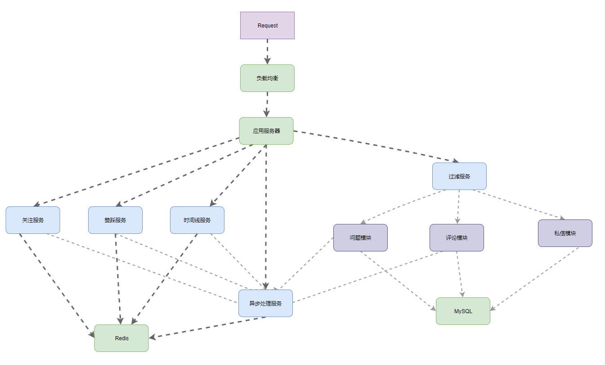
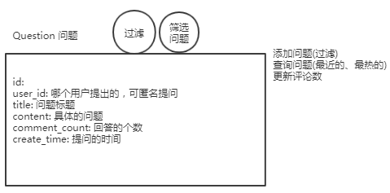
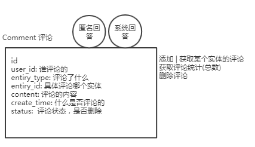
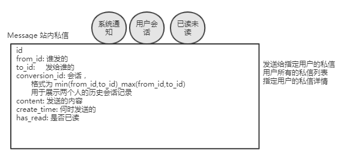
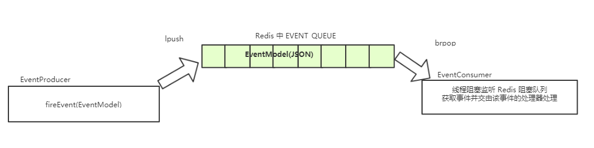
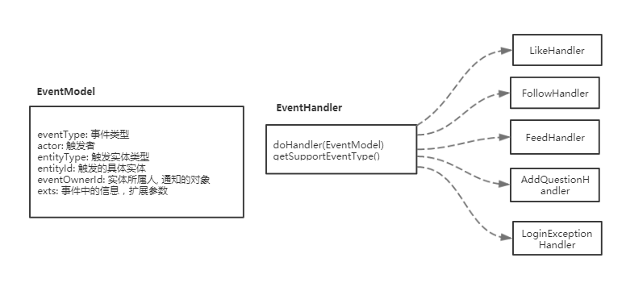

# 功能实现

## DB-问题发布

**&& 实体**




**&& 匿名提问**

支持匿名提问


**&& *问题详情**

（1） 实体

① 问题

② 回答列表

③ 回答的用户

④ 附加信息，是否关注该问题，对于

获取该问题的信息，同时显示当前用户是否关注该问题；

需要拉取出对应的回答，同时对于每个回答，需要回答者的头像和名称，当前用户是否关注该回答者，以及回答的赞同数量；


## DB-评论中心

回复帖子
回复评论
回复题目

覆盖∀实体  ， 二维结构


**&& 实体**

对某个问题的评论，相当于就是该问题的回答；




**&& 匿名回答(评论)**

未登录情况下的回答


**&& 通用评论**


## DB-消息中心

站内信，通过异步通知的方式实现的；




如何进行控制： 

方式一： 轮询方式，过一段时间去 Server 查看是否有新的站内信

方式二： 长连接，WebSocket 连接到 Server 上，一旦有站内信，服务器主动通知，及时性很高，实现麻烦，需要维护连接


**&& 系统通知**

主要借助自定义实现的异步处理服务实现，避免等待，提高系统吞吐量。


**&& 私人通信**


**&& 已读未读**


## *Redis-timeline

**&& Feed 实体**

（1）  实体结构

① data： JSON 对象，同时在序列化时形成类似属性的作用

② dataJson： 仿照获取

```java
class Feed {
    int id;
    int type;
    int userId;
    Date createdDate;
    String data;
    /** 辅助对象, 在设置 data 时进行初始化 */
    JSONObject dataJSON = null;
}
```


（2） 定制参数

② setData(data)：

③ get(key)： 

```java
void setData(String data) {
    this.data = data;
    dataJSON = JSONObject.parseObject(data);
}

String get(String key) {
    return dataJSON == null ? null : dataJSON.getString(key);
}
```


**&& feed 流入库**

只能通过异步队列获取到监听类型的事件，之后进行入库操作。


**&& PUSH**

（1） 结构

Redis 的队列，每个用户一个 timeline 队列，保存的是对应的 Feed 在 DB 中的 ID；


（2） timeline 队列放入时机

在 FeedHandler 中对 Feed 进行入库后，在此之前可以根据是否是大 V 以及粉丝中是否活跃，亲密度是否高而考虑是否选择 PULL 模式。


（3） 取出 Feed 展示

获取当前用户的 timeline 中保存的所有 Feed Id，向数据库中查询并组装出结果返回。


优化点： 对于热点数据，直接放入缓存中，放入缓存的策略可根据业务需要自定义实现


**&& PUSH**

（1） 结构

仅仅是 DB


（2） 获取

① 获取用户所有关注人的 ID

② 向 DB 中查询这些用户所形成的 Feed

③ 通过 maxId 进行增量拉取，count 限制获取 Feed 的数量


**&& 总结**

timeline 体现享元模式的思想


新鲜事 feed 流

获取关注的人，将关注的人的事件推送到关注者的事件线中


通过享元模式实现标准化的


大 V 触发产生新鲜事

粉丝新鲜事列表获取

各种新鲜事自定义熏染

新鲜事排序显示

广告推荐整合


推： 指的是主动的通知粉丝

大 V 对服务器压力大，

特别简单，实时性要求高

压力在写上，存储的多，Redis 中


拉： 用户登录时，获得

不需要存储，主要压力在读取上


推送给活跃用户，亲密度高的，在线的


僵尸号以拉为主


需要展示：
▲新鲜事自定义渲染： 收藏，关注，评论；文本+图片；分享；转发；
新鲜事排序展示
广告推荐整合

关注的人
关注的题目

每个人看到的不同

feed:
运营的人工方式，查找出好的内容进行展示

根据问题的关注数实现推送


**&& 推**

3000W 粉丝推送

事件触发后广播给所有的粉丝

优缺点：
对于粉丝数过多的事件后台压力较大，浪费存储空间。流程清晰，开发难度低，关注新用户需要同步更新feed流


让粉丝的 Feed 流都能够获取处数据：

获取所有的粉丝，  scan cursor 避免卡顿问题；

将当前事件放入到粉丝的时间线队列中；


直接从时间线中获取数据即可；

​	


需要注意点：

推模式，实时性高，当实体发生变化时，需要对应的变化

处理 unfollow 时，在新鲜事队列中删除原来的 follow 事件


 

@Q: 如何实现 推拉的结合？

僵尸用户使用拉取方式；

大号使用拉取的方式；

活跃用户使用推的方式；


**&& 拉**


**&& 推拉**

活跃 / 在线用户推,  有效用户，  亲密度高的
其他用户拉


**&& 增量拉取**

最大新鲜事的 maxId，确定当前看到的位置；


配合分段存储，大幅降低读取的压力；


获取从某处开始后的最新 Feed 流

```java
selectUserFeeds(maxId, userIds count);
```


拉取模式流程： 

通过 FeedHandler 监听器

将监听到的事件存放到 DB 中

党要显示时，从关注的人中从 DB 获取 Feed


**&& 事件处理**

```java
String buildFeedData(EventModel model);
doHandler();     // COMMENT, FOLLOW to feed stream
```


**&& 实体**

类型

```java
class Feed {
    int id;
    int type;                 // collect, like, follow
    int userId;
    Date createdDate;
    String data;               // pad data
}
```


```java
JSONObject dataJSON;
String get(String key) {
    return dataJSON == null ? null : dataJSON.getString(key);
}
```


# 交互

## 注册 | 登录


**&& 实体**

```java
 class LoginTicket {
    int id;
    int userId;
    Date expired;
    int status;
    String ticket;
}
```


ticket ⇒ userId

使用 aop
使用 Spring MVC 的 Interceptor,  链路回调思想

两个拦截器：

- 当前用户是谁
- 权限拦截


session
淘宝、支付宝一个登录，启动登录其他


用户数据安全性：
1.HTTPS注册页
2.公钥加密私钥解密，支付宝h5页面的支付密码加密
3.用户密码salt防止破解（CSDN，网易邮箱未加密密码泄漏）
4.token有效期
5.单一平台的单点登陆，登陆IP异常检验:   两次登录情况
6.用户状态的权限判断：
页面登录
激活
权限

7.添加验证码机制，防止爆破和批量注册

中间代理明文


是否激活


1.用户名合法性

- len： DB 长度字段有限
- 敏感词: 管理员
- 重复
- 特殊字符:  html 的脚本, XSS 攻击

2.密码长度要求：

3.salt加密, 密码强度检测
社工库： 生日...

4.用户邮件/短信激活
批量刷掉，垃圾信息，广告


**&& 登录**

1.token 登记
**1.1 S 端 token 关联 userid**
1.2C 端存储token

2.有效期设置
note: token 可 sessionid, OR cookie 中的key


## 主页

**&& 未登录用户的主页**

获取通用的删选出来的信息


**&& 用户主页**


（1） 


（2） 主页浏览量


## VO

**&& 通用的前台展示 VO**

```java
class ViewObject {
    Map<String, Object> objs = new HashMap<>();
    void set(String key, Object value) {
        objs.put(key, value);
    }
    Object get(String key) {
        return objs.get(key);
    }
}
```


# 松耦合实现

## Redis-赞踩服务

验证码设置过期时间
**list**
适用于 最新列表，关注列表
大小固定，配合 ltrim 命令


**Set**
点赞，点菜
抽奖
已读
共同好友


点赞功能使用集合实现，防止同一个人对其多次点赞

共同好友

随机取值


**zset:**
排行榜功能, 默认从小到大排序
优先队列

zrange
zrevrange   逆向排序

zrangeByScoreWithScores

zrank key
zrevrank key

字典排序：
同一个 score
zlexcount


KV：
验证码
PV（page view)
缓存


牛客中：
PV
点赞
关注    ， 集合
排行版
验证码
缓存
异步队列
叛数队列，   提交代码结果

GEO,  Redis, MongoDB


**&& 实体维护**

添加关注


**&& 查询**


## Redis-关注服务

关注更通用

1．A关注B
2．A是B的粉丝（）
3．B是A的关氵主对象（followee）
特点：
1，多对多服务
2，ID和ID的关联，有序
存储纟勾
redis·zset/list

Service·
1．通用关注接口
之粉丝列表分页
3．关注对象列表分页
Controller：
1，首页问题关注数
2，详页问题关注列表
3．粉关注人列表
4．关注异步事件

## 过滤服务

**&& 敏感词过滤**

Trie 树实现，

可使用类似 KMP 算法思想实现 AC 自动机更进一步优化；


**&& 脚本过滤**


**&& 问题查询提示**

// todo


## *异步处理服务
用于系统通知： 通知点赞、关注、




业务功能： 

系统通知： 监测到对用户问题的评论、用户回答的赞、用户的关注

从而通过系统用户向对应的用户发送这些同志




**&& 事件实体**

（1） 事件模型实体


① 代表 actor 触发了 某个问题的关注

为了实现快速的构造，采用 **构建器模式** 实现

```java
class EventModel {
    EventType type;
    int actorId;
    int entityType;
    int entityId;
    int entityOwnerId;
    Map<String, String> exts = new HashMap<>();
}
```


（） 构建器模式


（3） 事件处理器接口

```java
interface EventHandler {
	void doHandle(EventModel model);
	List<EventType> getSupportEventTypes();
}
```


（4） 具体的处理器

一个处理器可以监听多种类型的实体


**&& 初始化**

（1） 映射事件类型与处理器

通过 Spring 容器来将容器中所有的 EventHandler.class 都获取到，然后进行映射。


**&& 异步化**

（1） 阻塞队列

通过 Redis 的 List 实现的通用的阻塞队列


（2） 构建线程池


**&& 功能实现-触发放入**

在各个模块间，任意通过注入 eventProducer 即可实现异步服务。

主要用于系统通知、邮件发送等耗时操作。


（1） 问题模块-添加问题

先进行入库操作，之后将添加问题事件放到 Redis 阻塞队列，等待对应的处理


（2） 评论模块-添加评论

先进行入库，更新与问题模块的回答数，之后放入队列让监听者进行对应的处理


（3） 赞踩服务-赞了回答

放入点赞事件到队列，更新 Redis 中两个 set 并返回当前点赞总数。


（4） 关注服务-关注OR 取消关注用户、问题

先带事务更新 Redis 中两个 zset，将事件放入到 Redis 队列中。


（） 登录模块-登录事件

判断是否是异常登录，从而进行对应的处理。


**&& 功能实现-处理器**

（1） AddQuestionHandler

监听： EventType.ADD_QUESTION

功能： 更新 Solr 搜索索引


（2） FollowHandler

监听： EventType.FOLLOW

功能： 

① 关注问题

发送系统消息给对应问题的用户


② 关注用户

发送系统消息给对应的用户


（3） LikeHandler

监听： EventType.LIKE

功能：

发送系统消息给对应回答或评论的用户


（4） LoginExceptionHandler

获取事件判断 IP 查看该用户是否登录异常，

登录异常时异步向用户的注册邮箱发送异常登录提醒。


（5）* FeedHandler

监听：  {EventType.COMMENT, EventType.FOLLOW}

功能：

将监听到的 Feed 进行入库，同时根据该事件确定是否需要


流程

系统进行通知


用户 xxx 攒了你的回答


处理的问题： 

如何实现异步？


如何实现指定的 Handler 处理指定的事件？

借助 Spring 容器直接在启动时获得所有的 Handler ，并借助接口方法获取支持处理的类型，实现某个事件类型对应多个处理器。

```java
Map<EventType, List<EventHandler>> config = new HashMap<EventType, List<>>()
```


## 筛选排序

**&& Hacker News**

> Score=（P-1）/（T+2）G


[介绍](https://medium.com/hacking-and-gonzo/how-hacker-news-ranking-algorithm-works-1d9b0cf2c08d)

**&& Reddit**

> 

新闻聚合网站

时间和赞踩的因子  调整底数，调整时间

[[介绍](https://medium.com/hacking-and-gonzo/how-reddit-ranking-algorithms-work-ef111e33d0d9)](https://medium.com/hacking-and-gonzo/how-reddit-ranking-algorithms-work-ef111e33d0d9)

**&& StackOverFlow**

> 

浏览数 回答数 赞踩差 所有回答的赞踩总和

负相关参数： 时间 最新的回答时间


[介绍](http://meta.stackexchange.com/questions/11602/what-formula-should-be-used-to-determine-hot-questions)

**&& IMDB**

[介绍](http://www.imdb.com/help/show_leaf?votestopfaq)

> 加权排名(WR) = (v ÷(v+m)) ×R + (m ÷(v+m)) ×CR


有效投票人数： 防止制作方的刷票

**&& topcoder**

[介绍](https://community.topcoder.com/longcontest/?module=Static&d1=support&d2=ratings)

在线编程比赛

与小白比赛排名 与大牛比赛排名

参加比赛的次数

对赢概率的预设： 参加比赛的规模


稳定高排名的用户

用户：  水军、马甲 老用户、活跃用户

交互越好， 时间越新，


**微博架构演进：**


**人人网：**


《大型网站互联网架构》


**可做的优化：**
整合事件
取消关注，不在获取其流
按天、越等存储
增量拉取


今日头条
人物画像： 机器学习算法、预测
关系链


个人主页上的新鲜事


扩展：
设计排序公式：  热点数据

共同关注


