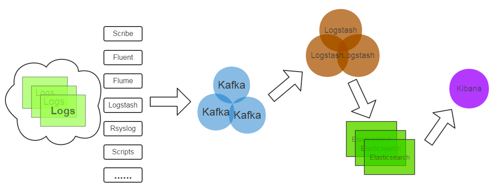

**消息队列的作用**

消息队列中间件是分布式系统中重要的组件，主要解决应用耦合，异步消息，流量削锋等问题。

(1) 异步处理

引入消息队列，将不是必须的业务逻辑，异步处理。

(2) 应用解耦

(3) 流量削锋

一般在秒杀或团抢活动中使用广泛。

(4) 日志处理



日志处理是指将消息队列用在日志处理中，比如Kafka的应用，解决大量日志传输的问题。

(5) 消息通讯

消息队列一般都内置了高效的通信机制，因此也可以用在纯的消息通讯。比如实现点对点消息队 列，或者聊天室等。

消息队列的两种消息模式，点对点或发布订阅模式。


**消息的幂等处理**

由于网络原因，生产者可能会重复发送消息，因此消费者方必须做消息的幂等处理，常用的解决方案有：

1.查询操作：

2.删除操作：

3.唯一索引，防止新增脏数据。比

4.token机制，防止页面重复提交。

5.悲观锁——获取数据的时候加锁获取。

6.乐观锁——乐观锁只是在更新数据那一刻锁表，其他时间不锁表，所以相对于悲观锁，效率更高。

7.分布式锁—

8.select + insert—


# RabbitMQ

介绍 ： 异步的消息队列，是 amqp 协议的一种实现，跨平台的中间件，

RabbitMQ服务器是用`Erlang`语言编写的，而群集和故障转移是构建在开放电信平台框架上的。所有主要的编程语言均有与代理接口通讯的客户端库。

与 JMS 的比较 ：
- 可实现跨平台，线路层协议；

Exchange 概念

处理流程 ：
producer --- exchange --- queue --- consumer


## 四种模式：
『Exchange』 ：用来进行生产到 queue 的映射
『Binding』 ：通过 Exchange 进行对应 queue 绑定的行为

『Receiver』： 
监听到发送的消息，执行对应的 sql 查询

『Sender』  在程序中用于发送信息，convertAnd

RabbitMQ 的四种交换模式
DirectExchange  
FanoutExhcnage  
HeadersExhcnage  
TopicExchange 

@RabbitListener(queues=)

Sender


## 主要特性
   可伸缩性：集群服务
   消息持久化：从内存持久化消息到硬盘，再从硬盘加载到内存

消息队列提供了`异步的`通信协议，每一个贮列中的纪录包含详细说明的数据，包含发生的时间，输入设备的种类，以及特定的输入参数，也就是说：消息的发送者和接收者不需要同时与消息队列交互。消息会保存在队列中，直到接收者取回它


## 优缺点
消息队列本身是异步的，它允许接收者在消息发送很长时间后再取回消息，这和大多数通信协议是不同的。例如WWW中使用的HTTP协议（HTTP2之前）是同步的，因为客户端在发出请求后必须等待服务器回应。然而，很多情况下我们需要异步的通信协议。比如，一个进程通知另一个进程发生了一个事件，但不需要等待回应。但消息队列的异步特点，也造成了一个缺点，就是`接收者必须轮询消息队列`，才能收到最近的消息。

和信号相比，消息队列能够传递更多的信息。与管道相比，消息队列提供了有格式的数据，这可以减少开发人员的工作量。但消息队列仍然有大小限制。

消息队列除了可以当不同线程或进程间的缓冲外，更可以透过消息队列当前消息数量来侦测接收线程或进程性能是否有问题。

# 配置

```properties
spring.rabbitmq.host=103.125.232.152
spring.rabbitmq.port=5672
spring.rabbitmq.username=guest
spring.rabbitmq.password=guest
spring.rabbitmq.virtual-host=/            # 虚拟处的主机

# 消费者的数量
spring.rabbitmq.listener.simple.concurrency=10
spring.rabbitmq.listener.simple.max-concurrency=10

# 消费者每次从队列中获取的消息数量，多去几个加快，
spring.rabbitmq.listener.simple.prefetch=1

# 消费者自动启动
spring.rabbitmq.listener.simple.auto-startup=true

#消费失败，自动重新入队
spring.rabbitmq.listener.simple.default-requeue-rejected=true

# 启动发送重试
spring.rabbitmq.template.retry.enabled=true 
spring.rabbitmq.template.retry.initial-interval=1000 
spring.rabbitmq.template.retry.max-attempts=3
spring.rabbitmq.template.retry.max-interval=10000
spring.rabbitmq.template.retry.multiplier=1.0
```


# Kafka

> Kafka 是⼀个分布式流式处理平台。
>
> LinkedIn 最早开发 Kafka ⽤于处理海量的⽇志。

流平台具有三个关键功能：

1. **消息队列**：发布和订阅消息流，这个功能类似于消息队列，这也是 Kafka 也被归类为消息队列 的原因。

2. **容错的持久⽅式存储记录消息流**： Kafka 会把消息持久化到磁盘，有效避免了消息丢失的⻛险 ·。

3. **流式处理平台**： 在消息发布的时候进⾏处理，Kafka 提供了⼀个完整的流式处理类库。


Kafka 主要有两⼤应⽤场景：

1. **消息队列** ：建⽴实时流数据管道，以可靠地在系统或应⽤程序之间获取数据。
2. **数据处理**： 构建实时的流数据处理程序来转换或处理数据流。


### 架构


- Topic 用来对消息进行分类，每个进入到Kafka的信息都会被放到一个Topic下
- Broker 用来实现数据存储的主机服务器
- Partition 每个Topic中的消息会被分为若干个Partition，以提高消息的处理效率
- Producer 消息的生产者
- Consumer 消息的消费者
- Consumer Group 消息的消费群组


### 对比

Kafka 相⽐其他消息队列主要的优势如下：

1. 极致的性能 ：基于 Scala 和 Java 语⾔开发，设计中⼤量使⽤了批量处理和异步的思想，最⾼ 可以每秒处理千万级别的消息。
2. ⽣态系统兼容性⽆可匹敌 ：Kafka 与周边⽣态系统的兼容性是最好的没有之⼀，尤其在⼤数据和流计算领域。


