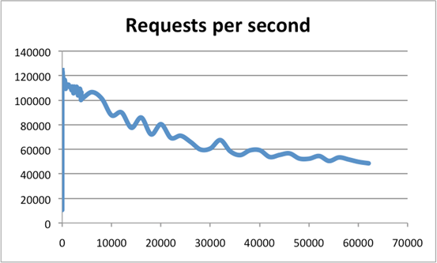
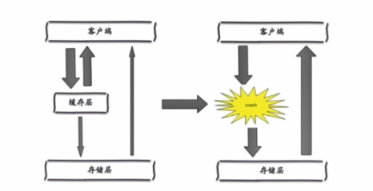
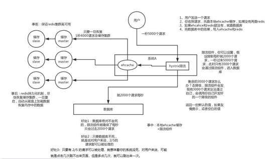

# 缓存

> 缓存原指CPU上的一种高速存储器，它先于内存与CPU交换数据，速度很快 现在泛指存储在计算机上的原始数据的复制集，便于快速访问。

**二八定律**：

百分之八十的请求都是访问百分之二十的数据



横轴是连接数，纵轴是QPS。此时，这张图反映了一个数量级。


**热数据和冷数据**： 经常被访问的数据就可以认为是热数据，反之则为冷数据


**缓存的应用场景：**

1、DB 缓存，减轻 DB 压力

2、提高系统响应

在大量瞬间访问时（高并发）MySQL单机会因为频繁IO而造成无法响应。MySQL的InnoDB是有行锁 将数据缓存在Redis中，也就是存在了内存中。

3、Session 分离

多个服务器(Tomcat)可以共享Session信息。

4、分布式锁

多个进程（JVM）在并发时也会产生问题，控制时序性。

5、乐观锁

高性能、高响应（秒杀）采用乐观锁 (CAS)。

Redis可以实现乐观锁 watch + incr。


**缓存的优势：**

提升用户体验

减轻服务器压力

提升系统性能


**缓存的代价：**

(1) 额外的硬件支出

(2) 高并发下缓存失效

(3) 缓存与数据库同步的一致性问题

(4) 缓存的并发竞争


## 缓存粒度

浏览器缓存

Nginx 缓存

分布式缓存

本地缓存

页面缓存

URL 级别缓存

对象缓存


## 缓存设计

### 缓存预热

缓存预热这个应该是一个比较常见的概念，相信很多小伙伴都应该可以很容易的理解，缓存预热就是系统上线后，将相关的缓存数据直接加载到缓存系统。这样就可以避免在用户请求的时候，先查询数据库，然后再将数据缓存的问题！用户直接查询事先被预热的缓存数据！

**解决思路：**

1、直接写个缓存刷新页面，上线时手工操作下；

2、数据量不大，可以在项目启动的时候自动进行加载；

3、定时刷新缓存；


### 缓存更新

除了缓存服务器自带的缓存失效策略之外（Redis默认的有6中策略可供选择），我们还可以根据具体的业务需求进行自定义的缓存淘汰，常见的策略有两种：

（1）定时去清理过期的缓存；

（2）当有用户请求过来时，再判断这个请求所用到的缓存是否过期，过期的话就去底层系统得到新数据并更新缓存。

两者各有优劣，第一种的缺点是维护大量缓存的key是比较麻烦的，第二种的缺点就是每次用户请求过来都要判断缓存失效，逻辑相对比较复杂！具体用哪种方案，大家可以根据自己的应用场景来权衡。


### 缓存降级

当访问量剧增、服务出现问题（如响应时间慢或不响应）或非核心服务影响到核心流程的性能时，仍然需要保证服务还是可用的，即使是有损服务。系统可以根据一些关键数据进行自动降级，也可以配置开关实现人工降级。

降级的最终目的是保证核心服务可用，即使是有损的。而且有些服务是无法降级的（如加入购物车、结算）。

在进行降级之前要对系统进行梳理，看看系统是不是可以丢卒保帅；从而梳理出哪些必须誓死保护，哪些可降级；比如可以参考日志级别设置预案：

（1）一般：比如有些服务偶尔因为网络抖动或者服务正在上线而超时，可以自动降级；

（2）警告：有些服务在一段时间内成功率有波动（如在95~100%之间），可以自动降级或人工降级，并发送告警；

（3）错误：比如可用率低于90%，或者数据库连接池被打爆了，或者访问量突然猛增到系统能承受的最大阀值，此时可以根据情况自动降级或者人工降级；

（4）严重错误：比如因为特殊原因数据错误了，此时需要紧急人工降级。


### *缓存更新策略

> 如何保证缓存与数据库双写时的数据⼀致性。

缓存的问题，预加载，项目启动时便将对应商品和其用于秒杀的库存缓存到 Redis 中


### 热点key重建优化

问题描述： 热点 key + 较长的重建时间 ；
微博大 V 发布，重建的延时时间 ；

1，三个目标 
减少重缓存的次数 
数据尽可能一致 
减少潜在危险 

2，两个解决 
互斥锁(mutexkey) 
永远不过期


（1） 方案一： 互斥锁

锁住第一个重建缓存的命令，使得之后获取 Cache 的全部阻塞注，知道第一个重建缓存执行完毕；

```java
public String get(String key) {
    String value = redis.get(key);
    if (value == null) {
        String mutexKey = "mutex:key:" + key;
        if (redis.set(mutexKey, "1", "ex180", "nx")) {
            value = db.get(key);
            redis.set(key, value);
            redis.delete(mutexKey);
        } else {
            // 其他线程休息50毫秒后重试
            SleepUtil.millisecond(50);
            get(key);                // next try may cache already have value
        }
    }
    return value;
}
```


（） 方案二： 永不过期

需要设置一个逻辑过期时间；
无法保证数据一致性 ；
杜绝热点key 重建问题；

```java
String get2(final String key) {
    ValWithLogic v = redis.get(key, ValWithLogic.class);
    String value = v.getValue();
    long logicTimeout = v.getLogicTimeout();
    if (logicTimeout >= System.currentTimeMillis()) {
        String mutexKey = "mutex:key:" + key;
        if (redis.set(mutexKey, "1", "nex180", "nx")) {  // only one take, other take old value
            // 异步更新后台异常执行
            threadPool.execute(new Runnable() {
                public void run() {
                    String dbValue = db.get(key);
                    redis.set(key, new ValWithLogic(dbValue, new Date().getTime() + 2222L));
                    redis.delete(mutexKey);
                }
            });
        }
    }
    return value;
}
```


## 缓存问题

### *缓存雪崩

>  当某一时刻发生大规模的缓存失效的情况，如缓存服务宕机了，会有大量的请求进来直接打到DB上面。结果就是DB 撑不住, 宕机。


调用其他 API, 级联导致问题


高可用： 节点宕机， 
1．保证缓存高可用性． 
·个别节点、个别机器、甚至是机房。 
·例如RedisCluster、RedisSentinelsVIPO 
2，依赖隔离组件为后端限流。 limit, 限流算法 
3，提前演练：例如压力测试


（1） 方案一： 缓存层高可用

事前： <font color="green"> **使用集群缓存，保证缓存服务的高可用**</font>

在发生雪崩前对缓存集群实现高可用，如果是使用 Redis，可以使用主从+哨兵 ，Redis
Cluster 来避免 Redis 全盘崩溃的情况。

事中：  <font color="green">**Ehcache本地缓存 + Hystrix限流&降级,避免MySQL宕机**</font>


1)	使用 Ehcache 本地缓存的目的也是考虑在 Redis Cluster 完全不可用的时候，Ehcache本地缓存还能够支撑一阵。用户发送一个请求，系统 A 收到请求后，先查本地 ehcache 缓存，如果没查到再查 Redis。如果  Ehcache和 Redis 都没有，再查数据库，将数据库中的结果，写入 Ehcache和 Redis中。
2)	使用 Hystrix进行限流 & 降级 ，比如一秒来了5000个请求，我们可以设置假设只能有一秒 2000个请求能通过这个组件，那么其他剩余的 3000 请求就会走限流或降级逻辑。
3)	然后去调用我们自己开发的降级组件（降级），比如设置的一些默认值之类的。以此来保护最后的 MySQL 不会被大量的请求给打死。


默认情况下都是取得分布式缓存，在分布式缓存无用的情况下使用本地缓存抗一抗；

之后需进行限流，；

进行服务降级，直接给默认值，防止奔溃；


事后： **开启Redis持久化机制，尽快恢复缓存集群**

一旦重启，就能从磁盘上自动加载数据恢复内存中的数据。




Case: 


Case： 


Case: 主从漂移    VIP： 虚拟 IP 


（2） 客户端降级

Case: 服务降级 
隔离： 解决依赖隔离组件 
线程池/ 信号量隔离组件


HYSTRIX 
Deepnd your app (java/go) 

（3） 预防： 提前演练

JMeter 等进行压力测试


缓存击穿

大量的请求同时查询一个 key 时，此时这个key正好失效了，就会导致大量的请求都打到数据库上面去。所有原本应该访问缓存的请求都去查询数据库了，而对数据库CPU和内存造成巨大压力，严重的会造成数据库宕机。从而形成一系列连锁反应，造成整个系统崩溃。


例如：我们设置缓存时采用了相同的过期时间，在同一时刻出现大面积的缓存过期，（**原有缓存失效，新缓存未到期间**）


考虑用  <u>加锁或者队列的方式</u>  保证来保证不会有大量的线程对数据库一次性进行读写，从而避免失效时大量的并发请求落到底层存储系统上。

简单方案就时  <u>将缓存失效时间分散开</u>  ，比如我们可以在原有的失效时间基础上增加一个随机值，比如1-5 分钟随机，这样每一个缓存的过期时间的重复率就会降低，就很难引发集体失效的事件。

（1）碰到这种情况，一般并发量不是特别多的时候，使用最多的解决方案是**加锁排队**，


加锁排队只是为了减轻数据库的压力，并没有提高系统吞吐量。假设在高并发下，缓存重建期间key是锁着的，这是过来1000个请求999个都在阻塞的。同样会导致用户等待超时，这是个治标不治本的方法！

**注意：**加锁排队的解决方式分布式环境的并发问题，有可能还要解决分布式锁的问题；线程还会被阻塞，用户体验很差！因此，在真正的高并发场景下很少使用！


（2）还有一个解决办法解决方案是：给每一个缓存数据增加相应的缓存标记，记录缓存的是否失效，如果缓存标记失效，则更新数据缓存，实例伪代码如下：


**解释说明：**

1、缓存标记：记录缓存数据是否过期，如果过期会触发通知另外的线程在后台去更新实际key的缓存；

2、缓存数据：它的过期时间比缓存标记的时间延长1倍，例：标记缓存时间30分钟，数据缓存设置为60分钟。 这样，当缓存标记key过期后，实际缓存还能把旧数据返回给调用端，直到另外的线程在后台更新完成后，才会返回新缓存。

关于缓存崩溃的解决方法，这里提出了三种方案：使用锁或队列、设置过期标志更新缓存、为key设置不同的缓存失效时间，还有一各被称为“二级缓存”的解决方法，有兴趣的读者可以自行研究。


### *缓存穿透

> 在高并发下查询 key 不存在的数据，会穿过缓存查询数据库。导致数据库压力过大而宕机。

大量请求不命中 ，且在 DB 也不命中；

storage 中不存在，redis 中不存在 ；

每次都打在 storage 上；


原因： 
URL 规则猜测进行爬取，或暴力爬取 
1，业务代码自身问题 
2，恶意攻击、爬虫等等


如何发现： 
1，业务的相应时间 
2，业务本身问题 
3，相关指标：总调用数、缓存层命中数、存储层命中数

日志系统，监控系统 ⇒ 判断是否发生


**解决方法1： 缓存空对象**

> 对空的情况缓存，缓存的 expire 过期时间 ttl 设置的小一些 或是在该 Key 对应的数据插入后清理缓存，防止不必要的开销； 

问题： 
需要更多的键： 爬虫造成键多， 过期时间来一定防止 ；

cache 和 storage 数据短期不一致；

```java
public String getPassThrough(String key) {
    String cacheValue = cache.get(key);
    if (StringUtils.isBlank(cacheValue)) {
        String storageValue = storage.get(key);
        cache.set(key, storageValue);
        // 如果存储数据为空，需要设置一个过期时间（300秒）
        if (StringUtils.isBlank(storageValue)) {
            cache.expire(key, 60 * 5);
            return storageValue;
        }
    }
    return cacheValue;
}
```


**解决方法2： 布隆过滤器拦截(BloomFilter)**

> 在缓存之前加一层布隆过滤器，查询的时候根据布隆过滤器查询 KEY 是否存在，不存在则直接缓存。


判断电话本是否在里面，黑名单，白名单系统 ；

适用于略微固定的数据，对于频繁更新的

数据集固定或定时更新布隆过滤器


将所有可能存在的数据哈希到一个足够大的bitmap中，一个一定不存在的数据会被这个bitmap拦截掉，从而避免了对底层存储系统的查询压力；

这种方式在大数据场景应用比较多，比如 Hbase 中使用它去判断数据是否在磁盘上。还有在爬虫场景判断URL 是否已经被爬取过。

Case: 推荐系统， 根据昨天推荐今天


（） 方案的选择

针对于一些恶意攻击，攻击带过来的大量key 是不存在的，那么我们采用第一种方案（缓存空值）就会缓存大量不存在key的数据，那这种方案就不合适了，我们完全可以先对使用第二种方案（BloomFilter）进行过滤掉这些key。

针对这种key异常多、请求重复率比较低的数据，我们就没有必要进行缓存，使用第二种方案（BloomFilter）直接过滤掉。

而对于空数据的key有限的，重复率比较高的，我们则可以采用第一种方式（缓存空值）进行缓存。


### 缓存击穿

> 对于一些设置了过期时间的key，如果这些key可能会在某些时间点被超高并发地访问，是一种非常“热 点”的数据。
>
> 和缓存雪崩的区别在于这里针对 某一key缓存，前者则是很多key。

**使用分布式锁控制**

保证不会有大并发操作去操作数 据库。


**缓存淘汰**

不设置超时时间，，volatile-lru。


### *数据不一致

> 造成 Cache 与 DB 数据不一致。

**先更新 DB，后更新 Cache**

（1） 可能存现数据不一致问题

线程 A 进行更新完毕后，将新的值放入到 Cache

线程 B 进行更新完毕后，将新的值放入到 Cache 

技术上，可能因为网络原因，造成两者顺序颠倒，读取到脏数据；

业务上，写多读少，可能被频繁更新，性能下降，可能放入Cache 的需要计算的，性能更加浪费；


此种缓存的读写莫斯在实际使用中很少使用；


**先删除 Cache，后更新 DB**

（1） 出现数据不一致

线程 A 进行更新操作，线程 B 读取操作。

会出现线程 B 发现无缓存而从 DB 中读取脏数据放入到  Cache；


（2） 延时双删策略

可以将在 1 秒内所造成的的缓存脏数据再次删除；

- 1、先更新数据库同时删除缓存项(key)，等读的时候再填充缓存
- 2、2秒后再删除一次缓存项(key)
- 3、设置缓存过期时间 Expired Time 比如 10秒 或1小时
- 4、将缓存删除失败记录到日志中，利用脚本提取失败记录再次删除（缓存失效期过长 7*24）

升级方案 通过数据库的 binlog 来异步淘汰 key，利用工具(canal)将binlog日志采集发送到MQ中，然后通过ACK机制确认处理删除缓存。    ==> 异步操作，时间长...

```java
redis.del(key);
db.updateData(data);
Thread.sleep(1000);
redis.delKey(key);
```

相关问题： MySQL 读写架构分离；  吞吐量下降(异步)；第二次删除失败(Cache 和 DB 不一致)；


**先更新 DB，后删除 Cache**

（1） 数据不一致问题

原因: 线程 A 在缓存失效时读取旧值，线程 B 更新和写入 DB, Cache，线程 A 将旧值放入 Cache。

基于写操作通常比读操作更长，发生的概率小；

相关问题：如何处理上述的情况； 删除缓存失败如何处理(保障重试机制(消息队列)...)；


### 无底洞问题

>  分布式缓存中，更多机器不保证更多的性能

2010年，facebook的 3000 个 Memcache 节点，增加机器反而使得查询速度变慢； 

原因： mget 从多个节点中获取数据，需要等待最慢的节点完成进行返回


问题关键点： 
更多的机器！=更高的性能 
批量接口需求(mget,mset等） 
数据增长与水平扩展需求


优化 IO: 
命令优化： 慢查询 
减少网络通信次数： 压缩命令， mget 
降低接入成本： 客户端常/连接池， NIO...


**&& 四种批量优化的方法**

1，串行mget 
2，串行 IO
3，并行 IO
4，hash-tag 

### 数据并发竞争

> 是多个 redis 的 client 同时 set 同一个key引起的并发问题。

**方案一： 分布式锁 + 时间戳**

通过分布式锁将操作串行化，通过时间戳来控制顺序性


**方案二： 消息队列**

通过消息中间件进行处理,把并行读写进行串行化，把Redis的set操作放在队列中使其串行化,必须的一个一个执行。


### 热点 Key

> 有大量的请求(几十万)访问某个Redis某个key时，流量集中达到网络上限，从而导致这个redis的 服务器宕机。
>
> 造成缓存击穿，接下来对这个key的访问将直接访问数据库造成数据库崩溃。
>
> 访问数 据库回填Redis再访问Redis，继续崩溃。

发现热点 Key:

- 预估热key，比如秒杀的商品、火爆的新闻等
- 在客户端进行统计，实现简单

- 如果是Proxy，比如Codis，可以在Proxy端收集

- 基于大数据领域的流式计算技术来进行实时数据访问次数的统计，比如 Storm、Spark Streaming、Flink，这些技术都是可以的。发现热点数据后可以写到zookeeper中
- 利用Redis自带的命令，monitor、hotkeys。但是执行缓慢


1、变分布式缓存为本地缓存 发现热key后，把缓存数据取出后，直接加载到本地缓存中。可以采用Ehcache、Guava Cache都可 以，这样系统在访问热key数据时就可以直接访问自己的缓存了。（数据不要求时时一致）

2、在每个Redis主节点上备份热key数据，这样在读取时可以采用随机读取的方式，将访问压力负载到 每个Redis上。

人为的随机 Key。

3、利用对热点数据访问的限流熔断保护措施

每个系统实例每秒最多请求缓存集群读操作不超过 400 次，一超过就可以熔断掉，不让请求缓存集群， 直接返回一个空白信息，然后用户稍后会自行再次重新刷新页面之类的。（首页不行，系统友好性差）

通过系统层自己直接加限流熔断保护措施，可以很好的保护后面的缓存集群。


### 大 Key

> 存储的值大，每次获取耗时长。

常见场景

- 热门话题下的讨论
-  大V的粉丝列表 
- 序列化后的图片 
- 没有及时处理的垃圾数据


**发现大 Key**

- redis-cli --bigkeys 查找
- 获取生产Redis的rdb文件，通过rdbtools分析rdb生成csv文件，再导入MySQL或其他数据库中进行 分析统计，根据size_in_bytes统计bigkey


大 Key 的处理

(1) 1、string类型的big key，尽量不要存入Redis中，可以使用文档型数据库MongoDB或缓存到CDN上。

如果必须用Redis存储，最好单独存储，不要和其他的key一起存储。采用一主一从或多从。

(2) 单个简单的key存储的value很大，可以尝试将对象分拆成几个key-value， 使用mget获取值，这样分拆的意义在于分拆单次操作的压力，将操作压力平摊到多次操作中，降低对redis的IO影响。

(3) hash， set，zset，list 中存储过多的元素，可以将这些元素分拆。（常见）

(4) 删除大key时不要使用del,因为del是阻塞命令，删除时会影响性能。

(5) 使用 lazy delete (unlink命令)

异步操作


