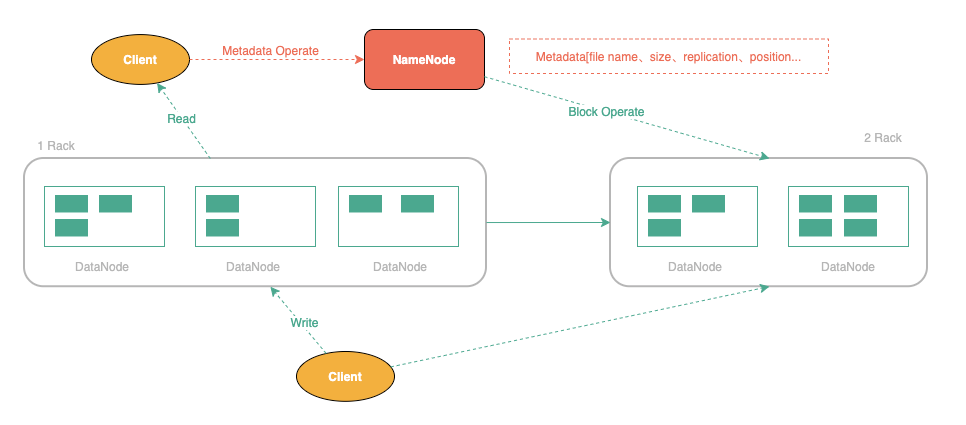
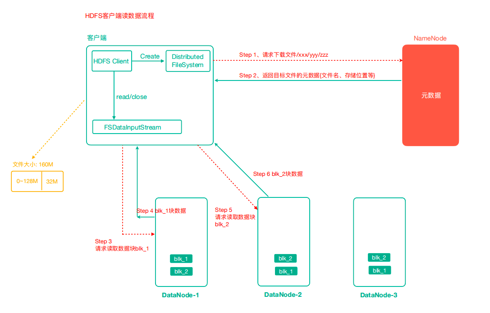
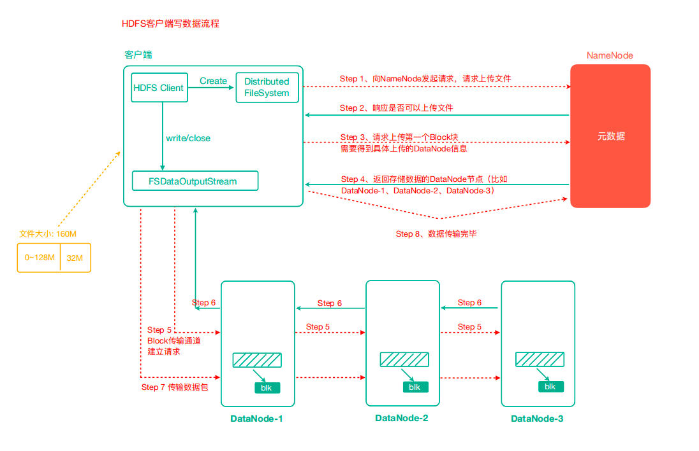
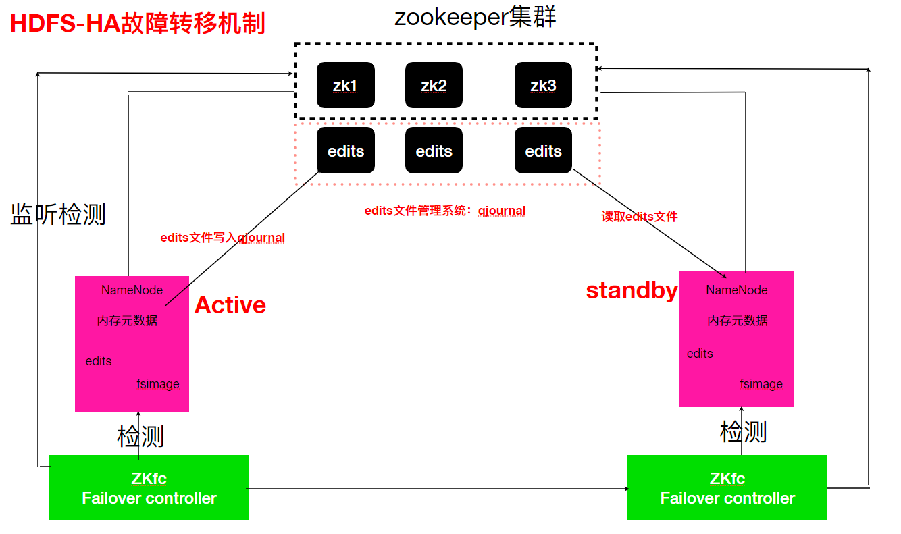
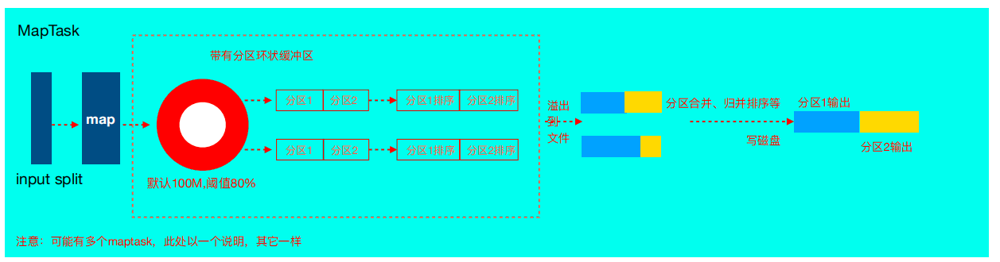
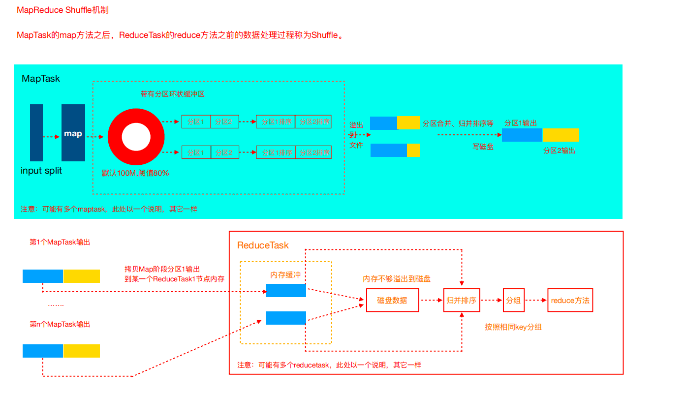
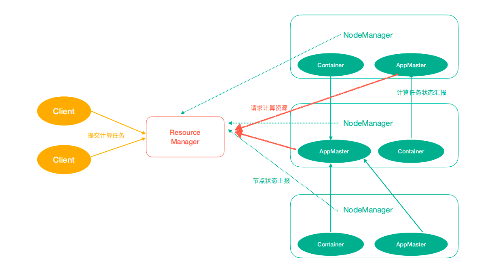
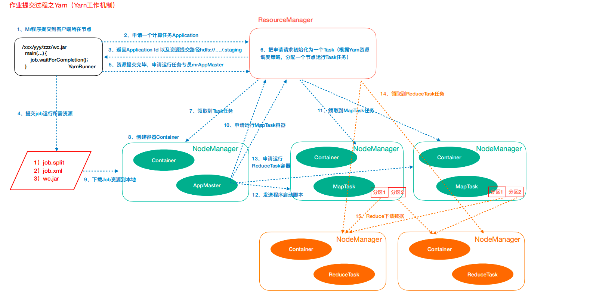
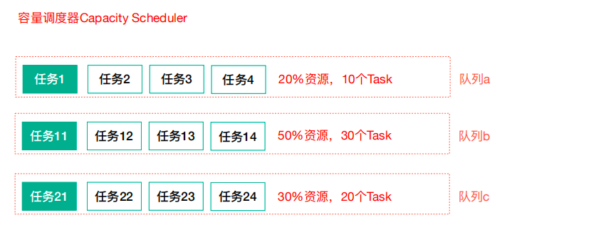

[parent](README.md)  

[TOC]  

[配置与启动](../../bigdata/conf/hadoop)  
[HDFS Shell 操作](../../bigdata/shell/hadoop)


# HDFS

## 存储扩展
put： 1file => 1..n block  到不同的节点不同的块上 
get:    去  NN 上查找 file 对应元数据信息  

通过统一的命名空间目录树来定位文件；



HDFS集群往往是一个NameNode（HA架构会有两个NameNode,联邦机制）+ 多个DataNode组 成；

特点：

- M/S 架构
- Block 存储
- NameSpace
- NameNode Metadata 管理
- DataNode 存储
- Replication 存储
- 一次写入，多次读出:  支持追加写、不支持随机写


组件： 

- NN：维护 HDFS NameSpace、Replication 策略、记录 Block 映射信息、处理 Client R/W 请求
- 2NN:  
- DN: 执行 NN 命令，Slave Node，保存实际的 Block、数据的 R/W
- Client: 


### HDFS API  
Shell 命令执行  

```shell
hdfs dfs -ls /
hdfs dfs -copyFromLocal t1.dat /test
```


Java Api 执行


**权限管理**

防止好人做错事，不能阻止坏人做坏事。
- 指定用户信息
- 关闭集群校验
- 放弃权限校验， Prod 借助 kerberos、sentry 安全框架管理大数据集群安全


## *读写流程

**读取流程**  


1. 客户端通过 Distributed FileSystem 向 NN 请求下载文件，NN 通过查询元数据， 返回文件块所在的 DN 地址。
2. 挑选一台 DN（就近原则，然后随机）服务器，请求读取数据。
3. DN 开始传输数据给客户端（从磁盘里面读取数据输入流，以 Packet 为单位来做校验）。
4. 客户端以 Packet 为单位接收，先在本地缓存，然后写入目标文件。


**写入流程**  


1. 客户端通过 Distributed FileSystem 模块向 NN 请求上传文件，NN 检查目标文件是否已存在，父目录是否存在。
2. NameNode返回是否可以上传。
3. 客户端请求第一个 Block 上传到哪几个 DataNode 服务器上。
4. NameNode返回3个DataNode节点，分别为dn1、dn2、dn3。
5. 客户端通过 FSDataOutputStream 模块请求 dn1 上传数据，dn1 收到请求会继续调用 dn2，然后 dn2 调用 dn3，将这个通信管道建立完成。
6. dn1、dn2、dn3逐级应答客户端。
7. 客户端开始往 dn1 上传第一个Block（先从磁盘读取数据放到一个本地内存缓存），以Packet为单 位，dn1收到一个 Packet 就会传给 dn2，dn2 传给 dn3；dn1 每传一个 packet 会放入一个确认队列 等待确认。
8. 当一个 Block 传输完成之后，客户端再次请求 NN 上传第二个 Block 的服务器。（重复执行 3-7步）。


## NameNode

### 元数据管理

$hadoop_tmp_dir/dfs/name/current

文件的作用

- Fsimage: 检查点，所有目录和文件信息

- Edits: 记录更细操作

- Seen_txid:

- VERSION:


Q: 磁盘和内存的元数据划分？

数据一样： client 进行 Data 的更新，保证一致性，FsImage 文件效率不高

合并成一份完整的数据： NN 引入 edits 文件，只能追加写入，记录 client 的更新操作，不再选择 NN 将数据 dump 出 FsImage


### NN 保存的内容

```shell
-rw-r--r--. 1 root root      42 9月  13 06:26 edits_0000000000000002433-0000000000000002434
-rw-r--r--. 1 root root 1048576 9月  13 06:26 edits_inprogress_0000000000000002435
-rw-r--r--. 1 root root     323 9月  12 09:35 fsimage_0000000000000000000
-rw-r--r--. 1 root root      62 9月  12 09:35 fsimage_0000000000000000000.md5
-rw-r--r--. 1 root root       5 9月  13 06:26 seen_txid     当前 NN 中 edits 中最大的编号
-rw-r--r--. 1 root root     217 9月  12 09:35 VERSION
```

VERSION 文件内容

```shell
#Sat Sep 12 09:35:47 EDT 2020
namespaceID=533115801
clusterID=CID-4c7bc40c-c634-4524-9282-cca5a179fa76      集群的唯一标示
cTime=1599917747718
storageType=NAME_NODE
blockpoolID=BP-1205731227-172.17.10.110-1599917747718   块池 id
layoutVersion=-63
```


### 安全模式

让 DN 回所持有的 Block 信息, DN 每隔一段时间汇报自己持有的 Block 信息

Fsimage_000xxx: xxx 确定哪些没有被合并


### *故障处理

故障处理方式

1、 将 2NN 的元数据拷贝到 NN 的节点下

此种方式会存在元数据的丢失，丢失的为 edit_inprocess 中的内容。

2、搭建 HDFS 的 HA 集群，解决 NN 的单点故障问题（借助Zookeeper实现HA，一个

 Active的NameNode,一个是Standby的NameNode）


出现问题场景：

NN 宕机，集群无法使用；

NN 机器进行升级，如软件、硬件升级，此时集群无法使用；


**ZK 实现 HA 故障转移过程**



1、NN(NN1) 假死

2、ZKFailoverController（ZKFC1) 检测到假死

3、ZKFailoverController1 通知另一台 NameNode 的 ZKFailoverController(ZKFC2)

4、ZKFC2 强行 kill NN1 防止脑裂(`ssh kill -9 <pid-nn1>`)(必须保证两个NameNode之间能够ssh⽆密码登录)

==> ZKFC2 在 ssh 执行失败调用用自定义脚本程序(/home/xxx/kill/poweroff.sh)

6、ZKFC2 获取命令执行结果

7、ZKFC2 激活 NN2, 切换状态为 Active


Journal:

共享的 Edits 进行共享存储中管理


ZKFailoverController： 是ZooKeeper的客户端，也监视和管理NameNode的状态。

- 健康检测；

- 会话管理： 保持一个特殊的 znode 锁，会话终止，锁节点自动删除；

- 基于 ZK 进行选择： 本地 NN 健康，尝试持有 znode 锁，成功则运行故障转移进城使得本地 NN 为 Active。

  


Q: 宕机的 NN 恢复时?

  宕机的 NN 重新启动时，再次注册 ZK，发现有 znode 锁，自动变为 Standby 状态；

Q: Master 如何选举?

  ZK 中维护一个短暂类别的 znode，实现抢占锁机制，判断哪个 NN 为 Active 状态；


## 2NN

> 辅助 NameNode，分担其工作量
>
> 定期合并 Fsimage 和 Edits，并推送给 NameNode
>
> 在紧急情况下，可辅助恢复 NameNode 的元数据

***工作机制**

通过 2NN 辅助 NN 管理元数据


不接受 Client 的请求

生成 dump 的 FsImage


Edis_001:

Edit_inprogress_002: 

第一阶段：NameNode启动

第一次启动NameNode格式化后，创建Fsimage和Edits文件。如果不是第一次启动，直接加载编辑日志和镜像文件到内存。

- 客户端对元数据进行增删改的请求。

- NameNode记录操作日志，更新滚动日志。

- NameNode在内存中对数据进行增删改。

第二阶段：Secondary NameNode工作

- Secondary NameNode询问NameNode是否需要CheckPoint。直接带回NameNode是否执行检查点操作结果。

- Secondary NameNode请求执行CheckPoint。

- NameNode滚动正在写的Edits日志。

- 将滚动前的编辑日志和镜像文件拷贝到Secondary NameNode。 Secondary NameNode加载编辑日志和镜像文件到内存，并合并。 生成新的镜像文件fsimage.chkpoint。

- 拷贝fsimage.chkpoint到NameNode。

- NameNode将fsimage.chkpoint重新命名成fsimage。


NameNode 与 SecondaryNameNode 的区别与联系？

区别： 

NameNode 管理整个文件系统的元数据，以及每个路径（文件）锁对应数据库的信息；

2NN 主要<font color="green">定期合并命名空间镜像和命名空间镜像的编辑日志</font><font color="green">测试</font>。；


联系：

2NN 保存一份 NN 一致的镜像文件（faimage)和 编辑日志(edits)。

无 NN 的 HA 时，可从 2NN 恢复数据（丢失一些）


### 其他操作

**限额**

限制指定目录下存放的文件个数、文件大小


**安全模式**

初始化的时候， 30s 安全期，不能执行修改操作，数据量大时耗时更长。


**文件归档**

处理小文件占用 NN 的内存；

将多个小文件归档成一个文件；


Q: NN 如何管理存储 Metadata?

Mem + Dist，NameNode 内存 + FsImage 的磁盘文件


# MapReduce
>  基于 Google 论文2004年12月

Map、Shuffle、Reduce    

分布式计算框架   

IO 流读取文本数据已经被 MR 框架封装好，无需用户关心；

Yarn 通过一个 ApplicationMaster 进行 Job 的调度；


### 序列化与反序列化

Java 的序列化会附带很多额外的信息（各种校验信息，header，继承体系等），不便于在网络中高效传输。


Hadoop 的序列化：

- 必须有空参构造函数;

- 实现 Writable 接口;

- 将自定义的 Bean 放在 Key 中传输，需要实现 Comparable 接口，<font color="green">MR 的 shuffle 默认进行 key 排序</font>;

- 序列化与反序列化对应属性定义顺序需要一致;

- 需要将结果显示在文件中，需要重写 `toString`，用指定分隔符分开，方便续用;


### 切片

MR 的切片为逻辑切片，HDFS 的 Block 为物理切片;

大数据分布式计算框架中，<font color="green">移动计算也不要移动数据</font>，移动数据的成本很高;

分片决定 map 的并行度;


分片逻辑

```
org.apache.hadoop.mapreduce.lib.input.FileInputFormat#getSplits
org.apache.hadoop.mapreduce.lib.input.FileInputFormat#computeSplitSize
```

129M 在 MR 中当成一个 Split


### 推测执行

发现拖后腿任务，再启动拖后腿任务，谁先执行完就结束...


### 配置参数

| 参数                  | 含义                    |
| --------------------- | ----------------------- |
| mapreduce.job.reduces | 每个 job 的 reduce 个数 |


## MapTask

### MapTask 的并行度

> 由客户端提交job时的切片个数决定, MapTask的并行度决定Map阶段的任务处理并发度。

Key 相同去往同个分区

```
org.apache.hadoop.mapreduce.task.JobContextImpl#getPartitionerClass
```


NumReduceTasks: 决定分区的结果，最好与 xx 数量一致;

默认情况下，一个 ReduceTask 对应一个输出文件;

split 大小默认是 blocksize，块的数量约等于分片的数量，1.1 比例;


### *工作机制



Read 阶段：

Map 阶段：

Collect 阶段：

Spill 阶段：

Combine 阶段：


## ReduceTask

### ReduceTask 并行度

ReduceTask 的并行度数量可以手动设置;

ReduceTask=0，无 Reduce 阶段，文件数和 MapTask 数量一致;

默认值为1，即输出文件为1个;

数据分布不均匀，会出现**数据倾斜**;

一个ReduceTask对应一个输出文件


### *工作机制

Copy 阶段：

Merge 阶段：

Sort 阶段：

Reduce 阶段：


## *Shuffle 机制

map阶段处理的数据 ==>. reduce 阶段

按照相同 key 分组，分区规则 `hashcode % numreducetasks`

MR程序默认使用的 HashPartitioner，保证了相同的key去往同个分区

环形缓冲区默认为 100M，阈值为 80%

溢写文件合并，保留分区，同时进行归并排序

Copy: 根据分区编号拉取所有 Map 数据的同个分区的数据


merge: 

sort:

分区


### *工作流程



分区、排序、溢写，copy 到对应 reduce 机器上，增加 combiner，压缩溢血文件。


### 分区器

**默认的分区器**

`org.apache.hadoop.mapred.lib.HashPartitioner` 

```java
public int getPartition(K key, V value,
                        int numReduceTasks) {
  return (key.hashCode() & Integer.MAX_VALUE) % numReduceTasks;
}
```


**自定义分区器**

最好保证分区数量与 reduceTask 数量保持一致

- 如果分区数量不止1个，但是reduceTask数量1个，此时只会输出一个文件

- 如果reduceTask数量大于分区数量，输出reduceTask 数量哥文件，但是输出多个空文件

- 如果reduceTask数量小于分区数量，有可能会报错


### Combiner

预聚合

父类为 Reducer

直接使用Reducer作为Combiner组件来使用是可以的


对每个 MapTask 的输出进行局部汇总，减少网络开销


使用前提：

不能影响最终结果，输出 KV 与 Reducer 的 KV 对应


Combiner 与 Reducer 的区别：

运行位置不同，Combiner 时在每个 MapTask 所在的节点运行，Reducer 时接受全局所有 Mapper 的输出结果。


## 排序

shuffle阶段的排序是默认行为，不管是否需要;

默认排序是按照字典顺序排序，且实现该排序的方法是 快速排序

排序：重写 compareTo()方法，序列以及反序列化方法

对于全局排序需要保证只有一个reduceTask


**排序的分类**

（1）部分排序

默认的，根据输入记录的键对数据集排序，保证输出的每个文件内部排序。

（2）全排序

最终结果只有一个文件，只设置一个 ReduceTask 可实现；

对与大型文件效率低

替代方案： 创建多个排序好的文件，串联起来，使用一个分区描述输出的全局排序，如 a-g 分区、h-n分区、o-z 分区。

（3）辅助排序(GroupingComparator)：

让指定字段相同的 key 进入到同一个 Reduce

reduce 端的一个功能，决定哪些数据作为一组

（4）二次排序：

自定义排序中， compareTo 作为判断条件为两个的情况


排序发生的阶段：

Map 阶段发生在 spill 后 partition 前

Reduce 阶段发生在 copy 后 reduce 前


### GroupingComparator

>  可以自定义实现不同的 key 作为一组

案例： 求出每隔订单中成交金额最大的交易

可以用于实现 TopN

自定义 GroupingComparator，结果进行最大值排序，在 reduce 输出时，控制只输出前 n 个数


## 读取和输出

**自定义 InputFormat**

TextIntputFormat: 默认的读取实现类

KeyValueInputFormat: 指定分割符

NLineInputFormat: 按照行划分分片

CombineTextInputFormat:  合并小文件，避免启动过多的 MapTask 任务

自定义 InputFormat


### CombineInputFormat

CombineInputFormat <font color="green">将多个小文件从**逻辑上划分成一个切片**</font>


虚拟存储过程：

与最大的比较，

`<1M`:单独的

`1M<x<2M`: 切分成两块

`>= 2M`: 按照最大值切分一块，剩余的超过最大值，小于2倍的最大值，将文件分成2个虚拟存储块

2 => 2

7 => 3.5, 3.5

0.3 => 0.3

8.2 => 4, 4.2 => 4, 2.1, 2.1


切片过程

`>=1M`: 单独一个切片

`<1M`: 与下一个虚拟存储文件合并

存储切片的最大值设置根据实际情况划分


### InputFormat

自定义 InputFormat

SequenceFile, 存储二进制形势的 key-value 对的文件格式，文件路径 + 名称为 Key，文件内容为 value

TextIntputFormat 父类为 FileIntputFormat


**FileInputFormat 切片机制**

```java
  waitForCompletion()
  submit();
  // 1、建立连接
    connect();
      // 1）创建提交job的代理
      new Cluster(getConfiguration());
        // （1）判断是本地yarn还是远程
        initialize(jobTrackAddr, conf);
  // 2、提交job
  submitter.submitJobInternal(Job.this, cluster)
    // 1）创建给集群提交数据的Stag路径
    Path jobStagingArea = JobSubmissionFiles.getStagingDir(cluster, conf);
    // 2）获取jobid ，并创建job路径
    JobID jobId = submitClient.getNewJobID();
    // 3）拷贝jar包到集群
    copyAndConfigureFiles(job, submitJobDir);
    rUploader.uploadFiles(job, jobSubmitDir);
    // 4）计算切片，生成切片规划文件
    writeSplits(job, submitJobDir);
    maps = writeNewSplits(job, jobSubmitDir);
    input.getSplits(job);
    // 5）向Stag路径写xml配置文件
    writeConf(conf, submitJobFile);
    conf.writeXml(out);
    // 6）提交job,返回提交状态
    status = submitClient.submitJob(jobId, submitJobDir.toString(), job.getCredentials());
```


### OutputFormat

TextOutputFormat

SequenceFileOutputFormat

将数据结果输出两类结果到不同的目录


## 压缩

节约磁盘空间，加快网络传输

是否可切分

| 压缩格式 | hadoop自带   | 算法    | 文件扩 展名 | 是否可切分 | 换成压缩格式后，原来的程序是否需要修改 | 其他                       |
| -------- | ------------ | ------- | ----------- | ---------- | -------------------------------------- | -------------------------- |
| DEFLATE  | 是，直接使用 | DEFLATE | .deflate    | 否         | 和文本处理一样，不需要修改             |                            |
| Gzip     | 是，直接使用 | DEFLATE | .gz         | 否         | 和文本处理一样，不需要修改             |                            |
| bzip2    | 是，直接使用 | bzip2   | .bz2        | 是         | 和文本处理一样，不需要修改             |                            |
| LZO      | 否，需要安装 | LZO     | .lzo        | 是         | 需要建索引，还需要指定输入 格式        |                            |
| Snappy   | 否，需要安装 | Snappy  | .snappy     | 否         | 和文本处理一样，不需要修改             | 需要 OS 安装 Native 库支持 |

| 压缩算法 | 原始文件大小 | 压缩后的文件大小 | 压缩速度 | 解压缩速度 |
| -------- | ------------ | ---------------- | -------- | ---------- |
| gzip     | 8.3GB        | 1.8GB            | 17.5MB/s | 58MB/s     |
| bzip2    | 8.3GB        | 1.1GB            | 2.4MB/s  | 9.5MB/s    |
| LZO-bset | 8.3GB        | 2GB              | 4MB/s    | 60.6MB/s   |
| LZO      | 8.3GB        | 2.9GB            | 49.3MB/S | 74.6MB/s   |


可供压缩的位置

- Map 输入压缩： 自动进行解码

- Map 输出压缩：

- Reduce 输出压缩： 

默认不适用压缩


# Yarn  



架构    

已经封装到底层中


解决运行的用户程序与yarn框架完全解耦。

可以运行各种类型的分布式运算程序，如 mapreduce、storm 程序，spark 程序……


### 整体架构

AppMaster:  为 Job 申请资源，Map 后 Reducer，失败后向 ResourceManager 申请资源

Container: 虚拟出来的节点，封装资源、运行时相关信息

ResourceManager: 处理 Client 请求，启动监控 AppMaster，监控 NodeManager

NodeManager: 处理 ResouceManager、AppMaster 的命令


### 执行过程



1、作业提交


2、作业初始化


3、任务分配


4、任务运行


5、进度和状态更新

6、作业完成


## 资源调度策略
// TODO  

**调度器种类**

（1）FIFO

（2）Capacity Scheduler

容量调度器

默认使用

支持多队列共享集群资源

<font color="green">允许多个组织共享整个集群</font>

通过为每个组织分配专门的队列，然后再为每个队列分配一定的集 群资源，这样整个集群就可以通过设置多个队列的方式给多个组织提供服务了。



（3）Fair Scheduler

CDH 版本默认调度器

抢占式的分配。

设计目标是为所有的应用分配公平的资源


## 多租户资源隔离

队列间可相互资源共享

控制队列的所占比例


A队列设置占用资源70%主要用来运行常规的定时任务，

B队列设置占用资源30%主要运行临时任务，

两个队列间可相互资源共享，假如A队列资源占满，B队列资源比较充裕，A队列可以使用B队列的 资源，使总体做到资源利用最大化.


# 总结

Hadoop 集群中需要启动哪些进程，作用分别是什么？

| 进程                        | 作用                                              |
| --------------------------- | ------------------------------------------------- |
| NameNode                    | 管理 HDFS 的元数据                                |
| SecondaryNameNode           | NameNode 的冗余守护进程，提供周期检查点和清理任务 |
| DataNode                    | 存储数据                                          |
| ResourceManager(JobTracker) |                                                   |
| NodeManager(TaskTracker)    |                                                   |
| DFSZKFailoverController     |                                                   |
| JournalNode                 | 高可用情况下存放 NameNode 的 editlog 文件         |


