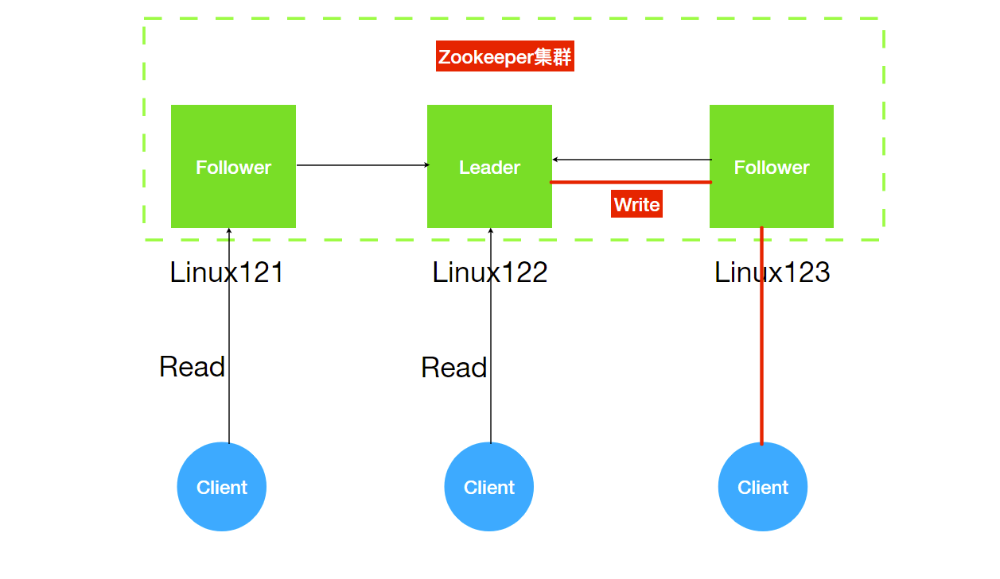
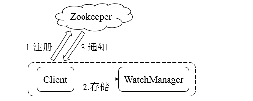
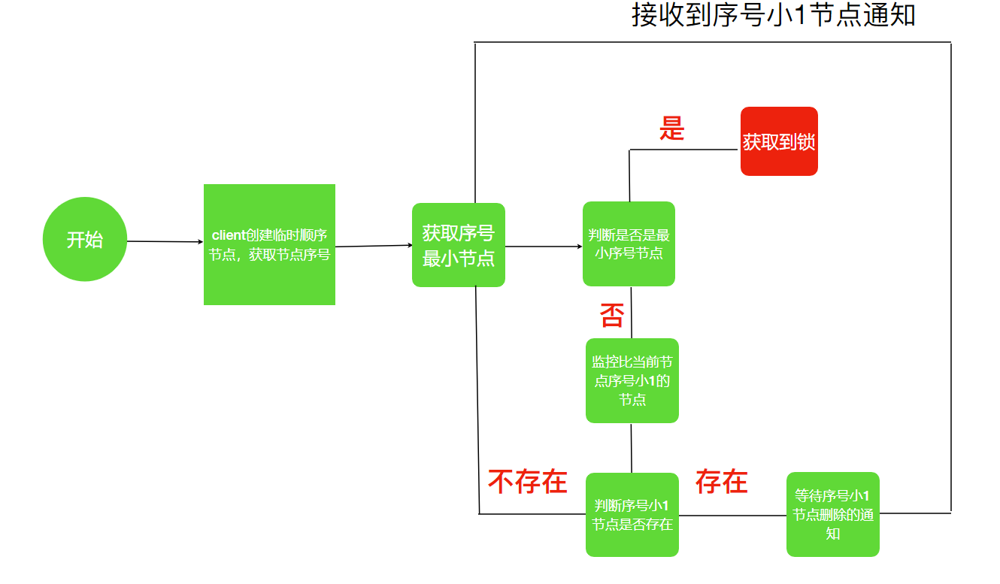
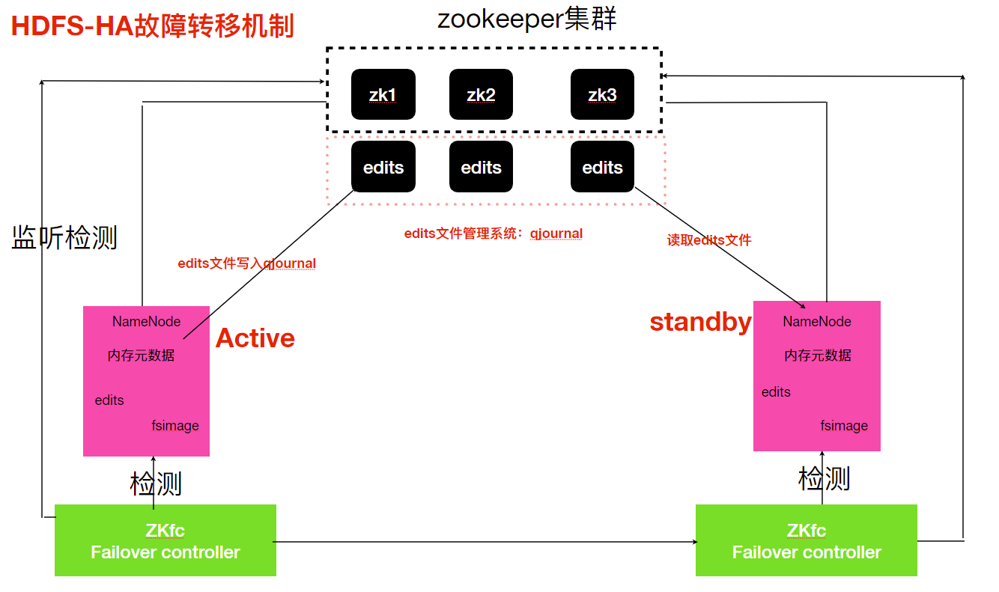

# zookeeper

zkClient在内部还实现了诸如Session超时重连、Watcher反复注册 等功能  

基于zookeeper可以实现同步服务，配置维护，命名服务


监控


Dubbo： 分布式。。。

分布式配置管理： 携程阿波罗..,   solr 配置集中管理

### 架构



Leader: 核心组件，事务请求唯一处理者。非手动指定，需要选举。

Follower： 处理读请求，转发食物到 Leader

Observer:  不参与选举，增加 ZK 集群的读的..

 


每个 Server 保存相同的数据副本，数据一致。

只要有半数以上节点存活， ZK 集群就能正常提供服务。


**<font color="green">Zookeeper 本质上是一个分布式的小文件存储系统</font>**

**<font color="green">Zookeeper 提供给客户端监控存储在 ZK 内部数据的功能</font>**


### ZNode

**Node 类型**

**持久性(Persistent):** 最常见。

**持久顺序节点：**

**临时性(Ephemeral)**: 会被自动清理的节点。生命周期与 Client 回话绑定在一起，Client Session 结束，节点胡删除。临时节点无法创建子节点。

**临时顺序性((Sequential)**:  使用灵活。


**ZNode 的状态信息**

```
get /hbase

cZxid = 0x50000002f
ctime = Thu Nov 12 09:00:20 CST 2020
mZxid = 0x50000002f
mtime = Thu Nov 12 09:00:20 CST 2020
pZxid = 0x500000081
cversion = 17
dataVersion = 0
aclVersion = 0
ephemeralOwner = 0x0
dataLength = 0
numChildren = 17
```


### 事务

改变 ZK 服务状态的操作。

全局唯一的食物 ID： ZXID


### *Watch 机制

> 可通过 Watch 机制实现发布订阅模式。



注册： 监听目录变化(子节点)

WatchManager： 存储 Watch 对象

当 Zookeeper 目录变更的时候，通知 Watch


### *客户端操作

生产中常用


## 命令操作

连接 ZK 命令行

```shell
$ZK_HOME/bin/zkCli.sh
# 连接指定的服务器
$ZK_HOME/bin/zkCli.sh -server ip:port
```

ZK 命令操作

```shell
# remove
rmr /hbase


# Node create
create [-s] [-e] <path> <data>
# sequence node
create -s /zk-test 111
# extemporaneous node
create -e /zk-tmp 111
# persist
create /zk-persist 111
```


## ZK 内部原理

建议 ZK 安装奇数台服务器。


### *Leader 选举

选举机制：

① 半数机制： 

② 


**首次启动**

启动顺序、ID 值、是否超过集群半数

优先选择 ID 值大的节点


***非首次启动**


## ZAB 协议

`paxos` 底层理论算法, 不易..  
ZAB，Zookeeper原⼦消息⼴播协议）的协议作为其数据⼀致性的核⼼算法  


出现数据复制，存在网络问题，导致数据不一致。


**<font color="green">ZAB 协议是为分布式协调服务 Zookeeper 专⻔门设计的⼀种⽀持崩溃恢复和原⼦⼴播协议。</font>**

消息广播类似于 二阶段提交过程，对 Client 发送的 W 请求，由  Leader 接收，

将其封装为一个 事务，将其发送给所有 Follower，接收到半数反馈 ACK，执行 Commit 操作。


(1) Leader 项 Folloer 发送 Proposal

(2) Leader 接收 Folower 的 ACK
(3) 超过半数 ACK 则 Commit  

对于掉线的 Follower，恢复正常后进入数据同步阶段最终于 Leader 保持一致。

### Leader 奔溃

需要 Leader 的重新选举

考虑当前 ZXid 最大的，表示这个节点最接近、数据最全。


### 特性

.客户端如果对Zookeeper的数据节点注册Watcher监听，那么当该数据节点的内容或是其⼦节点 列表发⽣变更时，Zookeeper服务器就会向订阅的客户端发送变更通知。

2.对在Zookeeper上创建的临时节点，⼀旦客户端与服务器之间的会话失效，那么临时节点也会被 ⾃动删除


## 案例

### 服务器上下线监听 

客户端可以感知服务端的状况。

服务端启动后，到 ZK 中创建指定的节点。

Client 维护一个 List 存储上线的服务器。


### *分布式锁

使用到的特性：

临时有序的节点

监听机制

分布式锁



锁： 某个节点下最小序号的节点。

等待上一个比自身小的节点。

- 锁就是zk指定⽬录下序号最⼩的临时序列节点，多个系统的多个线程都要在此⽬录下创建临时的顺 序节点，因为Zk会为我们保证节点的顺序性，所以可以利⽤节点的顺序进⾏锁的判断。

- 每个线程都是先创建临时顺序节点，然后获取当前⽬录下最⼩的节点(序号)，判断最⼩节点是不是 当前节点，如果是那么获取锁成功，如果不是那么获取锁失败。

- 获取锁失败的线程获取当前节点上⼀个临时顺序节点，并对对此节点进⾏监听，当该节点删除的时 候(上⼀个线程执⾏结束删除或者是掉线zk删除临时节点)这个线程会获取到通知，代表获取到了 锁。


Hadoop 的 HA


两个进程修改一个共享变量。


Zookeeper 实现分布式锁的性能相对 Redis 低。


### HDFS 的 HA 搭建




### 命令操作

```shell
./zkcli.sh 连接本地的zookeeper服务器 
./zkCli.sh -server ip:port(2181) 连接指定的服务器
```


