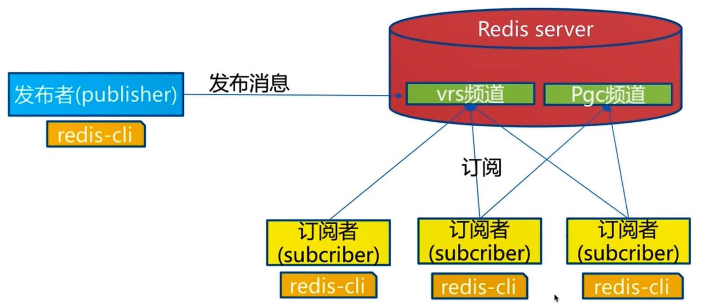

# 概述

> 远程字典服务器，是用 C 语言开发的一个开源的高性能键值对（ key-value ）内存数据库。
>
> Redis 读的速度是110000次/s, 写的速度是81000次/s 。

**特性-存取速度快 | 简单**

（1） 速度快的原因

- 数据完全存放在内存
- 底层使用 C 语言编写(50000 line)
- 单线程, 避免不必要的上下文切换和竞争条件，无锁的开销，同时采用 IO 多路复用，非阻塞IO
- 数据结构简单，对数据操作也简单，Redis 中的数据结构是专门设计的；

（2）多路 I/O 复用模型

多路I/O复用模型是利用 select、poll、epoll 可以同时监察多个流的 I/O 事件的能力，在空闲的时候，会把当前线程阻塞掉，当有一个或多个流有 I/O 事件时，就从阻塞态中唤醒，于是程序就会轮询一遍所有的流（epoll 是只轮询那些真正发出了事件的流），并且只依次顺序的处理就绪的流，这种做法就避免了大量的无用操作。

这里 “多路” 指的是<font color="green">多个网络连接</font>，“复用” 指的是<font color="green">复用同一个线程</font>。采用多路 I/O 复用技术可以让单个线程高效的处理多个连接请求（尽量减少网络 IO 的时间消耗），且 Redis 在内存中操作数据的速度非常快，也就是说内存内的操作不会成为影响 Redis 性能的瓶颈，主要由以上几点造就了 Redis 具有很高的吞吐量。


**功能丰富**

- 支持发布订阅模式
- pipeline: 提高客户端的并发效率
- 事务： 不支持回滚
- 脚本扩展支持(Lua)： 方便实现自定义功能


**高可用、分布式支持**
高可用  ⇒ Redis-Sentinel(v2.8) 支持高可用


**优缺点**

（1） 优点

性能高，速度快；

支持丰富的数据类型；

原子操作；

丰富的特性，包括 pipeline、订阅发布模型；

（2） 缺点

是数据库容量受到物理内存的限制, 不能用作海量数据的高性能读写, 因此 Redis 适合的场景主要<font color="green">局限在较小数据量的高性能操作和运算上</font>。


相关问题：

Q: **为什么Redis是单线程的**

因为 Redis 是基于内存的操作，CPU 不是 Redis 的瓶颈，Redis 的瓶颈最有可能是机器内存的大小或者网络带宽。既然单线程容易实现，而且CPU不会成为瓶颈，那就顺理成章地采用单线程的方案了。


**与其他数据库的比较**

1、单进程多线程模型：MySQL、Memcached、Oracle（Windows版本）；

2、多进程模型：Oracle（Linux版本）；

3、Nginx有两类进程，一类称为Master进程(相当于管理进程)，另一类称为Worker进程（实际工作进程）。启动方式有两种：

（1）单进程启动：此时系统中仅有一个进程，该进程既充当Master进程的角色，也充当Worker进程的角色。

（2）多进程启动：此时系统有且仅有一个Master进程，至少有一个Worker进程工作。

（3）Master进程主要进行一些全局性的初始化工作和管理Worker的工作；事件处理是在Worker中进行的。


## Redis 线程模型

redis 内部使⽤⽂件事件处理器 `file event handler` ，这个⽂件事件处理器是单线程的，所以 redis 才叫做单线程的模型。它采⽤ IO 多路复⽤机制同时监听多个 socket，根据 socket 上的事件 来选择对应的事件处理器进⾏处理。


## *数据类型

（1） 底层结构

① type、encoding 实现多态的数据结构

② refcount： 用于实现内存的回收，以及对象的共享

③ lru： 用于设置最大内存作为热点缓存时，且开启的淘汰策略为 volatile-lru 或 all-lru 时使用。

```c
typedef struct redisObject {
    unsigned type:4;
    unsigned encoding:4;、
    unsigned lru:LRU_BITS; /* lru time (relative to server.lruclock) */
    int refcount;
    void *ptr;
} robj;
```


（2） 特性

① 多态特性，可根据实际场景来进行自动切换

② "单线程"：

（）scan
```
scan cursor [match pattern] [count count]
```
用于在大量键的情况下找到对应的


### **String**

> 常⽤命令: set,get,decr,incr,mget 等。
>
> value其实不仅可以是String，也可以是数字。

底层为 SDS ，基于 C 的 Char 更近一步的封装；

（1） get|set|del

缓存 JSON 格式的数据；

（2） incr|decr|incrby|decrby|incrbyfloat

用于计数使用，如 page view；

（3） append|getrange|setrange 字符命令

（4） setbit|getbit|bitcount Bit 命令

BitMap 实现


**应用场景：**

String是最常用的一种数据类型，普通的key/value存储都可以归为此类，value其实不仅是String， 也可以是数字：比如想知道什么时候封锁一个IP地址(访问超过几次)。INCRBY命令让这些变得很容易，通过原子递增保持计数。


### **Hash**

> 常⽤命令： hget,hset,hgetall 等。
>
> hash 是⼀个 string 类型的 field 和 value 的映射表，hash 特别适合⽤于存储对象，后续操作的时 候，你可以直接仅仅修改这个对象中的某个字段的值。

散列存储的值既可以是字符串又可以是数字值，并且用户同样可以对散列存储的数字执行自增操作或者是自减操作。

（） hset|hget|hdel|hgetall 基本命令

（） hmset|hmget|hlen|hdel 批量命令

（） hincr 操作数字命令

```
hset hash1 name A age 23 
hget hash1 name 
```

（） 应用-存放结构

存放用户的信息；

视频的信息；


### **List**

> 常⽤命令: lpush,rpush,lpop,rpop,lrange等。

**一个List结构可以有序的存储多个字符串，并且是允许元素重复的。**

（1） lpush|lpop|rpush|rpop 增删命令

基本链表的添加删除，可以借助对应的命令组合成栈、队列结构；

（2） lrange|lindex

查找指定范围内的所有值，获取列表在给定位置的单个元素；

（3） blpush|brpop

阻塞添加内容

```shell 
lrange list1 0 -1
```

（） 应用1-消息队列

作为阻塞队列使用；

（）应用2-作为 timeline；

```java
void doHandle(EventModel model) {
    // 为了测试，把model的userId随机一下
    Random r = new Random();
    model.setActorId(1+r.nextInt(10));

    // 构造一个新鲜事
    Feed feed = geneFeedByModel(model);
    if (feed.getData() == null) {
        return;
    }
    feedService.addFeed(feed);

    // 可再次加入判断逻辑, 判断事件的触发者是否是 大 V
    // 为大 V, 可考虑不加入 timeline 队列
    //         可考虑选取与该 大 V 亲密度高的或在线用户进行推送
    // 不为大 V， 可考虑直接加入 timeline 队列
    //           可考虑只选取与该事件触发者亲密度高或在线用户进行推送


    // 推模式, 将当前事件推送到所有粉丝的时间线
    List<Integer> followers = followService.getFollowers(EntityType.ENTITY_USER, model.getActorId(), Integer.MAX_VALUE);
    followers.add(0);
		
    for (int follower : followers) {   // push event to followers
        String timelineKey = RedisKeyUtil.getTimelineKey(follower);
        jedisAdapter.lpush(timelineKey, String.valueOf(feed.getId()));               
    }
}
```

（） 作为异步队列

rpush 生产队列， lpop 消费队列

缺点： 没有等待队列就直接消费，

弥补： 通过在应用层引入 Sleep 机制去 lpop 重试；

-使用blpop key [key ...] timeout：阻塞直到队列有消息或者超时
        缺点：只能个单个消费者消费

-多个消费者可用 pub/sub: 主题订阅者模式
发送者(pub)发送消息，订阅者(sub)接收消息
订阅者可以订阅任意数量的主题
缺点：消息发布是无状态的，无法保证可以达到，如发布消息时，订阅者下线了，重新上线后接收不到消息
解决方案：借助专门的消息队列中间件，如kfaka解决	


### **Set**

> 常⽤命令： sadd,spop,smembers,sunion 等

smembers set1

srem set1 a

（） sadd|srem

基本的添加删除

（） sismember|smembers|scard  查询命令

查看某个人是否是某个人都额粉丝、用户关注了多少个人、用户是否关注了某个问题

（） srandmember 随机命令

用于随机抽奖；

InnoDB 中

通过 COUNT, 之后配合 LIMIT 实现；

通过 order by rand() LIMIT 3 实现；

（） sinter|sunion|sdiff (...)集合操作

用于表示好友关系，共同好友；

好友推荐，根据 tag 求交集，大于某个 threshold 可以推荐；

（） 应用1-抽奖

随机键，作为抽奖使用

（2）应用2-论坛的赞踩功能实现、好友功能的实现

```java
long like(int userId, int entityType, int entityId) {
    String likeKey = RedisKeyUtil.getLikeKey(entityType, entityId);
    jedisAdapter.sadd(likeKey, String.valueOf(userId));
    String disLikeKey = RedisKeyUtil.getDisLikeKey(entityType, entityId);
    jedisAdapter.srem(disLikeKey, String.valueOf(userId));
    return jedisAdapter.scard(likeKey);
}
```

（3）应用三-推荐好友

好友推荐，根据 tag 求交集，大于某个 threshold 可以推荐；

（4）应用四-唯一性

利用唯一性，可以统计访问网站的所有独立 IP


### **zset**

> 常⽤命令： zadd,zrange,zrem,zcard等。

有序集合和散列一样，用于存储键值对；有序集合的键被称为成员member，每一个成员都是独一无二的；而有序集合的值被称为分值score，分值必须是浮点数。

有序集合是Redis里面唯一一个既可以根据成员访问元素，又可以根据分值以及分值的排序来访问元素的结构。

（） zadd|zrem 基础命令

（） zrange|zrangebyscore|zrevrange 范围选择

排序的选择

排行榜功能

关注与被关注

```shell
zrange zset1 0 -1

zrevrange zset1 0 -1
```


仅仅能够支持一种排序的规则，即 store 来实现。
Java 可指定多个 Comporator 来自定义实现。


### 其他

SDS 


**GEO**

> 地理位置信息


**BitMap**

>  可用于做布隆过滤器


**HyperLogLog**

> 更节省内存的一种数据结构


## 底层数据结构

### SDS

> 非 C 中的字符数组

C 中的 字符串以 `\0` 作为结尾。

```c
struct sdshdr{
  int len;
  int free;
  char buf[];
}
```

SDS 的优势：

- 防止缓冲区溢出，记录了长达
- 可存钱二进制数据，\0 字符串，二进制中包含


### *SkipList

**底层结构**

类似带有 Level (平衡 | 索引) 和 Score(有序) 的双向链表。

① Level ： 类似索引的功能，通过随机函数来确定每个节点所具有的层数；

② Score： 用于进行排序的参考值，结合 Hash 表能够在 O(1) 内找出；

Level： span，下一个指向

Node： 包含多个向前指向，一个向后指向，存放数据的指针


**跳表与红黑树的比较**

与红黑树等平衡树相比，跳跃表具有以下优点：

- 插入速度非常快速，因为不需要进行旋转等操作来维护平衡性；
- 更容易实现；
- 支持无锁操作，ConcurrentSkipListMap 用来代替 TreeMap 在并发下使用的；


### *Dict

在 Redis 中的使用：

1） 键的获取与过期实现

Redis 维护一个根据键获取到对应 type 的值，type 即为 5 种数据类型；

同时对于设置过期时间的键维护过期时间，在定期随机选择过期键删除策略上使用；

2） 实现 zset

zset 底层为 dict + zskiplist；

跳表中有序性通过 score 实现，对于给定的 obj 获取 score 属性需要线性时间，而通过 dict 为每个 obj 保存对应到 score 的映射可以在常数项复制度获取；

redis 通过引用计数法实现了缓存 1~9999 的整形值，score 共享，不会造成太多的空间浪费；

**1、底层结构|INIT**


（1） 字典整体结构： 

```c
typedef struct dict {
    dictType *type;
    void *privdata;            // ↑ 2 个用于多态字典实现
    dictht ht[2];              // ht[1] 用于 grow
    long rehashidx;            /* -1 -> rehash 状态, 用于渐进式 rehash 处理 */
    unsigned long iterators; /* 当前number of iterators currently running */
} dict;
```

```c
typedef struct dictht {          
    dictEntry **table;
    unsigned long size;
    unsigned long sizemask;
    unsigned long used;     
} dictht;
```

```c
typedef struct dictEntry {   
    void *key;
    union {
        void *val;
        uint64_t u64;
        int64_t s64;
        double d;               // 多态的 Val {int,string...}, hincr 命令基于 int
    } v;
    struct dictEntry *next;
} dictEntry;
```

（2） 初始情况

初始时设置大小为 4 的容量


**2、操作**

**hash 函数**

正常情况： 取模实现；

```java

```

rehash 情况： 映射到辅助表对应的桶中

```java

```


&2. get


&3. put()

(1) Key 冲突

链地址法解决，头插法处理。


**3、rehash | grow**
可能遇到 BGSAVE, BGREWRITEAOF 形成类多线程情况，在多线程情况下负载因子到达一定程度再进行扩容。

（1） rehash 时机

扩容时机：

- 正常情况下 ， loadFactor >=1 

- `BGSAVE` OR `BGREWRITEAOF` 命令下 loadFactor >= 5

缩容时机：  `loadFactor <0.1`

**（2） <font color="green">渐进式 rehash</font>** 

**原理：**   在 dict 中维护着对应的结构

① dict.rehashidx 

- 控制当前是否是在 rehash 状态
- 代表当前 rehash 到何处

② dictht[2]

保证与原始数据不分割

**（3） 执行流程：**

阶段1： 未在 rehash 阶段，`rehashidx = -1`

阶段2： 处在 rehash 阶段

进行 CRUD

在 rehash 期间，对 dict 进行 CRUD，都会执行一次 rehash

阶段3： rehash 完毕

全部从 ht[0] -> ht[1] 完成后，回收原来 ht[0] 的空间，交换引用

**X、其他**

（1） 多态类型支持

命令 hincrby

（2） 与 HashMap 比较

rehash 特殊

多态支持


### *QuickList

> 快速列表，在Redis3.2以后结合adlist和ziplist的优势Redis设 计出了quicklist。

```c
typedef struct quicklist {
    quicklistNode *head;
    quicklistNode *tail;
    unsigned long count;        /* total count of all entries in all ziplists */
    unsigned long len;          /* number of quicklistNodes */
    int fill : 16;              /* fill factor for individual nodes */
    unsigned int compress : 16; /* depth of end nodes not to compress;0=off */
} quicklist;
```

```c
typedef struct quicklistNode {
    struct quicklistNode *prev;
    struct quicklistNode *next;
    unsigned char *zl;
    unsigned int sz;             /* ziplist size in bytes */
    unsigned int count : 16;     /* count of items in ziplist */
    unsigned int encoding : 2;   /* RAW==1 or LZF==2 */
    unsigned int container : 2;  /* NONE==1 or ZIPLIST==2 */
    unsigned int recompress : 1; /* was this node previous compressed? */
    unsigned int attempted_compress : 1; /* node can't compress; too small */
    unsigned int extra : 10; /* more bits to steal for future usage */
} quicklistNode;
```

```c
typedef struct quicklistLZF {
    unsigned int sz; /* LZF size in bytes*/
    char compressed[];
} quicklistLZF;
```


Redis 采用的压缩算法是LZF。

其基本思想是：数据与前面重复的记录重复位置及长度，不重复的记录原始数据。


### stream

> stream主要由：消息、生产者、消费者和消费组构成。
>
> Redis Stream的底层主要使用了listpack（紧凑列表）和Rax树（基数树）。

**listpack**

表示一个字符串列表的序列化，listpack可用于存储字符串或整数。用于存储stream的消息内 容。


**Rax 树**

Rax 是一个有序字典树 (基数树 Radix Tree)，按照 key 的字典序排列，支持快速地定位、插入和删除操 作。


## 持久化

（1） 适用的场景

对于一些  <u>需要进行大量计算而得到的数据，放置在Redis服务器</u>  ，我们就有必要对其进行数据的持久化，如果需要对数据进行恢复的时候，我们就不需进行重新的计算，只需要简单的将这台机器上的数据复制到另一台需要恢复的Redis服务器就可以了。

（2） 持久化策略

一方面我们需要通过快照或者AOF的方式对数据进行持久化，另一方面，我们还需要将持久化所得到的文件进行备份，备份到不同的服务器上，这样才可以尽可能的减少数据丢失的损失。


### RDB 持久化

snapshotting 快照

对整个 DB 进行持久化动磁盘，只有一份 RDB 文件，可随时备份；

比 AOF 文件小，加载效率高；

就是我们俗称的备份，他可以在定期内对数据进行备份，将Redis服务器中的数据持久化到硬盘中；


通常情况下，为了防止单台服务器出现故障造成所有数据的丢失，我们还可以将快照复制到其他服务器，创建具有相同数据的数据副本，这样的话，数据恢复的时候或者服务器重启的时候就可以使用这些快照信息进行数据的恢复，也可以防止单台服务器出现故障的时候造成数据的丢失。


**触发的三种方式**

- SAVE
- BGSAVE
- 根据配置自动持久化

如果用户使用了save设置，例如：save 60 1000 ,那么从Redis最近一次创建快照之后开始计算，当“60秒之内有1000次写入操作”这个条件满足的时候，Redis就会自动触发BGSAVE命令。

如果用户使用了多个save设置，那么当任意一个save配置满足条件的时候，Redis都会触发一次BGSAVE命令。

（） 针对大数据量下 BGSAVE 的卡顿

因此，为了防止Redis因为创建子进程的时候出现停顿，我们可以考虑关闭自动保存，转而通过手动的方式发送BGSAVE或者SAVE来进行持久化，

手动的方式发送BGSAVE也会出现停顿的现象，但是我们可以控制发送该命令的时间来控制出现停顿的时候不影响具体的业务请求。


（） 快照生成时机

创建快照的时候，我们可以在业务请求，比较少的时候，比如凌晨三、四点，通过手写脚本的方式，定时执行。


压缩 | 校验：

RDB 文件的压缩；

在进行主从复制时，传递给从服务器 RDB 文件，从而实现同步；


通用配置参数：

```shell
save 60 1000
save ""                                    # 关闭 RDB 
stop-writes-on-bgsave-error no 
rdbcompression yes						# 设置压缩
dbfilename dump.rdb
dir ./     
```


**RDB 的特点(*)**

1、RDB 是一种快照模式，即——保存的是 key value 数据内容。

2、RDB 有 2 种持久方式，同步 save 模式和异步 bgsave 模式。由于 save 是同步的，所以可以保证数据一致性，而 bgsave 则不能。

3、save 可以在客户端显式触发，也可以在 shutdown 时自动触发；bgsave 可以在客户端显式触发，也可以通过配置由定时任务触发，也可以在 slave 节点触发。

4、save 导致 redis 同步阻塞，基本已经废弃。bgsave 则不会导致阻塞，但也有缺点：在 fork 时，需要增加内存服务器开销，因为当内存不够时，将使用虚拟内存，导致阻塞 Redis 运行。所以，需要保证空闲内存足够。

5、默认执行 shutdown 时，如果没有开启 AOF，则自动执行 bgsave。

6、每次的 RDB 文件都是替换的。


**RDB 的优化(*)**

会压缩 RDB 文件，适用 LZF 算法，让最终的 RDB 文件远小于内存大小，默认开启，会消耗 CPU。


**RDB 的缺点(*)**

无法秒级持久化，也即无法保证持久性；

老版本 Redis 无法兼容新版本 RDB；


**RDB 的优点(*)**

文件紧凑，适合备份，全量复制场景，例如每 6 小时执行 bgsave，保存到文件系统之类的；

Redis 加载 RDB 恢复数据远远快鱼 AOF；


总结：

1.RDB是Redis内存到硬盘的快照，用于持久化。
2.save通常会阻塞Redis
3.bgsave不会阻塞Redis，但是会fork新进程。
4.save自动配置满足任一就会被执行。
5.有些触发机制不容忽视


### AOF 持久化

append-only-file 只追加文件

他会在执行写命令的时候，将执行的写命令复制到硬盘里面，后期恢复的时候，只需要重新执行一下这个写命令就可以了。类似于我们的MySQL数据库在进行主从复制的时候，使用的是binlog二进制文件，同样的是执行一遍写命令；


**恢复原理**

通过 fake 一个客户端进行执行对应的指令


**三种同步频率策略(*)**

- every second: 性能较好
- always:  可实现事务的持久性
- no: 交给 OS 决定何时持久化，不可控

（1） always : 需要对硬盘进行大量的写操作，所以Redis处理命令的速度会受到硬盘性能的限制。

保证了持久性，数据安全性最高。

普通的硬盘每秒钟只能处理大约200个写命令，使用固态硬盘SSD每秒可以处理几万个写命令，但是每次只写一个命令，这种只能怪不断地写入很少量的数据的做法有可能引发严重的写入放大问题，这种情况下降严重影响固态硬盘的使用寿命。

（2） everysec：既可以兼顾数据安全也可以兼顾写入性能。

Redis以每秒同步一次AOF文件的性能和不使用任何持久化特性时的性能相差无几，使用每秒更新一次 的方式，可以保证，即使出现故障，丢失的数据也在一秒之内产生的数据。

（3） no： 由 OS 决定何时对 AOF 进行同步。

这个命令一般不会对Redis的性能造成多大的影响，但是当系统出现故障的时候使用这种选项的Redis服务器丢失不定数量的数据。

另外，当用户的硬盘处理写入操作的速度不够快的话，那么缓冲区被等待写入硬盘的数据填满时，Redis的写入操作将被阻塞，并导致Redis处理命令请求的速度变慢，因为这个原因，一般不推荐使用这个选项。


**AOF 重写**

将多条命令合并成一条使用，   `BGREWRITEAOF`

原理： Redis会创建一个子进程，然后由子进程负责对AOF文件的重写操作。

设置参数重写：

两个参数设置 重写的时机：

表示当前AOF的文件体积大于64MB，并且AOF文件的体积比上一次重写之后的体积变大了至少一倍（100%）的时候，Redis将执行重写


```
appendonly no                       # 开启
appendfsync everysec                # 策略
no-appendfsync-on-rewrite no
auto-aof-rewrite-percentage   100
auto-aof-rewrite-min-size    64mb   # 多久执行
dir ./      
```


**并发中的 AOF 重写(#)**

原理：

① fork() 创建子进程；

② 子进程将新的 AOF 写到一个临时文件里，作为 AOF 重写缓冲区，不依赖原来的 AOF 文件；

③ 主进程持续将新的变动同时写到内存和原来的AOF里；

④ 主进程获取子进程重写AOF的完成信号，往新的AOF同步增量变动；

⑤ 使用新的AOF文件替换掉旧的AOF文件；


**持久化后的数据恢复**

fake 一个 client，之后通过其进行执行对应的 AOF 命令逐个执行，进行对应的恢复；

（1） 检验修复恢复

```
red1is-check-aof
redis-check-dump
```

如果用户在运行redis-check-aof命令的时候，指定了--fix 参数，那么程序将对AOF文件进行修复。

程序修复AOF文件的方法很简单：他会扫描给定的AOF文件，寻找不正确或者不完整的命令，当发现第一个出现错误命令的时候，程序会删除出错命令以及出错命令之后的所有命令，只保留那些位于出错命令之前的正确命令。大部分情况，被删除的都是AOF文件末尾的不完整的写命令。


**（2）持久化恢复(#)**

优先加载 AOF，当没有 AOF 时才加载 RDB。当 AOF 或者 RDB 存在错误，则加载失败。


**AOF 特点(*)**

1、默认文件名是 appendonly.aof，和 RDB 一样，保存在配置中 dir 目录下。

2、AOF 相比较于 RDB，每次都会保存写命令，数据实时性更高。

3、AOF 由于每次都会记录写命令，文件会很大，因此需要进行优化，称之为“重写机制”（下面详细说）。

4、AOF 每次保存的写命令都放在一个缓冲区，根据不同的策略（下面详细说）同步到磁盘。


**与 RDB 的比较**

（） RDB和AOF的优缺点
	RDB优点：全量数据快照，文件小，恢复快
	RDB缺点：无法保存最近一次快照之后的数据
	AOF优点：可读性高，合适保存增量数据，数据不易丢失
	AOF缺点：文件体积大，恢复时间长

（） RDB 和 AOF 两者的差异，如何选择

① AOF 的文件一般更大，RDB 相对较少；

② AOF 能够较少的丢失数据， RDB 缺失的数据为上次备份到当前时间；

③ 在恢复策略上，优先采用 AOF 进行恢复；


推荐使用 RDB + AOF 混合方式；

bgsave 做镜像的全量持久化， aof 做增量持久化；


## 缓存淘汰 

### *过期键删除策略

**底层结构**

dict： 用于存放键空间

expire： 用于存放键的过期时间，默认是以 ms 作为单位；


**删除的原理**

> 通过惰性删除，以及定期删除实现;

(1) 惰性删除： 在每次从键空间获取键时，判断是否过期，若过期便进行删除。

(2) 定期删除： 在规定的时间内，分多次遍历 Server 中的各个 DB，从 expires 字典中随机检查一部分键的过期时间，并删除其中的过期键。


**限制**

对于散列表这种容器，只能为整个键设置过期时间（整个散列表），而不能为键里面的单个元素设置过期时间。


### 缓存淘汰策略

作为内存数据库，出于对性能和内存消耗的考虑，Redis 的淘汰算法实际实现上并非针对所有 key，而是抽样一小部分并且从中选出被淘汰的 key。


**淘汰策略种类**

| 策略            | 描述                                                 |
| --------------- | ---------------------------------------------------- |
| volatile-lru    | 从已设置过期时间的数据集中挑选最近最少使用的数据淘汰 |
| volatile-ttl    | 从已设置过期时间的数据集中挑选将要过期的数据淘汰     |
| volatile-random | 从已设置过期时间的数据集中任意选择数据淘汰           |
| allkeys-lru     | 从所有数据集中挑选最近最少使用的数据淘汰             |
| allkeys-random  | 从所有数据集中任意选择数据进行淘汰                   |
| noeviction      | 禁止驱逐数据                                         |
| volatile-lfu    | 4.0 + 支持                                           |
| all-lfu         | 4.0 + 支持                                           |

本身通过 expire 的时间进行过期策略


**淘汰策略的实现**

（1） 结构的支持

对象的空转时长：

```c
typedef struct redisObject {
    // ...
	unsigned lru:LRU_BITS; 
} robj;
```

（2） 函数调用


**配置开启**

设置配置文件中的参数： 

```
maxmemory
maxmemory-policy
```


## 缓存

**与 Memcached 的比较：**
同为内存数据库，Memcached 可以缓存其他东西，如图片、视频等；

① 支持更多的数据类型，Memcached 仅支持 String；

② 数据安全与恢复，支持持久化，Memcached 最多保存 30 天，Redis 支持两种持久化方式；

③ 分布式集群支持： Memcached 只能通过在客户端使用一致性哈希来实现分布式存储，这种方式在存储和查询时都需要先在客户端计算一次数据所在的节点。Redis Cluster 实现了分布式的支持，Sentinel 实现了对可靠性的要求；

④ Memcached是多线程，⾮阻塞IO复⽤的⽹络模型，Redis使⽤单线程的多路 IO 复⽤模型。

⑤ 内存管理控制： 

- 在 Redis 中，并不是所有数据都一直存储在内存中，可以将一些很久没用的 value 交换到磁盘，而 Memcached 的数据则会一直在内存中。
- Memcached 将内存分割成特定长度的块来存储数据，以完全解决内存碎片的问题。但是这种方式会使得内存的利用率不高，例如块的大小为 128 bytes，只存储 100 bytes 的数据，那么剩下的 28 bytes 就浪费掉了。

Memcached适合于缓存SQL语句、数据集、用户临时性数据、延迟查询数据和Session等。

采用单进程多线程的同样基于内存的 KV 数据库 Memcached 

| 对比参数       | Redis                                                        | Memcached                                               |
| -------------- | ------------------------------------------------------------ | ------------------------------------------------------- |
| 类型           | 1、支持内存 <br>2、非关系型数据库                            | 1、支持内存  <br>2、key-value键值对形式 <br>3、缓存系统 |
| 数据存储类型   | 1、String  <br>2、List <br>3、 Set <br>4、Hash <br>5、SortSet[俗称ZSet] | 1、文本型  <br>2、二进制类型[新版增加]                  |
| 查询[操作]类型 | 1、批量操作  <br>2、事务支持[虽然是假的事务] <br>3、每个类型不同的CRUD | 1、CRUD  <br>2、少量的其他命令                          |
| 附加功能       | 1、发布/订阅模式  <br>2、主从分区 <br>3、序列化支持 <br>4、脚本支持[Lua脚本] | 1、多线程服务支持                                       |
| 网络\|O模型    | 1、单进程模式                                                | 2、多线程、非阻塞\|0模式                                |
| 事件库         | 自封装简易事件库AeEvent                                      | 贵族血统的LibEvent事件库                                |
| 持久化支持     | 1、RDB  <br>2、AOF                                           | 不支持                                                  |


**缓存更新策略**

（1） 三种策略

- LRU/LFU/FIFO 算法剔除:  `maxmemory-policy`
- 超时剔除：  expire
- 主动更新： 开发控制生命周期, -1 ⇒  -2

（2） 三种策略比较


**缓存的收益与成本**

**（1） 好处：** 
1.加速读写 
CPU L1/L2/L3 Cache、Linux page Cache 加速磁盘读写、浏览器缓存、Ehcache 缓存 

2.降低后端存储负载 
缓存降低负载，后端Mysql负载

**（2） 成本：** 
数据不一致：cache 和 storage 不一致 ⇦ 更新策略 
代码维护成本： cache logic 
运维成本： Redis CLuster

**（3） 使用场景：** 
排行榜等复杂的SQL

1．降低后端负载：对高消耗的SQL：join 结果分组统计结果缓存

2．加速请求响应： 利用 Redis/Memcache 优 IO 响应时间

3．大量写合并为批量写： 如计数器先Redis累加再批量写DB， 秒杀架构


**缓存更新策略**

（1） 三种策略

- LRU/LFU/FIFO 算法剔除: `maxmemory-policy`
- 超时剔除： expire
- 主动更新： 开发控制生命周期, -1 ⇒ -2


三种策略比较： 

| 策略              | 一致性 | 维护成本 |
| ----------------- | ------ | -------- |
| LRU/LIRS 算法剔除 | 最差   | 低       |
| 超市剔除          | 较差   | 低       |
| 主动更新          | 强     | 高       |

建议： 
1，低一致性：最大内存和淘汰策略 
2．高一致性：超时剔除和主动更新结合，最大内存和淘汰策略兜底。

设置长的过期时间作为保底


（）缓存粒度

用户的全部信息？ 部分信息？

控制的三个角度： 
1．通用性：全量属性更好。 
2，占用空间：部分属性更好。 
3．代码维护·表面上全量属性更好。


页面缓存；

对象缓存；

URL 缓存；


**一些问题**

（） 大量的 Key 同时过期

集中过期，清理大量的 KEY 比较耗时，出现短暂的卡顿现象；

解决方案： 设置过期时间时，给 KEY 加一个随机值，将过期时间分散；


## 客户端

### 连接池

**连接方式**

底层为 Socket 通信
Jedis jedis = new Jedis("127.0.0.1", 6379);

Jedis(host, port, timeout, soTimeout)
连接超时
客户端读取超时


（1） 单个连接
（2） 配置连接池连接


（3） 两者的比较

连接数无法控制
无法统一管理


**参数配置**

<p align="center"><strong>资源控制</strong></p>

| 参数名     | 含义                       | 默认值 | 使用建议 |
| ---------- | -------------------------- | ------ | -------- |
| maxTotal   | 资源池最大连接数           | 8      | 后面讨论 |
| maxldle    | 资源池允许最大空闲连接数   | 8      | 后面讨论 |
| minldle    | 资源池确保最少空闲连接数   | 0      | 后面讨论 |
| jmxEnabIed | 是否开罔m×监控，可用于监控 | true   | 建议开启 |

<p align="center"><strong>借还参数</strong></p>

| 参数名             | 含义                                                         | 默认值           | 使用建议         |
| :----------------- | :----------------------------------------------------------- | :--------------- | :--------------- |
| blockWhenExhausted | 当资源池用尽后，调用者是否要等待。只有当为true时，下面的maxWaitMiIIis才会生效 | true             | 建议使用默认值   |
| maxWaitMillis      | 当资源池连接用尽后，调用者的最大等待时间（单位为毫秒）       | -1：表示永不超时 | 不建议使用默认值 |
| testOnBorrow       | 向资源池借用连接时是否做连接有效性检测(ping)，无效连接会被移除 | false            | 建议false        |
| testOnReturn       | 向资源池归还连接时是否做连接有效性检测(ping)，无效连接会被移除 | false            | 建议false        |

testOnBorrow 高并发下不应该使用


**3. 选取合适的 maxTotal**
比较难确定的，举个例子
1．命令 **平均执行时间**    0.1ms=0.001S
2．业务需要  **50000 QPS**
3，maxTotal理论值=0·001*50000=50个。实际值要偏大一些。


参考数据：

1，业务希望Redis并发量

2，客户端执行命令时间

3，Redis资源：例如nodes（例如应用个数）*maxTotal是不能超过redis的最大连接数。(config get maxclients)

4，资源开销：例如虽然希望控制空闲连接，但是不希望因为连接池的频繁释放创建连接造成不必靠开销。


**4. 选取合适的 maxIdle, minIdle**

高并发下的预热

建议maxldle=maxTotal

减少创建新连接的开销

建议预热 minIdle

减少第一次启动后的新连接开销。


**问题及解决**

Timeout wait for idle object
Pool Exhausted

1，慢查询阻塞：池子连接都被hang住。

2，资源池参数不合理：例如QPS高、池子小。

3，连接泄露（没有close()）·此类问题比较难定位，例如clientlist、netstat等，最重要的是代码。

4, DNS异常

分别用集群版的JedisClientCluster和单机版的JedisClientPool去实现，并重写方法，各自用自己的方式实现功能；


# 其他特性

## 事务

底层通过维护者一个  watch_keys 的 dict 进而通过实现

命令：

> WATCH, MULT, EXEC, DISCARD, UNDISCARD

一个事务包含了多个命令，服务器在执行事务期间，不会改去执行其它客户端的命令请求。


流水线：  事务中的多个命令被一次性发送给服务器，而不是一条一条发送，这种方式被称为流水线，它可以减少客户端与服务器之间的网络通信次数从而提升性能。


**应用**

（1） 关注服务实现

```java
boolean follow(int userId, int entityType, int entityId) {
    String followerKey = RedisKeyUtil.getFollowerKey(entityType, entityId);
    String followeeKey = RedisKeyUtil.getFolloweeKey(userId, entityType);
    Date date = new Date();
    // 实体的粉丝增加当前用户
    // BEGIN TRANSACTION
    Jedis jedis = jedisAdapter.getJedis();
    Transaction tx = jedisAdapter.multi(jedis);
    tx.zadd(followerKey, date.getTime(), String.valueOf(userId));
    // 当前用户对这类实体关注+1
    tx.zadd(followeeKey, date.getTime(), String.valueOf(entityId));
    // COMMIT,  ROLLBACK
    List<Object> ret = jedisAdapter.exec(tx, jedis);
    return ret.size() == 2 (Long) ret.get(0) > 0 (Long) ret.get(1) > 0;
}
```

 

***WATCH 命令**

可以通过 watch + incr 实现乐观锁

通过维护一个 hash 来实现


## 慢查询

指令的生命周期


两点说明：
（1）慢查询发生在第3阶段
（2）客户端超时不一定慢查询，但**慢查询是客户端超时的一个可能因素**

记录慢查询，
设置慢查询阈值
单位为  微秒


**内部结构**

固定的 FIFO 队列，存放在内存中，可dump存储进 db；

在超过容量之后，便删除；


**慢日志配置**

```shell
# 开启慢日志


# 设置慢日志的时间

# 设置慢日志
# 1，默认值,   FIFO 长度,  时间阈值
config get slowlog-max-len=128
config get slowlog-log-slower-than

# 2，修改配置文件重启
# 3，动态配置
config set slowlog-max-len 1000
config set slowlog-log-slower-than 1000


# 获取慢查询队列
slowlog get[n]：
# 获取慢查询队列长度
slowlog len
# 清空慢查询队列
slowlog reset
```


**运维经验**
1、slowlog-max-len不要设置过大，默认10ms，通常设置1ms
2、slowlog-log-slower-than不要设置过小，通常设置1000左右。
3、理解命令生命周期。
4、定期持久化慢查询。


## pipeline

两点注意
1．Redis的命令时间是微秒级别。
2，pipeline每次条数要控制（网络）。


**网络上花费大量时间**  ，毫秒级别
redis 执行命令 微秒级别

pipeline 命令与 `m....` 命令区别：
非原子操作


使用建议：
1，注意每次pipeline携带数据量
2，pipeline每次只能作用在一个Redis节点上
3．M操作与pipeline区别


## 发布订阅

角色
模型

角色： 
publisher
channel
subscriber




**命令**

发布者与订阅者都是 Client

```shell
publish [channel] [message]
subscribe [channel...]
unsubscribe [channel..]
```


```shell
# other
psubscribe [pattern..]
punsubscribe [pattern...]
pubsubchannels  // have at least one subscribe channel
pubsub numsub [channel.] // assigned channel subcribe num
```

无法做到消息堆积（消息历史）功能


其他：
订阅模式


## 消息队列

性质：

抢任务执行，多个消息订阅者只能够有一个订阅者获得消息进行执行；


通过链表结构以及阻塞实现


## 事件

底层通过无序链表实现；

文件事件；


## Lua 脚本

eval 解释执行 Lua 脚本

```
EVAL ""
script load ""
```


**脚本管理命令**


**管道、事务、脚本(Lua) 三者的区别**

管道不保证原子性，是 TCP双工，批量操作；


# Redis 高可用

## 主从复制

支持数据备份；

主从同步原理：  分为全量同步，之后进行增量同步。

（1） 全量同步过程

① Salve发送sync命令到Master

② Master启动一个后台进程，将Redis中的数据快照保存到文件中

③ Master将保存数据快照期间的收到的写命令写入到缓存

④ Master完成操作②之后，将该文件发送给Salve 

⑤ Salve收到文件后保存到磁盘，并从文件中恢复快照，即使用新文件替换旧文件

⑥ Master将快照生成期间的增量数据发送给salve端

（2） 增量同步过程

① Master接收到用户的操作指令后，判断是否需要传播到Salve

② 将操作记录追加到AOF文件

③ 将操作传播到其他salve：1、对齐主从库；2、往响应缓存写入指令

④ 将缓存中的数据发送给其他salve


**复制的实现**

一整块的复制；

在复制期间产生的相关缓冲区复制；


**心跳监测**


## Sentinel

Sentinel（哨兵）可以监听集群中的服务器，并在主服务器进入下线状态时，自动从从服务器中选举出新的主服务器。

解决主从同步 Master 宕机后的主从切换问题


**实现机制**

① 监控：检查主从服务器是否运行正常
​② 提醒：通过API向管理员或者其他应用程序发送故障通知
③ 自动故障迁移：主从切换
④ 分布式，可起多个节点，通过流言协议 Gossip 通讯
​	  

一种特殊的 Redis Server：

支持的命令： PING, PONG, INFO, 

订阅发布方式： 

监听：

同步： 


选举领头 Sentinel


**故障转移**


**获取主从服务器的信息**

通过 INFO 命令来获得信息；


## Cluster

> Redis 3.0 + 官方提供完整的集群解决方案。
>
> 去中心化方式，包括 sharding(分区)、replication(复制)、falivor()


通信关系

- 客户端与集群节点的通信

- 集群之间的通信

- 集群与 Slave 之间的通信

**Gossip 通讯**

 - 关于 Gossip，在杂乱无章中寻求一致
 - 每个节点都随机地与对方通信，最终所有节点的状态一致性
 - 定期随机发送
 - 不保证信息一定会传递给所有节点，但是会最终一致

| 命令    | 说明                                                         |
| ------- | ------------------------------------------------------------ |
| meet    | sender向receiver发出，请求receiver加入sender的集群           |
| ping    | 节点检测其他节点是否在线                                     |
| pong    | receiver收到meet或ping后的回复信息；在failover后，新的Master也会广播pong |
| fail    | 节点A判断节点B下线后，A节点广播B的fail信息，其他收到节点会将B节点标记为下线 |
| publish | 节点A收到publish命令，节点A执行该命令，并向集群广播publish命令，收到publish 命令的节点都会执行相同的publish命令 |


**槽(slot)**

> 将物理节点分配到 0 - 166383 个槽上。

平均分 slot、且连续

Hash 槽算法

crc16


相关的问题

1.为什么redis集群中必须至少有三个节点?

​       一个节点挂了,有一半以上的节点通过ping-pong方式的投票机制认为它挂了,那么这个集群就挂了.但如果只有2个节点,有一个挂了,另一个确定它挂了但百分比只占到了50%,没有超过一半,这个集群也不会挂,所以至少需要3个节点；

2.为什么每个redis集群需要至少6台服务器?

因为redis集群至少需要三个节点,要保证集群的高可用,每个节点都要一个备份机.理论上也需要6台虚拟机

 3.目的

高可用、负载均衡、性能提升


集群如何存储数据

Redis 集群中内置了 16384 个哈希槽，当需要在 Redis 集群中放置一个 key-value 时，redis 先对 key 使用 crc16 算法算出一个结果，然后把结果对 16384 求余数，这样每个 key 都会对应一个编号在 0-16383 之间的哈希槽，redis 会根据节点数量大致均等的将哈希槽映射到不同的节点


如何从海量数据里快速找到所需？
    ① 分片：
    ② 通过：一致性哈希算法：对2^32取模，将哈希值空间组织成虚拟的圆环
    	问题：Hash环的数据倾斜问题
	解决：引入虚拟节点  


**分片|重新分片**

槽指派：

** 架构细节**

(1)所有的redis节点彼此互联(PING-PONG机制),内部使用二进制协议优化速度和带宽.

(2)节点的fail是通过集群中超过半数的节点检测失效时才生效.

(3)客户端与redis节点直连,不需要中间proxy层.客户端不需要连接集群所有节点,连接集群中任何一个可用节点即可

(4)redis-cluster把所有的物理节点映射到[0-16383]slot上,cluster负责维护

(5)每个节点存储的数据不一样，但每个节点都会有备份机，主从机存储一样的数据


**分片**

分片是将数据划分为多个部分的方法，可以将数据存储到多台机器里面，这种方法在解决某些问题时可以获得线性级别的性能提升。

假设有 4 个 Reids 实例 R0，R1，R2，R3，还有很多表示用户的键 user:1，user:2，... ，有不同的方式来选择一个指定的键存储在哪个实例中。

- 最简单的方式是  <u>范围分片</u>，例如用户 id 从 0~1000 的存储到实例 R0 中，用户 id 从 1001~2000 的存储到实例 R1 中，等等。但是这样需要维护一张映射范围表，维护操作代价很高。
- 还有一种方式是  <u>哈希分片</u>，使用 CRC32 哈希函数将键转换为一个数字，再对实例数量求模就能知道应该存储的实例。


根据执行分片的位置，可以分为三种分片方式：

- 客户端分片：客户端使用一致性哈希等算法决定键应当分布到哪个节点。
- 代理分片：将客户端请求发送到代理上，由代理转发请求到正确的节点上。
- 服务器分片：Redis Cluster。


**重新分片**


场景变更：

- 新的节点作为master加入；
- 某个节点分组需要下线；
- 负载不均衡需要调整slot 分布。


迁移的触发和过程控制由外部系统完成

- 节点迁移状态设置：迁移前标记源/目标节点。
- key迁移的原子化命令：


执行过程：

1、向节点B发送状态变更命令，将B的对应slot 状态置为importing。

2、向节点A发送状态变更命令， 将A对应的slot 状态置为migrating。 

3、向A 发送migrate 命令，告知A 将要迁移的slot对应的key 迁移到B。

4、当所有key 迁移完成后，cluster setslot 重新设置槽位。


**SmartClient**

JedisCluster 

通过 cluster slots 


### 副本漂移

获取其他 Master 的 Slave 作为当前 Master 的 Slave。


# Redis 实现锁

## 乐观锁

> 基于CAS（Compare And Swap）思想（比较并替换），是不具有互斥性，不会产生锁等待而消 耗资源，但是需要反复的重试，但也是因为重试的机制，能比较快的响应。

利用 redis 的 watch 功能，监控这个 redisKey 的状态值。


## 分布式锁

1. 获取锁的时候，使用setnx（SETNX key val：当且仅当key不存在时，set一个key为val的字符串，返回1；若key存在，则什么都不做，返回0）加锁，锁的value值为一个随机生成的UUID，在释放锁的时候进行判断。并使用expire命令为锁添加一个超时时间，超过该时间则自动释放锁。

2. 获取锁的时候调用setnx，如果返回0，则该锁正在被别人使用，返回1则成功获取锁。 还设置一个获取的超时时间，若超过这个时间则放弃获取锁。
3. 释放锁的时候，通过UUID判断是不是该锁，若是该锁，则执行delete进行锁释放。


**锁的获取**

方式一：

setnx 的时候设置过期时间。


方式二： setnx 实现

并发的时候，若获取到锁的机器宕机，锁会无法释放。


**锁的释放**

方式一：get and delete


方式二： redis + lua


**存在的问题**

主从之间

(1) 主从架构：

主挂掉，从服务器还没有从主将锁复制过来，有可能导致锁重复获得。


(2) 获取到锁

还没有使用完毕，锁过期，被其他客户端获取到

<font color="green">无法续租</font>


**CAP 模型分析**

分布式环境下三者不能共存，只能两者共存，分布式场景下 P 不能舍弃。

CP: 强一致性模型

AP: 高可用模型

分布式锁是 CP 模型，Redis 集群是 AP 模型。

<font color="green"><strong>Redis 不能保证数据的实时一致性，只能保证数据的最终一致性。</strong></font>

社交场景下，可以使用。

若需要数据的强一致性，即不允许重复获得锁(重复下单、重复转账)  不要使用，可使用 CP 模型实现，如 Zookeeper 和 etcd。 


## Redisson 分布式锁

> 架设在Redis基础上的一个Java驻内存数据网格（In-Memory Data Grid）。
>
> Redisson在基于NIO的Netty框架上，生产环境使用分布式锁。


通过 Lua 脚本加锁

通过 watch dog 进行续租，每隔10秒查看，如果有锁，则继续...

Lua: 保证复杂业务逻辑执行的原子性。


**锁互斥**


**自动延时机制**


**可重入机制**

自己加一


**释放锁**


### 分布式锁特性

(1) 互斥性：

任意时刻，只能有一个 Client 获取到锁，不允许多个 Client 获取到锁。

Redis 的 setnx 原子操作， redisson 的判断存在性。

(2) 同一性：锁只能被持有该锁的 Client 的删除

Redis 通过 lua 的原子性， redission 判断是不是加锁的

(3) 可重入

可以持续对锁加锁，实现锁的续租。

(4) 容错性


**实际使用**

(1) 数据并发竞争

(2) 防止库存超卖


# 其他

Q: 从海量Key里查询出某一固定前缀的Key？

```shell
scan cursor [MATCH pattern] [Count count]
```

该命令的注意事项：

基于游标的迭代器，需要基于上一次的游标延续之前的迭代过程

以 0 开始新的迭代，返回游标 0 完成一次遍历；

不保证每次执行返回给定数量，支持模糊查询；

一次返回的数量不可用，大概率符合 count 参数；


Q: 判断redis服务是否正常？

通过 ping-pong机制来判断节点是否挂了


Redis 配置文件注释

http://download.redis.io/redis-stable/redis.conf

官网地址：http://redis.io/

中文官网地址：http://www.redis.cn/

下载地址：http://download.redis.io/releases/