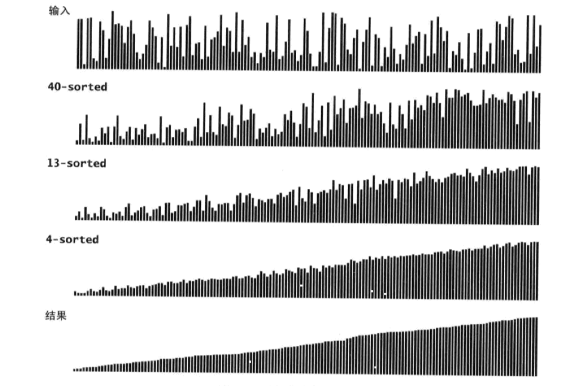
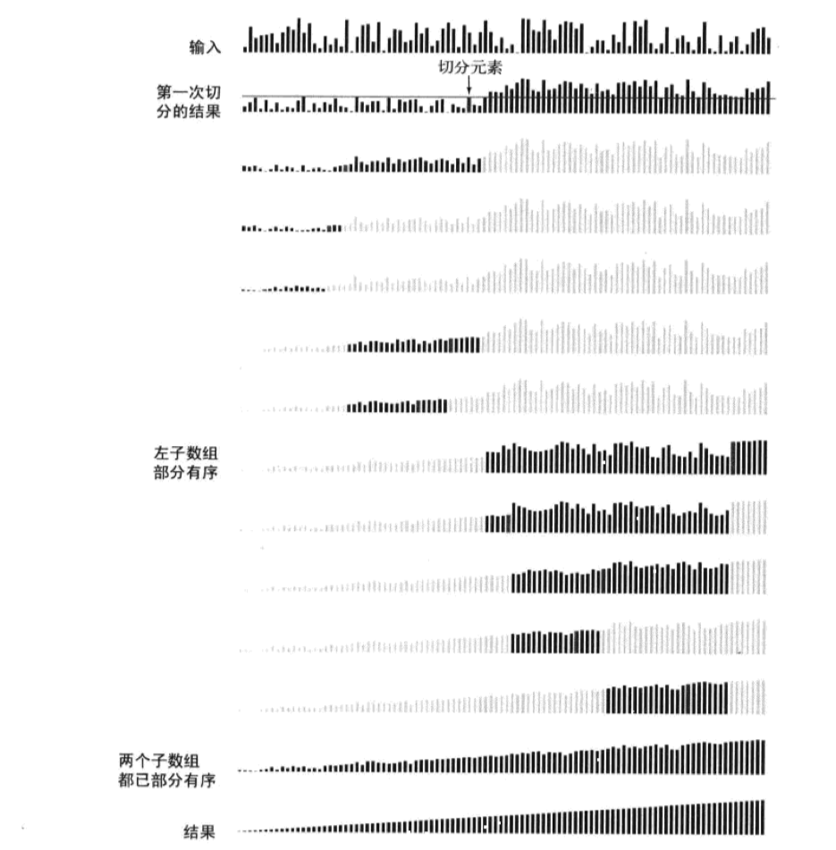
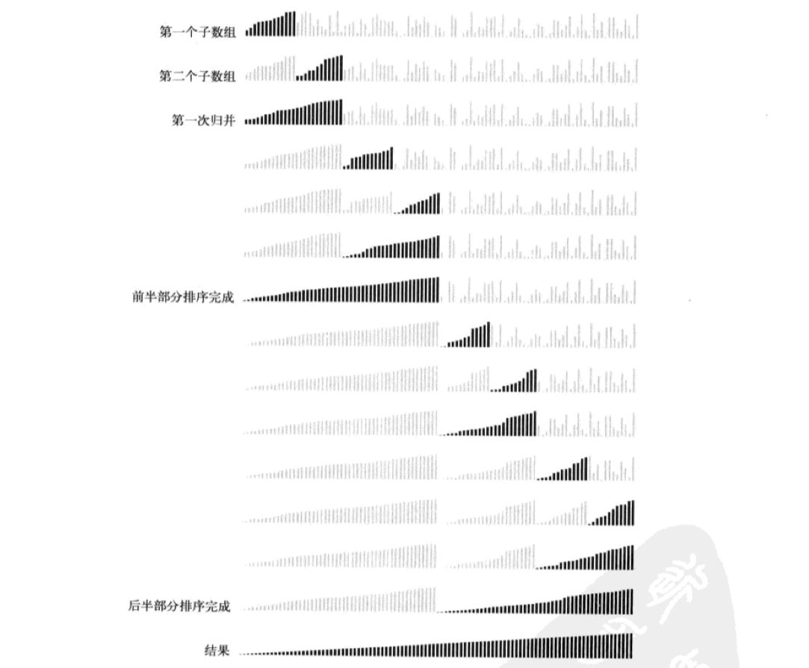
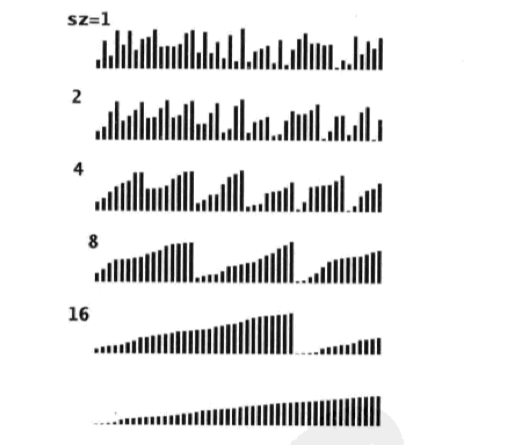
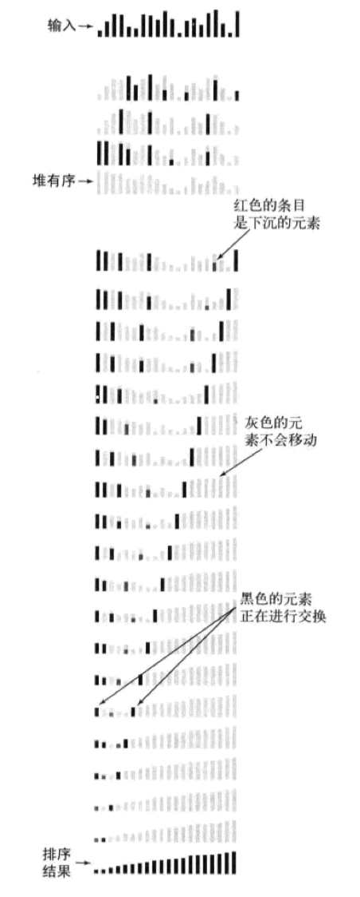
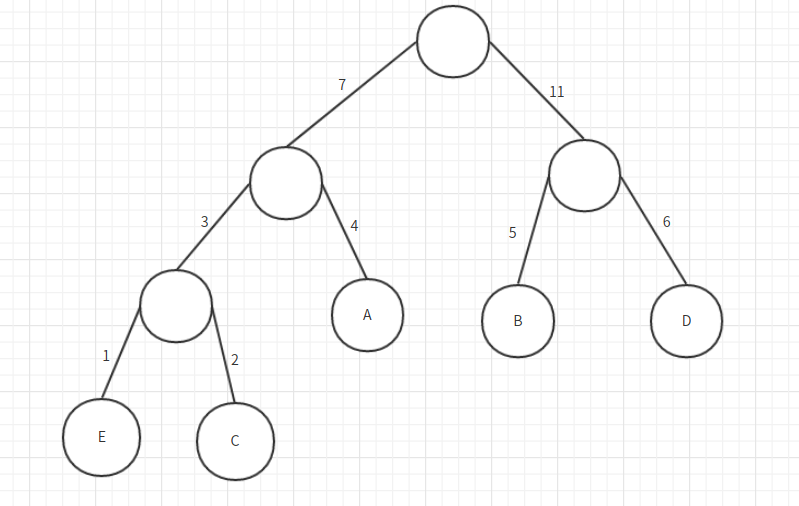

[TOC] 


# 基础算法

**编码**

**数学归纳法**

用于证明断言对所有自然数成立

步骤：

证明对于 N = 1 成立；

证明 N>1 时，如果对于 N-1 成立，那么对于 N 成立；


**递归控制**

严格定义递归函数作用，包括参数，返回值，Side-effect
先<u>一般</u>，后<u>特殊</u>
每次调用 <u>必须</u> 缩小问题规模
每次问题规模缩小程度必须为 <u>1</u>


## 排序
> 基本的排序算法，以及变种  

|       算法       | 稳定性 |          时间复杂度          | 空间复杂度 |            备注             |
| :--------------: | :----: | :--------------------------: | :--------: | :-------------------------: |
|     选择排序     |   ×    |        N<sup>2</sup>         |     1      |                             |
|     冒泡排序     |   √    |        N<sup>2</sup>         |     1      |                             |
|     插入排序     |   √    |      N \~ N<sup>2</sup>      |     1      |     与初始的逆序度相关      |
|     希尔排序     |   ×    | N 的若干倍乘于递增序列的长度 |     1      | 每次交换逆序度数量减少大于1 |
|     快速排序     |   ×    |            NlogN             |    logN    |                             |
| 三向切分快速排序 |   ×    |          N \~ NlogN          |    logN    |     适用于有大量重复值      |
|     归并排序     |   √    |            NlogN             |     N      |                             |
|      堆排序      |   ×    |            NlogN             |     1      |     无法利用局部性原理      |

### 基础排序

#### 选择排序

（1） 算法:

选择数组中最小的元素, 将它与数组的第一个元素交换, 之后开始次小元元素...
（2） 复杂度

比较: N²/2,  交换: N
最坏: O(n²)

最好: O(n²)，

平均: O(n²)

（3） 性质:

- 运行时间与输入无关；
- 不稳定；
- 原地排序；

```java
void selectSort(int[] arr) {
    if (arr == null || arr.length < 2) return;
    for (int i = 0; i < arr.length; i ++) {
        int minIndex = i;
        for (int j = i + 1; j < arr.length; j ++) {
            if (arr[j] < arr[minIndex])
                minIndex = i;
        }
        swap(arr,i, minIndex);
    }
}
```


#### 冒泡排序

（1） 算法: 从左到右不断交换相邻逆序的元素, 经过一次循环确定最后一个元素到达最右侧
存在传入数组已经有序的情况

（2） 复杂度分析:
  最坏: O(n²)
  最好: O(n), 集合有序, 需要进行一次冒泡
  平均: O(n²)

（3） 性质：

- 元素交换的次数为固定值, 原始数据的逆序度   需要三次赋值操作；

- 稳定；

- 原地排序；
  

**1、基础冒泡**

```java
void bubbleSort(int[] arr) {
    if (arr == null || arr.length < 2) return;
    for (int i = arr.length - 1; i > 0; i --)  // insure N-1~1 position, 0 must in correct position
        for (int j = 0; j < i; j ++)
            if (arr[j] > arr[j + 1])
                swap(arr, j, j + 1);
}
```

**2、 有序性优化**

对于已经有序的数据，不进行元素交换。

```java
void bubbleSort(int[] arr) {
    if (arr == null || arr.length < 2) return;
    boolean hasSorted = false;
    for (int i = arr.length - 1; i > 0 && !hasSorted; i --) {  // except bad condtion
        hasSorted = true;
        for (int j = 0; j < i; j ++) {
            if (arr[j] > arr[j + 1]) {    // when equal not modify original order
                hasSorted = false;
                swap(arr, j, j + 1);
            }
        }
    }
}
```


#### 插入排序

（1）算法: 将数组分为两部分，将后部分元素逐一与前部分元素比较，如果前部分元素比array[i]小，就将前部分元素往后移动。当没有比array[i]小的元素，即是合理位置，在此位置插入array[i]。

（2） 复杂度分析
最坏: O(n²), 数组逆序, 需要 N²/2 比较  N²/2 交换
最好: O(n), 正序, 需要     N-1  比较    0  次交换
平均:   O(n^2)  N²/4  比较  N²/4 交换

（3） 性质:

- 复杂度取决于数组的初始顺序， 移动次数为逆序对的数量；

- 稳定；

- 原地排序；


**1、基础插入排序**

```java
public static void insertSortB(int[] arr) {
    if (arr == null || arr.length < 2)
        return;
    for (int i = 1; i < arr.length; i++)
        for (int j = i; j > 0 && arr[j] < arr[j - 1]; j --)
            swap(arr, j, j - 1);
}
```

**2、 赋值优化**

```java
void insertSort(int[] arr) {
    if (arr == null || arr.length < 2) return;
    for (int i = 1; i < arr.length; i ++) {
        int e = arr[i], j;   // e current element, j should put position
        for (j = i; j > 0; j --) {
            if (e < arr[j-1])
            	arr[j] = arr[j-1];
        }
        arr[j] = e;
    }
}
```

**3、链表实现插入排序**

[leetcode](https://leetcode.com/problems/insertion-sort-list/)

```java
public ListNode insertionSortList(ListNode head) {
  if (head == null) {
    return head;
  }

  ListNode first = new ListNode(0);
  ListNode cur = head;  //the node will be inserted
  ListNode pre = first; //insert node between pre and pre.next
  ListNode next = null; //the next node will be inserted
  while (cur != null) {
    next = cur.next;
    //find the right place to insert
    while (pre.next != null && pre.next.val < cur.val) {
      pre = pre.next;
    }
    //insert between pre and pre.next
    cur.next = pre.next;
    pre.next = cur;
    pre = first;
    cur = next;
  }

  return first.next;
}
```


#### 希尔排序



<p align="center">希尔排序可视轨迹</p>

（1） 算法：使用插入排序对间隔 h 的序列进行排序。通过不断减小 h，最后令 h=1，就可以使得整个数组是有序的。 

（2） 复杂度分析： 希尔排序的运行时间达不到平方级别，使用递增序列 1, 4, 13, 40, ... 的希尔排序所需要的比较次数不会超过 N 的若干倍乘于递增序列的长度。

（3） 性质：

- 交换不相邻元素，将逆序数量减少大于1；

- 基于原来的插入排序；

- 不稳定；

- 原地排序；

```java
void shellSort(int[] arr) {
    int N = arr.length;
    int h = 1;
    while (h < N/3) h = 3 * h + 1;
    while (h > 0) {
        for (int i = h; i < N; i += h) {
            for (int j = i; j >= h; j -= h) {
                if (arr[j] < arr[j-h]) swap(arr, j, j - h);
                else break;
            }
        }
        h /= 3;
    }
}
```


### 快速排序

（1） 思想: 分治, 分区

（2） 复杂度:
由每次选取的分割点控制
最好: 每次分割点都为中间的元素， O(logN)
最坏: 每次分割点都为最后元素   O(n²)

（3） 性质:

- 每趟排序就有一个元素排在了最终的位置上，第n趟结束，**至少**有n个元素已经排在了最终的位置上；

- 非稳定

- 原地排序

（4） 归并 VS 快排:
归并由下到上, 先处理子问题之后合并，快排由上到下, 先进行分区然后处理子问题；

归并非原地排序，需要辅助空间，快排通过原地分区函数实现原地排序；

归并排序为稳定的排序，保留原来相同值的顺序；

（5） 优化:
 三数取中法
 随机选取法

**1、随机取枢纽元**

小数据集使用插入排序；

随机选择枢纽元比较；

```java
void quickSort(int[] arr) {
    if (arr == null || arr.length < 2) return;
    quickSort(arr, 0, arr.length);
}
void quickSort(int[] arr, int lo, int hi) {
    if (hi - lo < INSERTION_SORT_THRESHOLD) {
        insertSort(arr, lo, hi);
        return;
    }
    int j = partition(arr, lo, hi);
    quickSort(arr, lo, j - 1);
    quickSort(arr, j +1, hi);
}
```

快速选择；

```java
int partition(int[] arr, int lo, int hi) {
    swap(arr,lo,lo +(int) Math.random() * (hi-lo+1);
    int pivot = arr[lo];
    int i = lo, j = hi + 1;
    while (true) {
		while (arr[++ i] < pivot) if (i == hi) break;
        while (arr[-- j] > pivot) if (j == lo) break;
        if (i >= j) break;
        swap(arr, i, j);
    }
    swap(arr, j, lo);
}
```

**2、三路快排优化**



<p align="center">三向切分快排可视轨迹</p>

对重复元素较多的情形优化；

函数返回重复元素第一次和最后一次出现位置；

类似荷兰国旗问题的处理；

相关： [75. Sort Colors](https://leetcode.com/problems/sort-colors/description/)  

```java
int[] partition(int[] arr, int lo,int hi) {
    int pivot = arr[lo];
    int lt = lo - 1, gt = hi + 1;
    int i = lo;
    while (i < gt) {              // 各个区间的语义
        if (arr[i] == pivot) 
            i ++;
        else if (arr[i] < pivot)
            swap(arr, i ++, ++ lt);
        else 
            swap(arr, i, -- gt);
    }
    return new int[]{lt+1, gt-1};
}
```

**3、 三数取中值确定枢纽元优化**

枢纽元的选取上进行优化；

选取边界和中间数将三处进行排序，选择中间元素作为枢纽元，并放入 [hi-1] 位置；

之后 [lo], [hi] 可以作为快排内循环的哨兵；

```java
// sort three element AND put hi-1 position
int medianOf3(int[] arr, int lo, int hi) {
    int mid = lo + (hi - lo) / 2;
    if (arr[lo] > arr[mid]) swap(arr, lo, mid);
    if (arr[lo] > arr[hi]) swap(arr, lo, hi);
    if (arr[mid] > arr[hi]) swap(arr, mid, hi);
    swap(arr, mid, hi - 1);
    return arr[hi - 1];        // pivot is mid value, and position is hi-1
}
```

```java
int partition(int[] arr, int lo, int hi, int pivot) {  // pivot original position hi - 1
    int i = lo, j = hi - 1;
    while (true) {
        while (arr[++ i] < pivot);   // NOTE: [hi-1] as sentinel
        while (arr[-- j] > pivot);   // [lo] as sentinel
        if (i >= j) break;
        swap(arr, i, j);
    }
    swap(arr, i, hi - 1);  // put pivot as correct position
    return i;
}
```

```java
void quickSort(int[] arr, int lo, int hi) {
    if (hi - lo <= INSERTITION_SORT_THRESHOLD) {
        insertSort(arr, lo, hi);
        return;
    }
    int median = medianOf3(arr, lo, hi);
    int i = partition(arr, lo, hi, median);
    quickSort(arr, lo, i - 1);
    quickSort(arr,i +1, hi);
}

```


### 归并排序

（1） 算法

（2） 复杂度

大部分为 O(NlogN)

> T(n) = 2*T(n/2) + n
>     = 2*(2*T(n/4) + n/2) + n = 4*T(n/4) + 2*n
>     = 4*(2*T(n/8) + n/4) + 2*n = 8*T(n/8) + 3*n
>     = 8*(2*T(n/16) + n/8) + 3*n = 16*T(n/16) + 4*n
>     ......
>     = 2^k * T(n/2^k) + k * n

（3） 性质

- 大数据量情况下出现无法分配空间情况；

- 稳定的排序；

- 非原地排序；

**1、基础归并排序**



<p align="center">自顶向下归并排序可视轨迹</p>

① 对排序的两个子数组 [lo,mid], [mid+1, hi]，在 [mid] >= [mid+1] 数组整体有序情况下跳过合并；

② 分配当前两个数组对应的数组空间作为辅助；

```java
void mergeSort(int[] arr, int lo, int hi) {
    if (hi - lo < INSERTITION_SORT_THRESHOLD) {
        insertSort(arr, lo, hi);
        return;
    }
    int mid = lo + (hi - lo) / 2;
    mergeSort(arr, lo, mid);
    mergeSort(arr, mid + 1, hi);
    if (arr[mid] > arr[mid + 1])    loopArrQueue
    	merge(arr, lo, mid, hi);
}
```

```java
void merge(int[] arr, int lo, int mid, int hi) {
    int[] aux = new int[hi - lo + 1];
    int i = lo, j = mid + 1;
    for (int k = 0; k < aux.length; k ++) {
        if (i > mid) aux[k] = arr[j ++];
        else if (j > hi) aux[k] = arr[i ++];
        else if (arr[i] < arr[j]) aux[k] = arr[i ++];
        else aux[k] = arr[j ++];
    }
    for (int k = 0; k < aux.length; k ++) 
       arr[k + lo] = aux[k];
}
```

**2、 自底向上的归并排序**



<p align="center">自底向上的归并排序可视轨迹</p>

考虑处理两种情况：

```html
P1  __ __ | __ __ | __ __ | _       i + sz < arr.length to control
P2  __ __ | __ __ | __ __ | __ _    min{i + sz + sz - 1, arr.length - 1} to control
```

sz 为两个子数组的区间大小

```java
void mergeSort(int[] arr) {
    if (arr == null || arr.length < 2) return;
    int N = arr.length;
    for (int sz = 1; sz < N;  sz += sz) {
        for (int i = 0; i + sz < N; i += sz + sz) {  loopArrQueue
            merge(arr, i, i + sz - 1, Math.min(i + sz + sz - 1, N-1));
        }
    }
}
```

**3、使用链表进行归并排序**

执行过程：

① 找出中间节点，分割链表；

② 对分割的链表分别进行归并排序；

③ 将链表合并；

相关： [leetcode](https://leetcode.com/problems/sort-list/) | [leetcode-cn](https://leetcode-cn.com/problems/sort-list/)

```java
public class ListNode implements Cloneable {
  public int val;
  public ListNode next;

  public ListNode(int val) {
    this.val = val;
  }

  public ListNode(int val, ListNode next) {
    this.val = val;
    this.next = next;
  }
}
```

```java
public ListNode sortList(ListNode head) {
  if (head == null || head.next == null) {
    return head;
  }

  // 1. find mid node and cut two list
  ListNode preMid = preMidNode(head);
  ListNode mid = preMid.next;
  preMid.next = null;
  // 2. handle two sub problem
  ListNode l1 = sortList(head);
  ListNode l2 = sortList(mid);
  // 3. merge result
  return merge(l1, l2);
}

private ListNode preMidNode(ListNode head) {
  ListNode pre = null, fast = head, slow = head;
  while (fast != null && fast.next != null) {
    pre = slow;
    slow = slow.next;
    fast = fast.next.next;
  }
  return pre;
}

private ListNode merge(ListNode l1, ListNode l2) {
  if (l1 == null)
    return l2;
  if (l2 == null)
    return l1;
  if (l1.val < l2.val) {
    l1.next = merge(l1.next, l2);
    return l1;
  } else {
    l2.next = merge(l1, l2.next);
    return l2;
  }
}
```

**4、合并 k 个已经排序的链表**

[leetcode-cn](https://leetcode-cn.com/problems/merge-k-sorted-lists/) | [leetcode](https://leetcode.com/problems/merge-k-sorted-lists/)

```java
  public ListNode mergeKLists(ListNode[] lists) {
    return mergeSortList(lists, 0, lists.length - 1);
  }

  private ListNode mergeSortList(ListNode[] lists, int lo, int hi) {
    if (lo > hi) {
      return null;
    }
    if (lo == hi) {
      return lists[lo];  
    }

    int mid = lo + (hi - lo) / 2;
    ListNode left = mergeSortList(lists, lo, mid);
    ListNode right = mergeSortList(lists, mid + 1, hi);
    return merge(left, right);
  }

  // 合并两个排序的链表
  private ListNode merge(ListNode l1, ListNode l2) {
    if (l1 == null) {
      return l2;
    }
    if (l2 == null) {
      return l1;
    }
    if (l1.val < l2.val) {
      l1.next = merge(l1.next, l2);
      return l1;
    } else {
      l2.next = merge(l1, l2.next);
      return l2;
    }
  }
```


### 堆排序



<p align="center">堆排序可视轨迹</p>

（1） 算法

（2） 复杂度

O(logN)

（3） 性质

- 无法利用到现代处理器的缓存局部性原理，一般不使用；

- 不稳定；

- 原地排序，适用于嵌入式系统中内存小的情况；

**1、 基础堆排序**

先通过向堆中不断插入元素，向上调整形成堆结构；

之后不断删除堆顶元素实现排序；

```java
void heapSort(int[] arr) {
    if (arr == null || arr.length < 2)
        return;
    for (int i = 0; i < arr.length; i ++)
        heapify(arr, i);                            // heapInsert
    int N = arr.length;
    while (N > 0) {                              // heapify: delete and adjust heap structure
        swap(arr, -- N, 0);
        sink(arr, N, 0);
    }
}
```

```java
void heapify(int[] arr, int k) {
    while (arr[k] > arr[(k - 1) / 2]) {
        swap(arr, k, (k - 1) / 2);
        k = (k - 1) / 2;
    }
}
```

```java
void sink(int[] arr, int N, int k) {
    while (2 * k + 1 < N) {
        int j = 2 * k + 1;
        if (j + 1 < N && arr[j] < arr[j + 1])
            j ++;
        if (arr[k] >= arr[j])
            break;
        swap(arr, k, j);
        k = j;
    }
}
```

**2、算法优化**

与 java.util.ProrityQueue 中实现逻辑相同

① 通过 sink 向下调整进行优化；

② 下沉操作中使用赋值替代交换，常数级优化；

```java
void heapSort(int[] arr) {
    if (arr == null || arr.length < 2)
        return;
    int N = arr.length;
    for (int i = (N - 2)  / 2; i >= 0; i --)      // build heap
        sink(arr, i, N);
    while (N > 0) {                   // delete max ⇔ put into last position
        swap(arr, 0, -- N);
        sink(arr, 0, N);
    }
}
```

```java
void sink(int[] arr, int k, int N) {
    int val = arr[k];
    while (k * 2 + 1 < N) {
    	int j = k * 2 + 1;
   		if (j + 1 < N && arr[j] < arr[j + 1])
   			 j = j + 1;
        if (val >= arr[j])  break;
        arr[k] = arr[j];
        k = j;
    }
    arr[k] = val;
}
```

**3、合并 k 个已经排序的链表**

```java
public ListNode mergeKLists(ListNode[] lists) {
  if (lists == null || lists.length == 0) {
    return null;
  }
  // 初始化加载所有链表的头节点
  PriorityQueue<ListNode> pq = new PriorityQueue<>(lists.length, Comparator.comparingInt(l -> l.val));   // list like each data flow
  for (ListNode list : lists) {
    if (list != null) {
      pq.offer(list);
    }
  }

  // 比较每条链表当前的头节点
  ListNode first = new ListNode(-1);
  ListNode cur = first;
  while (!pq.isEmpty()) {
    cur.next = pq.poll();
    cur = cur.next;
    if (cur.next != null) {
      pq.offer(cur.next);
    }
  }
  return first.next;
}
```


## 查找

### 二分查找

（1） 算法

（2） 复杂度

O(logN)

（3）性质

- 适用于处理 ceil、floor 等操作；

- 配合索引相当于是实现了跳表结构；

**1、 普通二分查找**

```java
int binarySearch(int[] arr, int target) {
    int lo = 0, hi = arr.length - 1;
    while (lo <= hi) {
        int mid = lo + (hi - lo) / 2;
        if (arr[mid] == target)
            return mid;
        if (arr[mid] < target)
            lo = mid + 1;
        else
            hi = mid - 1;
    }
    return -1;
}
```

**2、 带有重复元素的二分查找-最先&最后**

（1） 查找含有重复元素的数组集合中元素第一次出现的位置

在相等的情况下，进行判断决定是否进行缩小范围或找到对应的值；

```java
int binarySearchFirst(int[] nums, int lo, int hi, int aim) {
    while (lo <= hi) {
        int mid = lo + (hi - lo) / 2;
        if (nums[mid] == aim) {
            if (mid == 0 || nums[mid-1] != nums[mid])  return mid;
            else hi = mid - 1;
        } else if (nums[mid] < aim) {
            lo = mid + 1;
        } else
            hi = mid - 1;
    }
    return -1;
}
```

（2） 查找含有重复元素的数组集合中元素最后一次出现的位置

```java
int binarySearchLast(int[] nums, int key, int lo, int hi) {
    while (lo <= hi) {
        int mid = (hi - lo) / 2 + lo;
        if (nums[mid] == key) {
            if (mid == nums.length - 1 || nums[mid] != nums[mid + 1]) return mid;
            else lo = mid + 1;
        } else if (nums[mid] < key) {
            lo = mid + 1;
        } else {
            hi = mid - 1;
        }
    }
    return -1;
}
```

**3、 二分查找-大于&小于**

（1） 查找小于等于给定元素的最小元素在数组中的位置

```java
public int binarySearchFloor(int[] nums, int key, int lo, int hi) {
    while (lo <= hi) {
        int mid = lo + (hi - lo) / 2;
        if (nums[mid] <= key) {
            if (mid == nums.length-1 || nums[mid+1] > key) return mid;
            else lo = mid + 1;
        } else {
            hi = mid - 1;
        }
    }
    return -1;
}
```

（2） 查找大于等于给定元素的最小元素在数组中的位置

```java
public int binarySearchCeil(int[] nums, int key, int lo, int hi) {
    while (lo <= hi) {
        int mid = lo + (hi - lo) / 2;
        if (nums[mid] >= key) {
            if (mid == 0 || nums[mid-1] < key) return mid;
            else hi = mid - 1;
        } else {
            lo = mid + 1;
        }
    }
    return -1;
}
```

**4、 带偏移的二分查找**

用于旋转数组的查找，偏移后数据有序；

```java
int binarySearchOffset(int[] nums, int key, int offset) {
    int lo = 0, hi = nums.length - 1;
    while (lo <= hi) {
        int mid = lo + (hi - lo) / 2;
        int realMid = (mid + offset) % nums.length;
        if (nums[realMid] == key) {
            return mid;
        } else if (nums[mid] < key) {
            lo = mid + 1;
        } else
            hi = mid - 1;
    }
    return -1;
}
```


# 基础结构

**结构维护**

（1） 构造函数中直接根据传入的值进行调整

（2） 直接通过字面量赋予默认值

（3） 通过使用 final 来维护强的结构性

不可修改保证合法性

（4） 通过


1、remove

(1) 标记-清除：  

线性探测法处理 hash 冲突时可使用

处理的情况： 找到的空闲位置是后来删除的，导致原来的查找算法失效。本来存在的数据，会被认定为不存在。
问题解决： 将删除的元素，特殊标记为deleted。当线性探测查找的时候，遇到标记为deleted的空间，并不是停下来，而是继续往下探测。

(2) 树的结构调整使其符合结构语义

处理 BST、 AVL 、红黑树删除之后需要对有序性、平衡性进行对应的调整

(3) 堆结构的维护


**访问修饰**

public 方法不仅对已经实现的逻辑进行保证, 还要考虑通用性.

使用private方法维护数据结构


**基于数组的扩容与缩容**

（1） 两倍扩容

HashMap 中利用位运算的性质进行控制；

（2） 大容量和小容量不同的扩容策略

指定每次扩容的规模： Vector 的扩容策略，可指定每次扩容增大多少的容量；

（3） 缩容策略

为防止复杂度震荡通常缩容时容器容量与缩小的容量有一定的偏差；

JDK8 HashMap 中 Node → TreeNode, TreeNode → Node，分别为 8， 6；


## Array

基础定义

```java
public class Array<E> {
  private E[] data;
  private int N;
  private final static int DEFAULT_SIZE = 10;
  ...
}
```

（1） 动态扩容

防止复杂度震荡，在数组中元素移除的时候控制；

```java
public E remove(int index) {
  if (index < 0 || index > N) {
    throw new IndexOutOfBoundsException();
  }

  E ret = data[index];
  for (int i = index + 1; i < N; i++) {
    data[i - 1] = data[i];
  }
  data[N - 1] = null;
  N--;
  if (N == data.length / 4 && data.length != 0) {
    resize(data.length / 2);
  }
  return ret;
}
```

（2） add() 

通过复杂度均摊，在尾部插入为 O(1)；

```java
public void add(int index, E val) {
  if (index < 0 || index > N)
    throw new IndexOutOfBoundsException();
  if (N == data.length) {    // >= 2^x    every time adjust
    resize(data.length * 2);
  }

  for (int i = N - 1; i >= index; i--) {
    data[i + 1] = data[i];
  }
  data[index] = val;
  N++;
}
```


## LinkedList

递归性质

（） 本身的动态结构


**（） 应用**

配合 Hash 表实现一些结构


## Stack

后进先出的结构，类似有约束性质的队列

**（） 应用**

① 浏览器中前进和后退，两个栈分表保存前进的与后退的

② Dijikstra 双栈表达式算法，保存数字与操作符

③ 作为单调栈处理特殊问题

④ 处理递归问题，类似各种嵌套问题


相关：

[503. Next Greater Element II(Medium)](https://leetcode.com/problems/next-greater-element-ii/)

[739. Daily Temperatures](https://leetcode.com/problems/daily-temperatures/)

..


## Queue

**循环队列**

（1） 结构

使用循环数组实现的队列

front, tail 都为队列中对应的索引；

```java
E[] data;
int front, tail;  // tail->lastElement
int N;
```

（2） 入队

```java
void enqueue(E item) {
    if ((tail + 1) % data.length == front)      // full condition: front and tail ...
        resize(capacity() * 2);
    data[tail] = item;
    tail = (tail + 1) % data.length;
    N ++;
}
```

（3） 出队

```java
E dequeue() {
    if (isEmpty()) throw new IllegalArgumentException();

    E oldFront = data[front];
    data[front] = null;
    front = (front + 1) % data.length;
    N --;

    if (N == capacity() / 4 && capacity() / 2 != 0)
        resize(capacity() / 2);
    return oldFront;
}
```

（4） 扩容

```java
void resize(int newCapacity) {
    E[] newData = (E[]) new Object[newCapacity + 1];
    for (int i = 0; i < size(); i++) {
        newData[i] = data[(i + front) % data.length];  // from front to tail AND need offset
    }
    data = newData; 
    front = 0;
    tail = N;                    // reset front, tail;
}
```

（5） 一些应用

ArrayBlockingQueue 通过循环队列实现，通过保存 takeIndex, putIndex 来控制取出和放入；

```java
final Object[] items;
int takeIndex;
int putIndex;
int count;
```


# 特殊的树形结构

## Heap

**堆的构建**

（1） 通过插入实现

swim 向上调整

（2） 通过中间节点不断向下调整实现

sink 向下调整


**堆的插入**

将其放到完全二叉树的最末节点上，之后不断向上调整实现。


**堆顶元素的弹出**

保存堆顶元素


## Trie

**应用**

（1） 多模式串匹配算法中使用来作为敏感词过滤

基于基本的 Trie 树；

基于 AC 自动机实现；

（2） 关键字提示功能


## UnionFind

并查集

求解连通性问题


## SegmentTree

线段树

相关：

 [303. Range Sum Query - Immutable](https://leetcode.com/problems/range-sum-query-immutable/description/)
 [307. Range Sum Query - Mutable](https://leetcode.com/problems/range-sum-query-mutable/description/)


接口

```java
public interface ISegmentTree<E> {
  E query(int queryL, int queryR);
  void set(int index, E e);
}
public interface Merger<E> {
    E merge(E a, E b);
}
```


# 树

## 二叉树

**一些分类**

（1） 完全二叉树

完全二叉树(Complete Binary Tree)定义：若设二叉树的深度为h，除第 h 层外，其它各层 (1～h-1) 的结点数都达到最大个数，第 h 层所有的结点都连续集中在最左边，这就是完全二叉树。

完全二叉树是由[满二叉树](https://baike.baidu.com/item/%E6%BB%A1%E4%BA%8C%E5%8F%89%E6%A0%91)而引出来的。对于深度为K的，有n个结点的二叉树，当且仅当其每一个结点都与深度为K的满二叉树中编号从1至n的结点一一对应时称之为完全二叉树。

一棵二叉树至多只有最下面的一层上的结点的度数可以小于2，并且最下层上的结点都集中在该层最左边的若干位置上，而在最后一层上，右边的若干结点缺失的二叉树，则此二叉树成为完全二叉树。

完全二叉树的特点是：

1）只允许最后一层有空缺结点且空缺在右边，即叶子结点只能在层次最大的两层上出现；

2）对任一结点，如果其右子树的深度为j，则其左子树的深度必为j或j+1。 即度为1的点只有1个或0个

（2） 满二叉树

特点：

叶子只能出现在最下一层

非叶子节点度一定是

在同样深度的二叉树中,满二叉树的结点个数最多,叶子树最多


**遍历**

（1） 前序遍历

经典的前序遍历

```java
public List<Integer> preorderTraversal(TreeNode root) {
    List<Integer> res = new ArrayList<>();
    if (root == null) return res;

    Stack<TreeNode> stack = new Stack<>();
    stack.push(root);
    while (!stack.isEmpty()) {
        TreeNode node = stack.pop();
        res.add(node.val);
        if (node.right != null)      // must first right then left
            stack.push(node.right);
        if (node.left != null)
            stack.push(node.left);
    }
    return res;
}
```

Morris 遍历

空间复杂度: O(1)

```java
public List<Integer> preorderTraversal(TreeNode root) {
    List<Integer> res = new ArrayList<>();
    if (root == null)
        return res;
    TreeNode cur1 = root;
    TreeNode cur2 = null;
    while (cur1 != null) {
        cur2 = cur1.left;
        if (cur2 != null) {
            while (cur2.right != null && cur2.right != cur1)
                cur2 = cur2.right;
            if (cur2.right == null) {
                res.add(cur1.val);
                cur2.right = cur1;
                cur1 = cur1.left;
                continue;
            } else {
                cur2.right = null;
            }
        } else {
            res.add(cur1.val);
        }
        cur1 = cur1.right;
    }
    return res;
}
```

（2） 中序遍历

经典的中序遍历

```java
List<Integer> inorderTraversal(TreeNode root) {
    List<Integer> res = new ArrayList<>();
    if (root == null) return res;
    Stack<TreeNode> stack = new Stack<>();
    TreeNode cur = root;
    while (cur != null || !stack.isEmpty()) {
        while (cur != null) {
            stack.push(cur);
            cur = cur.left;
        }
        cur = stack.pop();
        res.add(cur.val);
        cur = cur.right;
    }
    return res;
}
```

Morris 遍历

Morris 遍历节点的顺序

```java
public List<Integer> inorderTraversal(TreeNode root) {
    List<Integer> res = new ArrayList<>();
    if (root == null) return res;
    TreeNode cur1 = root;
    TreeNode cur2 = null;
    while (cur1 != null) {
        cur2 = cur1.left;
        if (cur2 != null) {
            while (cur2.right != null && cur2.right != cur1)
                cur2 = cur2.right;
            if (cur2.right == null) {    // link leaf.right to cur node
                cur2.right = cur1;
                cur1 = cur1.left;
                continue;
            } else {
                cur2.right = null;
            }
        }
        res.add(cur1.val);
        cur1 = cur1.right;
    }
    return res;
}
```

（3） 后续遍历

简单的双栈实现；

```java
public List<Integer> postorderTraversal(TreeNode root) {
    List<Integer> res = new ArrayList<>();
    if (root == null) return res;

    Stack<TreeNode> stack = new Stack<>();
    Stack<Integer> out = new Stack<>();     // use for record
    stack.push(root);
    while (!stack.isEmpty()) {
        TreeNode node = stack.pop();
        out.push(node.val);                 // mock preOrder traversal     stack: L → R
        if (node.left != null)
            stack.push(node.left);
        if (node.right != null)
            stack.push(node.right);
    }
    while (!out.isEmpty())
        res.add(out.pop());
    return res;
}
```

Morris 遍历

需要不断的反转对应的 "边"，之后进行对应的打印操作；

```java
// morris 无法遍历三次
public List<Integer> postorderTraversal(TreeNode root) {
    List<Integer> res = new ArrayList<>();
    if (root == null)
        return res;
    TreeNode cur1 = root;
    TreeNode cur2 = null;
    while (cur1 != null) {
        cur2 = cur1.left;
        if (cur2 != null) {
            // findRightMost(cur.left) or can backtracking
            while (cur2.right != null && cur2.right != cur1) {
                cur2 = cur2.right;
            }
            if (cur2.right == null) {
                cur2.right = cur1;
                cur1 = cur1.left;
                continue;
            } else {
                cur2.right = null;
                printEdge(cur1.left, res);     // second cur1 visit
            }
        }
        cur1 = cur1.right;
    }
    printEdge(root, res);    // last root -> rightest
    return res;
}

public static void printEdge(TreeNode node, List<Integer> list) {
    TreeNode tail = reverseEdge(node);
    TreeNode cur = tail;
    while (cur != null) {
        list.add(cur.val);
        cur = cur.right;
    }
    reverseEdge(tail);
}

// ↘  ⇒  ↖
public static TreeNode reverseEdge(TreeNode node) {
    TreeNode pre = null;
    TreeNode next = null;
    while (node != null) {
        next = node.right;
        node.right = pre;
        pre = node;
        node = next;
    }
    return pre;
}
```

（4） 层序遍历

```java
List<List<Integer>> levelOrderTraversal(TreeNode root) {
    List<List<Integer>> res = new ArrayList<>();
    if (root == null) return res;

    Queue<TreeNode> q = new LinkedList<>();
    q.offer(root);
    while (!q.isEmpty()) {
        int cnt = q.size();
        List<Integer> level = new ArrayList<>();
        while (cnt -- > 0) {
            TreeNode front = q.poll();
            level.add(front.val);
            if (front.left != null)
                q.offer(front.left);
            if (front.right != null)
                q.offer(front.right);
        }
        res.add(level);
    }
    return res;
}
```


## BST

对 BST 进行中序遍历的结果是有序的

**remove**

（1） 经典实现

对于既有左孩子又有有孩子节点的删除

算法： 

① 选择待删除节点的后继节点；

② 后继节点右孩子指向删除右树中最小节点后的头结点；

③ 后继节点的左孩子指向原来的左子树；

④ 返回后继节点作为拼接

```java
Node successor = minimum(node.right);      
successor.right = removeMin(node.right);
successor.left = node.left;
node.left = node.right = null;
return successor;
```

（2） 递归语义实现

① 获取后继节点；

② 将当前节点赋值为后继节点的值；

③ 当前节点右孩子指向删除右子树中后继返回的节点；

④ 返回当前节点；

```java
Node successor = minimum(node.right);    // take successor to join
node.val = successor.val;
node.right = remove(node.right, successor.val);   // reuse function
return node;
```

相关： 

[450. Delete Node in a BST(Medium)](https://leetcode.com/problems/delete-node-in-a-bst/description/)


## AVL

平衡树，任意节点的左右高度不超过 1

结构

```java
class Node {
    K    key;
    V    val;
    Node left, right;
    int height;  
}
```


**平衡调整**

需要维护原来 BST 的有序性，同时需要维护树的平衡性

（1） 左旋转

处理 RR 情况

```html
处理 RR
对节点y进行向左旋转操作，返回旋转后新的根节点x
   y                             x
 /  \                          /   \
T1   x      向左旋转 (y)       y     z
    / \   - - - - - - - ->   / \   / \
  T2  z                     T1 T2 T3 T4
     / \
    T3 T4
```

```java
private Node leftRotate(Node y) {
  Node x = y.right;
  Node T2 = x.left;
  x.left = y;
  y.right = T2;        // ordered

  y.height = 1 + Math.max(getHeight(T2), getHeight(y.left));
  x.height = 1 + Math.max(getHeight(y), getHeight(x.right));           // balanced
  return x;
}
```

（2） 右旋转

处理 LL 情况

```
处理 LL -> right rotate
对节点y进行向右旋转操作，返回旋转后新的根节点x    维护 height to calculate balance factor
       y                              x
      / \                           /   \
     x   T4     向右旋转 (y)        z     y
    / \       - - - - - - - ->    / \   / \
   z   T3                       T1  T2 T3 T4
  / \
T1   T2
satisfy BST and balanced
```

```java
private Node rightRotate(Node y) {
  Node x = y.left;
  Node T3 = x.right;
  x.right = y;
  y.left = T3;      // ordered
  // maintain height, sub tree -> big tree ⇒ first calculate y → second x
  y.height = 1 + Math.max(getHeight(T3), getHeight(y.right));
  x.height = 1 + Math.max(getHeight(x.left), getHeight(y));              // balanced
  return x;
}
```

（3） LR 情况处理

```
      y                             y
     / \                           / \                           z
    x   T4  向左旋转 (x)           z   T4   向左旋转 (y)          /   \
   / \     - - - - - - - ->      / \      - - - - - - - ->      x     y
 T1   z                        x   T3                          / \   / \
     / \                      / \                            T1  T2 T3 T4
   T2   T3                  T1   T2
```

```java
private Node LR(Node y) {
  Node x = y.left;
  y.left = leftRotate(x);
  return rightRotate(y);
}
```

（4） RL 情况处理

```
   y                          y                                    x
 /  \                       /  \                                 /   \
T1   x      向右旋转 (x)    T1   z        向右旋转 (y)            y     z
    / \   - - - - - - - ->     / \     - - - - - - - ->        / \   / \
   z  T4                     T2  x                            T1 T2 T3 T4
  / \                           / \
 T2 T3                         T3 T4
```

```java
private Node RL(Node y) {
  Node x = y.right;
  y.right = rightRotate(x);
  return leftRotate(y);
}
```

（5） 调整时机

每次进行 add(), remove() 后都需要进行重新计算高度，以及对于平衡性的维护；

需要使其满足 BST 有序性质同时满足 Balanced Tree 的平衡性；

通过获取左右子树高度计算平衡因子，之后更具当前因子情况进行对应的处理；


高度调整：

添加完节点之后，重新计算对应的节点高度；

```java
void recomputeHeight(Node node) {
    if (node == null)
        return;
    node.height = 1 + Math.max(getHeight(node.left), getHeight(node.right));
}
```

平衡性调整：

```java
Node reBalance(Node node) {
    if (node == null)
        return null;
    int balanceFactor = getBalanceFactor(node);
    if (balanceFactor > 1 && getBalanceFactor(node.left) >= 0)   // LL
        return rightRotate(node);
    if (balanceFactor < -1 && getBalanceFactor(node.right) <= 0)   // RR
        return leftRotate(node);
    if (balanceFactor > 1 && getBalanceFactor(node.left) < 0)    // LR
        return LR(node);
    if (balanceFactor < -1 && getBalanceFactor(node.right) > 0)     // RL
        return RL(node);
    return node;       // balanced
}
```


## 2-3 Tree

2-node： 有两个孩子的节点

3-node： 有三个孩子的节点

4-node： 有四个孩子的节点(非法)

作为学习红黑树的基础


## RB Tree

**1、 定义**

① 每个节点颜色∈ {RED, BLCAK}

② 根节点为黑(root.color = BLCAK)

③ 叶子节点颜色为 BLACK(NULL)

④ RED-node 的孩子节点为 BLCAK-node；

⑤ **任意** 位置从该处到达叶子节点所经过的 BLACK-node 数量相同；


**2、 与 2-3 Tree 的等价性**


**X、 一些比较 **

（1） 与 B-Tree 的比较

高度： B-Tree 在相同节点下高度更低；

磁盘访问： 

内存访问：  RB-Tree 效率更高

（2） 与 AVL 的比较

AVL 的查找效率更高，O(logN)，而 RB 通常情况下为 O(2logN)；

AVL 的插入和删除效率低，为了维护绝对的平衡开销大，而 RB 非绝对平衡，允许最多 logN 的高度差；


# 其他有序结构

## SkipList(redis)

**底层结构**

类似带有 Level (平衡 | 索引) 和 Score(有序) 的双向链表。

① Level ： 类似索引的功能，通过随机函数来确定每个节点所具有的层数；

② Score： 用于进行排序的参考值，结合 Hash 表能够在 O(1) 内找出；

Level： span，下一个指向

Node： 包含多个向前指向，一个向后指向，存放数据的指针


**跳表与红黑树的比较**

与红黑树等平衡树相比，跳跃表具有以下优点：

- 插入速度非常快速，因为不需要进行旋转等操作来维护平衡性；
- 更容易实现；
- 支持无锁操作，ConcurrentSkipListMap 用来代替 TreeMap 在并发下使用的；


## B-Tree

对于 M-阶 B-Tree 中的节点

关键字的个数n必须满足： [ceil(m / 2)-1]<= n <= m-1  （ceil为取上整）


## B+Tree

孩子节点个数等于关键字个数；

可带有重复元素；


**插入**

考虑三种情况： 需要根据 Leaf Page与 Index Page 是否满来进行不同的处理

通过节点之间的分裂实现平衡的维护


**B-Tree 与 B+Tree 的比较**

① 磁盘访问速度： B+Tree 快，内部节点仅仅存放必要字段，而 B-Tree 需访问整块空间；

② 查找稳定： B+Tree 每次都到叶子节点终止查询，每次搜索的高度相同，B-Tree 可在找到后直接返回；

③ 迭代|范围|结果排序支持： B+Tree 叶子节点为双端链表，节点内部仍然是双端链表，便于进行范围查询排序，B-Tree 实现的代价高；


# 散列表 | 哈希函数

## Hash 表

**hash 函数**

散列函数设计的好坏，决定了散列表冲突的概率大小，也直接决定了散列表的性能。

（1） hash 函数要求
①  散列函数计算得到的散列值是一个非负整数；
② 如果key1 = key2，那hash(key1) == hash(key2)；
③  如果key1 ≠ key2，那hash(key1) ≠ hash(key2)。

（2） 一些设计

`+`: char

`*`:  乘法不相关性

`xor`: 异或得出 hashCode 值


**装载因子 | 扩容**

（） 负载因子的大小

过大，散列表中元素多，空闲位置少，散列冲突概率大，插入和寻找慢，利用了空间，查找相对较慢；

过小，散列表中元素少，空闲位置多，散列冲突该类小，插入和寻找快，空间浪费，查找快速；


**散列表 与 链表**

（1） LRU 缓存淘汰算法，将找到访问节点的复杂度降低为 O(1)；

（2） Redis 中的 zset 通过 zskipList + dict 来实现， dict 保存对象到 score 的直接映射；

（3） Java 中的 LinkedHashMap，可以保持插入顺序，或者 LRU 顺序；

（4） InnoDB 中 B+ 树底层叶子节点为双端链表 + 自适应 hash 算法，伪相关


**应用**

@Q: word 文档中的单词拼写检查；

@Q: 假设我们有10万条URL访问日志，如何按照访问次数给URL排序？

@Q: 有两个字符串数组，每个数组大约有10万条字符串，如何快速找出两个数组中相同的字符串？

@Q: 如何设计的一个工业级的散列函数？

@Q: 假设猎聘网有10万名猎头，每个猎头都可以通过做任务（比如发布职位）来积累积分，然后通过积分来下载简历。假设你是猎聘网的一名工程师，如何在内
存中存储这10万个猎头ID和积分信息，让它能够支持这样几个操作：

- 根据猎头的ID快速查找、删除、更新这个猎头的积分信息；

- 查找积分在某个区间的猎头ID列表；

- 查找按照积分从小到大排名在第x位到第y位之间的猎头ID列表。

  

## **Key 冲突处理方法**

（1） 开放地址法

思想： 如果出现了散列冲突，我们就重新探测一个空闲位置，将其插入。

① 线性探测法

当我们往散列表中插入数据时，如果某个数据经过散列函数散列之后，存储位置已经被占用了，我们就从当前位置开始，依次往后查找，看是否有空闲位置，直到找到为止。

② 二次探测法(Quadratic probing)

线性探测每次探测的步长是1，那它探测的下标序列就是hash(key)+0，hash(key)+1，hash(key)+2……而二次探测探测的步长就变成了原来的“二次方”，也就是说，它探测的下标序列就是hash(key)+0，hash(key)+1^2，hash(key)+2^2……

③ 双重散列

意思就是不仅要使用一个散列函数。我们使用  一组  散列函数hash1(key)，hash2(key)，hash3(key)……我们先用第一个散列函数，如果计算得到的存储位置已经被占用，再用第二个散列函数，依次类推，直到找到空闲的存储位置。

（2） 链地址法（拉链法）

当插入的时候，我们只需要通过散列函数计算出对应的散列槽位，将其插入到对应链表中即可，所以插入的时间复杂度是O(1)。


## 哈希算法

**设计要求**

从哈希值不能反向推导出原始数据（所以哈希算法也叫单向哈希算法）；
对输入数据非常敏感，哪怕原始数据只修改了一个Bit，最后得到的哈希值也大不相同；
散列冲突的概率要很小，对于不同的原始数据，哈希值相同的概率非常小；
哈希算法的执行效率要尽量高效，针对较长的文本，也能快速地计算出哈希值。


**应用**

（1） 常规应用

① 应用加密

MD5、SHA 加密，对用于加密的哈希算法来说，有两点格外重要。第一点是很难根据哈希值反向推导出原始数据，第二点是散列冲突的概率要很小。

② 唯一标识

要在海量的图库中，搜索一张图是否存在，我们不能单纯地用图片的元信息（比如图片名称）来比对，因为有可能存在名称相同但图片内容不同，或者名称不同图片内容相同的情况。

③ 数据校验

电影文件可能会被分割成很多文件块（比如可以分成100块，每块大约20MB）。等所有的文件块都下载完成之后，再组装成一个完整的电影文件就行了。

HTTPS 中的完整性校验；

④ 散列函数

散列函数对于散列算法计算得到的值，是否能反向解密也并不关心。散列函数中用到的散列算法，更加关注散列后的值是否能平均分布，也就是，一组数据是否能均匀地散列在各个槽中。
散列函数用的散列算法一般都比较简单，比较追求效率。


（2） 分布式系统中的应用

⑤ 负载均衡

如何才能实现一个会话粘滞（session sticky）的负载均衡算法呢？也就是说，我们需要在同一
个客户端上，在一次会话中的所有请求都路由到同一个服务器上。

思路一： 维护一张映射关系表，这张表的内容是客户端IP地址或者会话ID与服务器编号的映射关系

思路二： 通过哈希算法，对客户端IP地址或者会话ID计算哈希值，将取得的哈希值与服务器列表的大小进行取模运算，最终得到的值就是应该被路由到的服务器编号。


⑥ 数据分片

Q1: 如何统计“搜索关键词”出现的次数？
假如我们有1T的日志文件，这里面记录了用户的搜索关键词，我们想要快速统计出每个关键词被搜索的次数，该怎么做呢？

在机器内存不足时，MapReduce 设计思想


Q2: 如何快速判断图片是否在图库中？

对数据进行分片，然后采用多机处理。我们准备n台机器，让每台机器只维护某一部分图片对应的散列表。我们每次从图库中读取一个图片，计算唯一标识，然后与机器个数n求余取模，得到的值就对应要分配的机器编号，然后将这个图片的唯一标识和图片路径发往对应的机器构建散列表。


⑦ 分布式存储

需要将数据分布在多台机器上。

Q： 原来使用 10 台机器进行数据分片，现在扩充了一台机器，如何处理？

如果从新计算 hash，缓存全部失效，造成雪崩效应，压垮 DB；

通过一致性 hash 算法，同时借助虚拟节点处理，可解决该问题；


## InnoDB 中的 Hash

**hash()**

使用除法作为散列函数


# 其他

## Huffman Tree

**底层结构**

哈夫曼编码过程：字符串“AAAABBBBBCCDDDDDDE”，字符出现的频率为

A4，B5，C2，D6，E1


**算法流程**

霍夫曼编码的具体步骤如下：

> 1）将信源符号的概率按减小的顺序排队。
>
> 2）把两个最小的概率相加，并继续这一步骤，始终将较高的概率分支放在右边，直到最后变成概率１。
>
> 3）画出由概率１处到每个信源符号的路径，顺序记下沿路径的０和１，所得就是该符号的霍夫曼码字。   
>
> 4）将每对组合的左边一个指定为0，右边一个指定为1（或相反）。


**编码与解码**

编码就是从根节点开始，往左走就是0，往右走就是1

最终字符编码为：
A:01
B:10
C:001
D:11
E:000

字符串“AAAABBBBBCCDDDDDDE”  ---->  01010101101010101000100111111111111000

解码也是使用上面的哈夫曼树来，从根节点开始，遇到0就往左走，遇到1就往右走，走到叶子节点就是该字符了，完成一个字符解码，下一个字符解码又从根节点开始走。




**注意事项**

Huffman编码使得每一个字符的编码都与另一个字符编码的前一部分不同，不会出现像’A’：00，  ’B’：001，这样的情况，解码也不会出现冲突。

