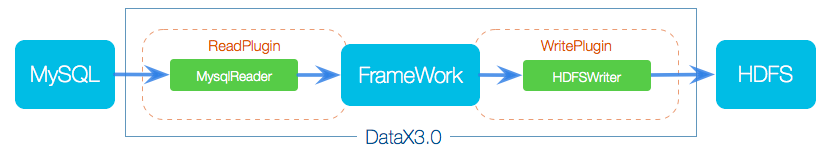
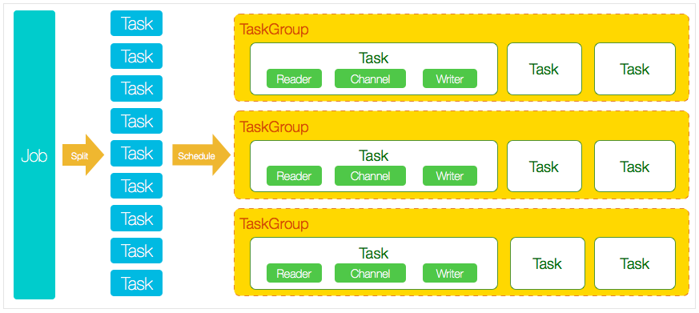

[TOC] 

# Sqoop ETL 工具

> 数据清洗工具，在 RDBMS 和 HDFS 之间导入导出
>
> ETL(Extraction-Tranformation-Loading) 数据提取、转换和加载

可 RDBMS 进行数据清洗  
在Hadoop(Hive)与传统的数据库(mysql、 postgresql等)间进行数据的传递。  

将导入或导出命令转换为 MapReduce 程序来实现。翻译出的 MapReduce 中主要 是对 inputformat 和outputformat 进行定制。  

## 导入

### 筛选导入

### *CDC

CDC: 数据捕获  

#### 侵入式

侵入式: 对源系统产生性能影响  

**基于时间戳的 CDC:**  
无法实时  

基于触发器的 CDC:  
Insert, update, delete 语句，将数据保存到临时表中  ...    
基本不会被采用  

基于快照的 CDC:  

#### 非侵入式

基于日志的 CDC:  
binlog...  

使用阿里 Canal 解析 MySQL binlog 日志。

## 导出

// TODO

## JOB

// TODO

## FAQ

sqoop导入hive数据时可能会报这个错误：  
ERROR Could not register mbeans java.security.AccessControlException: access denied .  
解决方案一：hive-site.xml放入sqoop的conf目录下  
解决方案二：在jdk1.8的/opt/lagou/servers/jdk1.8/jre/lib/security
找到java.policy文件，添加一句
permission javax.management.MBeanTrustPermission "register";
到grant{}里边在执行  

# DataX

> 阿里巴巴集团内被广泛使用的离线数据同步工具/平台。
>
> 包括 MySQL、Oracle、SqlServer、Postgre、HDFS、Hive、ADS、HBase、TableStore(OTS)、MaxCompute(ODPS)、DRDS 等各种异构数据源之间高效的数据同步功能。

支持单机多线程模式完成同步作业运行，Task 为最小的调度单元。

DataX 作业生命周期时序图

# kettle

> 开源ETL工具。支持数据库、FTP、文件、rest接口、hdfs、hive等平台的据进 行抽取、转换、传输等操作，Java编写跨平台，C/S架构，不支持浏览器模式。

