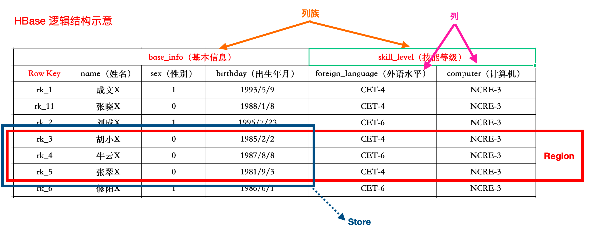
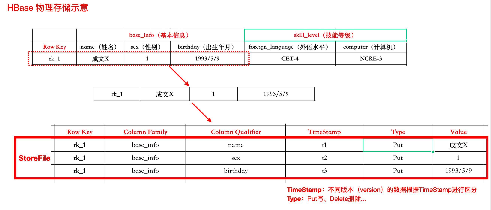
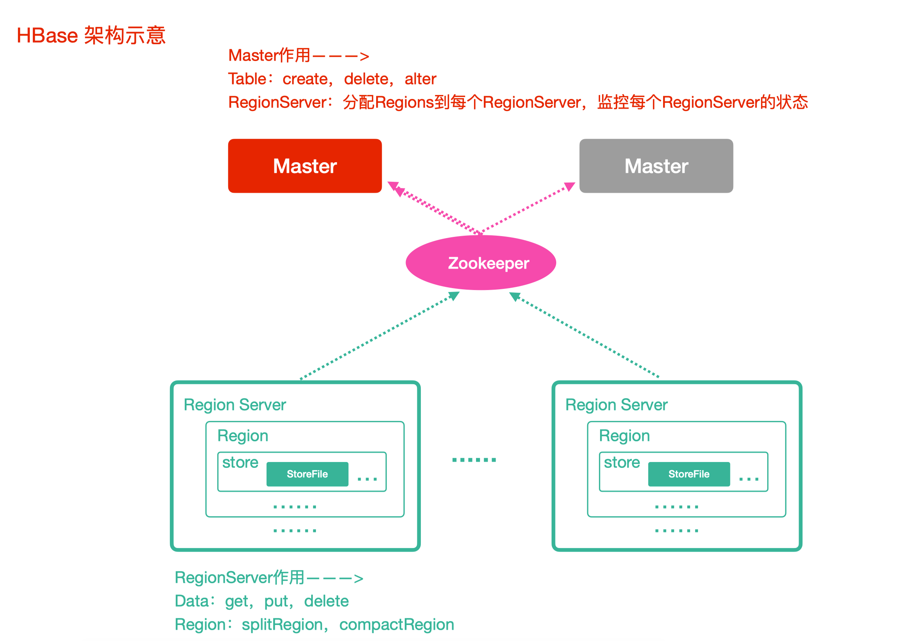
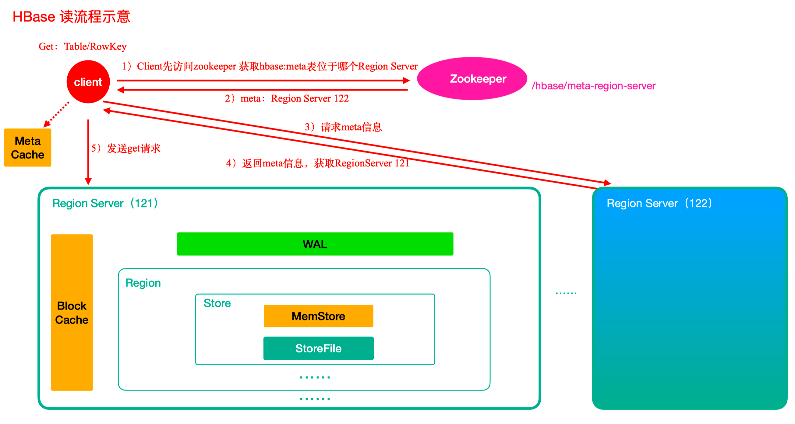
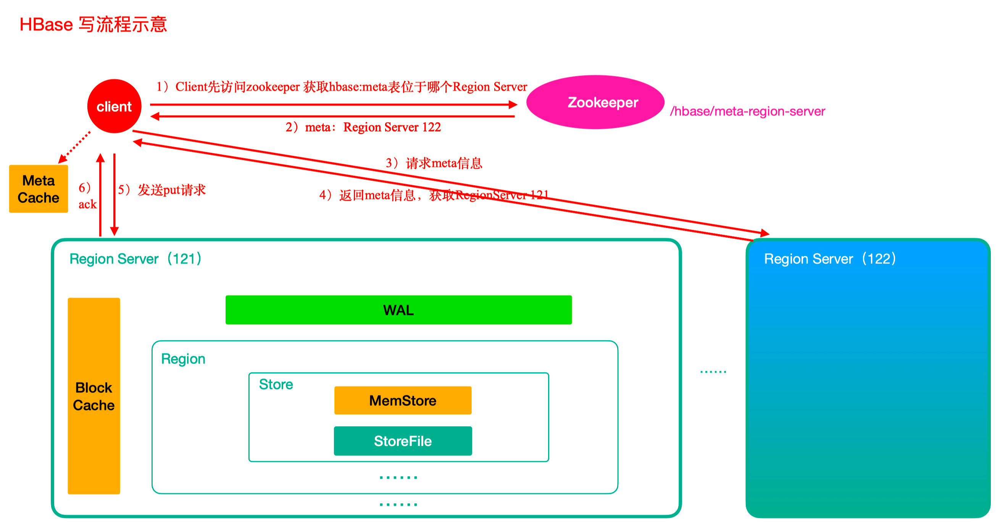
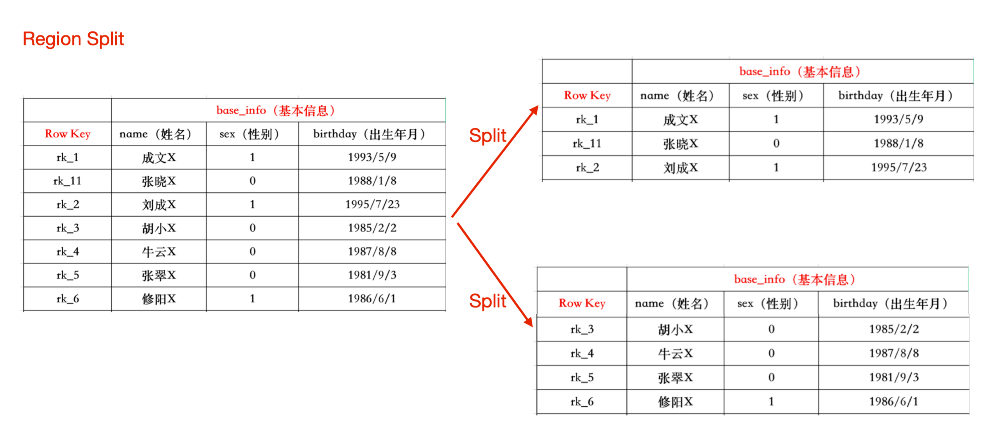

[TOC]

# *Hbase

> **一个高可靠性、高性能、面向列、非关系型、可伸缩的分布式存储系统**。
>
> 基于 Google的BigTable论⽂⽽来。
>
> **<font color="green">提供超大规模数据集的实时随机读写。</font>**


提供超⼤规模数据集的实 时随机读写

**必须借助 RowKey 进行大数据量的存取**


特性：  

数据的多版本：HBase表中的数据可以有多个版本值，默认情况下是根据版本号去区分，版本号就是插⼊数据的时 间戳  

数据类型单⼀：所有的数据在HBase中是以字节数组进⾏存储  

HBase适合海量明细数据的存储，并且后期需要有很好的查询性能（单表超千万、上亿，且并发要求⾼）  

列式存储：根据列族存储，列族在建表的时候必须指定。

易于扩展： 基于上层处理能力(RegionServer) 的扩展，基于存储的扩展(HDFS)。


列缺失的情况下关系型数据库存在存储空间浪费问题。  


特性：

所有数据都是以字节码方式存储

稀疏： 

### 数据模型

**逻辑存储**



列族： 可稀疏存储。建表时指定。写入文件时以列族存储。

Region： 表的若干行组成，不能跨 RegionServer。

Store：


**物理存储**



TimeStamp: 数据的版本。

Type：

RowKey： 每行数据的主键。

Column Family： 列族。

Cell： 每个版本一个 Cell。

Region：表的分区。


### 整体架构  




Client： 访问 Hbase 接口，维护对应的 cache 来加速 Hbase 访问，如 cache 的 .META 元数据信息

Zookeeper： 实现了HMaster的⾼可⽤，可对 RegionServer 监控，元数据的入口(地址信息)和集群配置的维护。


HMaster（Master）： 为HRegionServer分配Region，


HRegionServer（RegionServer）：  处理来自 Client 的读写请求，负责与底层 HDFS 交互，数据存放到 HDFS，处理 Region 变大后的拆分，负责 Storefile 的合并  


Region：多个 Storefile、Memfile 组成。

Hbase 表的分片


Store： HFile 存放在 Store 中，一个 Store 对应 HBase 表的一个列祖。


HFile： 磁盘上保存原属数据的实际物理文件，StoreFile 以 Hfile 的形式存储在 HDFS 中。  


### Shell 操作

**值过滤**

{FILTER=>"valueFilter(=,'binary:wang')"}： =

{FILTER=>"(QualifierFilter(=,'substring:a'))"}： 模糊查询

scan "ll"： 全表信息

```shell
scan 'lagou', {COLUMS=>'base_info'}
# 版本查询，可查标记删除的数据，需要额外配置
scan 'lagou', {COLUMNS=>'base_info', RAW=>true,VERSION=>3}
```

RowKey 的范围查询： 重要。rowkey 底层默认字典序

```shell
scan 'lagou', {COLUMNS=>'base_info',STARTROW='rk1',ENDROW='rk3'}
```

RowKey 的前缀查询

```shell
scan 'lagou', {FILTER=>"PrefixFilter('rk')"}
```


## Hbase 原理

### *读流程



BlockCache： 查询时先到 BlockCache 中找，再到 StoreFiel 中读取。从头 StoreFile 读取后，将数据写入 BlockCache，之后返回结果给 Client。为读缓存。为 RowKey 级别的。

MetaCache： Client 为提高查询速度缓存元数据(ZK中的数据)。

MemStore： 每个 Store 持有一个。

读取数据的过程中 HMaster 未参与。 

HBase 表中的 RowKey 按照字典许排序，切分 Region 按照 RowKey 来划分。


### *写流程



WAL： Write ahead log，与写入日志。 

MemStore： 写缓存。flush 刷盘


HBase 的写入性能比读取性能好。


### Flush 与阻塞

当 MemStore 的大小超过指定值得时候，需要进行 Flush。

默认为 100M。


### *Compact 合并机制

**Minor compact 小合并**： 

多个 HFile(StoreFIle) 合并为一个 HFile。删除和更新知识做标记，为物理删除，触发频率高。


触发机制：

(1) MemStore Flush

(2) 定期检查县城，默认 10s


**Major Compact 大合并**

合并 Store 中<font color="green">所有</font>的额。HFiel 为一个 HFile

会真正移除删除标记的数据。触发频率低。默认 7 天执行。一般手动控制执行，防止业务高峰。


### *Region 拆分机制



**拆分策略**

(1) ConstantSizeRegionSplitPolicy

0.94- 默认切分

(2) IncreasingToUpperBoundRegionSplitPolity

```
regioncount ^3 * 128M * 2
```

(3) SteppingSplitPolity

2.0 默认

对大肌群中对与大表、小白哦比 (2) 更好。

(4) KeyPrefixRegionSpliPolicy

(5) DelimitedKeyPrefixRegionSPlitPolicy

(6) DisabledRegionSplitPolicy

不启用切分。


**指定策略**

(1) 全局指定

(2) 通过 Java API 指定策略

(3) 通过 Hbase SHell 指定策略


### Region 合并

> 仅用于维护的目的。

冷合并： 

不需要启动 HBase 集群。

对 RowKey 进行合并。


热合并：

在线进行合并。


## Hbase 原理
### 刷写与合并机制
...


### 预分区(Region)

Q： 为何

表被创建时候，默认分配一个 Region 给 Table。此时读写都到同一个 RegionServer 的同一个 Region，无法 Balance。

增加 R W xiaol

Bala na ce，防止数组倾斜

方便集群容灾调度 Region


在未自动分区前控制


### *协处理器

> Observer 协处理器，将业务运算代码封装到 Coprocessor 中，并在 RegionServer 上运行，即在数据实际存储位置执行，最后将运算结果返回给 Client。

默认访问 HBase 使用 scan / get 获取数据，对数据进行业务运算，数据量大的情况下，会出现性能问题。


类似数据库中的触发器和存储过程、Hadoop 中的 MapReduce、Spring 中的 AOP。

- Observer Coprocessor 可以在一些事件(Get, Scan) 发生前后执行指定的代码。

- Endpoint Coprocessor 类似粗糙才能过程，在 RegionServer 上直接存储的数据计算。

(1) OBSERVER

与触发器类似

- RegionObserver：⽤户可以⽤这种的处理器处理数据修改事件，它们与表的region联系紧密。 
- MasterObserver：可以被⽤作管理或DDL类型的操作，这些是集群级事件。 
- WALObserver：提供控制WAL的钩⼦函数

Note: HBase 的一种二级索引通过此种方式实现。

(2) Endpoint

类似存储过程，在 RegionServer 中执行代码

常见用途： 聚合操作。普通操作为全表扫描。

Endpoint Coprocessor 借助 phoenix 框架容易实现。针对 HBase 数据集进行聚合运算直接使用 SQL 语句。

初始化表

```
create 't1','info'
create 't2','info'
```


安装处理器

```
hdfs dfs -mkdir -p /processor
hdfs dfs -put processor.jar /processor

describe 't1'
alter 't1',METHOD => 'table_att','Coprocessor'=>'hdfs://linux121:9000/processor/processor.jar|com.janhen.bigdata.hbase.processor.MyProcessor|1001|'
describe 't1'
```

验证处理器

```
put 't1','rk1','info:name','lisi'
```

卸载处理器

```
disable 't1'
alter 't1',METHOD=>'table_att_unset',NAME=>'coprocessor$1'
enable 't2'
```


### *RowKey 设计

字典序排序。

最大长度 64kb。

实际一般为 10 - 100 bytes。


**基本原则**

(1) 长度原则： 

(2) 散列原则： 

(3) 唯一原则： 

实现的HBase 中快速的读写


### 表热点

处理表的热点方案：

(1) 与分区：避免前期读写都在一个 RegionServer

(2) 加盐：在 RowKey 前增加一个随机数。操作起来较为复杂。

(3) 哈希：较为简单。

(4) 反转：牺牲了 RowKey 的有序性。一般用字符串进行反转。


### HBase 的二级索引

借助其他的开源

常见二级索引 Phoenix / solr / es...


### 布隆过滤器

HBase 底层中使用，判断某个元素是否存在。


### 配置

| 配置                                          | 用途                                                         |
| --------------------------------------------- | ------------------------------------------------------------ |
| hbase.hregion.memstore.flush.size             | 134217728 默认，128M，MemStore 大小超过这个值<br>Flush 到磁盘 |
| hbase.regionserver.optionalcacheflushinterval | 当memstore中的数据时间超过1⼩时，会flush到磁盘                |
| hbase.regionserver.global.memstore.size       | HregionServer的全局memstore的⼤⼩，超过该⼤⼩会触发flush到磁盘的操作,默认是堆⼤⼩的40% |

```
调优以下分配管理器参数，以匹配Region的数量，从而加快分配速度：

hbase.assignment.threads.max：线程池大小，默认值30
hbase.master.namespace.init.timeout：默认值300000ms
hbase.master.wait.on.regionservers.mintostart：向HMaster汇报的RegionServer的数量最小启动值，默认值1
hbase.bulk.assignment.threshold.regions：Region数量超过阈值（默认值7），使用bulk assign
hbase.bulk.assignment.threshold.servers ：Server数量超过阈值（默认值3），使用bulk assign
```


HBase Master采用了 RIT 机制并结合Zookeeper 中znode状态来保证操作的安全和一致性。

Region有以下几种状态：

- OFFLINE：region is in an offline state
- PENDING_OPEN：sent rpc to server to open but has not begun
- OPENING：server has begun to open but not yet done
- OPEN：server opened region and updated meta
- PENDING_CLOSE：sent rpc to server to close but has not begun
- CLOSING：server has begun to close but not yet done
- CLOSED：server closed region and updated meta
- SPLITTING：server started split of a region
- SPLIT：server completed split of a region


### 命令操作

```
create 'lagou2', 'base_info', 'extra_info'
put 'lagou2', 'rk1', 'base_info:name', 'wang'
put 'lagou2', 'rk1', 'base_info:age', 30
put 'lagou2', 'rk1', 'extra_info:address', 'shanghai'
```

```
create 'lagou', {NAME => 'base_info', VERSIONS => '3'},{NAME => 'extra_info',VERSIONS => '3'}
```

```
# query data
get 'lagou', 'rk1'
# 查看 rowkey 下某个列族信息
get 'lagou', 'rk1', 'base_info'
# 查看指令列族中 name,age 标识符信息
get 'lagou', 'rk1', 'base_info:name', 'base_info:age'


# 查看 rowkey 下多个列族信息
get 'lagou', 'rk1', {COLUMN => ['base_info', 'extra_info']}
```


## 问题排查

如果一个集群Region非常多，默认300000ms（5分钟）有可能还分配不到namespace表，此时抛出异常：Failed to become active master java.io.IOException: Timedout 300000ms waiting for namespace table to be assigned。此时需要调整参数hbase.master.namespace.init.timeout增加超时时间。