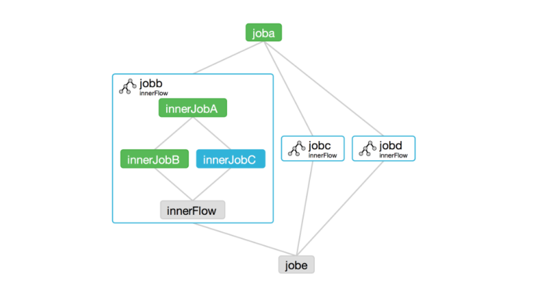

# Azkaban

工作流调度系统    
简单的任务调度：  
直接使⽤linux的crontab； 

复杂的任务调度：  
开发调度平台或使⽤现成的开源调度系统，⽐如Ooize、Azkaban、Airflow等


简单的任务调度

直接使⽤linux的crontab； 复杂的任务调度

开发调度平台或使⽤现成的开源调度系统，⽐如Ooize、Azkaban、Airflow等  


Azkaban使⽤Properties⽂件定义⼯作流   
Oozie使⽤XML⽂件定义⼯作流  


参数传递：  
Azkaban⽀持直接传参，例如${input}   
Oozie⽀持参数和EL表达式，例如${fs:dirSize(myInputDir)}  

由linkedin（领英）公司推出的⼀个批量⼯作流任务调度器  


需求:  

任务经常做，任务有固定的执行过程


### 整体架构  




- mysql服务器: 存储元数据，如项⽬名称、项⽬描述、项⽬权限、任务状态、SLA规则等

- AzkabanWebServer:   对外提供web服务，使⽤户可以通过web⻚页⾯管理。职责包括项⽬管理、权限授 权、任务调度、监控executor。

- AzkabanExecutorServer:负责具体的⼯作流的提交、执⾏。  可有多个并行执行。

azkaban默认需要3G的内存，剩余内存不⾜则会报异常  


AirFlow、Oozie、Azkaban 工作流调度系统。

相对 AirFlow 使用更多。。。


系统内存不足，清楚系统缓存命令，暂时释放一些内存

```shell

```


**执行 HDFS 任务**

通过命令，执行 HDFS 的命令


**执行 MR 任务**

上传jar 到 HDFS中

通过命令，执行 Jar，指定好输出目录


**执行 Hive 脚本任务**

hive -f <file-name> 方式执行


**定时调度**

通过 Web 界面的 Schedule 配置控制。


[记录-安装使用Azkaban遇到的坑](https://blog.csdn.net/sinat_33641737/article/details/78502621)