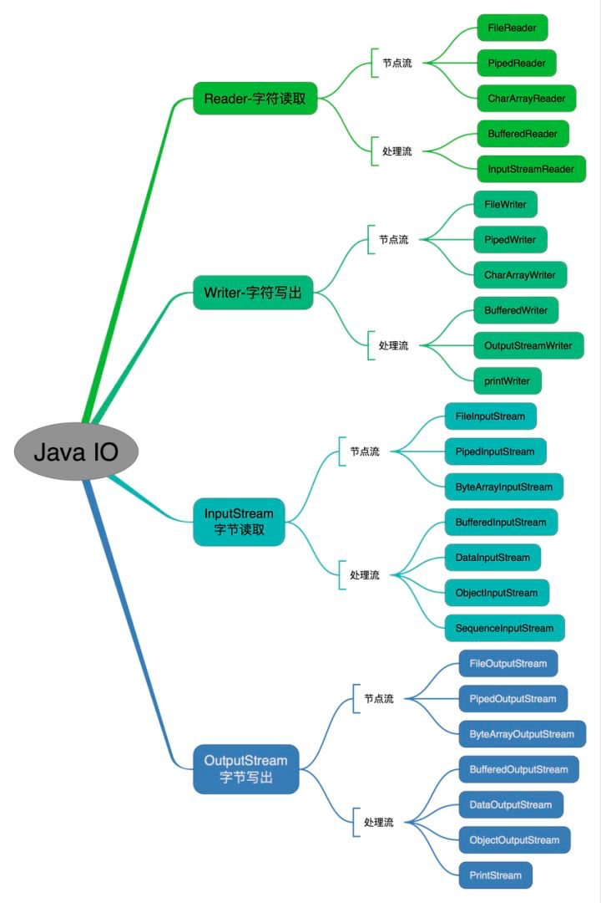
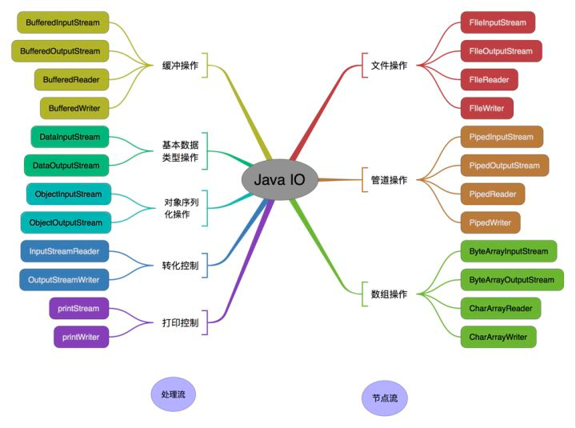

# IO





## IO 模型

### **设计模式**

1.IO中用到的适配器模式

在IO中，如将**字符串数据**转变成**字节数据**保存到文件中，将**字节数据**转变成**流数据**等都用到了适配器模式，下面以InputStreamReader和OutputStreamWriter类为例介绍适配器模式。

 InputStreamReader和OutputStreamWriter类分别继承了Reader和Writer接口，但要创建它们必须在构造函数中传入一个InputStream和OutputStream的实例，InputStreamReader和OutputStreamWriter的作用也就是将InputStream和OutputStream适配到Reader和Writer。

  InputStreamReader实现了Reader接口，并且持有了InputStream的引用，这是通过StreamDecoder类间接持有的，因为byte到char要经过编码。

​       这里，适配器就是InputStreamReader类，而源角色就是InputStream代表的实例对象，目标接口就是Reader类，OutputStreamWriter类也是类似的方式。

​       在IO中类似的还有，如StringReader将一个String类适配到Reader接口，ByteArrayInputStream适配器将byte数组适配到InputStream流处理接口。

2.IO中用到的装饰模式

​        装饰模式就是对一个类进行装饰，增强其方法行为，在装饰模式中，作为原来的这个类使用者还不应该感受到装饰前与装饰后有什么不同，否则就破坏了原有类的结构了，所以装饰器模式要做到对被装饰类的使用者透明，这是对装饰器模式的一个要求。**总之装饰器设计模式就是对于原有功能的扩展**

在IO中有许多不同的功能组合情况，这些不同的功能组合都是使用装饰器模式实现的，下面以FilterInputStream为例介绍装饰器模式的使用。

InputStream类就是以抽象组件存在的，而FileInputStream就是具体组件，它实现了抽象组件的所有接口，FilterInputStream类就是装饰角色，它实现了InputStream类的所有接口，并持有InputStream的对象实例的引用，BufferedInputStream是具体的装饰器实现者，这个装饰器类的作用就是使得InputStream读取的数据保存在内存中，而提高读取的性能。类似的还有LineNumberInputStream类，它的作用是提高按行读取数据的功能。

**总结**

​    这两种设计模式看起来都是起到包装一个类或对象的作用，但是使用它 们的目的却不尽相同。适配器模式主要在于将一个接口转变成另一个接口，**它的目的是通过改变接口来达到重复使用的目的**；而装饰器模式不是要改变被装饰对象的接口，而是保持原有的接口，**但是增强原有对象的功能，或改变原有对象的方法而提高性能**。


### **NIO**

三大核心，通道、缓冲、选择器

特性：

- NIO 是基于块（Block）的，它以块为基本单位处理数据
- 为所有的原始类型提（Buffer）缓存支持
- 增加通道（Channel）对象，作为新的原始I/O抽象
- 支持锁和内存映射文件的文件访问接囗
- 提供了基于 selector 的异步网络I/O

『文件锁』：使用文件系统来实现锁
.log,

『内存映射文件』：相较于在磁盘上块


Buffer & Channel

Buffer 基本使用：


状态变量 ：

『limit』: buf 的实际上限
『capacity』: buf 总上限
『position』:当前 buf 的位置
『marked』：
『flip』: buffer 从 写模式 ==>> 读模式， 重置当前的 position 为 0， 将 limit 设置当前 position 位置.

File 只有 5byte, capacity 为 10byte, 5byte 为实际上限。 实际上限配合读写时的 flip() 

对应 API:

- S allocate(size)
- position()
- limit()
- capacity()

- int remaining() ：return limit - position;
- Buffer clear():
- Buffer flip():

```
// buffer + channel的文件复制
public void copyFileByNio(String srcFile, String destFile) {
    try (FileInputStream in = new FileInputStream(srcFile);
         FileOutputStream out = new FileOutputStream(destFile, true);
         FileChannel rchannel = in.getChannel();
         FileChannel wchannel = out.getChannel()) {

        ByteBuffer buf = ByteBuffer.allocate(1024);

       /* while (true) {
            buf.clear();
            int len = rchannel.read(buf);
            if (len == -1)
                break;

            buf.flip();
            wchannel.write(buf);
        }*/

        int len = 0;
        while ((len = rchannel.read(buf)) > 0) {
            buf.flip();
            wchannel.write(buf);
            buf.clear();
        }
    } catch (Exception e) {
        e.printStackTrace();
    }
}
```


**文件映射到内存**

Channel : 接口

- isOpen()
- close :

FileChannel : abstract class

- read(ByteBuffer)
- write(ByteBuffer<,position>)
- MappedByteBuffer map(MapMode,long position, long size) ：内存映射
- FileLock tryLock|lock : 文件锁

RandomFile :

- RandomFile(name, mode):
- FileChannel getChannel() :
- native long length(): 返回文件长度
- seek(long pos)
- close():

MappedByteBuffer : ByteBuffer 的子类

- get()
- put()

```
public void funB() {
    try (RandomAccessFile rfile = new RandomAccessFile("D:\\ProductManageController.java", "rw")) {
        FileChannel fchannel = rfile.getChannel();

        MappedByteBuffer  mapBuf = fchannel.map(FileChannel.MapMode.READ_WRITE, 0, rfile.length());

        while (mapBuf.hasRemaining()) {
            System.out.print( (char) mapBuf.get() );
        }
        // modify the file
        mapBuf.putChar(0, 'a');

    } catch (Exception e) {
        e.printStackTrace();
    }
}
```


**Channel**

通道 Channel 是对原 I/O 包中的流的模拟，可以通过它读取和写入数据。

通道与流的不同之处在于，流只能在一个方向上移动)，而通道是双向的，可以用于读、写或者同时用于读写。

通道包括以下类型：

-   SocketChannel：通过 TCP 读写网络中数据；
-   ServerSocketChannel：可以监听新进来的 TCP 连接，对每一个新进来的连接都会创建一个 SocketChannel。
-   FileChannel：从文件中读写数据；
-   DatagramChannel：通过 UDP 读写网络中数据；


常用 Channel 的获得：

- 通过文件流获得 FileChannel
- 通过 ServerSocketChannel 静态打开获得
- 通过已经进行 selector 绑定的 SelectionKey 进行获得并转换


对应的 API:
文件的通道：

- FileChannel.getChannel(): 根据流获得
- RandomAccessFile.getChannel() ： 获得 FileChannel
- S ServerSocketChannel.open:  ServerSocketChannel 的获得
- SelectionKey.channel(): 返回 SelectableChannel, 转换成 SocketChannel | ServerSocketChannel


**通过 channel 获得数据**

通过 limit 定位到实际的大小，将 byte 转换成 char 最终变换成 String 进行接收返回。

```
// general option to get data from channel by using byteBuffer limit and char
private static String readDataFromSocketChannel(SocketChannel sChannel) throws IOException {
    // user ByteBuffer read SocketChannel
    ByteBuffer buf = ByteBuffer.allocate(1024);
    StringBuilder sb = new StringBuilder();

    while (true) {
        buf.clear();
        int len = sChannel.read(buf);
        if (len == -1)
            break;
        buf.flip();

        // via limit and char   ==>> string 
        int limit = buf.limit();
        char[] dst = new char[limit];
        for (int i = 0; i < limit; i++) {
            dst[i] = (char) buf.get(i);
        }
        sb.append(dst);
        buf.clear();
    }
    return sb.toString();
}
```


**Selector**

传统 IO ：

- 为每一个 client 使用一个 thread, client 出现 delay 异常，线程被占用;
- 线程池减少线程创建和回收的成本；
- 大并发，消耗大量的系统 resource
- 无法设置客户端的服务优先级
- 访问竞争资源，需要进行不同客户端（线程）的同步；

NIO 的特性 ：

- 非阻塞的 NIO
- data 准备好了在工作
- 轮询每个 channel 的状态


几个概念：
『Channel』 : 类似于流，一个 channel 可以和文件 or 网络 Socket 对应，双向
『Selector』: 用于复用的，进行监听绑定到对应的 selectionkey
『SelectionKey』: 表示一对 Selector 和 Channel 的关系. 且从 SelectionKey 中可以得到 Channel, 并读取数据.


本质 ：

- 一个线程轮询了多个 Socket, 线程复用；
- 每个 Channel 对应一个 Socket 即一个 client;
- 一个线程监控多个client;


『位域』： 能够组成事件集整数
int interestSet = SelectionKey.OP_READ | SelectionKey.OP_WRITE

```
public static final int OP_READ = 1 << 0;
public static final int OP_WRITE = 1 << 2;
```

常用 API: 
SelectionKey :

- channel(): 返回
- attach(Object): 存放 "附件"
- attachment(): 取出 “附件”
- interestOps(..|..): 感兴趣的事件


Selector : 

- S open() | isOpen(): 获取选择器
- select() | selectNow(): 监听事件, 没有数据准备好，阻塞; 不阻塞，返回
- selectedKeys() | keys(): 获取到达的事件, 返回 SelectionKey 的 set
- wakeup():
- close(

ServerSocketChannel :

- configureBlocking(false): 非阻塞
- register(selector,SelectionKey.OP_ACCEPT)

SocketChannel :

- configureBlocking(false): 非阻塞
- register(selector,SelectionKey.OP_XX)


总结：

- NIO 将数据准备好后，再交由应用进行处理，数据的读取过程依然在应用线程中完成
- 节省数据准备时间（因为Sector可以复用）
- 即将等待的时间剥离到一个单独的线程中

与实现的异步队列相似，检测到关注的事件，之后进行处理。

```java
public class NIOClient {
    public static void main(String[] args) throws IOException {
        Socket socket = new Socket("127.0.0.1", 8888);
        OutputStream out = socket.getOutputStream();

        String msg = "hello world";
        out.write(msg.getBytes());

        out.close();
    } 
}

public class NIOServer {
    public static void main(String[] args) throws IOException {
        // open selector
        Selector selector = Selector.open();

        ServerSocketChannel ssChannel = ServerSocketChannel.open();
        ssChannel.configureBlocking(false);
        // make channel map to selector
        ssChannel.register(selector, SelectionKey.OP_ACCEPT);

        ServerSocket serverSocket = ssChannel.socket();
        InetSocketAddress address = new InetSocketAddress("127.0.0.1", 8888);
        serverSocket.bind(address);

        while (true) {
            // wait the data compared
            selector.select();

            // get all compared data SelectionKey  :  one selector manager many ServerSocketChannel or SocketChannel
            Set<SelectionKey> keys = selector.selectedKeys();

            Iterator<SelectionKey> keyIterator = keys.iterator();
            while (keyIterator.hasNext()) {
                SelectionKey key = keyIterator.next();

                if (key.isAcceptable()) {
                    // selectionKey have channel and selector bind
                    ServerSocketChannel ssChannel1 = (ServerSocketChannel) key.channel();

                    SocketChannel sChannel = ssChannel1.accept();
                    sChannel.configureBlocking(false);

                    sChannel.register(selector, SelectionKey.OP_READ);
                } else if (key.isReadable()) {
                    SocketChannel sChannel = (SocketChannel) key.channel();
                    System.out.println(readDataFromSocketChannel(sChannel));
                    sChannel.close();
                }
                keyIterator.remove();
            }
        }
    }

    // general option to get data from channel by using byteBuffer limit and char
    private static String readDataFromSocketChannel(SocketChannel sChannel) throws IOException {
        // user ByteBuffer read SocketChannel
        ByteBuffer buf = ByteBuffer.allocate(1024);
        StringBuilder sb = new StringBuilder();

        while (true) {
            buf.clear();
            int len = sChannel.read(buf);
            if (len == -1)
                break;
            buf.flip();

            // via limit and char   ==>> string 
            int limit = buf.limit();
            char[] dst = new char[limit];
            for (int i = 0; i < limit; i++) {
                dst[i] = (char) buf.get(i);
            }
            sb.append(dst);
            buf.clear();
        }
        return sb.toString();
    }
}
```


### **AIO**

异步的，适用于大量连接且是长连接的情况。

- 读完了再通知我
- 不会加快 IO，只是在读完后进行通知
- 使用回调函数，进行业务处理

AsynchronousServerSocketChannel

- void read(ByteBuffer,long,TimeUnit,A,CompletionHandler<>): 读完之后进一步处理
- Future<> read(ByteBuffer) : 
- read(ByteBuffer[],...): 网络协议报文固定长度的截取
- write

```
server = AsynchronousServerSocketChannel.open().bind(new InetSocketAddress(PORT));

// server accept
<A> void accept(A attachment, CompletionHandler<AsynchronousSocketChannel, ? super A) handler;
```


```
server.accept(null, new CompletionHander<.,..>() {
Future<> writeRes;
try {

} finally {
    server.accept(null, this);
    ...
}
})
```


### 网络

**URL :**

- URL(String spec)
- InputSteam openStream(): 用于读取返回信息
- URLConnection openConnection(): 获取连接, HttpConnection


URLConnection() ：

- getInputStream()
- getOutputStream
- getContentType()|ContentEncoding|Content: 一些返回信息

HttpURLConnection :继承自URLConnection

- getResponseCode() ：根据返回的状态码进行对应的执行
- disconnect() :断开连接
- getMessage|Method: 与 Http 相对应的字段


URLEncoder ：仅仅是一个工具类，提供编码方案

- encoder(charseq,charsetName)

CharSet ：提供工厂方法供外部调用

- forName(charsetName):

```
URL url = new URL(JSON_URL + URLEncoder.encode(q, "UTF-8"));
conn = (HttpURLConnection) url.openConnection();
```

```
String getJsonBySearch(String q) {
    HttpURLConnection con = null;
    // use sb to receive inputstream data
    StringBuilder sb = new StringBuilder(4096);
    try {
        URL url = new URL(JSON_URL + URLEncoder.encode(q, "utf-8" ));
        con =(HttpURLConnection) url.openConnection();
        if (200 == con.getResponseCode()) {
            // normal
            try (BufferedReader reader = new BufferedReader(
                    new InputStreamReader(con.getInputStream(), "utf-8"))) {
                int len = 0;
                char[] cbuf = new char[1024];
                while ((len = reader.read(cbuf)) != -1) {
                    sb.append(cbuf, 0, len);
                }
            }
            return sb.toString();
        }
        throw new RuntimeException("Bad response code : " + con.getResponseCode());
    } catch (Exception e) {
        throw new RuntimeException(e);
    } finally {
        if (con != null) {
            con.disconnect();
        }
    }
}
```

```
public static void main(String[] args) throws IOException {

    URL url = new URL("http://www.baidu.com");

    /* 字节流 */
    InputStream is = url.openStream();

    /* 字符流 */
    InputStreamReader isr = new InputStreamReader(is, "utf-8");

    /* 提供缓存功能 */
    BufferedReader br = new BufferedReader(isr);

    String line;
    while ((line = br.readLine()) != null) {
        System.out.println(line);
    }

    br.close();
}
```


**InetAddress :**

InetAddress:

- S getByName(host)
- S getByAddress(byte[] address)

InetSocketAddress: 用于 Socket connect 时接收的参数

- InetSocketAddress(int port)
- InetSocketAddress(String hostname, int port): 


**Socket :**

Socket :

- Socket(host, port) :
- getInputStream() | getOutputStream()：
- SocketChannel getChannel()： NIO 操作方法
- connect(SocketAddress): 一般接收 InetSocketAddress


**Datagram :** 

UDP 通信是面向报文的

DatagramSocket: 通信类
DatagramPacket: 数据包类


 

### 文件

**File**

API ：

1. Constructor
   File(String parent, String name) ：用于 path 文件夹配合创建；
   File(String name) ：
2. CD 和 判断

```
public void testCD() throws IOException {
    String pathName = "D:\\视频\\测试文件夹\\";
    String filename = "hello.java";
 
    File dir = new File(pathName);
    if (!dir.exists()) {
        dir.setWritable(true);
        dir.mkdirs();
    }
 
    File file = new File(pathName, filename);
    file.createNewFile();
    boolean isSuccess = file.createNewFile();
    boolean isExist = file.exists();
 
    boolean isFile = file.isFile();
    boolean isDir = dir.isDirectory();
 
    System.out.printf("create file isSuccess : %b,%n file is Exist : %b,%n, is file : %b, %n is directory : %b", isSuccess, isExist, isFile, isDir);
}
```

listFiles

```
public void testListFile() {
    String pathName = "D:\\视频\\office教程\\";
    File dir = new File(pathName);
 
    // file and directory
    String[] names = dir.list();
    File[] files = dir.listFiles();
 
    for (String name : names) {
        System.out.println(name);
    }
    System.out.println("-------");
    for (File file : files) {
        System.out.println(file.getName());
    }
}
```

**FileFilter**

过滤器工作原理：
listFiles()获得文件名的全路径给FileFilter接口accept()方法，在accept()方法内部实现判断，将想要返回的给设置true。

```
public void testFileFilter() {
    String path = "D:\\视频\\office教程\\";
    File file = new File(path);
     // the file is java type
    File[] files1 = file.listFiles((FilenameFilter) (dir, name) -> {
        return name.toLowerCase().endsWith(".java");
    });
    File[] files2 = file.listFiles((pathname) -> {
        return pathname.isDirectory();
    });
    
   for (File f : files1) {
        System.out.println(f.getName());
    }
    System.out.println("-----");
    for (File f : files2) {
        System.out.println(f.getName());
    }
}
```

**实例**

```
public void testFileRecursively() {
    String path = "D:\\视频\\office教程\\";
    File file = new File(path);
    List<File> fileList = new ArrayList<>();
 
    getFileAll(fileList, file);
 
    for (File f : fileList) {
        System.out.println(f.getName());
    }
}
 
public void getFileAll(List<File> fileList, File file) {
    // File[] files = file.listFiles((dir, name) -> name.endsWith(".java"));
    File[] files = file.listFiles();
 
    for (File f : files) {
        if (f.isDirectory()) {
            getFileAll(fileList, f);
        } else {
            if (f.getName().endsWith(".java"))
                fileList.add(f);
        }
    }
}
```

 

**MultipartFile**

org.springframework.web.multipart.MultipartFile

API :

- getName() ：
- getOriginalFilename() ：获取进行扩展名的提取
- transferTo(File dest) ：用于与一般 File 的传输使用

```
String path = request.getServletContext().getRealPath("upload");
 
 
 
String fileName = file.getOriginalFilename();
String fileExtensionName = fileName.subString(fileName.lastIndexOf(".") + 1);
String uploadFileName = UUID.randomUUID().toString() + "." + fileExtensionName;
 
File fileDir = new File(path)
if (!fileDir.exists()) {
    fileDir.setWritable(true);
    fileDir.mkdirs();
}
File targetFile = new File(path, uploadFileName);
 
file.transferTo(targetFile);
 
// upload ftp server
 
targetFile.delete();
```


**RandomAccessFile**

API :

*   RandomFile(name, mode): 根据指定格式连接
*   FileChannel getChannel() : 与 channel 的连接
*   native long length(): 返回文件长度
*   seek(long pos)
*   close():


通过提供的 I/O 工具类 ObjectInputStream 来实现，对象保存到文件上。

引入 ：
对象内部状态是需要被持久化的，将运行中的对象状态保存下来(最直接的方式就是保存到文件系统中)，在需要的时候可以还原，即使是在Java虚拟机退出的情况下。

注：

[1].只保存对象的非静态成员变量，不能保存任何的成员方法,静态的成员变量和transient标注的成员变量。
[2].如果一个对象的成员变量是一个对象，那么这个对象的数据成员也会被保存还原，而且会是递归的方式。
[3].如果一个可序列化的对象包含对某个不可序列化的对象的引用，那么整个序列化操作将会失败，并且会抛出一个NotSerializableException。可以将这个引用标记transient,那么对象仍然可以序列化


基本

- 会级联序列化
- 静态属性不会被序列化

『序列化 ID』：与当前对象实现的接口，属性，继承的类相关，为了以后的兼容性，一般直接指定好一个 serialId;


抛出的异常：
**1. NotSerializableException**
否则会发生异常NotSerializableException异常。

**2. InvalidClassException**
进行反序列化也会发生异常InvalidClassException

发生这个异常的原因如下：

-  该类的序列版本号与从流中读取的类描述符的`版本号  不匹配`[J43]
-  该类包含未知数据类型
-  该类没有可访问的 `无参数构造方法`

个序列版本号。serialVersionUID. 该版本号的目的在于验证序列化的对象和对应类是否版本匹配。

transient

瞬态
当一个类的对象需要被序列化时，某些属性不需要被序列化，只要被transient修饰了，序列化时这个属性就不会琲序列化了。
同时静态修饰也不会被序列化，因为序列化是把对象数据进行持久化存储，而静态的属于类加载时的数据，不会被序列化。

**使用实例 ：**
ArrayList 中存储数据的数组 elementData 是用 transient 修饰的，因为这个数组是动态扩展的，并不是所有的空间都被使用，因此就不需要所有的内容都被序列化。通过重写序列化和反序列化方法，使得可以只序列化数组中有内容的那部分数据。

```source-java
private transient Object[] elementData;
```


自定义序列化

// todo
  writeObject() 和 readObject() 来_控制只序列化数组中有元素填充那部分内容

实例

API ：
ObjectOutputStream ：

- ObjectOutputStream(OutputStream out)  创建一个写入指定的OutputStream的ObjectOutputStream。
- writeObject(obj)


DataOutput ：接口

- writeChars(String)
- writeBytes()
- writeInt(int)


ObjectOutput ：接口

- writeObject(Object)

```java
public void testWriteObject() {
    String filePath = "D://obj.txt";
 
    Course c1 = new Course("C language", 52);
    Course c2 = new Course("OS", 52);
    Student s1 = new Student("king", 22);
    Student s2 = new Student("jason", 22);
    s2.setCourse(c2);
    s1.setCourse(c1);
 
    try (ObjectOutputStream objOut = new ObjectOutputStream(new FileOutputStream(filePath))){
        objOut.writeObject(s1);
        objOut.writeObject(s2);
        objOut.writeInt(222);
    } catch (Exception e) {
        e.printStackTrace();
    }
    System.out.println("info : obj have write : " + filePath);
}
 
@Test
public void testReadObject() {
    String filePath = "D://obj.txt";
 
    try (ObjectInputStream objIn = new ObjectInputStream(new FileInputStream(filePath))) {
        Student s1 = (Student)objIn.readObject();
        Student s2 = (Student) objIn.readObject();
        int i = objIn.readInt();
 
        System.out.println("Info:文件"+filePath+"中读取对象");
        System.out.println(s1);
        System.out.println(s1.getCourse());
        System.out.println(s2);
        System.out.println(s2.getCourse());
        System.out.println(i);
    } catch (Exception e) {
        e.printStackTrace();
    }
}
 
Info:文件D://obj.txt中读取对象
Student Object name:king age:0
Course Object courseName:null credit:52
Student Object name:jason age:0
Course Object courseName:null credit:52
222
```

 

```java
class Student implements Serializable {
    private static final long serialVersionUID = -5255L;
 
    private String name;
    // transient key word would not serialize
    private transient int age;
    private Course course;
    public void setCourse(Course course){
        this.course = course;
    }
    public Course getCourse(){
        return course;
    }
    public Student(String name, int age){
        this.name = name;
        this.age = age;
    }
    public String  toString(){
        return "Student Object name:"+this.name+" age:"+this.age;
    }
}
 
class Course implements Serializable{
    private static final long serialVersionUID = -344L;
 
    // static attribute not serialize
    private static String courseName;
    private int credit;
    public Course(String courseName, int credit){
        this.courseName  = courseName;
        this.credit = credit;
    }
    public String toString(){
        return "Course Object courseName:"+courseName
                +" credit:"+credit;
    }
}
```

用

FileInputStream

API :

- FileInputStream(fileName)
- read(byte[])

 

FileOutputStream

API :

- FileOutputStream(fileName, append) ：
- write(byte[])
- flush()
- close()
  FileOutputStream 用于写入诸如图像数据之类的原始字节的流

```java
public void testFileOutputStream() {
    String fileName = "D:\\test.txt";
    File file = new File(fileName);
 
    try (FileOutputStream out = new FileOutputStream(fileName, true)) {
        String msg = "这是测试outputStream,  this is test .";
 
        out.write(msg.getBytes());
    } catch (Exception e) {
        e.printStackTrace();
    }
}
 
public void testFileInputStream() {
    String fileName = "D:\\test.txt";
 
    try (FileInputStream in = new FileInputStream(fileName)) {
        int len = 0;
        byte[] buf = new byte[1024];
 
        while ((len = in.read(buf)) > 0) {
            System.out.println(new String(buf, 0, len));
        }
    } catch (Exception e) {
        e.printStackTrace();
    }
}
 
public void testCopyFile() {
    String srcFileName = "D:\\18554.jpg";
    String destFileName = "E:\\18554.jpg";
 
    try (FileInputStream in = new FileInputStream(srcFileName);
        FileOutputStream out = new FileOutputStream(destFileName, true)) {
 
        int len = 0;
        byte[] buf = new byte[1024];
 
        while ((len = in.read(buf)) != -1) {
            out.write(buf, 0, len);
        }
    } catch (Exception e) {
        e.printStackTrace();
    }
}
```

FileReader

API ：

- FileReader(filename) ：
- read(cbuf,off,len)

 

FileWriter

要写入字符流，请考虑使用 FileWriter。

API ：

- flush() ： **
- write(String,off,len)
- write(cbuf,off,len)


```java
public void testReader() {
 
    String fileName = "D://writer.txt";
 
    try (FileReader reader = new FileReader(fileName)) {
 
        int len = 0;
        char[] cbuf = new char[1024];
        while ((len = reader.read(cbuf)) != -1) {
            System.out.println(new String(cbuf, 0, len));
        }
    } catch (Exception e) {
        e.printStackTrace();
    }
}
 
public void testWriter() {
    String fileName = "D://writer.txt";
 
    try (FileWriter writer = new FileWriter(fileName, true)) {
 
        writer.write("是开发健康是福市解放路扣水电费", 2, 9);
        // important
        writer.flush();
        writer.write("酸辣粉就开始的");
        writer.write("降低衰落附加赛可");
        writer.flush();
    } catch (IOException e) {
        e.printStackTrace();
    }
}
 
public void testCopyFile() {
    String srcFile = "D://writer.txt";
    String destFile = "E://copywriter.txt";
 
    try (FileReader reader = new FileReader(srcFile);
        FileWriter writer = new FileWriter(destFile, true)) {
 
        int len = 0;
        char[] cbuf = new char[1024];
        while ((len = reader.read(cbuf)) != -1) {
            writer.write(cbuf, 0, len);
        }
    } catch (Exception e) {
        e.printStackTrace();
    }
}
```

总结

```
IO流的分类
|- 字节流
    |- 字节输入流 InputStream 抽象类
        |-  FileInputStream 操作文件的字节输入流
|- 字节输出流 OuputStream抽象类
    |- FileOutputStream 操作文件的字节输出流
|- 字符流
    |- 字符输入流 Reader抽象类
        |- InputStreamReader 输入操作的转换流
            |- FileReader 用来操作文件的字符输入流（简便的流）
    |- 字符输出流 Writer抽象类
        |- OutputStreamWriter 输出操作的转换流
            |- FileWriter 用来操作文件的字符输出流（简便的流）
```

 

BufferedInputStream & BufferedOutputStream

花费了 392 ms花费了 3923 ms

```
public void copyFile(File srcFile, File destFile) {
 
    try (InputStream in = new FileInputStream(srcFile);
        BufferedInputStream bin = new BufferedInputStream(in);
        OutputStream out = new FileOutputStream(destFile, true);
        BufferedOutputStream bout = new BufferedOutputStream(out)) {
 
        int len = 0;
        while ((len = bin.read()) != -1) {
            bout.write(len);
        }
    } catch (Exception e) {
        e.printStackTrace();
    }
}
 
public void testCopyFile() {
    String fileName = "老友记01-04.mp4";
    File srcFile = new File("D:\\视频\\老友记\\老友记第1季[原画版]\\合并\\0004-老友记第1季第4集.mp4");
    File destFile = new File("E:\\测试\\", fileName);
 
    long start = System.currentTimeMillis();
    copyFileBuffer(srcFile, destFile);
    long end = System.currentTimeMillis();
    System.out.printf("花费了 %d ms", (end - start));
}
```

---

```
public void testCopyFileBuffer() {
    String fileName = "老友记01-05.mp4";
    File srcFile = new File("D:\\视频\\老友记\\老友记第1季[原画版]\\合并\\0005-老友记第1季第5集.mp4");
    File destFile = new File("E:\\测试\\", fileName);
 
    long start = System.currentTimeMillis();
    copyFileBuffer(srcFile, destFile);
    long end = System.currentTimeMillis();
    System.out.printf("花费了 %d ms", (end - start));
}
public void copyFileBuffer(File srcFile, File destFile) {
 
    try (InputStream in = new FileInputStream(srcFile);
        BufferedInputStream bin = new BufferedInputStream(in);
        OutputStream out = new FileOutputStream(destFile, true);
        BufferedOutputStream bout = new BufferedOutputStream(out)) {
 
        int len = 0;
        byte[] buf = new byte[1024];
        while ((len = bin.read(buf)) != -1) {
            bout.write(buf, 0, len);
        }
    } catch (Exception e) {
        e.printStackTrace();
    }
}
```

BufferedReader & BufferedWriter

提供特殊的 `行读取`，可借助其计算总行数，亦可以进行一定格式化进行数据封装。

API ：
BufferedReader ：

- readLine()

BufferedWriter ：

- write(String)
- newLine() ： 自动 flush ，无需手动处理

文件 copy

```
@Test
public void testCopyFile() {
    String fileName = "文本.java";
    File srcFile = new File("D:\\Java\\Java秒杀\\project\\s2gciy\\miaosha_7\\src\\main\\java\\com\\imooc\\miaosha\\redis\\MiaoshaKey.java");
    File destFile = new File("E:\\测试", fileName);
 
    copyFile(srcFile, destFile);
}
 
public void copyFile(File srcFile, File destFile) {
    int rowCount = 0;
 
    try (Reader reader = new FileReader(srcFile);
        BufferedReader breader = new BufferedReader(reader);
        Writer writer = new FileWriter(destFile, true);
        BufferedWriter bwriter = new BufferedWriter(writer)) {
 
        /*int len = 0;
        char[] cbuf = new char[1024];
        while ((len = breader.read(cbuf)) != -1) {
            bwriter.write(cbuf, 0, len);
        }*/
 
        String line = "";
        while ((line = breader.readLine()) != null) {
            bwriter.write(line);
            bwriter.newLine();
            rowCount++;
        }
 
        System.out.printf("文件共 %d 行.", rowCount);
    } catch (Exception e) {
        e.printStackTrace();
    }
}
```

在网络传输中的使用 ：

- 配合 StringBuilder
- 搭配 InputStreamReader 进行指定的解码返回

```
try (BufferedReader reader = new BufferedReader(
     new InputStreamReader(conn.getInputStream(), "UTF-8"))) {
    char[] buffer = new char[1024];
    for (;;) {
     int n = reader.read(buffer);
     if (n == (-1)) {
      break;
     }
     sb.append(buffer, 0, n);
    }
   }
```

一种线程之间相互通信的方式


应用 ：主要用于不同线程间的通信 

一个PipedInputStream实例对象必须和一个PipedOutputStream实例对象进行连接而产生一个通信管道。PipedOutputStream向管道中写入数据，PipedIntputStream读取PipedOutputStream向管道中写入的数据。一个线程的PipedInputStream对象能够从另外一个线程的PipedOutputStream对象中读取数据。

API :
PipeOutputStream

- sink : PipeInputStream 属性
- PipeOutputStream(PipeInputStream) ：初始连接
- connect(PipeInputStream) ：主要方法

```
@Test
public void testPipe() {
    Sender   send = new Sender();
    Receiver read = new Receiver();
 
    PipedOutputStream out = send.getOut();
    PipedInputStream in = read.getIn();
 
    out.connect(in);
    new Thread(send).start();
    new Thread(read).start();
}
```

```
 
class Sender implements Runnable {
    PipedOutputStream out = new PipedOutputStream();
 
    public PipedOutputStream getOut() {
        return out;
    }
 
    @Override
    public void run() {
        String msg = "hello world, receiver.";
        try {
            out.write(msg.getBytes());
            out.close();
        } catch (IOException e) {
            e.printStackTrace();
        }
    }
}
 
class Receiver implements Runnable {
    PipedInputStream in = new PipedInputStream();
 
    public PipedInputStream getIn() {
        return in;
    }
 
    @Override
    public void run() {
        byte[] buffer = new byte[1024];
        int len = 0;
        try {
            while ((len = in.read(buffer)) > 0) {
                System.out.println("receive from sender : " + new String(buffer, 0, len));
            }
        } catch (IOException e) {
            e.printStackTrace();
        }
    }
}
```


 


何时使用转换流？

- 当字节和字符之间有转换动作时；
- 流操作的数据需要编码或解码时。

OutputStreamWriter

字符流通向字节流的桥梁 :实现 字符向字节的转换     ====>>>>   编码

可使用指定的字符编码表，将要写入流中的字符编码成字节。它的作用的就是，将字符串按照指定的编码表转成字节，在使用字节流将这些字节写出去。

- OutputStreamWriter

 

InputStreamReader

字节流通向字符流的桥梁： 实现 byte 向 字符的转换   ====>>>    解码


它使用的字符集可以由名称指定或显式给定，或者可以接受平台默认的字符集。

API ：

- InputStreamReader(InputStream,charsetName) ：
- getEncoding() //返回此流使用的字符编码的名称。

```
public void testOutputStreamWriter() {
 
    String fileName = "D:outputStreamWriter.txt";
 
    try (OutputStream out = new FileOutputStream(fileName, true);
         OutputStreamWriter osw = new OutputStreamWriter(out, "utf-8")) {
 
        osw.write("四六级快递费绝对是世纪东方开始");
        osw.flush();
        osw.write("sjfsksfs胜多负少的".toCharArray(), 0, 6);
    } catch (Exception e) {
        e.printStackTrace();
    }
}
 
public void testInputStream() {
    String fileName = "D:outputStreamWriter.txt";
 
    try (InputStream in = new FileInputStream(fileName);
        InputStreamReader isr = new InputStreamReader(in, "utf-8")) {
 
        int len = 0;
        char[] cbuf = new char[1024];
 
        while ((len = isr.read(cbuf)) != -1) {
            System.out.println(new String(cbuf, 0, len));
        }
    } catch (Exception e) {
        e.printStackTrace();
    }
}
 
public void testCopyFile() {
    File srcFile = new File("D:\\writer.txt");
    File destFile = new File("E:\\dsfs.txt");
    copyFile(srcFile, destFile);
}
 
public void copyFile(File srcFile, File destFile) {
 
    String decodeCharset = "utf-8";
    String encodeCharset = "utf-8";
 
    try (InputStream in = new FileInputStream(srcFile);
        InputStreamReader isr = new InputStreamReader(in, decodeCharset);
        OutputStream out = new FileOutputStream(destFile, true);
        OutputStreamWriter osw = new OutputStreamWriter(out, encodeCharset)) {
 
        int len = 0;
        char[] cbuf = new char[1024];
        while ((len = isr.read(cbuf)) != -1) {
            osw.write(cbuf, 0, len);
            // increase
            osw.flush();
        }
    } catch (Exception e) {
        e.printStackTrace();
    }
}
```

 

总结

转换流与子类的关系 ：
发现有如下继承关系：
OutputStreamWriter:
   |--FileWriter:
InputStreamReader:
|--FileReader;

父类和子类的功能有什么区别呢？
字符转换流原理：字节流+编码表。
FileWriter和FileReader：作为子类，仅作为操作字符文件的`便捷类`存在。当操作的字符文件，使用的是默认编码表时可以不用父类，而直接用子类就完成操作了，简化了代码。


```java
InputStreamReader isr = new InputStreamReader(new FileInputStream("a.txt"));//默认字符集。
InputStreamReader isr = new InputStreamReader(new FileInputStream("a.txt"),"GBK");//指定GBK字符集。
FileReader fr = new FileReader("a.txt");
```

这三句代码的功能是一样的，其中第三句最为便捷。+ 

**注意：**一旦要指定其他编码时，绝对不能用子类，必须使用字符转换流。

什么时候用子类呢？
1、操作的是文件。2、使用默认编码。


总结：
字节--->字符 ： 看不懂的--->看的懂的。  需要读。输入流。 InputStreamReader
字符--->字节 ： 看的懂的--->看不懂的。  需要写。输出流。 OutputStreamWriter

 


文件

File

API ： renameTo(File );

- isFile
- isDirectory
- exists()
- mkdirs()

 

流

『节点流』：直接操作目标设备的流
『过滤流』：对一个已经存在的流的链接和封装

InputSteam

基本的介质流 ：ByteArrayInputSteam, FileInputStream
线程通信流 ：PipeInputStream
装饰流 ：FilterInputStream 的子类，ObjectInputStream

OutputStream

基本的介质流 ：ByteArrayOutputStream, FileOutputStream
线程通信流 ： PipeOutputStream
装饰流 ：FilterOutputStream 的子类， ObjectOutputStream

Reader

『reader 转换流』 ： 实现 byte ==>> 字符

基本的介质流 ：CharArrayReader, StringReader

 

Writer

『writer 转换流』： 实现 字符 ==>> 字节

基本的介质流 ：

 

API :

- write(char[],off,len)
- write(String,off,len)

各种流的特性介绍


PipedInputStram...：从与其它线程共用的管道中读取或写入数

ObjectInputStream，ObjectOutputStream：实现对象的序列化，一种特殊的创建对象的方式。