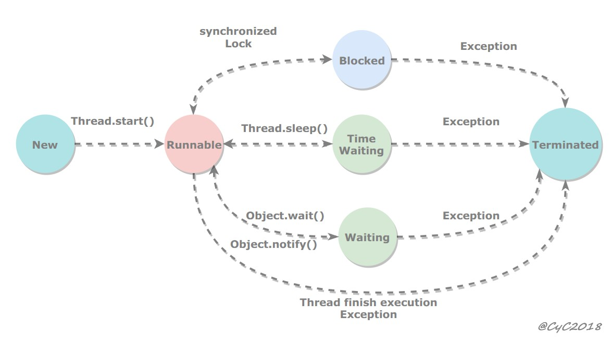
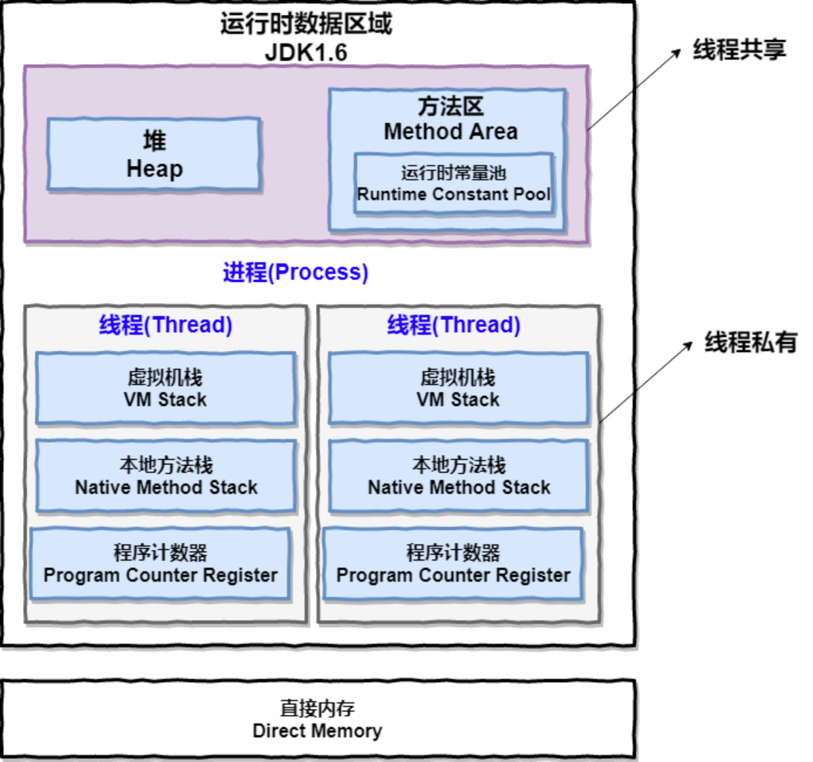
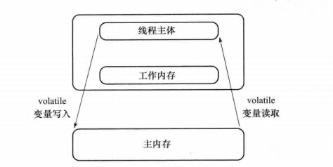
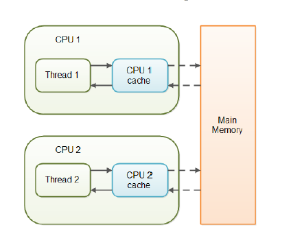
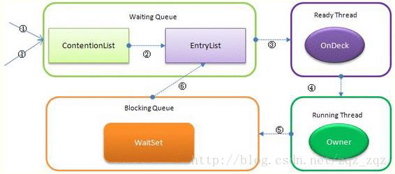

Java 代码首先会编译成Java字节码，字节码被类加载器加载到JVM里，JVM执行字节码，最终需要转化为汇编指令在CPU上进行执行。

Java中所使用的并发机制依赖于 JVM 的实现和 CPU 的指令。


# 线程

## 创建方式

(1) extends Thread

当调用 start() 方法启动一个线程时，虚拟机会将该线程放入就绪队列中等待被调度，当一个线程被调度时会执行该线程的 run() 方法。

```java
MyThread t1 = new MyThread();
t1.start();
```

(2) Runnable

(3) Callable

与 Runnable 相比，Callable 可以有返回值，且可以跑出异常，返回值通过 FutureTask 进行封装。

(4) ThreadPool


**继承与实现接口的比较**

优先实现接口

① Thread 只能够通过单继承来实现；

② Thread 创建开销大，Runnable 创建的开销小；

③ Runnable 实现解耦； 可以配合线程池使用


## 生命周期



```java
public enum State {
    NEW,
    RUNNABLE,
    BLOCKED,
    WAITING, 
    TIMED_WAITING,
    TERMINATED;
}
```

**(1) 新建(NEW)**

创建后尚未启动。

当程序使用   new 关键字  创建了一个线程之后，该线程就处于新建状态，此时仅由JVM为其分配内存，并初始化其成员变量的值。

**(2) 可运行(Runnable)**
可能正在运行，也可能正在等待 CPU 时间片。

包含了操作系统线程状态中的 Running 和 Ready。

当线程对象调用了start()方法之后，该线程处于就绪状态。Java虚拟机会为其创建方法调用栈和程序计数器，等待调度运行。

**(3) 阻塞(Blocked)**
等待获取一个排它锁，如果其线程释放了锁就会结束此状态。

主要分为三种阻塞方式：

① 同步阻塞： 

等待获取锁，获取同步锁时该同步锁被别的线程占用，JVM 将线程放入到锁池 (lock pool) 中。

② 等待阻塞

执行 o.wait() ，JVM会把该线程放入等待队列(waitting queue)中。

③ 其他阻塞

I/O 阻塞： 等待 I/O 操作完成；

执行 Thread.sleep() ；

执行 t.join() 方法；

**(4) 无限期等待(Waiting)**
等待其它线程显式地唤醒，否则不会被分配 CPU 时间片；

都是交互性质的方法；

Object.wait()、Thread.join()、LockSupport.part() 

| 进入方法                                   | 退出方法                             |
| ------------------------------------------ | ------------------------------------ |
| 没有设置 Timeout 参数的 Object.wait() 方法 | Object.notify() / Object.notifyAll() |
| 没有设置 Timeout 参数的 Thread.join() 方法 | 被调用的线程执行完毕                 |
| LockSupport.park() 方法                    | LockSupport.unpark(Thread)           |

**(5) 限期等待(Timed Waiting)**

无需等待其它线程显式地唤醒，在一定时间之后会被系统自动唤醒。

调用 Thread.sleep() 方法使线程进入限期等待状态时，常常用“使一个线程睡眠”进行描述。

调用 Object.wait() 方法使线程进入限期等待或者无限期等待时，常常用“挂起一个线程”进行描述。

睡眠和挂起是用来描述行为，而阻塞和等待用来描述状态。

阻塞和等待的区别在于，阻塞是被动的，它是在等待获取一个排它锁。而等待是主动的，通过调用 Thread.sleep() 和 Object.wait() 等方法进入。

| 进入方法                                 | 退出方法                                        |
| ---------------------------------------- | ----------------------------------------------- |
| Thread.sleep() 方法                      | 时间结束                                        |
| 设置了 Timeout 参数的 Object.wait() 方法 | 时间结束 / Object.notify() / Object.notifyAll() |
| 设置了 Timeout 参数的 Thread.join() 方法 | 时间结束 / 被调用的线程执行完毕                 |
| LockSupport.parkNanos() 方法             | LockSupport.unpark(Thread)                      |
| LockSupport.parkUntil() 方法             | LockSupport.unpark(Thread)                      |

**(6) 死亡(Terminated)**

可以是线程结束任务之后自己结束，或者产生了异常而结束。


## 线程的终止

**(1) 正常终止**

运行结束，正常终止；

**(2) 退出标志**

定义了一个退出标志exit，当exit为true时，while循环退出，exit的默认值为false.在定义exit时，**使用了一个Java关键字volatile，这个关键字的目的是使exit同步**，也就是说在同一时刻只能由一个线程来修改exit的值。

volatile 无锁同步的应用场景之一；

```java
class MyThread extends Thread {
    public volatile boolean exit = false;   // volatile
    public void run() {
        // ...
    }
}
```

**(3) Interrupt 方法结束**

①  阻塞下的结束

在线程处于阻塞状态下，调用 interrupt() 会抛出 InterrupteException，<u>一定要先捕获InterruptedException异常**之后通过break来跳出循环，才能正常结束run方法**</u>。

死循环中的退出，只有在捕获后进行显示的 break 才能实现；

② 未阻塞下的结束

使用 isInterrupted() 判断线程的中断标志来退出循环。当使用 interrupt() 方法时，中断标志就会置 true，和使用自定义的标志来控制循环是一样的道理。

```java
class MyThread  implements Runnable {
    public void run() {
        while (!isInterrupted()) {
            try {
                Thread.sleep(5000);
            } catch (InterruptedException e) {
                break;    // NOTE: after catch exception must break to skip loop
            }
        }
    }
}
```

**(4) stop 方法终止**

程序中可以直接使用thread.stop()来强行终止线程，但是stop方法是很危险的，就象突然关闭计算机电源，而不是按正常程序关机一样，可能会产生不可预料的结果，不安全主要是：thread.stop()调用之后，创建子线程的线程就会抛出ThreadDeatherror的错误，并且会释放子线程所持有的所有锁。一般任何进行加锁的代码块，都是为了保护数据的一致性，如果在调用thread.stop()后  <u>导致了该线程所持有的所有锁的突然释放(不可控制)</u>  ，那么被保护数据就有可能呈现不一致性，其他线程在使用这些被破坏的数据时，有可能导致一些很奇怪的应用程序错误。因此，并不推荐使用stop方法来终止线程。

**(5) Callable 通过 Future.camcel 来进行终止**


## Interrupt()

一个线程执行完毕之后会自动结束，如果在运行过程中发生异常也会提前结束。

**(1) InterruptedException**

该线程<u>处于阻塞、限期等待或者无限期等待</u>状态，那么就会抛出 InterruptedException，从而提前结束该线程。但是不能中断 I/O 阻塞和 synchronized 锁阻塞。

Thread.sleep()；

synchronized；

join()；

**(2) interrupted()**

无限循环不跳出，只有在该循环中执行 sleep() 等会抛出 InterruptedException 操作，

可通过其返回值来防止无线循环，作为一种退出标志；

调用 interrupt() 方法会设置线程的中断标记，此时调用 interrupted() 方法会返回 true。因此可以在循环体中使用 interrupted() 方法来判断线程是否处于中断状态，从而提前结束线程。

**(3) Executor 的中断操作**

① 关闭池子操作

shutdown() 方法会等待线程都执行完毕之后再关闭，但是如果调用的是 shutdownNow() 方法，则相当于调用每个线程的 interrupt() 方法。

② 关闭指定的线程(Future)

只想中断 Executor 中的一个线程，可以通过使用 submit() 方法来提交一个线程，它会返回一个 Future<?> 对象，通过调用该对象的 cancel(true) 方法就可以中断线程。


## 方法

(1) join

进行线程之间的流程控制，进行线程通信的一种方式；

(2) yield()

让出当前 CPU，之后重新进行竞争；

(3) sleep()

不释放锁，在等待一定时间后自动唤醒；


**sleep() 与 wait() 的区别**

想到对应在阻塞队列中、以及延时双删策略中的场景；

① 设计|定义： sleep() 是 Thread 的静态方法，wait() 是 Object 的成员方法；

② 锁的占用： sleep() 导致程序暂停执行指定的时间，它的监控状态依然保持着，不释放锁， 而 wait() 释放对象锁，进入等待此对象的等待池中；

③ 使用范围： sleep() 可以用在任何地方， wait() 只能够用在同步控制方法或同步控制块中使用；

④ 唤醒方式： sleep() 给定时间内自动唤醒，wait() 需要调用 notify 显视唤醒；


**start() 与 run() 的区别**

1. start() 方法来启动线程，真正实现了多线程运行。这时无需等待 run 方法体代码执行完毕，可以直接继续执行下面的代码。 
2.  通过调用 Thread 类的 start() 方法来启动一个线程， 这时此线程是处于就绪状态， 并没有运行。 run ⽅法只是 thread 的⼀个普通 ⽅法调⽤，直接运行。
3.  方法 run() 称为线程体，它包含了要执行的这个线程的内容，线程就进入了运行状态，开始运行 run 函数当中的代码。 Run方法运行结束， 此线程终止。然后CPU再调度其它线程。


## 其他性质



**(1) 进程与线程的比较**

进程是 OS 资源分配的单位，有自己独立的寻址空间；

线程是 OS 独立运行的单元，其共享同一个进程内的所有数据；

线程相较于进程更加轻量；

⼀个进程中可以有多个线程，多个线程共享进程的堆和⽅法区 (JDK1.8 之后的元空间)资源，但是每个线程有⾃⼰的程序计数器、虚拟机栈 和 本地⽅法栈。

**(2) 实现多线程的方式**

Java 中通过将每个线程映射为一个进程实现的；

线程的实现
3种模型:
内核线程；
用户线程；
两者结合。 

**(3) 守护线程**

是个服务线程，准确地来说就是服务其他的线程，这是它的作用——而其他的线程只有一种，那就是用户线程。所以java里线程分2种。

① 停止执行情况

专门用于服务其他的线程，如果其他的线程(即用户自定义线程)都执行完毕，连main线程也执行完毕，那么jvm就会退出(即停止运行)——此时，连jvm都停止运行了，守护线程当然也就停止执行了。

② 优先级

优先级较低

③ 设置

- 通过 setDaemon(true) 在 Thread 未 start() 之前显视设置

- Daemon 线程产生的新线程也是 Daemon 的

④ 性质

为 JVM 级别的线程，<u>即使你停止了Web应用，这个线程依旧是活跃的</u>。

**(4) 线程派生的联系**

继承对应的优先级、daemon等属性；

(5) 并发和并行

并发： 同⼀时间段，多个任务都在执⾏ (单位时间内不⼀定同时执⾏)； 

并⾏： 单位时间内，多个任务同时执⾏。


# 线程间通信

while 循环监测

线程B是一直执行着while(true) 循环的，直到长度为5才终止执行，显然这种方式是很消耗资源的。所以，就需要一种机制能避免上述的操作又能实现多个线程之间的通信，这就是接下来需要学习的“wait/notify线程间通信”。


## 通信方式

**(1) 进程间的通信方式**

① 管道(pipe)、有名管道(named pipe)

② 信号量(semophore)

③ 消息队列(message queue)

④ 信号(signal)

⑤ 共享内存(shared memory)

⑥ 套接字(socket)

**(2) 线程间的通信方式**

1、锁机制：
  1.1 互斥锁：提供了以排它方式阻止数据结构被并发修改的方法。
  1.2 读写锁：允许多个线程同时读共享数据，而对写操作互斥。
  1.3 条件变量：可以以原子的方式阻塞进程，直到某个特定条件为真为止。
对条件测试是在互斥锁的保护下进行的。条件变量始终与互斥锁一起使用。
2、信号量机制：包括无名线程信号量与有名线程信号量
3、信号机制：类似于进程间的信号处理。
线程间通信的主要目的是用于线程同步，所以线程没有像进程通信中用于数据交换的
通信机制。


## 等待/通知机制

Object.wait, notify 机制，需要配合 synchronized 一起使用


1、wait()/notify 方法

(1)wait() 和 notify() 方法要在同步块或同步方法中(synchronized 关键字) 调用，即在调用前，线程也必须获得该对象的对象级别锁。
(2)wait方法是释放锁，notify方法是不释放锁的；
(3)notify 每次唤醒 wait 等待状态的线程都是随机的，且每次只唤醒一个；
(4)notifAll 每次唤醒 wait 等待状态的线程使之重新竞争获取对象锁，优先级最高的那个线程会最先执行；
(5)当线程处于 wait() 状态时，调用线程对象的 interrupt() 方法会出现 InterruptedException 异常；

**通过 等待通知模式实现阻塞队列**

(1) 结构

```java
Queue<Object> queue = new LinkedList<>();
AtomicInteger count = new AtomicInteger();
int capacity = 5;
Object lock = new Object();      // use for thread communication
```

(2) 入队

```java
void put(Object task) {
    synchronzied(lock) {
        while (count.get() == capacity) {
            try {
                lock.wait();
            } catch (InterruptedException e) {
                log.error("", e);
            }
        }
        queue.offer(task);
        count.getAndIncrement();
        lock.notify();         // not empty conditon
    }
}
```

(2) 出队

```java
Object take() {
    Obejct oldFront = null;
    synchronized(lock) {
        while (count.get() == 0) {
            try {
                lock.wait()；
            } catch (Exception e) {
                log.error("Error", e);
            }
        }
        oldFront = queue.poll();
        count.getAndDecrment();
        lock.notify();       // not full condition
    }
    return oldFront;
}
```


**应用**

(1) MyBatis 中

在数据库连接这个地方使用
到的：
org.apache.ibatis.datasource.pooled.PooledDataSource 类中，所以不用花
太多的时间去深究。
1、获取连接的时候，如果数据库连接池没有空闲的连接，那么当前线程就会进入等
待，直到被通知，这个地方就是popConnection()方法


## *ThreadLocal

> 实现每⼀个线程都有⾃⼰的专属本地变量。
>
> 如果你创建了⼀个 ThreadLocal 变量，那么访问这个变量的每个线程都会有这个变量的本地副本，这也是 ThreadLocal 变量名的由来。

如果使用 ThreadLocal 管理变量，则每一个使用该变量的线程都获得该变量的副本，  副本之间相互独立，这样每一个线程都可以随意修改自己的变量副本，而不会对其他线程产生影响。

(1)概述

原理： 为每个使用该变量的线程都提供独立的变量副本，从而不会影响到其他线程所对应的副本。

是一种<u>多线程间并发访问变量的解决方案</u>，不使用锁来保证并发访问，本质是以空间换时间的方式，为每个线程提供变量的独立副本，以保证线程的安全。

(2) 作用

ThreadLocal 的作用是<font color="green">提供线程内的局部变量</font> ，这种变量在线程的生命周期内起作用，减少同一个线程内多个函数或者组件之间一些公共变量的传递的复杂度。

**底层结构**


一个Thread中只有一个ThreadLocalMap，

一个ThreadLocalMap中可以有多个ThreadLocal对象，

其中一个ThreadLocal对象对应一个ThreadLocalMap中一个的Entry实体

(也就是说：一个Thread可以依附有多个ThreadLocal对象)。


(1) Thread 中持有的结构

<u>线程局部变量</u>  ，那么理所当然就应该存储在自己的线程对象中

线程局部变量存储在 Thread 对象的 threadLocals 属性中

```java
public class Thread implements Runnable {
  ThreadLocal.ThreadLocalMap threadLocals = null;
  ThreadLocal.ThreadLocalMap inheritableThreadLocals = null;
  ...
}
```

(2) ThreadLocal.ThreadLocalMap

是实现 ThreadLocal 的原理，用于存储每一个线程的变量副本，Map中元素的键为线程对象，而值对应线程的变量副本。

KEY: 线程对象；

VALUE: 对应线程的变量副本；

```java
ThreadLocalMap(ThreadLocal<?> firstKey, Object firstValue) { ......
}
```


**一些操作**

(1) ThreadLocal 4 大 public 方法

根据当前线程获取到对应的 ThreadLocalMap，借助该 Map 操作实现；

get()、 set()、 remove()、 withInitial()。

最终的变量是放在了当前线程的 ThreadLocalMap 中，并不是存在 ThreadLocal 上， ThreadLocal 可以理解为只是 ThreadLocalMap 的封装，传递了变量值。

```java
public void set(T value) {
    Thread t = Thread.currentThread();
    ThreadLocalMap map = getMap(t);
    if (map != null)
        map.set(this, value);
    else
        createMap(t, value);
}
public T get() {
    Thread t = Thread.currentThread();
    ThreadLocalMap map = getMap(t);
    if (map != null) {
        ThreadLocalMap.Entry e = map.getEntry(this);
        if (e != null) {
            @SuppressWarnings("unchecked")
            T result = (T)e.value;
            return result;
        }
    }
    return setInitialValue();
}
public void remove() {
     ThreadLocalMap m = getMap(Thread.currentThread());
     if (m != null)
         m.remove(this);
 }
public static <S> ThreadLocal<S> withInitial(Supplier<? extends S> supplier) {
    return new SuppliedThreadLocal<>(supplier);
}
```


**与同步机制的比较**

​        a.ThreadLocal与同步机制都是为了 <u>解决多线程中相同变量的访问冲突问题</u>。 

​        b.前者采用以"空间换时间"的方法，后者采用以"时间换空间"的方式 

对于多线程资源共享的问题，同步机制采用了“以时间换空间”的方式，而ThreadLocal
采用了“以空间换时间”的方式。前者仅提供一份变量，让不同的线程排队访问，而后
者为每一个线程都提供了一份变量，因此可以同时访问而互不影响。


**Thread 造成的内存溢出问题**

(1) 与线程池协作引发的内存溢出问题

<u>ThreadLocal变量是维护在Thread内部的</u>，线程不退出，对象的引用就会一直存在。

当我们使用线程池的时候，就意味着当前线程未必会退出(比如<u>固定大小的线程池，线程总是存在的</u>)。如果这样的话，将一些很大的对象设置到ThreadLocal中(这个很大的对象实际保存在Thread的threadLocals属性中)，这样的话就可能会出现内存溢出的情况。

一种场景就是说如果使用了线程池并且设置了固定的线程，处理一次业务的时候存放到ThreadLocalMap中一个大对象，处理另一个业务的时候，又一个线程存放到ThreadLocalMap中一个大对象，但是这个线程由于是线程池创建的他会一直存在，不会被销毁，这样的话，以前执行业务的时候存放到ThreadLocalMap中的对象可能不会被再次使用，但是由于线程不会被关闭，因此无法释放Thread 中的ThreadLocalMap对象，造成内存溢出。

也就是说，ThreadLocal在没有线程池使用的情况下，正常情况下不会存在内存泄露，但是如果使用了线程池的话，就依赖于线程池的实现，如果线程池不销毁线程的话，那么就会存在内存泄露。所以我们在使用线程池的时候，使用ThreadLocal要格外小心！


(2) 原因

ThreadLocal内存泄漏的根源是：由于  <u>ThreadLocalMap的生命周期跟Thread一样长，如果没有手动删除对应key就会导致内存泄漏</u>  ，而不是因为弱引用。


**弱引用与内存泄漏**

弱引用被回收了只是回收了Entry的key引用，但是Entry应该还是存在的吧？

ThreadLocal的get(),set(),remove() 的时候都会清除线程ThreadLocalMap里所有key为null的value。

```java
static class Entry extends WeakReference<ThreadLocal<?>> { /** The value associated with this ThreadLocal. */ 
  Object value;
  Entry(ThreadLocal<?> k, Object v) { 
    super(k); 
    value = v; 
  }
}
```


这里我们就需要重新认识一下，什么是：**当垃圾收集器工作时，无论当前内存是否足够，都会回收掉只被弱引用关联的对象**，这里的重点是：**只被弱引用关联的对象**


上述过程尽管 GC 执行了垃圾收集，但是弱引用还是可以访问到结果的，也就是没有被回收，这是因为除了一个弱引用 userWeakReference 指向了User实例对象，还有 user 指向 User 的实例对象，只有当user和User实例对象的引用断了的时候，弱引用的对象才会被真正的回收


并不是所有弱引用的对象都会在第二次GC回收的时候被回收，而是  <u>回收掉只被弱引用关联的对象</u> 。因此，使用弱引用的时候要注意到！希望以后在面试的时候，不要上来张口就说，弱引用在第二次执行GC之后就会被回收！


**应用场景**

(1) 解决数据库连接

避免方法中总是出现 Connection 参数，每个线程每次使用的都是用一个  Connection；

(2) MyBatis 中用于 Session 管理

```java
private static final ThreadLocal threadSession = new ThreadLocal(); 
public static Session getSession() throws InfrastructureException { 
    Session s = (Session) threadSession.get(); 
    try { 
        if (s == null) { 
            s = getSessionFactory().openSession();
            threadSession.set(s); 
        } 
    } catch (HibernateException ex) { 
        throw new InfrastructureException(ex); 
    } return s; 
}
```


# *线程池

(1) new Thread 弊端：

- 每次`new Thread`新建对象，Thread 为大对象，性能差 ；

- 线程缺乏统一管理，可能无限制的新建线程，相互竞争，有可能占用过多系统资源导致死机或 OOM；

- 缺少更多功能，如更多执行、定期执行、线程中断；

(2) 线程池好处

重用性： 重用存在的线程，减少对象创建、消亡的开销，性能佳 ；

可控性： 可有效控制最大井发线程数，提高系统资源利用率，同时可以避免过多资源竞争，避免阻塞 ；

功能性： 提供定时执行、定期执行、单线程、井发数控制等功能；


**线程池参数**

- corePoolSize: <= x
- maximumPoolSize: 最大线程数
- workQueue: 工作队列，为BlockingQueue
- threadFactory: 默认非守护，同优先级，名称
- rejectHandler:  BlockingQueue 满，无空闲的线程池，拒绝cel，默认直接抛出 exception
- keepAliveTime，unit: corePoolSize  -->> maximumPoolSize 

```java
public ThreadPoolExecutor(int corePoolSize,
                          int maximumPoolSize,
                          long keepAliveTime,
                          TimeUnit unit,
                          BlockingQueue<Runnable> workQueue,
                          ThreadFactory threadFactory,
                          RejectedExecutionHandler handler) {
    if (corePoolSize < 0 ||
        maximumPoolSize <= 0 ||
        maximumPoolSize < corePoolSize ||
        keepAliveTime < 0)
        throw new IllegalArgumentException();
    if (workQueue == null || threadFactory == null || handler == null)
        throw new NullPointerException();
    this.acc = System.getSecurityManager() == null ?
            null :
            AccessController.getContext();
    this.corePoolSize = corePoolSize;
    this.maximumPoolSize = maximumPoolSize;
    this.workQueue = workQueue;
    this.keepAliveTime = unit.toNanos(keepAliveTime);
    this.threadFactory = threadFactory;
    this.handler = handler;
}
```


四种拒绝策略： ThreadPoolExecutor 类中提供

- AbortPolicythrows exception

- DiscardPolicy： 直接丢弃

- CallerRunPolicy： 使用调用者 thread 执行

- DiscardOldestPolicy： 丢弃 BlockingQueue 中最靠前的 task，执行当前 task


**方法**

(1) 主要方法

生命周期及 ExecutorService：

\- execute()

\- submit(): execute + Future

\- shutdown() : handle BlockingQueue in 

\- shutdownNow() : BlockingQueue not handler


(2) 监控方法：

- getTaskCount()：线程池已执行和未执行的任务总数 
- getCompIetedTaskCount()：已完成的任务数量 
- getPoolSize()：线程池当前的线程数量
- getActiveCount()：当前线程池中正在执行任务的线程数量


## Executors 

① Executors.newCachedThreadPool 

创建一个可根据需要创建新线程的线程池，但是在以前构造的线程可用时将重用它们。对于执行很多短期异步任务的程序而言，这些线程池通常可提高程序性能。**调用 execute 将重用以前构造的线程(如果线程可用)。如果现有线程没有可用的，则创建一个新线程并添加到池中。终止并从缓存中移除那些已有 60 秒钟未被使用的线程**。因此，长时间保持空闲的线程池不会使用任何资源。

② Executors.newFixedThreadPool

**创建一个可重用固定线程数的线程池，以共享的无界队列方式来运行这些线程**。在任意点，在大多数 nThreads 线程会处于处理任务的活动状态。如果在所有线程处于活动状态时提交附加任务，则在有可用线程之前，附加任务将在队列中等待。如果在关闭前的执行期间由于失败而导致任何线程终止，那么一个新线程将代替它执行后续的任务(如果需要)。在某个线程被显式地关闭之前，池中的线程将一直存在。

③ Executors.newSingleThreadExecutor

Executors.newSingleThreadExecutor()返回一个线程池(这个线程池只有一个线程)**,这个线程池可以在线程死后(或发生异常时)重新启动一个线程来替代原来的线程继续执行下去**！

④ Executors.newScheduIedThreadPool 

创建一个线程池，它可安排在给定延迟后运行命令或者定期地执行。

```java
ScheduledExecutorService scheduledThreadPool= Executors.newScheduledThreadPool(3); scheduledThreadPool.schedule(newRunnable(){ @Override public void run() { System.out.println("延迟三秒"); } }, 3, TimeUnit.SECONDS); scheduledThreadPool.scheduleAtFixedRate(newRunnable(){ @Override public void run() { System.out.println("延迟1秒后每三秒执行一次"); } },1,3,TimeUnit.SECONDS);
```

⑤ 

**线程池配置**

CPU 密集型任务，就需要尽量压榨 CPU，参考值可以设为 NCPU + 1IO 密集型任务，参考值可以设置为 2 * NCPU；


选用基础：

\- 小型应用不适合

\- 线程调度时间开销大


@@计算密集型与IO密集型

密集型：  CPU 核 + 1
IO 密集： CPU 核数 / (1-阻塞系数)   一般0。8~0.9


@@如何正确的使用线程池

设置线程池，比设置界限；

hook 机制嵌入行为，由 beforeMethod, afterMethod 记录线程执行前和后做日志，异常结果；

优雅的关闭，hook 机制，推荐使用 JavaBean 创建线程池，在 destoryMethod 里面在销毁时调用 shutdown；


# JMM

(1) 概述

Java 并发采用的是共享内存模型，线程之间的通信总是隐式执行。

定义： Java 线程之间的通信由 JMM 控制， <u>JMM 决定一个线程对共享变量的写入何时对另一个线程可见</u>。

Java内存模型(JMM)解决了可见性和有序性的问题，而锁解决了原子性的问题，理想情况下我们希望做到“同步”和“互斥”

1. 主内存与工作内存
    主内存副本拷贝，非对整个obj拷贝。
    Java借助共享内存实现线程间的通信

2. 内存间的交互操作
    8中操作, 主内存，保证原子性；
    对于long和double的特殊规则(了)
    64位

3. 对于volatile变量的特殊规则
    语义：

- 可见性, 实现对于其修改立即写回主内存中, 非保证原子性;
- 有序性, 禁止指令重排序, 是一种同步机制, 轻量, 与DCL实现安全的单例.  

4. 原子性、可见性与有序性
   volatile：
   finale: this 引用逃逸(读初始化一般的data)；
   synchronized: "万能", 重量, 阻塞

硬件的效率与一致性:
缓存一致性协议


## 关键字

### *volatile 



能够在线程之间保持可见性，能够被 **多线程同时读**，并且保证不会读到过期的值，但 **只能被单线程写**。
基于 happens-before 原则，对 volatile 字段的写入操作先于读操作，即使两个线程同时修改和获取 volatile 变量。


volatile是轻量级的synchronized，他的意思是：当一个线程修改一个共享变量时，另外一个线程能读到这个修改的值。如果volatile变量修饰符使用恰当的话，它比synchronized的使用和执行成本更低，因为它不会引起线程上下文的切换和调度


(1) 特性

a.volatile关键字为域变量的访问提供了一种免锁机制， 

b.使用volatile修饰域相当于告诉虚拟机该域可能会被其他线程更新， 

c.因此每次使用该域就要重新计算，而不是使用寄存器中的值 

d.volatile不会提供任何原子操作，它也不能用来修饰final类型的变量 


**volatile 保证可见性**

有volatile变量修饰的共享变量进行写操作的时候会引发了两件事情：
(1)将当前处理器缓存行的数据写回到系统内存；
(2)这个写回内存的操作会使在其他CPU里缓存了该内存地址的数据无效；


底层实现细节(了)：

① 发生 volatile  W， JVM 向处理器发送 Lock 前缀的汇编命令，将该变量缓存行写到系统内存；

② 为了保证写回到的数据被其他线程立即可见，借助  缓存一致性协议  实现，每个处理器 嗅探总线 上传播的数据检查自己是否过期，过期强制从系统内存中把数据读到处理器缓存中。




**volatile 如何禁止指令重排序** 

借助内存屏障和禁止指令重排实现

- 对 volatile 变量写操作时，会在**写操作之后**加上一条 store 屏障指令，将本地内存中的共享变量刷新到主内存；
- 对 volatile 变量的读操作，会在**读操作之前**加上一条 load 屏障指令，从主内存中读取共享变量。


使用volatile关键字修饰共享变量可以禁止重排序。若用volatile修饰共享变量，在编译时，会在指令序列中插入内存屏障来禁止特定类型的处理器重排序
volatile禁止指令重排序的一些规则：
　　1.当第二个操作是voaltile写时，无论第一个操作是什么，都不能进行重排序

　　2.当地一个操作是volatile读时，不管第二个操作是什么，都不能进行重排序

　　3.当第一个操作是volatile写时，第二个操作是volatile读时，不能进行重排序

涉及到内存屏障(Memory Barrier)，它是让一个CPU处理单元中的内存状态对其它处理单元可见的一项技术。


**一些应用**

- 无锁读取数据： ConcurrencyHashMap 的 get 操作，通过 volatile 替换锁，AQS 中 state 变量；
- 作为终止标识，exit 来进行终止，类似 interrupt 终止；

- 那么在禁止重排序时是一个较好的使用场景，否则我们不需要再使用它，如 DCL 中通过 volatile 修饰；
- 热部署的变量： 通过线程修改之后立即被其他线程可见；


适用场景： 

(1) 对变量的写操作不依赖于当前值(比如 i++)，或者说是单纯的变量赋值(boolean flag = true)。 

(2)该变量没有包含在具有其他变量的不变式中，也就是说，不同的 volatile 变量之间，不能互相依赖。只有在状态真正独立于程序内其他内容时才能使用 volatile。


### synchronized 

字解决的是多个线程之间访问资源的同步性。

(1) 一些性质：
- 提供原子性，实现同步功能；
- 是 JVM 提供的同步工具，使用 lock 和 unlock 字节码指令，保证被它修饰 的⽅法或者代码块在任意时刻只能有⼀个线程执⾏；
- 与 CAS 比较： 相比于 CAS 可以保证 **一块** 而非一个变量的原子性；
- 与 Lock 比较： 相比于 JDK Lock 可以保存 **程序运行信息** ，便于解决死锁和异常；

(2) 使用的位置：

- code bloker： 显视锁住当前调用对象  synchronized(this)，通过监视器锁实现；
- method: 锁住调用对象，通过访问标识位实现；
- static method: 锁住该类的所有对象；
- class: 显视锁住类对象 synchronized(xxx.class)；

适用同一个对象调用锁住 obj 的可以实现同步，使其中的一个线程阻塞等待另一个线程执行完毕；不同对象调用时不适用；


**synchronized 保证可见性原理**

通过 javap -v xxx.class 获取字节码指令分析

关键字synchronized可以修饰方法或者以同步块的形式来进行使用，它主要确保多个线程在同一个时刻，只能有一个线程处于方法或者同步块中，它保证了线程对变量访问的可见性和排他性。


JMM 对 synchronized 的规定：

- 线程解锁前，必须把共享变量的最新值刷新到主内存；
- 线程加锁时，将*清空工作内存* 中共享变量的值，从而使用共享变量时需要从主内存中重新读取最新的值(注意，`加锁与解锁是同一把锁`)；


本质是对一个对象的监视器(monitor) 进行获取，而这个获取过程是排他的，也就是说同一时刻只有一个线程
获取到由 synchronized 所保护对象的监视器。

**(1) 对代码块同步**

monitorenter 和 monitorexit 指令

Synchronized 每个对象有一个  <u>内置的监视器锁(monitor)</u>  。当 monitor 被占用时就会处于锁定状态，线程执行monitorenter 指令时尝试获取monitor的所有权，过程如下：
1、如果 monitor 的进入数为0，则该线程进入 monitor，然后将进入数设置为1，该线程即
为 monitor 的所有者。
2、如果线程己经占有该 monitor，只是重新进入，则进入monitor 的进入数加1．
3．如果其他线程巳经占用了 monitor ,则该线程进入阻塞状态，直到 monitor 的进入数为0，再重新尝试获取monitor的所有权。

**(2) 同步方法**

调用指令将会检查方法的 `ACC_SYNCHRONIZED` 访问标志是否被设置，如果设置了，  <u>执行线程将先获取 monitor，获取成功之后才能执行方法体</u>  ，方法执行完后再释放 monitor Synchronize和lock都属于同步阻塞。 


**synchronized 其他性质**

(1) 作为锁

见下部分锁相关

(2) 原子性

@Q: CAS 机制与 synchronized 保证原子性的区别？

① CAS 仅能够保证一个变量的原子性，而 synchronized 可用于方法、类、字段等多处；

② CAS 通过不断循环重试实现，存在不必要的开销，但是是一种无锁的实现；

③ CAS 存在 ABA 问题；


Q: JDK1.6+ 的 synchronized 关键字做了哪些优化?

对锁的实现引⼊了⼤量的优化，如偏向锁、轻量级锁、⾃旋锁、适应性⾃旋锁、锁消除、锁粗 化等技术来减少锁操作的开销。

锁主要存在四种状态，依次是：⽆锁状态、偏向锁状态、轻量级锁状态、重量级锁状态，他们会随着竞争的激烈⽽逐渐升级。锁可以升级不可降级，提⾼获得锁和释放锁的效率。


## 三大特性

**原子性**

提供了互斥访问，同一时刻只能有一个线程对它进行操作。

(1) 实现方式：

- 锁的同步机制：  synchronized | Lock
- CAS 机制： 包括 AtomicInteger 等原子类


**可见性** 

一个线程对主内存中共享变量的修改，能够及时地被其他线程观察到。

(1) 不可见的原因： 

- 线程交叉执行
- 重排序结合线程交叉执行
- 共享变量更新后的值没有在工作内存与主存间及时更新

(2) 实现方式

volatile 关键字可以保证共享变量的可⻅性。


**有序性：** 

代码在执⾏的过程中的先后顺序。

- Java内存模型中，允许编译器和处理器对指令进行重排序，但是重排序过程不会影响到单线程程序的执行，却会影响到多线程并发执行的正确性，导致代码的执⾏顺 序未必就是编写代码时候的顺序。
- volatile、synchronized、Lock


## *happen-before 原则

1. 单一线程原则

> Single Thread Rule

一个线程内，程序前面的操作先于后面的操作。也叫程序次序原则。

2. 管程锁定原则

> Monitor Lock Rule

一个 unlock option 先于后面同一个锁的 lock option。

3. volatile 变量规则

> Volatile Variable Rule

对一个 volatile 变量的写操作先于后面对这个变量的读操作。

4. 传递性原则

> Transitivity

A --> B, B --> C  ==>> A --> C

5. 线程启动规则

> Thread Start Rule丶。 入

Thread 对象的 start() 先于此线程的每一个动作

6. 线程中断规则

> Thread Interruption Rule

对线程 interrupt() 的调用先于被中断线程的代码检测到中断事件的发生，即 isInterrupt().

7. 线程加入规则

> Thread Join Rule

Thread 对象的结束先于 join() 方法返回

8. 对象终结规则

> Finalizer Rule

一个对象的初始化完成(构造函数结束)先于它的 finalize() 方法的开始


## 线程同步的实现

说明： 需要使用线程同步的根本原因在于对普通变量的操作不是原子的。

**1、 互斥同步** 

(1) 同步方法 、同步代码块 

(2) 使用重入锁实现线程同步

(3) 使用阻塞队列实现线程同步


**2、 非阻塞同步**

主要是 CAS 不断尝试实现

(1) 使用原子变量实现线程同步


**3、 无同步方案**

(1) 使用局部变量实现线程同步 
    如果使用ThreadLocal管理变量，则每一个使用该变量的线程都获得该变量的副本， 副本之间相互独立，这样每一个线程都可以随意修改自己的变量副本，而不会对其他线程产生影响。

(2) 使用特殊域变量(volatile)实现线程同步

 注：多线程中的非同步问题主要出现在对域的读写上，如果让域自身避免这个问题，则就不需要修改操作该域的方法。 


# 锁与锁优化

**线程安全**

1. Java语言中的线程安全
   绝对线程安全
   相对线程安全
   线程兼容
   线程对立

**2. 线程安全的实现方法**
*1)同步互斥*
**Synchronized：**存在挂起、恢复，是_<u>阻塞</u>_  实现的，且java线程直接映射到OS原生线程上的，存在用户态到内核态的_<u>转换</u>_，因而性能较差。

**Lock：**可重用锁


2)非阻塞
基于CAS+Loop实现

3)无同步

- 可重入代码
- TLC，线程本地， 是消息队列架构模式


# 锁

**乐观锁**

乐观锁是一种乐观思想，即认为读多写少，遇到并发写的可能性低，每次去拿数据的时候都认为别人不会修改，所以不会上锁，但是  <u>在更新的时候会判断一下在此期间别人有没有去更新这个数据，采取在写时先读出当前版本号，然后加锁操作</u>  (比较跟上一次的版本号，如果一样则更新)，如果失败则要重复读-比较-写的操作。 java中的乐观锁基本都是通过CAS操作实现的，CAS是一种更新的原子操作，  <u>  比较当前值跟传入值是否一样，一样则更新，否则失败</u>。


**悲观锁**

悲观锁是就是悲观思想，即认为写多，遇到并发写的可能性高，每次去拿数据的时候都认为别人会修改，所以每次在读写数据的时候都会上锁，这样别人想读写这个数据就会block直到拿到锁。java中的悲观锁就是  <u>Synchronized</u>,AQS框架下的锁则是先尝试cas乐观锁去获取锁，获取不到，才会转换为悲观锁，如RetreenLock。


## JVM 锁优化

锁有四种状态，无锁 -> 偏向锁 -> 轻量级锁 -> 重量级锁

通过 对象头实现

(1) 原理：

基于对象头的Mark Word， 23位表示偏向的线程ID

**偏向锁**

偏向锁的目的是在某个线程获得锁之后，<u>消除这个线程锁重入(CAS)的开销</u>，看起来让这个线程得到了偏护

而偏向锁只需要在置换 ThreadID 的时候依赖一次CAS原子指令

**如果一个线程获得了锁，那么锁就进入了偏向模式。当这个线程再次请求锁时，无需再做任何同步操作**

(1) 设计原因

为什么会出现这种设计的方式那？这是因为根据HotSpot的作者研究，他发现  <u>锁不仅不存在多线程竞争，而且总是由同一线程多次获得</u>  ，为了让线程获得锁的代价更低而引入了的偏向锁这个概念。

(2) 锁的升级

在锁竞争比较激烈的场景，最有可能的情况是每次不同的线程来请求相同的锁，这样的话偏向锁就会失效，倒不如不开启这种模式，幸运的是Java虚拟机提供了参数可以让我们有选择的设置是否开启偏向锁。
如果偏向锁失败，虚拟机并不会立即挂起线程，而是使用轻量级锁进行操作。

(3) 性质：

线程获取到锁之后，消除这个线程的重入开销；

```
-XX:+UseBiasedLocking
```


**轻量级锁**

轻量级锁是为了<u>在线程交替执行同步块时提高性能</u>，而偏向锁则是在只有一个线程执行同步块时进一步提高性能。

如果偏向锁失败，虚拟机并不会立即挂起线程，而是使用轻量级锁进行操作。轻<u>量级锁他只是简单的将对象头部作为指针，指向持有锁的线程堆栈的内部，来判断一个线程是否持有对象锁。</u>  如果线程获得轻量级锁成功，则可以顺利进入临界区。如果轻量级锁加锁失败，则表示其他线程抢先夺到锁，那么当前线程的轻量级锁就会膨胀为重
量级锁。

轻量级锁所适应的场景是 <u>线程交替执行同步块</u> 的情况，如果存在同一时间访问同一锁的情况，就会导致轻量级锁膨胀为重量级锁。

(1) 说明：

嵌入在线程栈中的对象
使用 Displaced Mark Word 复制对象头到堆栈中，借助CAS实现同步。
还是需要进行 CAS , 出现竞争时，会尝试自旋

(2) 原理：

绝大部分锁在整个同步周期内都是不存在竞争的


**自旋锁(无锁)**

(1) 原理

自旋锁原理非常简单，如果持有锁的线程能在很短时间内释放锁资源，那么那些等待竞争锁的线程就不需要做内核态和用户态之间的切换进入阻塞挂起状态，它们只需要等一等(自旋)，等持有锁的线程释放锁后即可立即获取锁，这样就避免用户线程和内核的切换的消耗。

(2) 优缺点

(3) 时间阈值

在1.6引入了适应性自旋锁，适应性自旋锁意味着自旋的时间不在是固定的了，而是  <u>由前一次在同一个锁上的自旋时间以及锁的拥有者的状态来决定</u>，基本认为一个线程上下文切换的时间是最佳的一个时间。

(4) 一些实现

在通过一定的自旋失败后，通常转化为加悲观锁实现，如 ConcurrentHashMap 中对于 put 在尝试 3 次失败后进行转换成对链表头进行加锁；

```
-XX:+UseSpinning
```


**自适应锁**
原来默认是10，现在可以实现自适应自旋

自适应，由前一次在同一个锁上的自旋时间及锁的拥有者的状态来决定。

如ConcurrentHashMap的tryLock()

> -XX:+UseSpinning      1.7默认开启
> -XX:PreBlockSpin     默认为10，代表


**锁消除**
不存在共享数据竞争，需要对其进行`逃逸分析`，从而减少不必要的锁。


**锁粗化**
防止在循环中加锁，进行资源的浪费


**锁的对比**

// TODO


## 程序锁优化

**1.减少锁粒度**

将大对象(这个对象可能会被很多线程访问)，拆成小对象，大大增加并行度，降低锁竞争。降低了锁的竞争，偏向锁，轻量级锁成功率才会提高。

() 应用

① 最最典型的减小锁粒度的案例就是ConcurrentHashMap。进而提高并发程度
如将 HashMap –> ConcurrentHashMap使用Segment(16)增加并行度。

**2. 减少锁持有时间**

只用在有线程安全要求的程序上加锁

只在有必要的时候进行同步，这样就明显减少了线程持有锁的时间，从而
提高系统的性能。

```java
public synchronized void syncMethod(){
    method1();                             // cost much time
    mutextMethod();   // 实际需要进行同步的方法
    method2();
}
```

**3. 锁分离**
如根据功能进行锁分离
(1) 应用

① ReadWriteLock，即保证了线程安全，又提高了性能。

在读多写少的情况下，通过 ReentrantReadWriteLock 替换 ReentrantLock，实现对于 Read 的不加锁实现；

② 读写分离思想可以延伸，  <u>只要操作互不影响，锁就可以分离</u>  。比如LinkedBlockingQueue 从头部取出，从尾部放数据。

如果使用独占锁的话，则要求两个操作在进行时首先要获取当前队列的锁，那么take
和put就不是先真正的并发了，因此，在JDK中正是实现了两种不同的锁，一个
是takeLock一个是putLock。

**4. 锁粗化**
不在循环中加锁，来回加和释放的开销大

```java
public void syncMethod() {
    synchronized (lock) { //第一次加锁
    	method1();
    }
    method3();
    synchronized (lock) { //第二次加锁
    	mutextMethod();
    }
    method4();
    synchronized (lock) { //第三次加锁
    	method2();
    }
}
```

如果第一次和第二次加锁和线程上下文切换的时间超过了method1()、method2()method3()、method4() 的时间.

改进后的代码的执行时间可能小于上述分别加锁的时间，这就是锁粗化，也是一种锁
优化的方式，但是要根据具体的场景；

**5. 锁消除**

锁消除是在  <u>编译器级别的事情</u>。在即时编译器时，如果发现不可能被共享的对象，则可以消除这些对象的锁操作。

引发原因：

① 多数是因为程序员编码不规范引起。

② 有时这些锁并不是程序员所写的，有的是JDK实现中就有锁的，比如Vector
和StringBuffer 这样的类，它们中的很多方法都是有锁的。当我们在一些不会有线
程安全的情况下使用这些类的方法时，达到某些条件时，编译器会将锁消除来提高性
能。

**6. JVM 锁优化(volatile, synchronized) **

见上部分


## *synchronized

(1) 作用范围

(2) 核心组件

1) Wait Set：哪些调用wait方法被阻塞的线程被放置在这里；

 2) Contention List：竞争队列，所有请求锁的线程首先被放在这个竞争队列中；

 3) Entry List：Contention List中那些有资格成为候选资源的线程被移动到Entry List中；

 4) OnDeck：任意时刻，最多只有一个线程正在竞争锁资源，该线程被成为OnDeck； 

5) Owner：当前已经获取到所资源的线程被称为Owner；
 6) !Owner：当前释放锁的线程。

() 底层实现



是非公平锁，等待的线程会先尝试自旋获取锁，如果获取不到就进入 ContentionList；

每个对象后有个 monitor 对象， <u>加锁就是在竞争 monitor 对象</u> ， 代码块加锁是在前后分别加上monitorenter和monitorexit指令来实现的，方法加锁是通过一个标记位来判断的。


**与 ReentrantLock 对比**

相同点： 都是可重入锁。

① 底层实现：ReentrantLock 是 API 级别的，synchronized 是 JVM 级别的，为关键字，能够在出现异常时打印出对应的错误堆栈用于分析问题，同时 JVM 对 synchronized 提供了锁升级的优化；

② 锁的实现方式： ReentrantLock 是同步非阻塞，采用的是乐观并发策略，而 synchronized 是同步阻塞，使用的是悲观并发策略。

③ 锁的使用的安全性： ReentrantLock 需要显视加锁解锁，可能因为忘记解锁而陷入死锁，而 synchronized 为隐式加锁，不会因为忘记解锁而陷入死锁。

④ 功能灵活性：

- ReentrantLock 可尝试获取锁；
- RentrantLock 可中断获取锁，提供了⼀种能够中断等待锁的线程的机制，`lock.lockInterruptibly()` ；
- RentrantLock 能够支持公平锁, synchronized 只能实现非公平锁；
- RentrantLock 可实现选择性通知： synchronizedf 使用 notify / notifyAll 进行通知时，通知的线程由 JVM 选择，ReentrantLock 更加灵活的绑定多个 Condition, 进行选择性通知。


1 ReentrantLock显示的获得、释放锁，synchronized隐式获得释放锁 
2 ReentrantLock可响应中断、可轮回，synchronized是不可以响应中断的，为处理锁的不可用性提供了更高的灵活性 
3 ReentrantLock是API级别的，synchronized是JVM级别的 
4 ReentrantLock可以实现公平锁 
5 ReentrantLock通过Condition可以绑定多个条件 
6 底层实现不一样， synchronized是同步阻塞，使用的是悲观并发策略，lock是同步非阻塞，采用的是乐观并发策略 
7 Lock是一个接口，而synchronized是Java中的关键字，synchronized是内置的语言实现。 
8 synchronized在发生异常时，会自动释放线程占有的锁，因此不会导致死锁现象发生；而Lock在发生异常时，如果没有主动通过unLock()去释放锁，则很可能造成死锁现象，因此使用Lock时需要在finally块中释放锁。 
9 Lock可以让等待锁的线程响应中断，而synchronized却不行，使用synchronized时，等待的线程会一直等待下去，不能够响应中断。 
10 通过Lock可以知道有没有成功获取锁，而synchronized却无法办到。 
11 Lock可以提高多个线程进行读操作的效率，既就是实现读写锁等。


**synchronized 与volatile 的比较**

① 实现与性能：volatile关键字是线程同步的 <u>轻量级</u>实现，所以 <font color="green">volatile性能肯定⽐synchronized关键字要好</font>。 但是 <font color="green">volatile关键字只能⽤于变量⽽synchronized关键字可以修饰⽅法以及代码块</font>。 synchronized关键字在JavaSE1.6之后进⾏了主要包括为了减少获得锁和释放锁带来的性能消耗 ⽽引⼊的偏向锁和轻量级锁以及其它各种优化之后执⾏效率有了显著提升，实际开发中使⽤ synchronized 关键字的场景还是更多⼀些。

② 阻塞： 多线程访问volatile关键字不会发⽣阻塞，⽽synchronized关键字可能会发⽣阻塞

③ 三特性的： volatile关键字能保证数据的可⻅性，但不能保证数据的原⼦性。synchronized关键字两者都能 保证。

④ 使用场景： volatile关键字主要⽤于解决变量在多个线程之间的可⻅性，⽽ synchronized关键字解决的是 多个线程之间访问资源的同步性。


## 死锁

两个进程都在等待对方执行完毕才能继续往下执行的时候就发生了死锁。结果就是两个进程都陷入了无限的等待中。

(1) 死锁的四个必要条件：

- 互斥条件：该资源任意⼀个时刻只由⼀个线程占⽤。

- 持有和等待条件： ⼀个进程因请求资源⽽阻塞时，对已获得的资源保持不放。

- 不可剥夺条件：线程已获得的资源在末使⽤完之前不能被其他线程强⾏剥夺，只有⾃⼰使⽤完毕后 才释放资源。

- 循环等待条件：:若⼲进程之间形成⼀种头尾相接的循环等待资源关系。


(2) 避免线程死锁

① 破坏互斥条件 ：这个条件我们没有办法破坏，因为我们⽤锁本来就是想让他们互斥的（临界资源需要互斥访问）。

② 破坏请求与保持条件 ：⼀次性申请所有的资源。

③ 破坏不剥夺条件 ：占⽤部分资源的线程进⼀步申请其他资源时，如果申请不到，可以主动释放它占有的资源。

④ 破坏循环等待条件 ：靠按序申请资源来预防。按某⼀顺序申请资源，释放资源则反序释放。


**相关问题**

(1) 如何确保N个线程可以访问N个资源同时又不导致死锁？

① 指定获取锁的顺序，并强制线程按照指定的顺序获取锁。因此，如果所有的线程都是以同样的顺序加锁和释放锁，就不会出现死锁了；

② 使用带有超时时间的锁；

③ 通过死锁的检测和恢复机制进行规避；

(2) 写一个发生死锁的程序

```java
 class DeadLock1 implements Runnable {

    private static Object resource1 = new Object();
    private static Object resource2 = new Object();
    private int flag = 0;

    public DeadLock1(int flag) {
        this.flag = flag;
    }

    @Override
    public void run() {
        if (flag == 1) {
            synchronized (resource1) {
                try {
                    Thread.sleep(500);
                    System.out.println("flag1 one level");
                    synchronized (resource2) {
                        System.out.println("flag 1");
                    }
                } catch (InterruptedException e) {
                    e.printStackTrace();
                }

            }
        }
        if (flag == 2) {
            synchronized (resource2) {
                try {
                    Thread.sleep(500);
                    System.out.println("flag2 one level");
                    synchronized (resource1) {
                        System.out.println("flag 2");
                    }
                } catch (InterruptedException e) {
                    e.printStackTrace();
                }
            }
        }
    }

    public static void main(String[] args) {
        Thread t1 = new Thread(new DeadLock1(1));
        Thread t2 = new Thread(new DeadLock1(2));
        t1.start();
        t2.start();
    }
}
```


## 其他锁

**无锁**

CAS算法的过程是这样：<u>它包含三个参数CAS(V,E,N): V表示要更新的变量，E</u>
<u>表示预期值，N表示新值。仅当V值等于E值时</u>，才会将V的值设为N，如果V值和E值不同，则说明已经有其他线程做了更新，则当前线程什么都不做。最后，CAS返回当前V的真实值。


**可重入锁(递归锁)**

可重入锁，也叫做递归锁，指的是同一线程 外层函数获得锁之后 ，内层递归函数仍然有获取该锁的代码，但不受影响。

偏向锁对于偏向的线程没有重入的开销。


**公平锁和非公平锁**

公平锁(Fair)

 加锁前检查是否有排队等待的线程，优先排队等待的线程，先来先得。


非公平锁(Nonfair) 

加锁时不考虑排队等待问题，直接尝试获取锁，获取不到自动到队尾等待。

1. 非公平锁性能比公平锁高5~10倍，因为公平锁需要在多核的情况下维护一个队列 
2.  Java中的synchronized是非公平锁，ReentrantLock 默认的lock()方法采用的是非公平锁。


**读写锁**

> 读读不互斥，读写互斥，写写互斥

为了提高性能，Java提供了读写锁，在读的地方使用读锁，在写的地方使用写锁，灵活控制，如果没有写锁的情况下，读是无阻塞的,在一定程度上提高了程序的执行效率。读写锁分为读锁和写锁，多个读锁不互斥，读锁与写锁互斥，这是由jvm自己控制的，你只要上好相应的锁即可。 

(1) 读锁 

如果你的代码只读数据，可以很多人同时读，但不能同时写，那就上读锁 

(2) 写锁 

如果你的代码修改数据，只能有一个人在写，且不能同时读取，那就上写锁。总之，读的时候上读锁，写的时候上写锁！ Java中读写锁有个接口java.util.concurrent.locks.ReadWriteLock，也有具体的实现ReentrantReadWriteLock。


**共享锁和独占锁**

java并发包提供的加锁模式分为独占锁和共享锁。 

(1) 独占锁

独占锁模式下，每次只能有一个线程能持有锁，ReentrantLock就是以独占方式实现的互斥锁。独占锁是一种悲观保守的加锁策略，它避免了读/读冲突，如果某个只读线程获取锁，则其他读线程都只能等待，这种情况下就限制了不必要的并发性，因为读操作并不会影响数据的一致性。

(2) 共享锁

 共享锁则允许多个线程同时获取锁，并发访问 共享资源，如：ReadWriteLock。共享锁则是一种乐观锁，它放宽了加锁策略，允许多个执行读操作的线程同时访问共享资源。 

1. AQS的内部类Node定义了两个常量 SHARED 和 EXCLUSIVE ，他们分别标识 AQS队列中等待线程的锁获取模式。 
2.  java的并发包中提供了ReadWriteLock，读-写锁。它允许一个资源可以被多个读操作访问，或者被一个 写操作访问，但两者不能同时进行。


**重量级锁(Mutex Lock)** 

Synchronized是通过对象内部的一个叫做监视器锁(monitor)来实现的。但是监视器锁本质又是依赖于底层的操作系统的Mutex Lock来实现的。而操作系统实现线程之间的切换这就需要从用户态转换到核心态，这个成本非常高，状态之间的转换需要相对比较长的时间，这就是为什么Synchronized效率低的原因。

因此，这种  <u>依赖于操作系统Mutex Lock所实现的锁我们称之为“重量级锁”</u>。JDK中对Synchronized做的种种优化，其核心都是为了减少这种重量级锁的使用。JDK1.6以后，为了减少获得锁和释放锁所带来的性能消耗，提高性能，引入了“轻量级锁”和“偏向锁”。


**分段锁**

是一种思想ConcurrentHashMap是学习分段锁的最好实践


**活锁**

因为活跃性而引入的问题


# 并发中的设计模式

## 单例模式

保证全局唯一，并发情况下使用安全

见设计模式单例

7 种单例模式：

饿汉式；

双重监测懒汉式；

线程安全懒汉式；

静态内部类持有懒汉式；

枚举式；

变种的饿汉式；

变种的懒汉式；


## Future 模式

Future模式的核心思想：异步调用

不仅可以在子线程完成后收集其结果，还可以设定子线程的超时时间，避免主任务一直等待。

() 性质
Future模式不会立即返回你需要的数据，但是，他会返回一个契约 ，以后在使用到数据的时候就可以通过这个契约获取到需要的数据。


在广义的Future模式中，虽然获取数据是一个耗时的操作，但是服务程序不等数据完成就立即返回客户端一个伪造的数据(就是上述说
的“契约”)，实现了Future模式的客户端并不急于对其进行处理，而是先去处理其他业
务，充分利用了等待的时间，这也是Future模式的核心所在，在完成了其他数据无关的任务之后，最后在使用返回比较慢的Future数据。这样在整个调用的过程中就不会出现长时间的等待，充分利用时间，从而提高系统效率。


() JDK 中的 Future 模式

FutureTask实现了 Callable，Future接口，RunnableFuture接口继承了Future和
Runnable接口。因为RunnableFuture实现了Runnable接口，因此FutureTask可以提
交给Executor进行执行，FutureTask有两个构造方法，如下：


Runnable 与 Callable 的区别

(1) Callable规定的方法是call()，Runnable规定的方法是run()；
(2) Callable的任务执行后可返回值，而Runnable的任务是不能返回值得；
(3) call()方法可以抛出异常，run()方法不可以；
(4) 运行Callable任务可以拿到一个Future对象，Future 表示异步计算的结果


() 异常

Future 的 get() 可能会阻塞当前线程的执行，会抛出 InterruptedExcpeiton、ExecutionException，若线程已经取消，抛出 CancellationException，取消由cancel 方法来执行。isDone确定任务是正常完成还是被取消了。


() 可取消性

一旦计算完成，就不能再取消计算。如果为了可取消性而使用Future 但又不提供可
用的结果，则可以声明Future<?> 形式类型、并返回 null 作为底层任务的结果。


## 生产者消费者
使用生产者消费者模式实现的一个例子；
模仿分布式爬虫；


单生产者单消费者

单生产者多消费者

多生产者单消费者

多生产者多消费者

