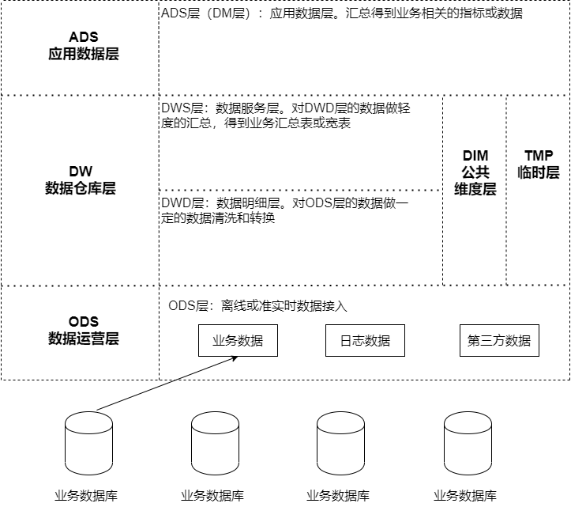
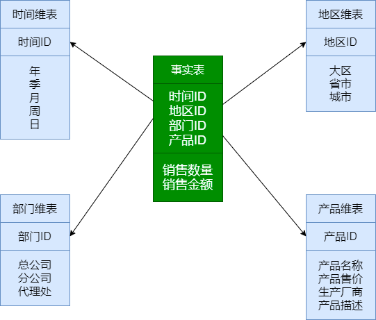
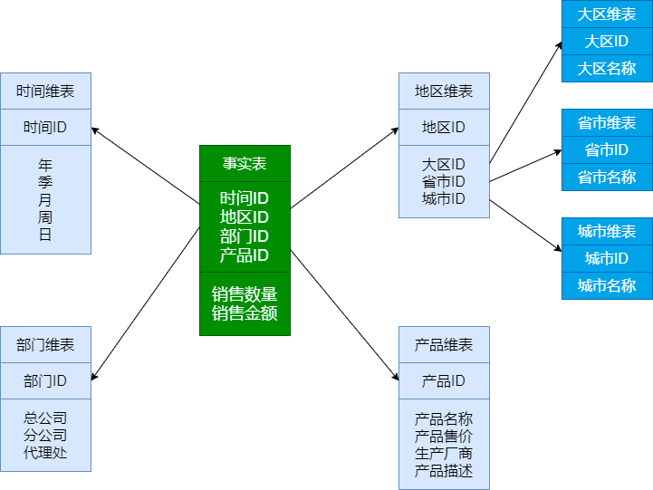
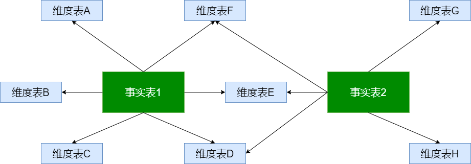
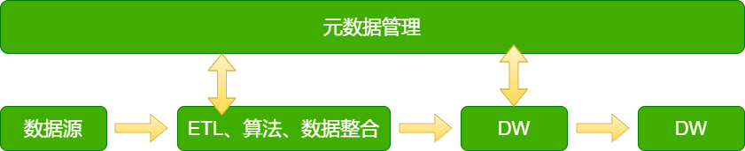
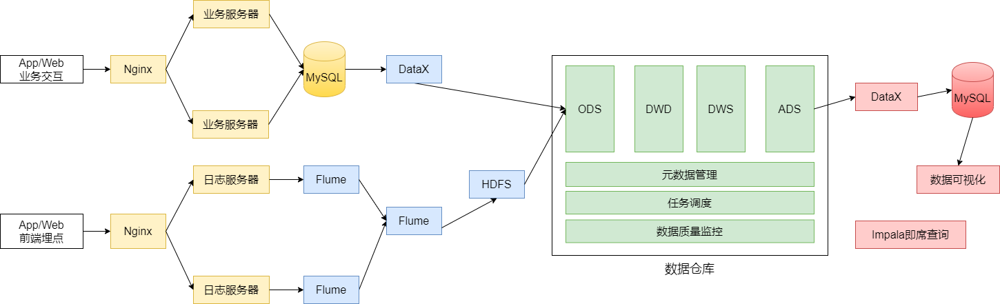
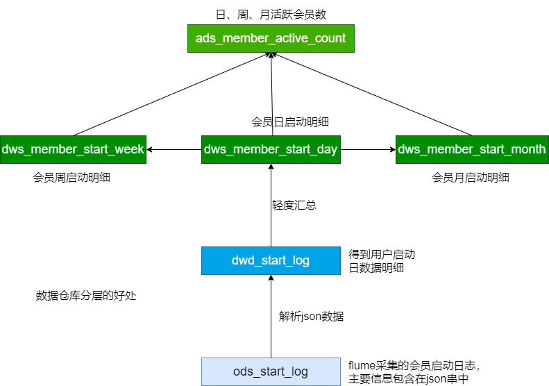

[parent](README.md)  
[TOC]  

核心交易

任务调度

血缘关系和数据历

数据质量监控

即席查询


# 数仓

> 数据仓库(DataWarehouse)是一个面向主题的(Subject Oriented)、集成的(Integrated)、相对
>
> 稳定的(Non-Volatile)、反映历史变化的(Time Variant)数据集合，用于支持管理决策(Decision-Making Support)。

数据仓库理论

数据离线仓库设计

会员活跃度分析

广告分析： 广告的效果


征信系统


**数据仓库特征**

① 面向主题的：在逻辑意义上，它是对应企业中某一宏观分析领域所涉及的分析对象

② 集成的： 从原有的分散的多个数据库、数据文件、用户日志中抽取来的，数据来源可能既有内部数据又有外部数据

从各种业务系统中集成数据

③ 稳定：数据经加工和集成进入数据仓库后是极少更新的，通常只需要定期的加载和更新。

④ 反应历史变化

业务系统不保存大量数据，数仓需要...

数据仓库中的数据是历史数据, 的数据是按照时间顺序追加的，都带有时间属性


**数仓作用**

基于数据做报表，反应企业经营情况

企业运营提供


**数据仓库与数据库的区别**

OLTP: 联机事务处理 ==> 数据库

通常对少量数据记性 crud，关心响应时间


OLAP: 联机分析处理 ==> 数据仓库

对某些主题的历史数据进行分析，支持管理决策。


数据仓库： 面向分析

引入数据冗余

面访分析（主题）设计的


数据库： 属于操作性

面向事务设计的

<p align="center">数据库与数据仓库对比</p>

| 对比内容          | 数据库                       | 数据仓库                          |
| ----------------- | ---------------------------- | --------------------------------- |
| 数据内容          | 近期值、当前值               | 历史的、归档的数据                |
| 数据目标          | 面向业务操作                 | 面向管理决策、面向分析（主 题）   |
| 数据特性          | 动态频繁更新                 | 静态、不能直接更新；定时添 加数据 |
| 数据结构          | 高度结构化、满足第三范 式    | 简单的、冗余的、满足分析的        |
| 使用频率          | 高                           | 低                                |
| 数据访问量        | 访问量大；每次访问的数据量少 | 访问量小；每次访问的数据量大      |
| 对响应时间的 要求 | 高                           | 低（不敏感）                      |


### 数据集市

> Data Mart(DM)
>
> 反应各个主题的局部性数据组织。又称为部门数据仓库。

遵循不同的标准和建设原则, 可能导致众多的数据孤岛。

### 数据建模

性能：

成本：

效率：

质量：


**E-R模型**


**维度模型**

> 实际使用较多

数据的粒度：

识别维表： 支付的渠道、在各个地域的情况、在各个时间段的情况

选择事实：


### *数据仓库分层

**分层的原因**

- 清晰的数据结构
- 将复杂的问题简单化： 分解成多个步骤，每一层都是单一的问题
- 减少重复开发: 如 json 数据的解析
- 屏蔽原始数据的异常: 只影响相关的某一层，不会向上传播；
- 方便做数据的血缘追踪：

**数据分层**



**1、数据运营层(ODS)**

Operate Data Store

数据仓库源头系统的数据<font color="green">原封不动的存储一份</font>


**2、数据仓库层(DW Data Warehouse)**

(1) 数据明细层(DWD Data Warehouse Detail)

对 ODS 层的数据做一定的数据清洗和转换

(2) 数据服务层(DWS Data Warehouse Service)

对数据进行轻度的汇总，得到业务汇总表或宽表。

(3) 公共维度层(DIM)

(4) 临时层(TMP)

**3、应用数据层(ADS Application Data Store)**

(1) ADS(DM) 层，汇总得到业务相关的指标，面向业务，可做报表。


## 数据仓库模型

### **事实表：*

主要包含数据数据，数据可汇总。

表多，数据量大

<font color="green">关注内容</font>(销售量、商品维度)


1、事务实时表

<font color="green">事务事实表记录的事务层面的事实，保存的是最原子的数据，也称“原子事实表”。</font>

2、周期快照事实表

按照天、月、年..

如： 商家的日销售表

3、累积快照事实表

完全覆盖一个事务或产品的生命周期的时间跨度。

如：订货日期、预定交货日期、实际发货日期、实际交货日期、数量、金额、运费 

如：商家本周、本月、本年累计销售表


**维度表：**

<font color="green">观察事务的角度</font>

常见的维度表： 时间维度、地域维度、商品维度


组合起来

### 星型表

> 一个事实表和多个维度表组成。



事实表包含大量数据，无数据冗余。

维度表包含一定的数据冗余。

在查询统计时，少表连接，查询效率高。

在数据冗余可接受的情况下，使用此模型较多。


### 雪花模型

> 星型模型的变种，维度表示规范化的, 去除了数据冗余。




### 事实星座

> <font color="green">共用维度表</font>




## 元数据

包含的内容

- 有哪些数据

- 数据的分布情况
- 数据类型
- 数据之间的关系
- 哪些数据使用频率高，哪些使用频率低


<font color="green">元数据贯穿大数据平台数据流动的全过程。</font>




元数据类型：

- 技术元数据： 库表模型、数据模型、SQL 程序...
- 业务元数据： 业务指标、业务术语...
- 管理元数据： 数据所有者、数据质量、数据安全...


# 电商离线数仓设计

网上商城的

- 网站前台

- 运营商后台

- 商家管理后台


分析的数据：

- 日志数据： 启动日志、点击日志(广告点击)

- 业务数据库的交易数据： 下单、提交订单、支付、退关等交易数据


分析的任务(主题)

- 会员活跃度分析
  - 每日新增会员数；每日、周、月活跃会员数；留存会员率；
- 广告业务分析主题
  - 点击次数；官港点击购买率；广告曝光率；
- 核心交易分析主题
  - 订单数、成交商品数、支付金额。


计算指标

新增会员： 

活跃会员：每日、周、月的活跃会员数

会员留存： 1日、2日、3日会员留存数，留存率


指标口径业务逻辑：

会员： 根据设备标准，Android, IOS, Ipad...

活跃会员： 打开应用，浏览xx秒，一个设备每天打开，每周打开都作为一个；按照自然周、自然月；

会员活跃率：会员数与活跃会员比例。

新增会员：第一次使用的为新会员，卸载安装的不算，自然周、自然月。

留存会员与留存率： 某段时间的新增会员，经过一段时间后忍让继续使用的，这部分会员赞当时新增会员的比例。


已知条件：

输入: 启动日志

输出：新增会员、活跃会员、留存会员

日志文件： ODS、DWD、DWS, ADS


### 数据埋点

> <font color="green">将用户的浏览、点击事件采集上报的一套数据采集的方法。</font>

一般不保存到数据库中，保存到日志文件中。

包括访问数、访客数、停留时长、浏览数、跳出率。

页面统计、统计操作。


工作流程

- 根据埋点需求完成开发（前端开发工程师）
- App/ 网页采集用户数据
- 数据上传到服务器
- 数据的清晰、加工、存储（大数据工程师）
- 数据分析得到相关的指标（大数据工程师）


相关人员

- 埋点需求：

- 埋点采集：

- 数据清洗、加工、存储：

- 数据分析：

- 前端展示：


埋点方法，前端：

- 手动埋点
- 无痕埋点： 不用开发代码实现，采用第三方统计工具，如友盟、百度移动、魔方等。


启动日志：

事件日志： 一批一批的发，或是一定时间后发。


### 数据指标体系

指标： 数据的统计值，如会员数；活跃会员数；会员留存率；广告点击量；订单金额；订单数；...

指标体系： 将指标系统的组织起来，按业务模型/标准对指标进行分类和分层。


建立指标体系的好处

- 建立指标体系实际与需求方达成一致，防止不靠谱的需求，让需求变得有条理和体系化；

- 是数据仓库建设的基石，稳定且体系化的需求，有利于数仓方案的优化和效率提升；


根据需求中，pm、业务、... 指定实时框架，三个选取原则：

-  准确
- 可解释
- 结构型


指标的构成：

- 基础指标 + [修饰词] + 时间段： 修饰词可选
- 基础指标不可再拆分，如交易额、支付金额
- 修饰词： 如搜索带来的交易
- 时间段为一个时间周期： 双十一、618...


指标体系的步骤：

- 理清业务阶段和需求： 企业的创业期、上升期、成熟发展期，不同阶段关注的核心指标不同。

- 确定核心指标： 在对应阶段找到正确的核心指标。

- 对核心指标进行维度的拆解： 本质上是监控维度核心指标。

- 指标的落地： 宣传、存档、落地。

由产品经理主导完成的。


### 架构设计

框架选型：

- Apache/ CDH, HDP, Fusion Insight(华为)

apache 完全开源免费、社区活跃、文档资料详细

复杂的版本管理，复杂的集群安装，复杂的集群运维，复杂的生态环境(版本冲突...)


第三方版本的好处

- 主要功能与社区办一致
- 版本管理清晰
- 兼容性、安全性、稳定性，通常进过大量的测试验证
- 版本更新快，每个季度、每年都有...
- 提供部署、安装、配置工具，图形化界面，提高集群部署的效率
- 运维简单


第三方版本的比较

CDH: 最成型的发行版本，有部分不开源，主要是中小型公司使用

HDP: 100% 开源

Fusion Insight: 华为 hadoop2.7.2 ，主要是国企、大型项目使用


**软件选型**

数据采集: **Flume**, Sqoop, Logstash, **DataX**, Kafka(实时)

数据存储: **HDFS**, HBase(实时)

数据计算: **Hive**, MapReduce, Tez, Spark, Flink

调度系统: **Airflow**, azkaban, Oozie

元数据管理: **Atlas**

数据质量管理: **Griffin**

即席查询：**Impala**, Kylin(中国开源), ClickHouse, Presto, Druid

其他： **MySQL**

<p align="center">产品版本选择</p>

| 产品    | 版本                  |
| ------- | --------------------- |
| Hadoop  | 2.9.2                 |
| Hive    | 2.3.7                 |
| Flume   | 1.9                   |
| DataX   | 3.0                   |
| Airflow | 1.10                  |
| Atlas   | 1.2.0                 |
| Griffin | 0.4.0                 |
| Impala  | impala-2.3.0-cdh5.5.0 |
| MySQL   | 5.7                   |


**集群规模规划**

计算能力、存储量

每日的活跃用户 500W, 平均没人每天有 100条左右日志信息；

每条日志大小 1K 左右；

不考虑历史数据，半年集群不扩容；

数据 3个副本；

离线数仓应用；


20T 的磁盘

分析的数据： 日志数据 + 业务数据

没电的日志数据量： 500w * 100 * 1K / 1024/ 1024 = 476 G...

半年需要的存储量： 500G * 3 * 180 / 1024 = 263T

通常为磁盘预留 20% ~ 30% 的控件： 260 * 1.25 = 325T

数据仓库应用有 1-2 倍的数据膨胀： 325 * 1.3 = 487.5T, 分层...

500T/20t = 25 个几点


其他未考虑： 数据压缩、业务数据

开发测试环境、生产环境，也需要一定数量的机器。


### 系统逻辑架构




### 开发规范

**数据库命名规范**

```
1 数据库命名
命名规则：数仓对应分层 
命名示例：ods / dwd / dws/ dim / temp / ads
  会员分析: ods_member, 
  广告分析: ods_ad
  
2 数仓各层对应数据库
ods层 -> ods_{业务线|业务项目}
dw层  -> dwd_{业务线|业务项目} + dws_{业务线|业务项目}
dim层 -> dim_维表
ads层 -> ads_{业务线|业务项目} (统计指标等)
临时数据 -> temp_{业务线|业务项目}

3 表命名（数据库表命名规则）
* ODS层： 命名规则：ods_{业务线|业务项目}_[数据来源类型]_{业务}

* DWD层： 命名规则：dwd_{业务线|业务项目}_{主题域}_{子业务}

* DWS层： 命名规则：dws_{业务线|业务项目}_{主题域}_{汇总相关粒度}_{汇总时间周期}

* ADS层： 命名规则：ads_{业务线|业务项目}_{统计业务}_{报表form|热门排序topN}

* DIM层： 命名规则：dim_{业务线|业务项目|pub公共}_{维度}
```


### 数据采集

> 日志文件 ==> HDFS

Flume 


日志数据采集：

- 使用taildir source 监控指定的多个目录，可以给不同目录的日志加上不同 header 
- 在每个目录中可以使用正则匹配多个文件 
- 使用自定义拦截器，主要功能是从json串中获取时间戳，加到event的header中 
- hdfs sink使用event header中的信息写数据（控制写文件的位置） 
- hdfs文件的滚动方式（基于文件大小、基于event数量、基于时间） 
- 调节flume jvm内存的分配


### ODS 层建表和数据加载

> HDFS ==> ODS ==> OWD

ODS 层的数据与源数据的格式基本相同。

定义按照 dt 进行分区。

每天添加分区的方式将已经采集到 HDFS 中的数据加载到 Hive 表中操作。

```sql
use ODS;
create external table ods.ods_start_log(
  `str` string;
)
comment '用户启动日志'
partitioned by (dt string)
location '/user/data/logs/start';
```

```sql
-- 加载数据
alter table ods.ods_start_log add partition(dt='2020-08-02');
drop table ods.ods_start_log;
```

```shell
#!/bin/bash
APP=ODS
source /etc/profile

# 不输入日期默认取昨天日期
if [ -n "$1" ]
then
  do_date=$1
else
  do_date=`date -d "-1 day" +%F`
fi

sql="alter table "$APP".ods_start_log add partition(dt='$do_date');"
hive -e "$sql"
```


### json 数据处理

Hive 处理 json 数据的方式

- 内建的函数 get_json_object、json_string
- 自定义 UDF 函数
- 使用序列化反序列化工具


**方式一: 内建的函数处理**

`get_json_object(string json_string, string path)`: 解析json字符串json_string，返回path指定的内容；

`json_tuple(jsonStr, k1, k2, ...)`: ：参数为一组键k1，k2，...和json字符串，返回值的元组。该方法比 get_json_object高效，可以在一次调用中输入多个键, 对嵌套结果的解析操作复杂；

`explode`，使用explod将Hive一行中复杂的 array 或 map 结构拆分成多行。

```sql
CREATE TABLE IF NOT EXISTS jsont1( 
  username string, 
  age int, 
  sex string, 
  json string 
) row format delimited fields terminated by ';';
load data local inpath '/data/lagoudw/data/weibo.json' overwrite into table jsont1;
```

```sql
-- get 单层值 
select username, age, sex, 
  get_json_object(json, "$.id") id, 
  get_json_object(json, "$.ids") ids, 
  get_json_object(json, "$.total_number") num 
from jsont1;
```

```sql
-- get 数组
select username, age, sex, 
  get_json_object(json, "$.id") id, 
  get_json_object(json, "$.ids[0]") ids0, 
  get_json_object(json, "$.ids[1]") ids1, 
  get_json_object(json, "$.ids[2]") ids2, 
  get_json_object(json, "$.ids[3]") ids3, 
  get_json_object(json, "$.total_number") num 
from jsont1;
```

```sql
-- json_tuple 一次处理多个字段
select json_tuple(json, 'id', 'ids', 'total_number') from jsont1;
```

含其他字段时，不能直接展开，需要使用 explod 展开

```sql
select username, age, sex, id, ids, num 
from jsont1 
lateral view json_tuple(json, 'id', 'ids', 'total_number') t1 as id, ids, num;

with tmp as( select username, age, sex, id, ids, num
            from jsont1 
            lateral view json_tuple(json, 'id', 'ids', 'total_number') t1 as id, ids, num ) 
select username, age, sex, id, ids1, num
from tmp 
lateral view explode(split(regexp_replace(ids, "\\[|\\]", ""), ",")) t1 as ids1;
```

**方式二: 使用 UDF 处理**

```sql
-- 创建临时函数
add jar /data/lagoudw/jars/cn.lagou.dw-1.0-SNAPSHOT-jar-withdependencies.jar;
create temporary function json_json_array as "cn.lagou.dw.hive.udf.ParseJsonArray";

select username, age, sex, parse_json_array(json, "ids") ids 
from jsont1;

select username, age, sex, ids1 
from jsont1 
lateral view explode(parse_json_array(json, "ids")) t1 as ids1;

select username, age, sex, id, num 
from jsont1 
lateral view json_tuple(json, 'id', 'total_number') t1 as id, num;
-- 合并
select username, age, sex, ids1, id, num 
from jsont1 
lateral view explode(parse_json_array(json, "ids")) t1 as ids1 
lateral view json_tuple(json, 'id', 'total_number') t1 as id, num;
```


**方式三: 使用SerDe处理**

对象的序列化用途：

- 把对象转换成字节序列后保存到文件中

- 对象数据的网络传送

Read : HDFS files => InputFileFormat => <key, value> => Deserializer => Row object

Write : Row object => Seriallizer => <key, value> => OutputFileFormat => HDFS files

```json
{"id": 1,"ids": [101,102,103],"total_number": 3}
{"id": 2,"ids": [201,202,203,204],"total_number": 4}
{"id": 3,"ids": [301,302,303,304,305],"total_number": 5}
{"id": 4,"ids": [401,402,403,304],"total_number": 5}
{"id": 5,"ids": [501,502,503],"total_number": 3}
```

```sql
create table jsont2(
  id int,
  ids array<string>,
  total_number int
)
ROW FORMAT SERDE 'org.apache.hive.hcatalog.data.JsonSerDe';
load data local inpath '/data/lagoudw/data/json2.dat' into table jsont2;
```


**JSON 处理方式比较**

1、简单格式的json数据，使用 `get_json_object`、`json_tuple` 处理

2、对于嵌套数据类型，可以使用 UDF

3、纯 json 串可使用 JsonSerDe 处理更简单


### DWD 层建表和数据加载

>  表的格式：parquet、分区表
>
> `inserter override` 避免相同的插入多次..
>
> 将 json 串提取出来轻度成表

加载时指定分区字段 dt。

```sql
use DWD;
drop table if exists dwd.dwd_start_log;
CREATE TABLE dwd.dwd_start_log(
  `device_id` string,
  `area` string,
  `uid` string,
  `app_v` string,
  `event_type` string,
  `os_type` string,
  `channel` string,
  `language` string,
  `brand` string,
  `entry` string,
  `action` string,
  `error_code` string
)
PARTITIONED BY (dt string)
STORED AS parquet;
```

```shell
#！/bin/bash
source /etc/profile

# 可以输入日期；如果未输入日期取昨天的时间
if [ -n "$1" ]
then
	do_date=$1
else
	do_date=`date -d "-1 day" +%F`
fi

# 定义要执行的SQL
sql="
with tmp as(
  select split(str, ' ')[7] line
  from ods.ods_start_log
  where dt='$do_date'
)
insert overwrite table dwd.dwd_start_log
partition(dt='$do_date')
select get_json_object(line, '$.attr.device_id'),
  get_json_object(line, '$.attr.area'),
  get_json_object(line, '$.attr.uid'),
  get_json_object(line, '$.attr.app_v'),
  get_json_object(line, '$.attr.event_type'),
  get_json_object(line, '$.attr.os_type'),
  get_json_object(line, '$.attr.channel'),
  get_json_object(line, '$.attr.language'),
  get_json_object(line, '$.attr.brand'),
  get_json_object(line, '$.app_active.json.entry'),
  get_json_object(line, '$.app_active.json.action'),
  get_json_object(line, '$.app_active.json.error_code')
from tmp;
"
hive -e "$sql"
```


### 活跃会员

活跃会员：打开应用的会员即为活跃会员；

新增会员：第一次使用应用的用户，定义为新增会员；

留存会员：某段时间的新增会员，经过一段时间后，仍继续使用应用认为是留存会

员；

<font color="green">活跃会员指标需求：每日、每周、每月的活跃会员数</font>

DWD: 会员的每日启动信息明细

DWS: 每日活跃会员信息(*)、每周活跃会员信息、每月活跃信息

ADS: 每日、每周、每月活跃会员数

```
ADS 表
daycnt weekcnt monthcnt dt
```


处理过程：

1、建表（每日、每周、每月活跃会员信息）

2、每日启动明细 ===> 每日活跃会员

3、每日活跃会员 => 每周活跃会员；每日活跃会员 => 每月活跃会员

4、汇总生成ADS层的数据


创建 DWS 层表

剔除无用的字段

周、月增加相应的 week、month 字段

```sql
use dws;
drop table if exists dws.dws_member_start_day;
create table dws.dws_member_start_day(
  `device_id` string,
  `uid` string,
  `app_v` string,
  `os_type` string,
  `language` string,
  `channel` string,
  `area` string,
  `brand` string
) COMMENT '会员日启动汇总'
partitioned by(dt string)
stored as parquet;

drop table if exists dws.dws_member_start_week;
create table dws.dws_member_start_week(
  `device_id` string,
  `uid` string,
  `app_v` string,
  `os_type` string,
  `language` string,
  `channel` string,
  `area` string,
  `brand` string,
  `week` string
) COMMENT '会员周启动汇总'
PARTITIONED BY (`dt` string)
stored as parquet;

drop table if exists dws.dws_member_start_month;
create table dws.dws_member_start_month(
  `device_id` string,
  `uid` string,
  `app_v` string,
  `os_type` string,
  `language` string,
  `channel` string,
  `area` string,
  `brand` string,
  `month` string
) COMMENT '会员月启动汇总'
PARTITIONED BY (`dt` string)
stored as parquet;
```

还在 DWS 层数据

collect_set

`dt >= date_add(next_day('$do_date', 'mo'), -7) and dt <= '$do_date'`: 每周，当周周一到当前日

`dt >= date_format('$do_date', 'yyyy-MM-01') and dt <= '$do_date'`: 每周，当月1号到当前日

```shell
#！/bin/bash
source /etc/profile

# 可以输入日期；如果未输入日期取昨天的时间
if [ -n "$1" ]
then
	do_date=$1
else
	do_date=`date -d "-1 day" +%F`
fi

# 定义要执行的SQL
# 汇总得到每日活跃会员信息；每日数据汇总得到每周、每月数据
sql="
insert overwrite table dws.dws_member_start_day
partition(dt='$do_date')
select device_id,
  concat_ws('|', collect_set(uid)),
  concat_ws('|', collect_set(app_v)),
  concat_ws('|', collect_set(os_type)),
  concat_ws('|', collect_set(language)),
  concat_ws('|', collect_set(channel)),
  concat_ws('|', collect_set(area)),
  concat_ws('|', collect_set(brand))
from dwd.dwd_start_log
where dt='$do_date'
group by device_id;

-- 汇总得到每周活跃会员
insert overwrite table dws.dws_member_start_week
partition(dt='$do_date')
select device_id,
  concat_ws('|', collect_set(uid)),
  concat_ws('|', collect_set(app_v)),
  concat_ws('|', collect_set(os_type)),
  concat_ws('|', collect_set(language)),
  concat_ws('|', collect_set(channel)),
  concat_ws('|', collect_set(area)),
  concat_ws('|', collect_set(brand)),
	date_add(next_day('$do_date', 'mo'), -7)
from dws.dws_member_start_day
where dt >= date_add(next_day('$do_date', 'mo'), -7)
	and dt <= '$do_date'
group by device_id;

-- 汇总得到每月活跃会员
insert overwrite table dws.dws_member_start_month
partition(dt='$do_date')
select device_id,
  concat_ws('|', collect_set(uid)),
  concat_ws('|', collect_set(app_v)),
  concat_ws('|', collect_set(os_type)),
  concat_ws('|', collect_set(language)),
  concat_ws('|', collect_set(channel)),
  concat_ws('|', collect_set(area)),
  concat_ws('|', collect_set(brand)),
  date_format('$do_date', 'yyyy-MM')
from dws.dws_member_start_day
where dt >= date_format('$do_date', 'yyyy-MM-01')
	and dt <= '$do_date'
group by device_id;
"
hive -e "$sql"
```


**创建 ADS 层表**

```sql
drop table if exists ads.ads_member_active_count;
create table ads.ads_member_active_count(
  `day_count` int COMMENT '当日会员数量',
  `week_count` int COMMENT '当周会员数量',
  `month_count` int COMMENT '当月会员数量'
) COMMENT '活跃会员数'
partitioned by(dt string)
row format delimited fields terminated by ',';
```


加载 ADS 层数据

script/member_active/ads_load_member_active.sh

```shell
#!/bin/bash
source /etc/profile

if [ -n "$1" ] ;then
	do_date=$1
else
	do_date=`date -d "-1 day" +%F`
fi
sql="
with tmp as(
select 'day' datelabel, count(*) cnt, dt
    from dws.dws_member_start_day
  where dt='$do_date'
  group by dt
  union all
  select 'week' datelabel, count(*) cnt, dt
    from dws.dws_member_start_week
  where dt='$do_date'
  group by dt
  union all
  select 'month' datelabel, count(*) cnt, dt
    from dws.dws_member_start_month
  where dt='$do_date'
  group by dt
)
insert overwrite table ads.ads_member_active_count
partition(dt='$do_date')
select sum(case when datelabel='day' then cnt end) as day_count,
	sum(case when datelabel='week' then cnt end) as week_count,
	sum(case when datelabel='month' then cnt end) as month_count
from tmp
group by dt;
"
hive -e "$sql"
```
方式二：
```shell
#!/bin/bash
source /etc/profile
if [ -n "$1" ] ;then
	do_date=$1
else
	do_date=`date -d "-1 day" +%F`
fi
sql="
insert overwrite table ads.ads_member_active_count
partition(dt='$do_date')
select daycnt, weekcnt, monthcnt
	from (select dt, count(*) daycnt
			from dws.dws_member_start_day
		where dt='$do_date'
		group by dt
		) day join
		(select dt, count(*) weekcnt
			from dws.dws_member_start_week
		where dt='$do_date'
		group by dt
		) week on day.dt=week.dt
		join
		(select dt, count(*) monthcnt
			from dws.dws_member_start_month
		where dt='$do_date'
		group by dt
		) month on day.dt=month.dt;
"
hive -e "$sql"
```



脚本执行次序：

```
ods_load_startlog.sh
dwd_load_startlog.sh
dws_load_member_start.sh
ads_load_member_active.sh
```


### 新增会员

留存会员： 某段时间内新增的会员，经过一定时间后，仍继续使用应用的；

新增会员： 安装后卸载再次安装的不算做新增

DWD: 会员每日启动(95-110)； 所有会员的信息(1-100)；


计算步骤：

计算新增会员

更新所有会员信息


改进后方法：

在所有会员中增加时间列，标示成为新增会员的时间；

只需要一整表

将新增会员插入到所有表中

```sql
-- 日启动表 => DWS
drop table t1;
create table t1(id int, dt string)
row format delimited fields terminated by ',';
load data local inpath '/data/lagoudw/data/t10.dat' into table
t1;
4,2020-08-02
5,2020-08-02
6,2020-08-02
7,2020-08-02
8,2020-08-02
9,2020-08-02

-- 全量数据 => DWS
drop table t2;
create table t2(id int, dt string)
row format delimited fields terminated by ',';
load data local inpath '/data/lagoudw/data/t2.dat' into table t2;
1,2020-08-01
2,2020-08-01
3,2020-08-01
4,2020-08-01
5,2020-08-01
6,2020-08-01

-- 找出 2020-08-02 的新用户
select t1.id, t1.dt, t2.id, t2.dt
from t1 left join t2 on t1.id=t2.id
  where t1.dt="2020-08-02";
select t1.id, t1.dt
  from t1 left join t2 on t1.id=t2.id
where t1.dt="2020-08-02"
  and t2.id is null;
-- 将找到 2020-08-02 新用户数据插入t2表中
insert into table t2
select t1.id, t1.dt
  from t1 left join t2 on t1.id=t2.id
where t1.dt="2020-08-02"
  and t2.id is null;
-- 检查结果
select * from t2;
-- t1 加载 2020-08-03 的数据
14,2020-08-03
15,2020-08-03
16,2020-08-03
17,2020-08-03
18,2020-08-03
19,2020-08-03
load data local inpath '/data/lagoudw/data/t3.dat' into table t1;
-- 将找到 2020-08-03 新用户数据插入t2表中
insert into table t2
select t1.id, t1.dt
  from t1 left join t2 on t1.id=t2.id
where t1.dt="2020-08-03"
  and t2.id is null;
-- 检查结果
select * from t2;
```


**创建 DWS 层表**

无需进行分区

```sql
drop table if exists dws.dws_member_add_day;
create table dws.dws_member_add_day (
  `device_id` string,
  `uid` string,
  `app_v` string,
  `os_type` string,
  `language` string,
  `channel` string,
  `area` string,
  `brand` string,
  `dt` string
) COMMENT '每日新增会员明细'
stored as parquet;
```

**加载 DWS 数据**

script/member_active/dws_load_member_add_day.sh

```shell
#!/bin/bash
source /etc/profile
if [ -n "$1" ]
then
do_date=$1
else
do_date=`date -d "-1 day" +%F`
fi
sql="
insert into table dws.dws_member_add_day
select t1.device_id,
  t1.uid,
  t1.app_v,
  t1.os_type,
  t1.language,
  t1.channel,
  t1.area,
  t1.brand,
  '$do_date'
from dws.dws_member_start_day t1 left join
dws.dws_member_add_day t2
on t1.device_id=t2.device_id
where t1.dt='$do_date'
	and t2.device_id is null;
"
hive -e "$sql"
```


**创建 ADS 层表**

```sql
drop table if exists ads.ads_new_member_cnt;
create table ads.ads_new_member_cnt
(
`cnt` string
)
partitioned by(dt string)
row format delimited fields terminated by ',';
```

加载ADS层数据

script/member_active/ads_load_member_add.sh

```shell
#!/bin/bash
source /etc/profile
if [ -n "$1" ] ;then
do_date=$1
else
do_date=`date -d "-1 day" +%F`
fi
sql="
insert overwrite table ads.ads_new_member_cnt
partition (dt='$do_date')
select count(1)
  from dws.dws_member_add_day
where dt = '$do_date'
"
hive -e "$sql"
```


  
