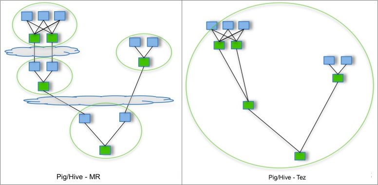

# Tez

> Hortonworks在2014年左右发布, 让 Hive支持更多 SQL, 让 Hive支持更多SQL。

优化Hive的请求执行计划

引入新的列式文件格式（ORC文件）

引入新的runtime框架——Tez


核心思想是将Map和Reduce两个操作进一步拆分，分解后的元操作可以任意灵活组合，产生新的操作。

Tez+Hive仍采用 MapReduce 计算框架，但对DAG的作业依赖关系进行了裁剪，并

将多个小作业合并成一个大作业，不仅减少了计算量，而且写HDFS次数也大大减

少。

```html
     Input
     Processor
Map  Sort
     Merge
     Output

         Input
         Shuffle
Reduce   Sort
         Merge
         Processor
         Output
```


Tez是Apache开源的<font color="green">支持**DAG**（有向无环图）作业的计算框架</font>，是支持Hadoop 2.x

的重要引擎。


