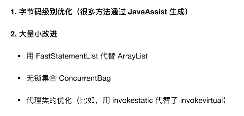
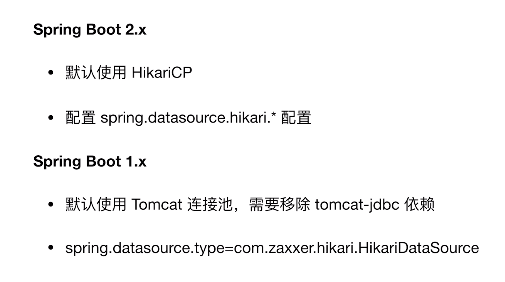
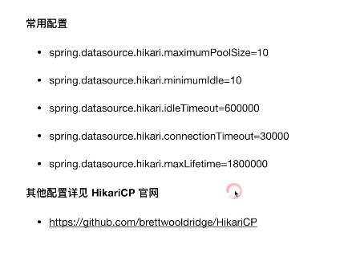
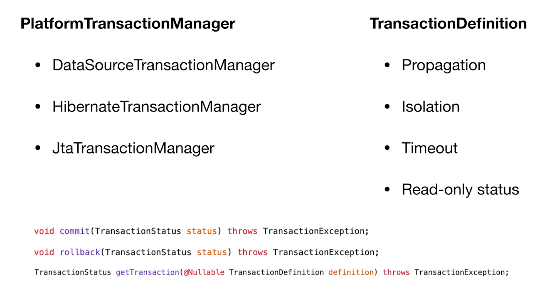

[toc]


# Spring

**优点**

基于 POJO  的轻量级和最小侵入性编程；

通过依赖注入和面向接口实现松耦合；

基于切面和惯例进行声明式编程；

通过切面和模板减少样板式代码；


核心包 bean、core、context、expression

Spring Core: 基础,可以说 Spring 其他所有的功能都需要依赖于该类库。主要提供 IoC 依赖 注⼊功能。

Spring Aspects: 为与AspectJ的集成提供⽀持。

Spring AOP ：提供了⾯向切⾯的编程实现。

Spring JDBC : Java数据库连接。

Spring JMS ：Java消息服务。

Spring ORM : ⽤于⽀持Hibernate等ORM⼯具。

Spring Web : 为创建Web应⽤程序提供⽀持。

Spring Test : 提供了对 JUnit 和 TestNG 测试的⽀持。


## ***核心模块**

### 容器

 **控制反转(IOC)：**

**<font color="green">将原本在程序中⼿动创建对象的控制权，交由Spring框架来管理。</font>**

**<font color="green">IoC 容器是 Spring ⽤来实现 IoC 的载体， IoC 容器实际上就是个Map(key，value), Map 中存放的是各种对象。</font>**

传统的java开发模式中，当需要一个对象时，我们会自己使用new或者getInstance等直接或者间接调用构造方法创建一个对象，而在Spring开发模式中，Spring容器使用了工厂模式为我们创建了所需要的对象，我们使用时不需要自己去创建，直接调用Spring为我们提供的对象即可，这就是控制反转的思想。

实例化一个java对象有三种方式：使用类构造器，使用静态工厂方法，使用实例工厂方法，当使用spring时我们就不需要关心通过何种方式实例化一个对象，spring通过控制反转机制自动为我们实例化一个对象。


对象的创建以及依赖关系可以由 spring 完成以及注入；

反转控制就是反转了对象的创建方式是，从我们字节 new，交给了 spring ；


**依赖注入(DI)：**

Spring使用 Java bean 对象的Set方法或者带参数的构造方法为我们在创建所需对象时将其属性自动设置所需要的值的过程 就是依赖注入的基本思想。

几种注入方式：

① set 方式注入；

② 构造函数注入；

③ p 命名空间注入；

④ spel 表达式注入；

 

注入的类型：

值；

引用类型；

集合类型；


**工厂**

ApplicationContext

ClassPathXmlApplicationContext | FileSystemXmlApplicationContext

```java
ApplicationContext ac = new 
ClassPathXmlApplicationContext("cn/itcast/b_create/applicationContext.xml");
User u = (User) ac.getBean("user");
```


(1) BeanFactory 

BeanFactory 采用懒加载的方式实现， 每次在获得对象时才会创建对象，  懒汉方式创建；

BeanFactory 面向 Spring 本身， ApplicationContext 面向使用 Spring 框架的开发者；


(2) ApplicationContext

容器启动时，就会创建所有的配置对象
加载配置文件  ClassPathXmlApplicationContext;

面向的是 Spring 框架的开发者；


### **Bean**

**创建方式**

类构造器；

静态工厂方法；

实例工厂方法；

```
factory-method
factory-bean
```


**属性注入方式**

① Set注入
② 构造器注入
③ p 名称空间注入，需要引入对应的 xml 约束；
④ 实例工厂的方法注入


值类型的注入：   @Value("")

- 在成员变量的上面， 通过反射的Field赋值； 破坏了对象的封装性

- 在set方法上面  ，  *通过**set**方法赋值*，推荐使用


对象类型注入：

@Autowired

原理：自动装配，根据**类型**来检测扫描容器中的所有的符合属性类型的对象，找到并赋值。

**不足：**对象多时，car注册多次。匹配多个类型一致的对象.将无法选择具体注入哪一个对象。

解决：配合 @Qualifier("car2")

@Autowired + @Qualifier

@Resource(name="")

```java
@Repository("user")
@Scope(scopeName="singleton")
public class User {
	private String name;
	@Value("18")
	private Integer age;
	@Autowired
	private House hou;
	@Resource(name="car")
	private Car car;
}
```

```xml
<bean  name="user" class="cn.itcast.bean.User" >
	<property name="name" value="tom" ></property>
	<property name="age"  value="18" ></property>
	<property name="car"  ref="car" ></property>
</bean>
```

```xml
<bean name="user2" class="cn.itcast.bean.User" >
	<constructor-arg name="name" index="0" type="java.lang.Integer" value="999"  ></constructor-arg>
	<constructor-arg name="car" ref="car" index="1" ></constructor-arg>
</bean>
```

```xml
<bean  name="user3" class="cn.itcast.bean.User" p:name="jack" 
p:age="20" p:car-ref="car"  >
</bean>
```

```xml
<bean  name="user4" class="cn.itcast.bean.User" >
	<property name="name" value="#{user.name}" ></property>
	<property name="age" value="#{user3.age}" ></property>
	<property name="car" ref="car" ></property>
</bean>
```

集合的注入：

```xml
<property name="arr">
    <array>
        <value>tom</value>
        <value>jerry</value>
        <ref bean="user4" />
    </array>
</property>
<property name="list"  >
    <list>
        <value>jack</value>
        <value>rose</value>
        <ref bean="user3" />
    </list>
</property>
<property name="map"  >
    <map>
        <entry key="url" value="jdbc:mysql:///crm" ></entry>
        <entry key="user" value-ref="user4"  ></entry>
        <entry key-ref="user3" value-ref="user2"  ></entry>
    </map> 
</property>
<property name="prop"  >
    <props>
        <prop key="driverClass">com.jdbc.mysql.Driver</prop>
        <prop key="userName">root</prop>
        <prop key="password">1234</prop>
    </props>
</property>
```


**Bean 的 scope 属性**

① singleton：单例模式(多线程下不安全)

② prototype:  原型模式每次使用时创建

每次通过Spring容器获取prototype定义的bean时，容器都将创建一个新的Bean实例，每个Bean实例都有自己的属性和状态，而singleton全局只有一个对象。根据经验，对有状态的bean使用prototype作用域，而对无状态的bean使用singleton作用域。

③ Request：一次request一个实例

request：在一次Http请求中，容器会返回该Bean的同一实例。而对不同的Http请求则会产生新的Bean，而且该bean仅在当前Http Request内有效,当前Http请求结束，该bean实例也将会被销毁。

④ session：在一次Http Session中，容器会返回该Bean的同一实例。而对不同的Session请求则会创建新的实例，该bean实例仅在当前Session内有效。同Http请求相同，每一次session请求创建新的实例，而不同的实例之间不共享属性，且实例仅在自己的session请求内有效，请求结束，则实例将被销毁。

⑤ global Session：在一个全局的Http Session中，容器会返回该Bean的同一个实例，仅在使用portlet context时有效。


***Bean 的生命周期**

配置的 init-method、destory-method 对应的注解为  @PostConstruct、@PreDestroy


1.Spring容器从 XML 文件中读取 Bean 的定义，并反射实例化 Bean。

2.Spring根据 Bean 的定义填充所有的属性。

3.如果Bean实现了BeanNameAware 接口，Spring 传递 bean 的 ID 到 setBeanName 方法。

4.如果 Bean 实现了 BeanFactoryAware 接口， Spring 传递 beanfactory 给 setBeanFactory 方法。

5.如果有任何与 bean 相关联的 BeanPostProcessors，Spring 会在 postProcesserBeforeInitialization() 方法内调用它们。

6.如果 bean 实现 IntializingBean了，调用它的 afterPropertySet 方法，如果 bean 声明了初始化方法，调用此初始化方法。

7.如果有 BeanPostProcessors 和 bean 关联，这些 bean 的  postProcessAfterInitialization() 方法将被调用。

8.如果 bean 实现了 DisposableBean，它将调用 destroy() 方法。


**Q: Spring 中的单例 bean 的线程安全问题**

单例 bean 存在线程问 题，主要是因为当多个线程操作同⼀个对象的时候，对这个对象的⾮静态成员变量的写操作会存在线程 安全问题。

解决方案：

- 在Bean对象中尽量避免定义可变的成员变量
- 在类中定义⼀个ThreadLocal成员变量，将需要的可变成员变量保存在 ThreadLocal 中（推荐的 ⼀种⽅式）。


**Q: @Component 和 @Bean 的区别是什么？**

(1) 作⽤对象不同:  @Component 注解作⽤于类，⽽ @Bean 注解作⽤于⽅法。

(2) @Component 通常是通过类路径扫描来⾃动侦测以及⾃动装配到Spring容器中（我们可以使⽤ @ComponentScan 注解定义要扫描的路径从中找出标识了需要装配的类⾃动装配到 Spring 的 bean 容器中）。 @Bean 注解通常是我们在标有该注解的⽅法中定义产⽣这个 bean, @Bean 告 诉了Spring这是某个类的示例，当我需要⽤它的时候还给我。

(3) 功能特性： @Bean 注解⽐ Component 注解的⾃定义性更强，⽽且很多地⽅我们只能通过 @Bean 注解 来注册bean。⽐如当我们引⽤第三⽅库中的类需要装配到 Spring 容器时，则只能通过 @Bean 来实现。


**Spring 中的设计模式**
1.代理模式—Spring中两种代理方式，若目标对象实现了若干接口，优先 JDK 的动态代理，若目标对象没有实现任何接口，spring使用CGLIB库生成目标对象的子类。
2.单例模式—在spring配置文件中定义的bean默认为单例模式。
3.模板方法模式—用来解决代码重复的问题。
    比如： RestTemplate, JmsTemplate, JpaTemplate。
4.前端控制器模式—Srping提供了DispatcherServlet来对请求进行分发。
5.视图帮助(View Helper )—Spring提供了一系列的JSP标签，高效宏来辅助将分散的代码整合在视图里。
6.依赖注入—贯穿于BeanFactory/ApplicationContext接口的核心理念。
7.工厂模式—在工厂模式中，我们在创建对象时不会对客户端暴露创建逻辑，并且是通过使用一个共同的接口来指向新创建的对象。Spring中使用BeanFactory用来创建对象的实例。


**(1) 代理**

SpringAOP用到了什么代理？
JDK动态代理:对实现了接口的类生成代理
CGLib代理机制:对类生成代理


动态代理与静态代理区别？
静态代理：由程序员创建或特定工具自动生成源代码，再对其编译。在程序运行前，代理类的.class文件就已经存在了。 
动态代理：在程序运行时，运用反射机制动态创建而成。 


(2) 工厂模式


**基于注解开发**

Spring有那些注解？
@Autowired(按类型注入)
@Service(标示为注入为服务层)
@Resource(按名称注入)
@Controller(标识控制器bean id) 
@RequestMapping(表示映射URL路径)


(1) @Resource 和 @Autowired

@Resource和@Autowired都是做bean的注入时使用,都可以写在字段上，或者是setter方法上

@Autowired注解是按照类型(byType)装配依赖对象(由Spring提供)

如果在此基础上想通过byName来装配，可以结合@Qualifier注解来一起使用。

① @Resource 是 javax.annotation.Resource 下的，Spring 支持该注解的注入。


@Resource默认按照byName自动注入

@Resource有两个重要的属性，name和type

@Resource如果写属性name，则按照byName来装配，如果属性为type，则按照byType来装配，不写按照默认的方式来装配(byName)


② @Autowired

是按照类型(byType)装配依赖对象，默认情况下它要求依赖对象必须存在，如果允许null值，可以设置它的required属性为false。如果我们想使用按照名称(byName)来装配，可以结合@Qualifier注解一起使用。如下：

```java
public class TestServiceImpl {
    @Autowired
    @Qualifier("userDao")
    private UserDao userDao; 
}
```


配置：

@ConfigurationProperty

**Environment**

```java
interface Environment extends PropertyResolver {
    String[] getActiveProfiles();
    String[] getDefaultProfiles();
    boolean acceptsProfiles(String... var1);
}
```


单数据源


多数据源

配置管理

事务管理


@Primary 类型的 Bean

排除


HikariCP 数据源

JDBC 连接池


字节码级别： 字节码操作减少









### AOP

**面向切面编程(AOP)**

在面向对象编程(OOP)思想中，我们将事物纵向抽象成一个个的对象。而在面向切面编程中，我们将一个个对象某些类似的方面横向抽象成一个切面，对这个切面进行一些如权限验证，事物管理，记录日志等公用操作处理的过程就是面向切面编程的思想。

**<font color="green">为业务模块所共同调⽤ 的逻辑或责任(例如事务处理、⽇志管理、权限控制等)封装起来</font>**，便于**<font color="green">减少系统的重复代码，降低模块间的耦合度</font>**，并**<font color="green">有利于未来的可拓展性和可维护性</font>**。

本质上生成动态代理对象，代替手动创建的方式；


**Q: Spring AOP 和 AspectJ AOP 有什么区别？**

Spring AOP 属于运⾏时增强，⽽ AspectJ 是编译时增强。 Spring AOP 基于代理(Proxying)，⽽ AspectJ 基于字节码操作(Bytecode Manipulation)。

如果我们的切⾯⽐较少，那么两者性能差异不⼤。但是，当切⾯太多的话，最好选择 AspectJ ，它⽐ Spring AOP 快很多。


**AOP 中的概念：**

切面(Aspect)： 切入点+通知

通知(Advice)：通知/增强, 增强的代码

切入点(Pointcut)：

目标对象(Target)：

连接点(Joinpoint) ： 目标对象中可以增强的方法，实际增强的为 Poincut；

织入(Weaving)： 将通知应用到切入点的过程

代理(Proxy)： 将通知织入到目标对象后生成代理对象


**五种通知类型：**

1> 前置通知 

2> 后置通知

3> 环绕通知(传入ProceedingJoinPoint)

4> 异常通知

5> 后置通知， 出现异常任然调用

```java
@Aspect
@Component
@Slf4j
public class LogAspect {

    @Pointcut("execution(* com.group.evaluate.controller..*Controller.*(..))")
    public void requestLog() {}

    @Before("requestLog()")
    public void beforeMethod(JoinPoint joinPoint) {
        HttpServletRequest request = ((ServletRequestAttributes) (RequestContextHolder.currentRequestAttributes())).getRequest();
        log.info("URL: {}", request.getRequestURL());
        log.info("IP: {}", request.getRemoteAddr());
    }
}
```

IoC 和 DI的区别？

IoC 控制反转，指将对象的创建权，反转到Spring容器 ， DI 依赖注入，指Spring创建对象的过程中，将对象依赖属性通过配置进行注入。

一个是创建权，一个是对象的属性注入。


说SpringIOC、SpringAOP?
SpringIOC ,其实就是依赖注入、控制反转。相当于把每个bean与bean之间的关系交给第三方容器管理。而这个容器就是spring。
单例模式，工厂模式

SpringAOP 面向切面的编程，或AOP，是一种编程技术，允许程序模块化横向切割关注点，或横切典型的责任划分，如日志和事务管理。 SpringAop 就是用 Java的动态代理
代理模式，反射

 


Spring的底层实现机制是什么？
使用Demo4j(解析XML)+ Java反射机制
Demo4j 其实就是解析XML。使用反射机制实例化bean。


## 事务

Spring 管理事务的⽅式有⼏种？

- 编程式事务，在代码中硬编码。(不推荐使⽤)

- 声明式事务，在配置⽂件中配置（推荐使⽤） 

   

声明式事务⼜分为两种：

- 基于XML的声明式事务

- 基于注解的声明式事务


**TransactionDefinition 定义了五个表示隔离级别的常量**

- TransactionDefinition.ISOLATION_DEFAULT: 使⽤后端数据库默认的隔离级别，Mysql 默认采 ⽤的 REPEATABLE_READ隔离级别 Oracle 默认采⽤的 READ_COMMITTED隔离级别. 

- TransactionDefinition.ISOLATION_READ_UNCOMMITTED: 最低的隔离级别，允许读取尚未提交的 数据变更，可能会导致脏读、幻读或不可重复读 

- TransactionDefinition.ISOLATION_READ_COMMITTED: 允许读取并发事务已经提交的数据，可以 阻⽌脏读，但是幻读或不可重复读仍有可能发⽣ 

- TransactionDefinition.ISOLATION_REPEATABLE_READ: 对同⼀字段的多次读取结果都是⼀致 的，除⾮数据是被本身事务⾃⼰所修改，可以阻⽌脏读和不可重复读，但幻读仍有可能发⽣。 

- TransactionDefinition.ISOLATION_SERIALIZABLE: 最⾼的隔离级别，完全服从ACID的隔离级 别。所有的事务依次逐个执⾏，这样事务之间就完全不可能产⽣⼲扰，也就是说，该级别可以防 ⽌脏读、不可重复读以及幻读。但是这将严重影响程序的性能。通常情况下也不会⽤到该级别。


**事务的传播行为**

| 传播性                    | 值   | 支持当前事务 | 描述                                                         |
| ------------------------- | ---- | ------------ | ------------------------------------------------------------ |
| PROPAGATION_REQUIRED      | 0    | ✔️            | 当前有事务就用当前的,没有就用新的                            |
| PROPAGATION_SUPPORTS      | 1    | ✔️            | 事务可有可无,不是必须的。<br>如果当前存在事务，则加⼊该事务；如果当 前没有事务，则以⾮事务的⽅式继续运⾏。 |
| PROPAGATION_MANDATORY     | 2    | ✔️            | 如果当前存在事务，则加⼊该事务；如果当 前没有事务，则抛出异常。 |
| PROPAGATION_REQUIRES_NEW  | 3    | ×            | 创建⼀个新的事务，如果当前存在事 务，则把当前事务挂起。      |
| PROPAGATION_NOT_SUPPORTED | 4    | ×            | 以⾮事务⽅式运⾏，如果当前存在事 务，则把当前事务挂起。      |
| PROPAGATION_NEVER         | 5    | ×            | 以⾮事务⽅式运⾏，如果当前存在事务，则抛出异常。             |
| PROPAGATION_NESTED        | 6    |              | 如果当前存在事务，则创建⼀个事务作为当前 事务的嵌套事务来运⾏；如果当前没有事务，则该取值等价于 TransactionDefinition.PROPAGATION_REQUIRED。 |


**@Transactional(rollbackFor = Exception.class)注解**

当 @Transactional 注解作⽤于类上时，该类的所有 public ⽅法将都具有该类型的事务属性，同 时，我们也可以在⽅法级别使⽤该标注来覆盖类级别的定义。如果类或者⽅法加了这个注解，那么这个 类⾥⾯的⽅法抛出异常，就会回滚，数据库⾥⾯的数据也会回滚。

在 @Transactional 注解中如果不配置 rollbackFor 属性,那么事物只会在遇 到 RuntimeException 的时候才会回滚,加上 rollbackFor=Exception.class ,可以让事物在遇到

⾮运⾏时异常时也回滚。





编程式事务

声明式事务


隔离级别，默认为数据库中默认的


保证各平台的事务规范(一致性)
问题：在不同平台，操作事务的代码各不相同，
解决：spring提供一个接口来形成规范，
PlatformTransactionManager接口


**核心对象：** 事务管理中最为核心的对象时TransactionManager


spring管理事务的属性介绍：

隔离级别

是否只读(true 只读；false 可操作)

事务传播行为


Spring支持两种类型的事务管理：

1.编程式事务管理：这意味你通过编程的方式管理事务，给你带来极大的灵活性，但是难维护。

2.声明式事务管理：这意味着你可以将业务代码和事务管理分离，你只需用注解和XML配置来管理事务。


**传播特性**

   事务属性的种类：   传播行为、隔离级别、只读和事务超时

 

a)   传播行为定义了被调用方法的事务边界。

 

7 种传播行为：


PROPAGATION_REQUIRED

表示当前方法必须运行在一个事务中，如果当前存在一个事务，那么该方法运行在这个事务中，否则，将创建一个新的事务。为 Spring 默认的传播行为。


PROPERGATION_MANDATORY

表示方法必须运行在一个事务中，如果当前事务不存在，就抛出异常

PROPAGATION_NESTED

表示如果当前事务存在，则方法应该运行在一个嵌套事务中。否则，它看起来和 PROPAGATION_REQUIRED 看起来没什么俩样

PROPAGATION_NEVER

表示方法不能运行在一个事务中，否则抛出异常

PROPAGATION_NOT_SUPPORTED

表示方法不能运行在一个事务中，如果当前存在一个事务，则该方法将被挂起


PROPAGATION_REQUIRES_NEW

表示当前方法必须运行在自己的事务中，如果当前存在一个事务，那么这个事务将在该方法运行期间被挂起

PROPAGATION_SUPPORTS

表示当前方法不需要运行在一个是事务中，但如果有一个事务已经存在，该方法也可以运行在这个事务中

 


 

b)   隔离级别

在操作数据时可能带来 3 个副作用，分别是脏读、不可重复读、幻读。为了避免这 3 中副作用的发生，在标准的 SQL 语句中定义了 4 种隔离级别，分别是未提交读、已提交读、可重复读、可序列化。而在 spring 事务中提供了 5 种隔离级别来对应在 SQL 中定义的 4 种隔离级别，如下：

隔离级别

意义

ISOLATION_DEFAULT

使用后端数据库默认的隔离级别

ISOLATION_READ_UNCOMMITTED

允许读取未提交的数据(对应未提交读)，可能导致脏读、不可重复读、幻读

ISOLATION_READ_COMMITTED

允许在一个事务中读取另一个已经提交的事务中的数据(对应已提交读)。可以避免脏读，但是无法避免不可重复读和幻读

ISOLATION_REPEATABLE_READ

一个事务不可能更新由另一个事务修改但尚未提交(回滚)的数据(对应可重复读)。可以避免脏读和不可重复读，但无法避免幻读

ISOLATION_SERIALIZABLE

这种隔离级别是所有的事务都在一个执行队列中，依次顺序执行，而不是并行(对应可序列化)。可以避免脏读、不可重复读、幻读。但是这种隔离级别效率很低，因此，除非必须，否则不建议使用。


c)    只读

如果在一个事务中所有关于数据库的操作都是只读的，也就是说，这些操作只读取数据库中的数据，而并不更新数据，那么应将事务设为只读模式( READ_ONLY_MARKER ) , 这样更有利于数据库进行优化 。

因为只读的优化措施是事务启动后由数据库实施的，因此，只有将那些具有可能启动新事务的传播行为 (PROPAGATION_NESTED 、 PROPAGATION_REQUIRED 、 PROPAGATION_REQUIRED_NEW) 的方法的事务标记成只读才有意义。

如果使用 Hibernate 作为持久化机制，那么将事务标记为只读后，会将 Hibernate 的 flush 模式设置为 FULSH_NEVER, 以告诉 Hibernate 避免和数据库之间进行不必要的同步，并将所有更新延迟到事务结束。

d)   事务超时

如果一个事务长时间运行，这时为了尽量避免浪费系统资源，应为这个事务设置一个有效时间，使其等待数秒后自动回滚。与设

置“只读”属性一样，事务有效属性也需要给那些具有可能启动新事物的传播行为的方法的事务标记成只读才有意义。


使用的方式

(1) 编码式

transactionManager   和   transactionTemplate

需要  transactionTemplate

0：核心事务管理器配置(transactionManager)

需要Connection，从连接池中获得，依赖于dataSource:

1：事务模板对象配置(transactionTemplate)

​       依赖于transactionManager

2：对应调用的serviceImpl添加transactionTemplate依赖

不足：多次调用，需要多次配置


(2) xml 配置(aop)

事务通知配置
spring中已经写好的
<tx:method>的属性isolation, propagation, read-only属性

注：依赖  transactionManager
企业中使用通配符来实现，以什么开头的方法名。
使用*，来批量为service方法进行事务属性的定制
<tx:advice transaction-manager="" >


目标织入配置
  <aop:advisor advce-ref="" pointcut-ref="" />
直接指定特定的类，中的方法名称，为特定的级别


(3) 注解配置(aop)

与xml配置相同
1： 开启注解

使用注解    @Transaction(isolation="", propagation=,readOnly=)


"两级" 实现： 类上为只读，对应的需要修改的方法为非只读；

```java
@Transactional(isolation=Isolation.REPEATABLE_READ,propagation=Propagation.REQUIRED,readOnly=true)
public class AccountServiceImpl implements AccountService {
	private AccountDao ad ;
	private TransactionTemplate tt;
	
	@Override
			@Transactional(isolation=Isolation.REPEATABLE_READ,propagation=Propagation.REQUIRED,readOnly=false)
	public void transfer(final Integer from,final Integer to,final Double money) {
		ad.decreaseMoney(from, money);
		int i = 1/0;
		ad.increaseMoney(to, money);
	}
}
```


## 设计模式

- ⼯⼚设计模式 : Spring使⽤⼯⼚模式通过 BeanFactory 、 ApplicationContext 创建 bean 对象。
- 单例设计模式 : Spring 中的 Bean 默认都是单例的。 

- 代理设计模式 : Spring AOP 功能的实现。 
- 观察者模式: Spring 事件驱动模型就是观察者模式很经典的⼀个应⽤。

- 包装器设计模式 : 项⽬需要连接多个数据库，⽽且不同的客户在每次访问中根据需要会去访问不同的数据库。这种模式让我们可以根据客户的需求能够动态切换不同的数据源。 

- 适配器模式 :Spring AOP 的增强或通知(Advice)使⽤到了适配器模式、spring MVC 中也是⽤到 了适配器模式适配 Controller 。 
- ......

## JDBC

为 JDBC 提供了对应的  JDBCTemplate 对象；

```java
T query(PreparedStatementCreator psc, final PreparedStatementSetter pss, final ResultSetExtractor<T> rse)
T queryForObject(String sql, Object[] args, RowMapper<T> rowMapper)
List<Map<String, Object>> queryForList(String sql, Object... args)
```

```java
class UserDaoImpl extends JdbcDaoSupport implements UserDao {
	public void save(User u) {
		String sql = "insert into t_user values(null,?) ";
		super.getJdbcTemplate().update(sql, u.getName());
	}
    // map to object
    public User getById(Integer id) {
		String sql = "select * from t_user where id = ? ";
		return super.getJdbcTemplate().queryForObject(sql,new RowMapper<User>(){
			public User mapRow(ResultSet rs, int arg1) throws SQLException {
				User u = new User();
				u.setId(rs.getInt("id"));
				u.setName(rs.getString("name"));
				return u;
			}}, id);
	}
    // map to List
    public List<User> getAll() {
		String sql = "select * from t_user  ";
		List<User> list = super.getJdbcTemplate().query(sql, new RowMapper<User>(){
			@Override
			public User mapRow(ResultSet rs, int arg1) throws SQLException {
				User u = new User();
					u.setId(rs.getInt("id"));
					u.setName(rs.getString("name"));
				return u;
			}});
		return list;
	}
}
```


# SpringMVC

### 执行过程


**一个核心三大组件：**

DispatcherServlet：前端控制器, 核心组件。

HandlerMapping：处理器映射器， springmvc 提供了不同的映射器实现不同的映射方式， 如配置文件方式，实现接口方式，注解方式等

Hander：处理器， 后端控制器，在 Dispatcher 的控制下对具体的用户请求进行处理。

HandlerAdapter：处理器适配器，通过 HanderAdapter 对处理器进行执行，通过扩展是适配器可以对更多类型的处理器进行执行

ViewResover：视图解析器，将处理结果生成view视图，通过逻辑视图名解析成物理视图名即具体的页面地址，再生成view视图对象，最后对view进行渲染将处理结果通过页面展示给用户。

View：视图，springmvc框架提供了很多的View视图类型的支持，包括：jstlView、freemarkerView、pdfView等。


**SpringMVC 执行过程**

前端控制器模式：

① 请求被 DispatcherServelt 捕获

② DispatcherServlet 对请求URL进行解析，得到请求资源标识符(URI)。然后根据该URI，调用 `HandlerMapping` 获得该 Handler 配置的所有相关的对象(包括 Handler 对象以及 Handler 对象对应的拦截器)，最后以 HandlerExecutionChain 对象的形式返回；

③ DispatcherServlet 根据获得的 Handler，选择一个合适的 `HandlerAdapter`。(附注：如果成功获得HandlerAdapter后，此时将开始执行拦截器的preHandler(...)方法)

④ 提取 Request 中的模型数据，<font color="green">填充 Handler入参</font>，开始执行 Handler(Controller)。 在填充Handler的入参过程中，根据你的配置，Spring将帮你做一些额外的工作：

- HttpMessageConveter： 将请求消息(如Json、xml等数据)转换成一个对象，将对象转换为指定的响应信息
- 数据转换：对请求消息进行数据转换。如String转换成Integer、Double等
- 数据格式化：对请求消息进行数据格式化。 如将字符串转换成格式化数字或格式化日期等
- 数据验证： 验证数据的有效性(长度、格式等)，验证结果存储到 BindingResult 或 Error 中

⑤ Handler 执行完成后，向 DispatcherServlet 返回一个 ModelAndView 对象；

⑥ 根据返回的 ModelAndView，选择一个适合的 ViewResolver (必须是已经注册到 Spring 容器中的 ViewResolver )返回给DispatcherServlet ；

⑦ ViewResolver 结合 Model 和 View，来渲染视图

⑧ 将渲染结果返回给客户端。


SpringMVC 工作流程描述
 为什么 SpringMVC 只使用一个 Servlet(DispatcherServlet() 来处理所有请求？
详细见J2EE设计模式-前端控制模式
Spring 为什么要结合使用 HandlerMapping 以及 HandlerAdapter 来处理 Handler?
符合面向对象中的单一职责原则，代码架构清晰，便于维护，最重要的是代码可复用性高。如 HandlerAdapter可能会被用于处理多种Handler。


**注解**

(1) @RequestMapping

value：指定请求的实际的地址，指定的地址可以是URI Template模式；
method：指定访问的方法
consumes：指定处理请求的内容类型，比如aplication/json;text/html

produces：指定返回的内容的类型
params：指定request中必须包含某些参数值时，才让该方法处理请求
headers：指定request中必须包含指定的header值，才能让该方法处理请求

**@ModelAttribute** 和 **@SessionAttributes**

@ModelAttribute该Controller的所有方法在调用前，先执行此@ModelAttribute方法，可用于注解和方法参数中，可以把这个@ModelAttribute特性，应用在BaseController当中，所有的Controller继承BaseController，即可实现在调用Controller时，先执行@ModelAttribute方法。

 @SessionAttributes即将值放到session作用域中，写在class上面。

**5.@PathVariable**

用于将请求URL中的模板变量映射到功能处理方法的参数上，即取出uri模板中的变量作为参数。

通常为 RESTful 风格的 API 来进行使用的；

**6.@RequestParam**

@requestParam主要用于在SpringMVC后台控制层获取参数，类似一种是request.getParameter("name")，它有三个常用参数：defaultValue = "0", required = false, value = "isApp"；defaultValue 表示设置默认值，required 铜过boolean设置是否是必须要传入的参数，value 值表示接受的传入的参数类型。

获取请求中的内容，一般是移动设备

**7.@ResponseBody**

作用： 该注解用于将Controller的方法返回的对象，通过适当的HttpMessageConverter转换为指定格式后，写入到Response对象的body数据区。

使用时机：返回的数据不是html标签的页面，而是其他某种格式的数据时(如json、xml等)使用；

**8.@Component**

相当于通用的注解，当不知道一些类归到哪个层时使用，但是不建议。

**9.@Repository**

用于注解dao层，在daoImpl类上面注解。

@CookieValue 直接在方法参数上获取到对应的 Cookie


### 参数绑定

ModelAndView

```java
@RequestMapping(value = "/item/itemlist.action")
	public ModelAndView itemList(){
		List<Items> list = geneList();
		ModelAndView mav = new ModelAndView();
		mav.addObject("itemList", list);
		mav.setViewName("itemList");
		return mav;
	}
}
```

页面中的表达式：

```html
<c:forEach items="${itemList }" var="item">
<tr>
	<td>${item.name }</td>
	<td>${item.price }</td>
	<td><fmt:formatDate value="${item.createtime}" pattern="yyyy-MM-dd HH:mm:ss"/></td>
	<td>${item.detail }</td>
	<td><a href="${pageContext.request.contextPath }/itemEdit.action?id=${item.id}">修改</a></td>
</tr>
</c:forEach>
```


**默认参数**

request、 response、session、mode、modelMap


**简单基本类型**

接受 int, long, String 等基础的

可以通过 @RequestParam 来控制页面传来的形参名进行绑定；


**绑定 POJO**

可能需要处理字符集情况，配置对应的 encoding 过滤器解决；

CharacterEncodingFilter


**绑定包装 POJO**


**自定义参数绑定**

需求:   在商品修改页面可以修改商品的生产日期，并且根据业务需求自定义日期格式。
	使用日期控件与db格式不一致….可改控件…
分析： 有三个组件中的处理器映射器进行参数的转换


书写对应的转换器

1 )在springmvc.xml中配置的处理器映射器注解开发中指定convertion-service

2 ) 配置Converter转换器， *转换工厂*  用于转换日期,  去除前后空串….

3 ) 配置Converter转换器，转换工厂(去掉前后空格，日期格式)

```java
public class DateConveter implements Converter<String, Date>{
	public Date convert(String source) {
		try {
			if(source !=null source.trim() != ""){
				DateFormat df = new SimpleDateFormat(STARD_DATE_FORMATER);
				return df.parse(source);
			}
		} catch (Exception e) {
		}
		return null;
	}
}
```


### 拦截器

**拦截器**

() 结构

() HandlerMethod

通过 HandlerMethod 来获取加在方法上的注解；


**参数解析器**

() HandlerMethodArgumentResolver

参数拦截，并将其注入到对应的方法参数中；


**自定义配置 SpringMVC**

() 定义结构

```java
class WebConfig extends WebMvcConfigurerAdapter{}
```

() 添加定制的拦截器

() 添加定制的参数解析器

渲染 JSON 对象作为 Response 返回给前台

① 数据协商

```java
response.setContentType("application/json;charset=UTF-8");
```

② 对象转换成 JSON

```java
str = JSON.toJSONString(ResultVO.error(resultEnum));
```

③ 通过字节输出流写入 Response 缓冲

```java
try (OutputStream out = response.getOutputStream()) {
    // ...
	out.write(str.getBytes("UTF-8"));
	out.flush();
}
```

() 通过 PrintWriter 来写回

```java
response.reset();
response.setCharacterEncoding("UTF-8");
response.setContentType("application/json;charset=UTF-8");
PrintWriter out = null;
try {
	out = response.getWriter();
	out.print(JSONUtil.beanToString(obj));
	// out.write(JSONUtil.beanToString(obj));
	out.flush();
}// ...
```


**手动熏染 VIEW**

① 获取 ApplicationContext

```java
@Autowired
ApplicationContext applicationContext;
```


② 准备 Model 


③ 构造 SpringWebContext


**SpringMVC 与 Struts2 的区别**

1)单例副本：xxxController为单例的，struts2为多例的；  
mvc基于方法为单位,    struts基于类为单位
形参绑定：struts参数绑定在成员变量上，springmvc绑定参数绑在形参上；

2)存储位置：值栈，数据存储，  ognl表达式从页面取值； 
mvc放在request域中. 一般用jstl取值. Jsp视图解析器默认使用jstl。
程序入口：入口，springmvc的入口为一个servlet前端控制器，
struts2入口为一个filter过滤器

性能：springmvc对servlet进行简单封装， struts2进行了深层的封装，因而sm性能优于struts2.

以方法为单位进行，和以类为单位进行复制


springmvc的入口是一个servlet即前端控制器，而struts2入口是一个filter过滤器。

springmvc是基于方法开发(一个url对应一个方法)，请求参数传递到方法的形参，可以设计为单例或多例(建议单例)，struts2是基于类开发，传递参数是通过类的属性，只能设计为多例。

Struts采用值栈存储请求和响应的数据，通过OGNL存取数据， springmvc通过参数解析器是将request请求内容解析，并给方法形参赋值，将数据和视图封装成ModelAndView对象，最后又将ModelAndView中的模型数据通过request域传输到页面。Jsp视图解析器默认使用jstl。


# SpringBoot

Spring Boot是由Pivotal团队提供的全新框架，其设计目的是用来简化新Spring应用的开发过程。

Spring Boot让我们的Spring应用变的更轻量化。比如：你可以仅仅依靠一个Java类来运行一个Spring应用。你也可以打包你的应用为jar并通过使用java -jar来运行你的Spring Web应用。

Spring Boot的主要优点：

- 为所有Spring开发者更快的入门
- 简化项目配置
- 内嵌式容器简化Web项目

·         springboot整合的框架统一管理版本，不会存在版本冲突

·         springcloud基于springboot开发

Spring Boot 是微服务中最好的 Java 框架. 


问题一 Spring Boot、Spring MVC 和 Spring 有什么区别？

SpringFrame

SpringFramework 最重要的特征是依赖注入。所有 SpringModules 不是依赖注入就是 IOC 控制反转。

当我们恰当的使用 DI 或者是 IOC 的时候，我们可以开发松耦合应用。松耦合应用的单元测试可以很容易的进行。

SpringMVC

Spring MVC 提供了一种分离式的方法来开发 Web 应用。通过运用像 DispatcherServelet，MoudlAndView 和 ViewResolver 等一些简单的概念，开发 Web 应用将会变的非常简单。

SpringBoot

Spring 和 SpringMVC 的问题在于需要配置大量的参数。

```xml
<bean
 class="org.springframework.web.servlet.view.InternalResourceViewResolver">
<property name="prefix">
        <value>/WEB-INF/views/</value>
    </property>
    <property name="suffix">
        <value>.jsp</value>
    </property>
  </bean>
  <mvc:resources mapping="/webjars/**" location="/webjars/"/>
```


Spring Boot 通过一个自动配置和启动的项来目解决这个问题。为了更快的构建产品就绪应用程序，Spring Boot 提供了一些非功能性特征。

 


() Spring Boot Starter

启动器是一套方便的依赖没描述符，它可以放在自己的程序中。你可以一站式的获取你所需要的 Spring 和相关技术，而不需要依赖描述符的通过示例代码搜索和复制黏贴的负载。

例如，如果你想使用 Sping 和 JPA 访问数据库，只需要你的项目包含 spring-boot-starter-data-jpa 依赖项，你就可以完美进行。


**SpringBoot 的一些使用**

() 读取配置文件内容

@ConfigurationProperties(prefix=”redis”);

自动于properties中对应


## Thymeleaf

@Q: Thymeleaf中有JS的时候，页面编译报错如何解决？

比如:下面的代码在thymeleaf中就会报错：

```js
<script type="text/javascript"
th:inline="javascript">
 for(var i=1;i<3;i++){
     alert(i);
  }
</script>
```

解决办法：

```js
<script type="text/javascript"
th:inline="javascript">
/* <![CDATA[ */    
     for(var i=1;i<3;i++){
      alert(i);
    }
 /* ]]> */
</script>
```

只需要用`/* <![CDATA[ */ 和 /* ]]> */`把js代码包起来即可。


**打 War 包**

提供 tomcat 编译时依赖， provided

加 war 的构建依赖；


# MyBatis

整体架构：


Q: #{}和${}的区别是什么？

- ${} 是 Properties ⽂件中的变量占位符，它可以⽤于标签属性值和 sql 内部，属于静态⽂本替换，⽐如${driver}会被静态替换为 com.mysql.jdbc.Driver 。 

- #{} 是 sql 的参数占位符，Mybatis 会将 sql 中的 #{} 替换为?号，在 sql 执⾏前会使⽤ PreparedStatement 的参数设置⽅法，按序给 sql 的?号占位符设置参数值，⽐如 ps.setInt(0, parameterValue)， #{item.name} 的取值⽅式为使⽤反射从参数对象中获取 item 对象的 name 属性值，相当于 param.getItem().getName() 。


Q: Xml 映射⽂件中，除了常⻅的 select|insert|updae|delete 标签之外，还有哪 些标签？

<resultMap> 、 <parameterMap> 、 <sql> 、 <include> 、 <selectKey> ，加上动态 sql 的 9 个标签， trim|where|set|foreach|if|choose|when|otherwise|bind 等，其中为 sql ⽚段标签，通过 <include> 标签引⼊ sql ⽚段， <selectKey> 为不⽀持⾃增的主键⽣成策略标签。


Q: 最佳实践中，通常⼀个 Xml 映射⽂件，都会写⼀个 Dao 接⼝与之对应，请问，这个 Dao 接⼝的⼯作原理是什么？Dao 接⼝⾥的⽅法，参数不同时，⽅法能重载吗？

Mapper 接⼝，接⼝的全限名，就是映射⽂件中的 namespace 的值， 接⼝的⽅法名，就是映射⽂件中 MappedStatement 的 id 值，接⼝⽅法内的参数，就是传递给 sql 的参数。 Mapper 接⼝是没有实现类的，当调⽤接⼝⽅法时，接⼝全限名+⽅法名拼接字符串作为 key 值，可唯⼀定位⼀个 MappedStatement。

Dao 接⼝⾥的⽅法，是不能重载的，因为是全限名+⽅法名的保存和寻找策略。

Dao 接⼝的⼯作原理是 JDK 动态代理，Mybatis 运⾏时会使⽤ JDK 动态代理为 Dao 接⼝⽣成代理 proxy 对象，代理对象 proxy 会拦截接⼝⽅法，转⽽执⾏ MappedStatement 所代表的 sql，然后将 sql 执⾏结果返回。


Q: Mybatis 是如何进⾏分⻚的？分⻚插件的原理是什么？

Mybatis 使⽤ RowBounds 对象进⾏分⻚，它是针对 ResultSet 结果集执⾏的内存分⻚，⽽⾮物理 分⻚，可以在 sql 内直接书写带有物理分⻚的参数来完成物理分⻚功能，也可以使⽤分⻚插件来完成 物理分⻚。

分⻚插件的基本原理是使⽤ Mybatis 提供的插件接⼝，实现⾃定义插件，在插件的拦截⽅法内拦截待 执⾏的 sql，然后重写 sql，根据 dialect ⽅⾔，添加对应的物理分⻚语句和物理分⻚参数。

```SQL
select _ from student;
select t._ from （select \* from student）t limit 0，10;
```


**Mybatis 的插件运⾏原理**

Mybatis 仅可以编写针对 ParameterHandler 、 ResultSetHandler 、 StatementHandler 、 Executor 这 4 种接⼝的插件，Mybatis 使⽤ JDK 的动态代理，为需要拦截的接⼝⽣成代理对象以实现接⼝⽅法拦截功能，每当 执⾏这 4 种接⼝对象的⽅法时，就会进⼊拦截⽅法，具体就是 InvocationHandler 的 invoke() ⽅法，当然，只会拦截那些你指定需要拦截的⽅法。

实现 Mybatis 的 Interceptor 接⼝并复写 intercept() ⽅法，然后在给插件编写注解，指定要拦截 哪⼀个接⼝的哪些⽅法即可，记住，别忘了在配置⽂件中配置你编写的插件。


**动态 SQL**

让我们在 Xml 映射⽂件内，以标签的形式编写动态 sql，完成逻辑判断和 动态拼接 sql 的功能，Mybatis 提供了 9 种动态 sql 标签 trim|where|set|foreach|if|choose|when|otherwise|bind 。

其执⾏原理为，使⽤ `OGNL` 从 sql 参数对象中计算表达式的值，根据表达式的值动态拼接 sql，以此来完成动态 sql 的功能。


**Mybatis 是如何将 sql 执⾏结果封装为⽬标对象并返回的？都有哪些映射形 式？**

第⼀种是使⽤  `<resultMap>` 标签，逐⼀定义列名和对象属性名之间的映射关系。

第⼆种是使⽤ sql 列的别名功能，将列别名书写为对象属性名，⽐如 T_NAME AS NAME，对象属性名⼀般是 name，⼩ 写，但是列名不区分⼤⼩写，Mybatis 会忽略列名⼤⼩写，智能找到与之对应对象属性名，你甚⾄可以 写成 T_NAME AS NaMe，Mybatis ⼀样可以正常⼯作。

有了列名与属性名的映射关系后，Mybatis 通过反射创建对象，同时使⽤反射给对象的属性逐⼀赋值并 返回，那些找不到映射关系的属性，是⽆法完成赋值的。


**延迟加载**

Mybatis 仅⽀持 association 关联对象和 collection 关联集合对象的延迟加载，association 指的就是⼀对⼀，collection 指的就是⼀对多查询。在 Mybatis 配置⽂件中，可以配置是否启⽤延迟 加载 lazyLoadingEnabled=true|false。

原理： 使⽤ CGLIB 创建⽬标对象的代理对象，当调⽤⽬标⽅法时，进⼊拦截器⽅法，⽐如调⽤ a.getB().getName() ，拦截器 invoke() ⽅法发现 a.getB() 是 null 值，那么就会单独发送事先保存好的查询关联 B 对象的 sql，把 B 查询上来，然后调⽤ a.setB(b)，于是 a 的对象 b 属性就 有值了，接着完成 a.getB().getName() ⽅法的调⽤。这就是延迟加载的基本原理。

当然了，不光是 Mybatis，⼏乎所有的包括 Hibernate，⽀持延迟加载的原理都是⼀样的。


**ID 重复**

Mybatis 的 Xml 映射⽂件中，不同的 Xml 映射⽂件，id 是否可以重复？

不同的 Xml 映射⽂件，如果配置了 namespace，那么 id 可以重复；如果没有配置 namespace， 那么 id 不能重复；毕竟 namespace 不是必须的，只是最佳实践⽽已。

原因就是 namespace+id 是作为 Map<String, MappedStatement> 的 key 使⽤的，如果没有 namespace，就剩下 id，那么，id 重复会导致数据互相覆盖。有了 namespace，⾃然 id 就可以重 复，namespace 不同，namespace+id ⾃然也就不同。


**Executor 执⾏器**

有三种基本的 Executor 执⾏ 器， SimpleExecutor 、 ReuseExecutor 、 BatchExecutor 。

(1) `SimpleExecutor` ：每执⾏⼀次 update 或 select，就开启⼀个 Statement 对象，⽤完⽴刻关闭 Statement 对象。

(2) `ReuseExecutor` ：执⾏ update 或 select，以 sql 作为 key 查找 Statement 对象，存在就使⽤，不存在就创建，⽤完后，不关闭 Statement 对象，⽽是放置于 Map<String, Statement>内，供下 ⼀次使⽤。简⾔之，就是重复使⽤ Statement 对象。

(3) `BatchExecutor` ：执⾏ update（没有 select，JDBC 批处理不⽀持 select），将所有 sql 都添加 到批处理中（addBatch()），等待统⼀执⾏（executeBatch()），它缓存了多个 Statement 对象，每 个 Statement 对象都是 addBatch()完毕后，等待逐⼀执⾏ executeBatch()批处理。与 JDBC 批处理 相同。


作⽤范围：Executor 的这些特点，都<u>严格限制在 SqlSession ⽣命周期范围内</u>。

在 Mybatis 配置⽂件中，可以指定默认的 ExecutorType 执⾏器类型，也可以⼿动给 DefaultSqlSessionFactory 的创建 SqlSession 的⽅法传递 ExecutorType 类型参数。


**结果映射到枚举类**

Mybatis 可以映射枚举类，不单可以映射枚举类，Mybatis 可以映射任何对象到表的⼀列上。映射 ⽅式为⾃定义⼀个 TypeHandler ，实现 TypeHandler 的 setParameter() 和 getResult() 接⼝⽅法。 TypeHandler 有两个作⽤，⼀是完成从 javaType ⾄ jdbcType 的转换，⼆是完成 jdbcType ⾄ javaType 的转换，体现为 setParameter() 和 getResult() 两个⽅法，分别代表设 置 sql 问号占位符参数和获取列查询结果。


**XML 文件解析**

(1) 如果 A 标签通过 include 引⽤了 B 标签的内容，B 标签可定义在 A 标签的后⾯

Mybatis 解析 A 标签，发现 A 标签引⽤了 B 标签，但是 B 标签尚未解析到，尚不存在，此 时，Mybatis 会将 A 标签标记为未解析状态，然后继续解析余下的标签，包含 B 标签，待所有标签解 析完毕，Mybatis 会重新解析那些被标记为未解析的标签，此时再解析 A 标签时，B 标签已经存在，A 标签也就可以正常解析完成了。

(2) Xml 映射文件与内部数据结构关系

Mybatis 将所有 Xml 配置信息都封装到 All-In-One 重量级对象 Configuration 内部。在 Xml 映射⽂件中， <parameterMap> 标签会被解析为 ParameterMap 对象，其每个⼦元素会被解析为 ParameterMapping 对象。 <resultMap> 标签会被解析为 ResultMap 对象，其每个⼦元素会被解析 为 ResultMapping 对象。每⼀个 <select>、<insert>、<update>、<delete> 标签均会被解析为 MappedStatement 对象，标签内的 sql 会被解析为 BoundSql 对象。


**半自动 ORM 映射工具**

Hibernate 属于全⾃动 ORM 映射⼯具，使⽤ Hibernate 查询关联对象或者关联集合对象时，可以 根据对象关系模型直接获取，所以它是全⾃动的。⽽ Mybatis 在查询关联对象或关联集合对象时，需 要⼿动编写 sql 来完成，所以，称之为半⾃动 ORM 映射⼯具。


MyBatis 与 JDBC 的比较：

① 提供连接池： 减少不必要的连接创建和销毁开销

② 提供动态 SQL： 各种逻辑控制语句编写 SQL

③ 更多的特性支持


与 Hibernate 的区别：

ORM 级别： 级别低 

灵活度： 原生sql，严格控制执行性能

数据库无关性：无法做到


**底层**

(1) 动态代理开发：

动态生成重复的内容；

本质： 接口 + 实现类，  通过接口 + 原则；

原理： 通过动态代理实现一个生成类，需要给对应接口的 .class ；


(2) 动态代理开发的四个原则

① 方法名： 等价于 User.xml 中 id 名，用 id 名取代方法名；

② 返回值： 与 xml 中一致；

③ 入参类型： 与 xml 中一致；

④ 命名空间： 与接口捆绑，与接口的类路径一致；


(3) selectOne 和 selectList

根据 mapper 接口返回值决定


(4) 命名空间

推荐使用mapper代理方法开发mapper接口，输入参数为pojo | map对象，保证dao通用性。


** 配置**

别名：  基本类型mybatis已经配置好了； 可通过其来简化类全名的书写。

命名空间： 区分方法的位置

二级缓存： 被分布式缓存替代，如redis


(1) `#{}` 与 `${}` 的区别

`#{}` 是字符串注入，解析成字符串，安全性高，

SQL 注入防御： `${}` 无法防御 SQL 注入， `#{}` 可以防御 SQL 注入攻击；

```sql
select * from user where id = ？         -- 占位符  ? ==  '五'
⇔ select * from user where id = '五'
select * from user where username like '%${value}%'
⇔ select * from user where username like '%五%'
```

(2) 返回自增主键

MySQL 函数 last_insert_id();

```xml
<selectKey keyProperty="id" resultType="Integer" order="AFTER">
	select LAST_INSERT_ID()
</selectKey>
```

()Mybatis缓存

一级缓存：Mybatis的一级缓存的作用域是session，当openSession()后，如果执行相同的SQL(相同语句和参数)，Mybatis不进行执行SQL，而是从缓存中命中返回。

二级缓存：Mybatis的二级缓存的作用域是一个mapper的namespace，同一个namespace中查询sql可以从缓存中命中。二级缓存是可以跨session的。


Mybatis中有一级缓存和二级缓存，默认情况下一级缓存是开启的，而且是不能关闭的。

一级缓存是指SqlSession级别的缓存，当在同一个SqlSession中进行相同的SQL语句查询时，第二次以后的查询不会从数据库查询，而是直接从缓存中获取，一级缓存最多缓存1024条SQL。

二级缓存是指可以跨SqlSession的缓存。是mapper级别的缓存，对于mapper级别的缓存不同的sqlsession是可以共享的。


## SQL

**输入类型**

(1) 简单类型

包含基本类型、String


(2) POJO 对象

使用ognl解析对象字段的值, #{},${}中的值为pojo属性


(3) POJO 包装对象

```java
public class QueryVo implements Serializable {
	private User user;
	List<Integer> idsList;
	Integer[] ids;
}
```


①  包装对象中的属性：

通过 "%"#{user.username}"%" 形成字符注入

```java
List<User> findUserByQueryVo(QueryVo vo);
```

```xml
<select id="findUserByQueryVo" parameterType="QueryVo" resultType="com.itheima.mybatis.pojo.User">
	select * from user where username like "%"#{user.username}"%"
</select>
```


**输出类型**

(1) 简单类型

基础类型、String


(2) POJO 对象

返回与表对应的 POJO 对象；

返回与对应属性完全映射上的 POJO 对象；


(3) POJO 列表


(4) 手动映射

通过 resultMap 自定义映射的规则，需要手动映射；


用来解决 column 与 property 不一致；

用来将查询结果映射为复杂类型的 POJO，用于一对一查询、一对多查询；


**四种映射类型：**    

cloumn、property、javaType(可省略)、jdbcType(可省略)自动生成/识别


**动态 SQL**

(1) if 标签

作为 where 条件进行多次判断实现；

作为 update 时进行对应项的更新；

```java
@Update("<script> " +
        "    UPDATE evaluator " +
        "    <set> " +
        "        <if test='phone != null'>phone = #{phone},</if> " +
        "        <if test='name != null'>name = #{name},</if> " +
        "        <if test='password'>password = #{password}</if> " +
        "    </set> " +
        "    WHERE evaluator_no=#{evaluatorNo}" +
        "</script>")
Integer updateEvaluator(Evaluator evaluator);
```

```xml
<select id="queryUserByCondition" parameterType="User" resultType="User">
	select * 
	from user
	where 1=1
	<if test="sex!=null and sex!=''">
		and sex=#{sex}
	</if>
	<if test="username != null and username != ''">
		and username like "%"#{username}"%"
	</if>
</select>
```

(2) where 标签

解决 1= 1 之后不断拼接的问题；

where 根据情况去掉 之前的 and；

用于搜索，搜索的字段可以全部为空，也可以部分为空的情况；

```xml
<select id="selectByNameAndProductId" resultMap="BaseResultMap" parameterType="map">
  SELECT
  <include refid="Base_Column_List"/>
  from mmall_product
  <where>
    <if test="productName != null">
      and name like #{productName}
    </if>
    <if test="productId != null">
      and id = #{productId}
    </if>
  </where>
</select>
```


**(3) foreach 标签**

处理批量插入， 在 VALUES() 进行；

处理批量查询， 配合 IN 关键字；

处理批量删除，配合 where 之后的 IN 关键字；

```
<insert id="batchInsert" parameterType="list">
  insert into mmall_order_item (id, order_no,user_id, product_id,
    product_name, product_image, current_unit_price,
    quantity, total_price, create_time,
    update_time)
  values
  <foreach collection="orderItemList" index="index" item="item" separator=",">
    (
    #{item.id},#{item.orderNo},#{item.userId},#{item.productId},#{item.productName},#{item.productImage},#{item.currentUnitPrice},#{item.quantity},#{item.totalPrice},now(),now()
    )
  </foreach>
</insert>
```

```xml
<select id="selectByNameAndCategoryIds" resultMap="BaseResultMap" parameterType="map">
  SELECT
  <include refid="Base_Column_List"></include>
  from mmall_product
  where status = 1
  <if test="productName != null">
    and name like #{productName}
  </if>
  <if test="categoryIdList != null" >
    and category_id in
    <foreach item="item" index="index" open="(" separator="," close=")" collection="categoryIdList">
      #{item}
    </foreach>
  </if>
</select>
```

```xml
<delete id="deleteByUserIdProductIds" parameterType="map">
  delete from mmall_cart
  where user_id = #{userId}
  <if test="productIdList != null">
    and product_id in
    <foreach collection="productIdList" item="item" index="index" open="(" separator="," close=")">
      #{item}
    </foreach>
  </if>
</delete>
```

(4) SQL 片段

**特性：** 提取重复sql的片段, 通过include动态引入

抽取 select * from user，通常抽取查询字段、插入字段；

```xml
<select id="" resultType="">  和  
<include refid="" />
```

(5) set 标签

配合可能不更新任何字段的数据；

MyBatis 自动生成的几个语句中， updateByPrimaryKeySelective 便是使用该标签实现的；

```xml
<update id="updateByPrimaryKeySelective" parameterType="com.mmall.pojo.Shipping" >
  update mmall_shipping
  <set >
    <if test="userId != null" >
      user_id = #{userId,jdbcType=INTEGER},
    </if>
    <if test="receiverName != null" >
      receiver_name = #{receiverName,jdbcType=VARCHAR},
    </if>
    <if test="receiverPhone != null" >
      receiver_phone = #{receiverPhone,jdbcType=VARCHAR},
    </if>
    <if test="receiverMobile != null" >
      receiver_mobile = #{receiverMobile,jdbcType=VARCHAR},
    </if>
    <if test="receiverProvince != null" >
      receiver_province = #{receiverProvince,jdbcType=VARCHAR},
    </if>
    <if test="receiverCity != null" >
      receiver_city = #{receiverCity,jdbcType=VARCHAR},
    </if>
    <if test="receiverDistrict != null" >
      receiver_district = #{receiverDistrict,jdbcType=VARCHAR},
    </if>
    <if test="receiverAddress != null" >
      receiver_address = #{receiverAddress,jdbcType=VARCHAR},
    </if>
    <if test="receiverZip != null" >
      receiver_zip = #{receiverZip,jdbcType=VARCHAR},
    </if>
    <if test="createTime != null" >
      create_time = #{createTime,jdbcType=TIMESTAMP},
    </if>
    <if test="updateTime != null" >
      update_time = now(),
    </if>
  </set>
  where id = #{id,jdbcType=INTEGER}
</update>
```


**查询**

(1) 一对一查询

方法一： 附加对象

使用resultType，继承中心，为其添加其他表对应的属性

改造订单pojo类，此pojo类中包括了订单信息和用户信息，返回对象的时候，mybatis自动把用户信息也注入进来。

改造pojo类，继承Order类，并为之添加需要查询的其他属性；

实现从其他表中查询数据的逻辑。


方法二： 使用 resultMap

定义专门的resultMap用于映射一对一查询结果 `<association>  `   在一对一映射时，与其他表进行关联查询时，即出现association标签，必须写全映射。

```xml
<resultMap type="Orders" id="orderV2">
	<id column="id" property="id"/>
	<result column="number" property="number"/>
	<result column="createtime" property="createtime"/>
	<result column="note" property="note"/>
	<association property="user" javaType="User">
		<id column="user_id" property="id"/>
		<result column="username" property="username"/>
		<result column="address" property="address"/>
	</association>
</resultMap>
```

**#(2) 一对多查询**

```xml
<resultMap type="User" id="userOrderMap">
	<id column="id" property="id"/>
	<result column="sex" property="sex"/>
	<result column="username" property="username"/>
	<result column="address" property="address"/>
	<!-- private List<Orders> orderList; -->
	<collection property="orderList" ofType="Orders">
		<id column="order_id" property="id"/>
		<result column="number" property="number"/>
		<result column="note" property="note"/>
	</collection>
</resultMap>

<!-- List<User> queryOrdersByUser(User u); -->
<select id="queryOrdersByUser" parameterType="User" resultMap="userOrderMap">
	SELECT u.id, u.sex, u.username, u.address, o.id order_id, o.number,o.note
	FROM orders o, USER u
	WHERE o.user_id=u.id AND u.username LIKE "%"#{username}"%"
</select>
```

(3) 主键注入

方式一 ： 注解注入

```java
@Insert("INSERT INTO order_info "
		+ "VALUES (null, #{userId}, #{goodsId}, null, #{goodsName}, #{goodsCount}, #{goodsPrice}, #{orderChannel}, #{status}, #{createDate}, null)")
@SelectKey(keyColumn = "id", keyProperty = "id", resultType = long.class, before = false, statement = "select last_insert_id()")
long insertOrderInfo(OrderInfo orderInfo);
```

方式二： XML 注入


